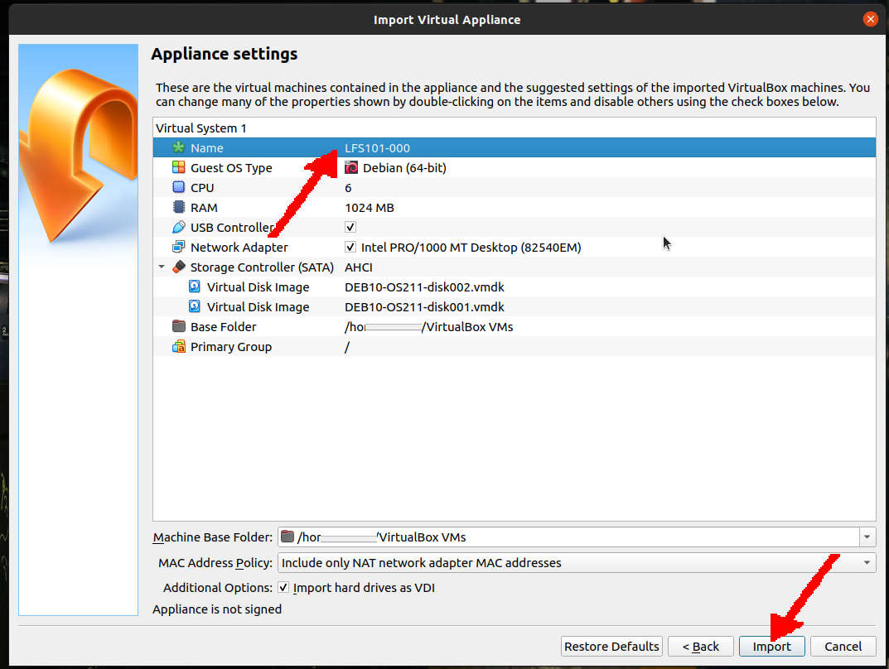
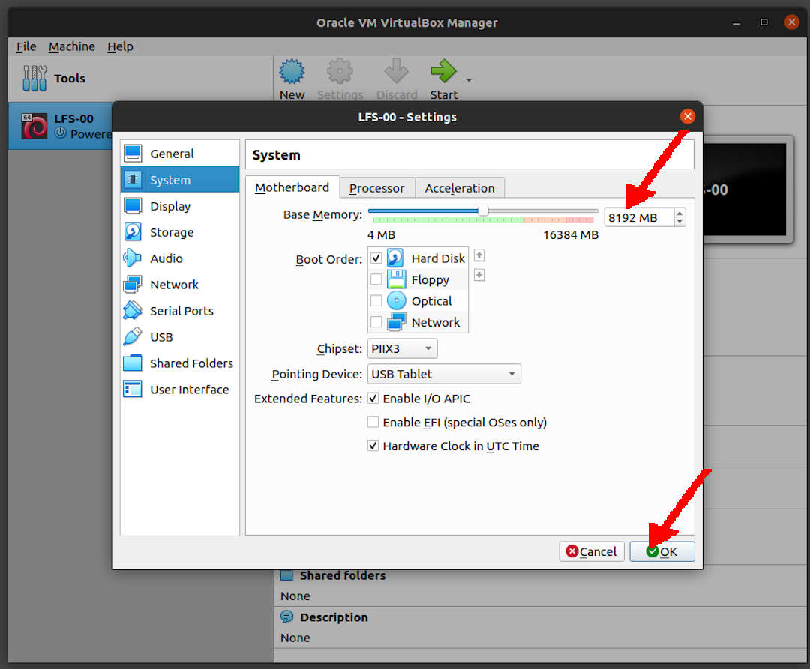
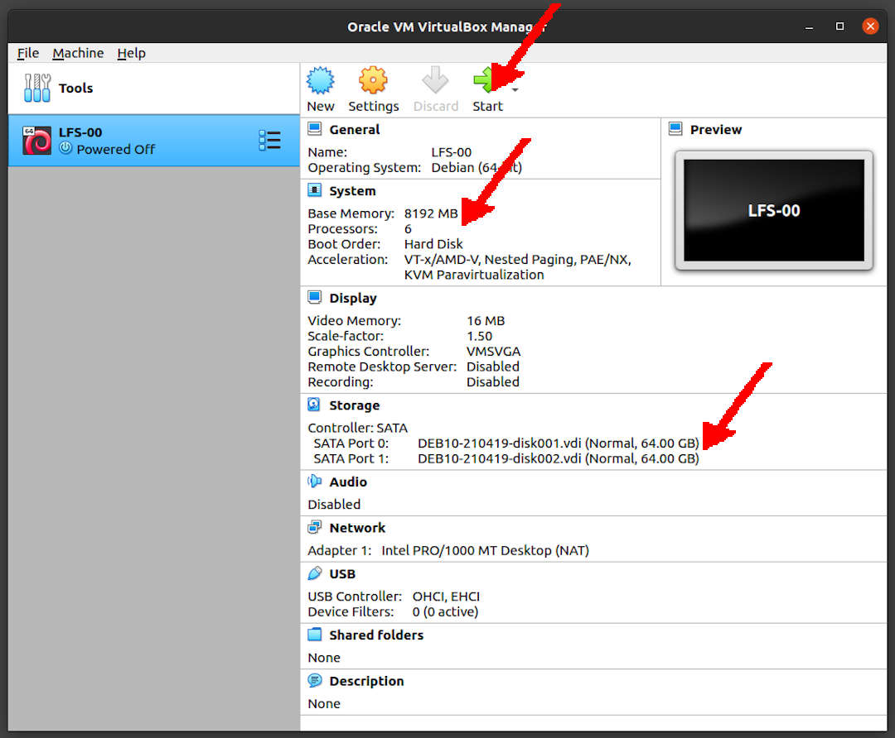
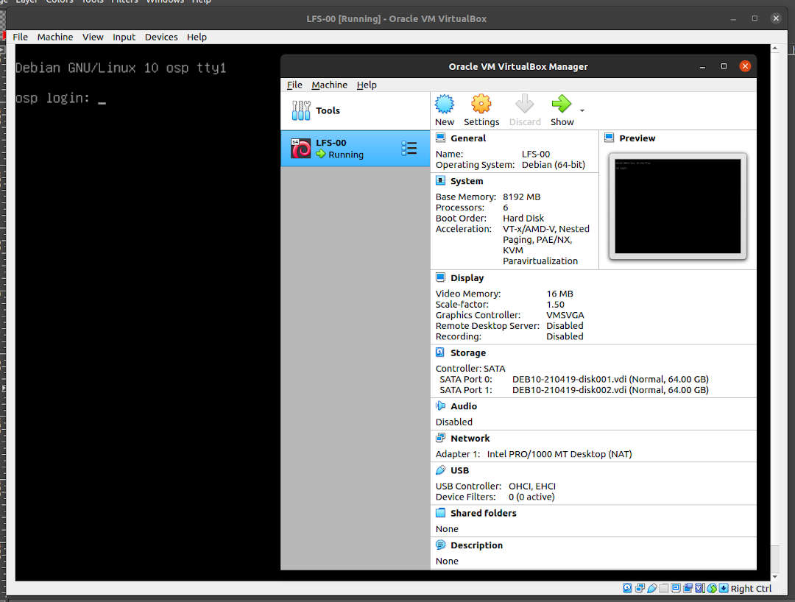

---
---

[HOME](index.md)
[ABOUT](README.md)
[WEB](https://lfs.vlsm.org/)
[GITHUB](https://github.com/OSP4DISS/lfs/)
[TOP](#)
[BOTTOM](#endofpage)
[PREV](index.md)
[NEXT](LFS-01.md)

 
# LFS: Set a Debian Guest from an OVA File

 
## Import A Debian Guest Ova File

* (Rename) the Guest to "LFS-00"

 
## Set the Debian Guest

* Set Base Memory Maximum, eg. 8192 MB

* Processors (Core) Maximum, eg. 6

* Main SATA Disk: 64 GB.

* LFS SATA Disk: 64 GB.

* SSH: TCP Port Forwading 127.0.0.1:6023 (host) to 10.0.2.15:22 (guest)

 
## (TEST) START "LFS-00"

 
## SHUTDOWN

* Export as **LFS-00.ova**

 
#### ENDOFPAGE
[HOME](index.md)
[ABOUT](README.md)
[WEB](https://lfs.vlsm.org/)
[GITHUB](https://github.com/OSP4DISS/lfs/)
[TOP](#)
[BOTTOM](#endofpage)
[PREV](index.md)
[NEXT](LFS-01.md)
 

