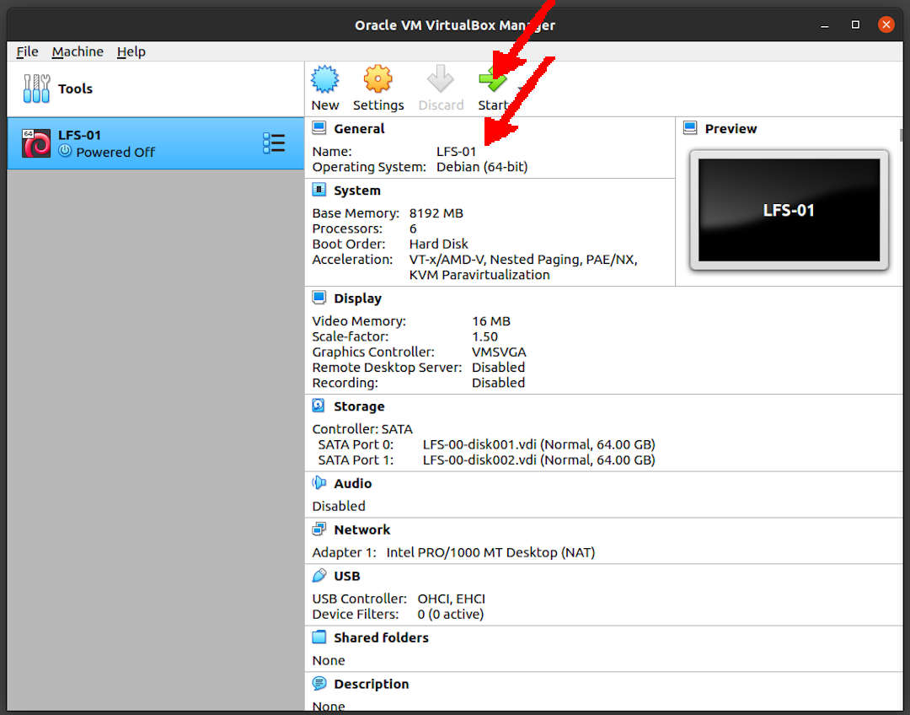

---
---

[HOME](index.md)
[ABOUT](README.md)
[WEB](https://lfs.vlsm.org/)
[GITHUB](https://github.com/OSP4DISS/lfs/)
[TOP](#)
[BOTTOM](#endofpage)
[PREV](LFS-00.md)
[NEXT](LFS-02.md)

# LFS: UPDATE the SYSTEM

<br>
## Virtual Box Guest LFS-01

* Import LFS-00.ova, rename to LFS-01

<br>
## START



<br>
### INPUT-01
```
ssh -p 6023 cbkadal@localhost

```

### OUTPUT-01
```
rms46@pamulang1:~$ ssh -p 6023 cbkadal@localhost

The authenticity of host '[localhost]:6023 ([127.0.0.1]:6023)' can't be established.
ECDSA key fingerprint is SHA256:XYZZYXYZZYXYZZYXYZZYXYZZYXYZZYXYZZYXYZZYXYZ.
Are you sure you want to continue connecting (yes/no/[fingerprint])? yes

Warning: Permanently added '[localhost]:6023' (ECDSA) to the list of known hosts.
cbkadal@localhost's password: *******

Linux osp 4.19.0-16-amd64 #1 SMP Debian 4.19.181-1 (2021-03-19) x86_64

The programs included with the Debian GNU/Linux system are free software;
the exact distribution terms for each program are described in the
individual files in /usr/share/doc/*/copyright.

Debian GNU/Linux comes with ABSOLUTELY NO WARRANTY, to the extent
permitted by applicable law.
Last login: Mon Apr 19 08:45:18 2021 from 10.0.2.2

cbkadal:~$

```

<br>
## File .bash_profile

### INPUT-02
```
cat > ~/.bash_profile << "EOF"
# Files .bash_profile
alias cl='clear;echo "";'
alias h='history'
alias sss='. ~/.profile'
export EDITOR=/usr/bin/vi
export HISTSIZE=2000
export HISTFILESIZE=2000
export LFS=/mnt/lfs
export PS1='\u:\w\$ '
export MAKEFLAGS='-j6'
EOF
echo "syntax off" > .vimrc
source ~/.bash_profile
echo   "Checking LFS=$LFS"
ls -al $LFS/

```

### OUTPUT-02

```
cbkadal@osp:~$ cat > ~/.bash_profile << "EOF"
> # Files .bash_profile
> alias cl='clear;echo "";'
> alias h='history'
> alias sss='. ~/.profile'
> export EDITOR=/usr/bin/vi
> export HISTSIZE=2000
> export HISTFILESIZE=2000
> export LFS=/mnt/lfs
> export PS1='\u:\w\$ '
> export MAKEFLAGS='-j6'
> EOF

cbkadal@osp:~$ echo "syntax off" > .vimrc

cbkadal@osp:~$ source ~/.bash_profile

cbkadal:~$ echo   "Checking LFS=$LFS"
Checking LFS=/mnt/lfs
cbkadal:~$ ls -al $LFS/
total 24
drwxr-xr-x 3 cbkadal cbkadal  4096 Feb 15 19:00 .
drwxr-xr-x 3 root    root     4096 Apr 19 10:10 ..
drwx------ 2 cbkadal cbkadal 16384 Apr 19 10:19 lost+found

cbkadal:~$

```

<br>
# LFS (Ch. 2) Preparing the LFS Host (=VirtualBox Guest)

### INPUT-03
```
su -

```

### OUTPUT-03
```
cbkadal:~$ su -
Password: 

root:~# 

```

<br>
### INPUT-04
```
cat > ~/.bash_profile << "EOF"
# Files .bash_profile
export EDITOR=/usr/bin/vi
export HISTSIZE=2000
export HISTFILESIZE=2000
export LFS=/mnt/lfs
export PS1='\u:\w\$ '
export MAKEFLAGS='-j6'
EOF
echo "syntax off" > .vimrc
source ~/.bash_profile
echo   "Checking LFS=$LFS"
ls -al $LFS/

```

### OUTPUT-04
```
root@osp:~# cat > ~/.bash_profile << "EOF"
> # Files .bash_profile
> export EDITOR=/usr/bin/vi
> export HISTSIZE=2000
> export HISTFILESIZE=2000
> export LFS=/mnt/lfs
> export PS1='\u:\w\$ '
> export MAKEFLAGS='-j6'
> EOF

root@osp:~# echo "syntax off" > .vimrc

root@osp:~# source ~/.bash_profile

root:~# echo   "Checking LFS=$LFS"
Checking LFS=/mnt/lfs

root:~# ls -al $LFS/
total 24
drwxr-xr-x 3 cbkadal cbkadal  4096 Feb 15 19:00 .
drwxr-xr-x 3 root    root     4096 Apr 19 10:10 ..
drwx------ 2 cbkadal cbkadal 16384 Apr 19 10:19 lost+found

root:~# 

```

<br>
### INPUT-05
```
apt-get update
apt-get dist-upgrade -y

```

### OUTPUT-05
```
root:~# apt-get update
Hit:1 http://deb.debian.org/debian buster InRelease
Hit:2 http://deb.debian.org/debian buster-updates InRelease
Hit:3 http://security.debian.org/debian-security buster/updates InRelease
Hit:4 https://dl.yarnpkg.com/debian stable InRelease
Reading package lists... Done

root:~# apt-get dist-upgrade -y
Reading package lists... Done
Building dependency tree       
Reading state information... Done
Calculating upgrade... Done
0 upgraded, 0 newly installed, 0 to remove and 0 not upgraded.

root:~#

```

<br>
### INPUT-06
```
apt-get autoremove --purge -y </dev/null
apt-get autoclean -y </dev/null
apt-get clean -y </dev/null
cd /bin
ls -al sh
rm sh
ln -s bash sh
ls -al sh
cd

```

### OUTPUT-06

```
root:~# apt-get autoremove --purge -y </dev/null
Reading package lists... Done
Building dependency tree       
Reading state information... Done
0 upgraded, 0 newly installed, 0 to remove and 0 not upgraded.

root:~# apt-get autoclean -y </dev/null
Reading package lists... Done
Building dependency tree       
Reading state information... Done

root:~# apt-get clean -y </dev/null

root:~# cd /bin

root:/bin# ls -al sh
lrwxrwxrwx 1 root root 4 Feb 15 19:11 sh -> dash

root:/bin# rm sh

root:/bin# ln -s bash sh

root:/bin# ls -al sh
lrwxrwxrwx 1 root root 4 Apr 19 14:36 sh -> bash

root:/bin# cd

root:~# 

```

<br>
## Just to be sure

### INPUT-07
```
DEBS="
apt-file
automake
bison
build-essential
gawk
liblocale-msgfmt-perl
locales-all
texinfo
parted
vim
"

apt-get install $DEBS -y
apt-file update

```

### OUTPUT-07
```
root:~# DEBS="
> apt-file
> automake
> bison
> build-essential
> gawk
> texinfo
> parted
> vim
> "

root:~# apt-get install $DEBS -y

=== TL;DR ===

0 upgraded, 107 newly installed, 0 to remove and 0 not upgraded.
Need to get 64.8 MB of archives.
After this operation, 229 MB of additional disk space will be used.

=== TL;DR ===

root:~# apt-file update
Hit:1 http://security.debian.org/debian-security buster/updates InRelease
Hit:2 http://deb.debian.org/debian buster InRelease
Hit:3 http://deb.debian.org/debian buster-updates InRelease
Get:4 http://deb.debian.org/debian buster/main amd64 Contents (deb) [37.3 MB]
Get:5 http://deb.debian.org/debian buster-updates/main amd64 Contents (deb) [65.4 kB]                        
Fetched 37.4 MB in 22s (1,738 kB/s)                                                                          
Reading package lists... Done
Building dependency tree       
Reading state information... Done
All packages are up to date.

```

<br>
### INPUT-08
```
poweroff

```

### OUTPUT-08
```
root:~# poweroff
Connection to localhost closed by remote host.
Connection to localhost closed.

rms46@pamulang1:~$ 

```

* Back to "pamulang1" host

* Export LFS-01.OVA (backup)

<br>
#### ENDOFPAGE
[HOME](index.md)
[ABOUT](README.md)
[WEB](https://lfs.vlsm.org/)
[GITHUB](https://github.com/OSP4DISS/lfs/)
[TOP](#)
[BOTTOM](#endofpage)
[PREV](LFS-00.md)
[NEXT](LFS-02.md)
<br>

