---
---

[HOME](index.md)
[ABOUT](README.md)
[WEB](https://lfs.vlsm.org/)
[GITHUB](https://github.com/OSP4DISS/lfs/)
[TOP](#)
[BOTTOM](#endofpage)
[PREV](index.md)
[NEXT](LFS-02.md)

# Set a Blank VirtualBox Guest of LFS

 
* Create LFS-ORIG.ova

  * Base Memory Maximum, eg. 8096 MB

  * **Boot Order [Optical, Harddisk]**

  * Processors (Core) Maximum, eg. 6

  * Delete IDE Controller

  * Main SATA Disk: 16 GB.

  * LFS SATA Disk: 32 GB.

  * SSH: TCP Port Forwading 127.0.0.1:6024 (host) to 10.0.2.15:22 (guest)

  * Export as LFS-ORIG.ova

 
* Import a blank OVA file

  * Rename to LFS-ORIG

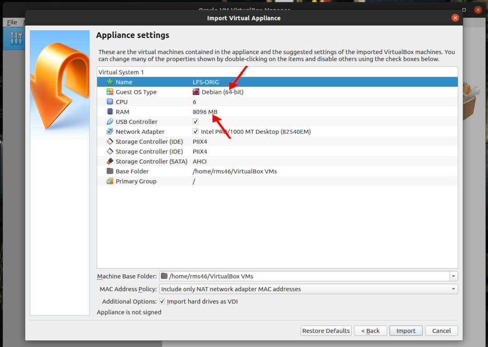
 

 
* Create LFS-ORIG

  * Settings

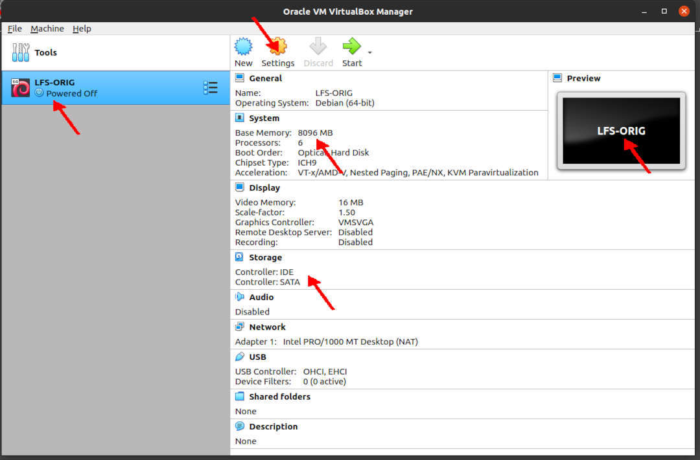
 

 
* Settings:General:Basic

  * Name: LFS-ORIG

  * Type: Linux

  * Version: Debian (64 bit)

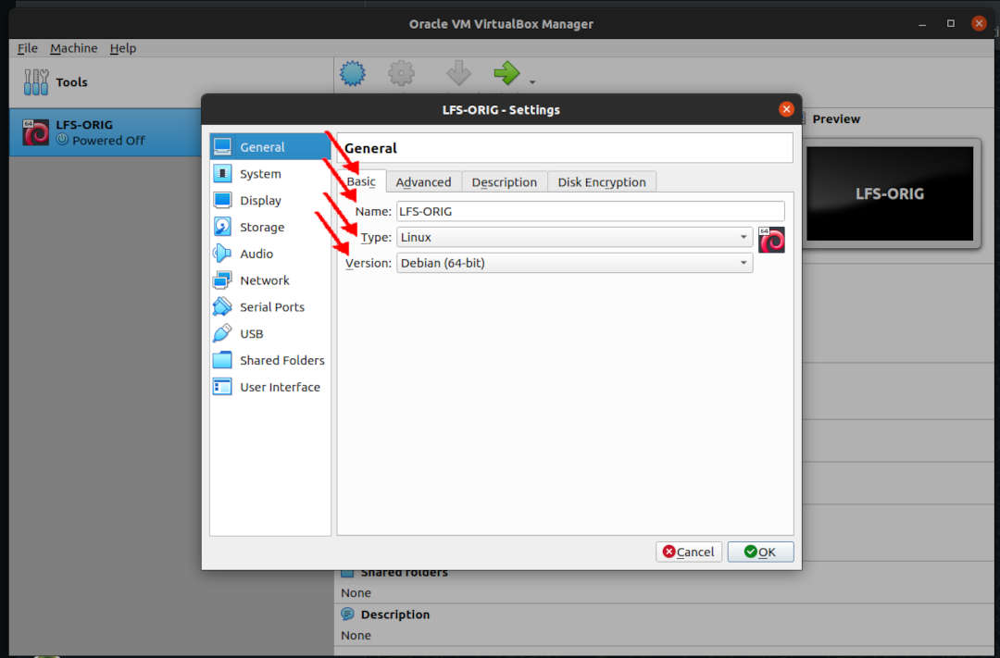
 

 
* Settings:General:Advanced

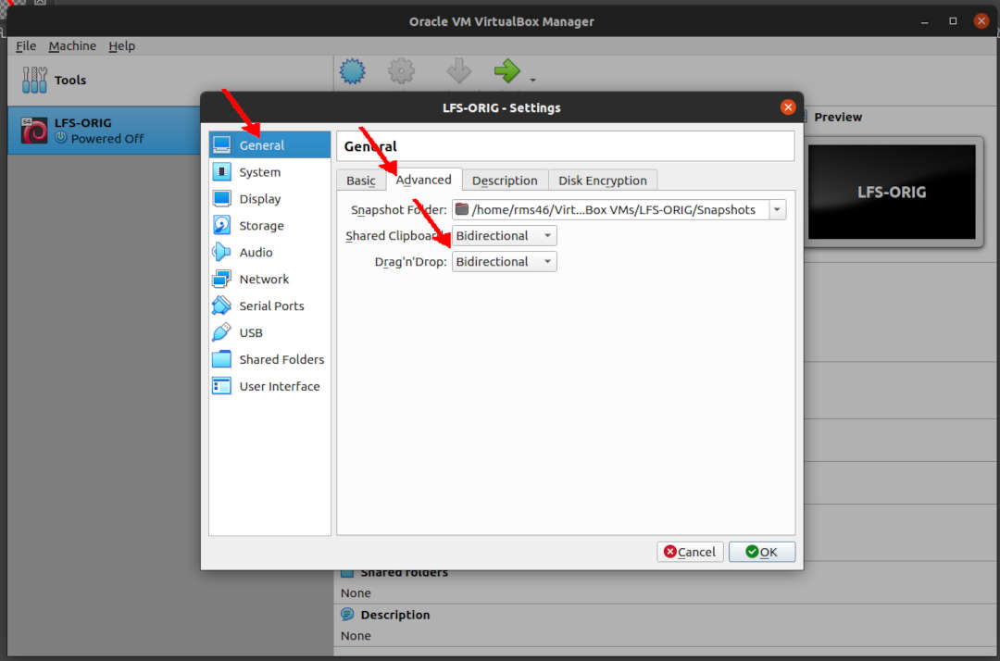
 

 
* Settings:System:Motherboard

  * Base Memory (Maximum) eg. 8096 MB

  * **Boot Order [Optical, Harddisk]**

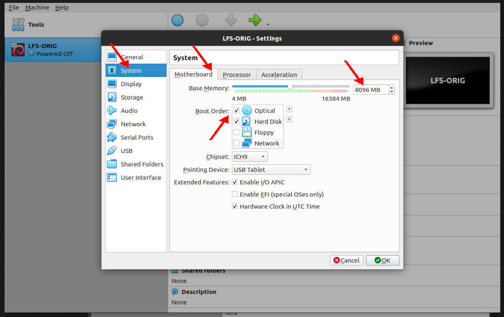
 

 
* Settings:System:Processor

  * Processors (Core Maximum), eg. 6

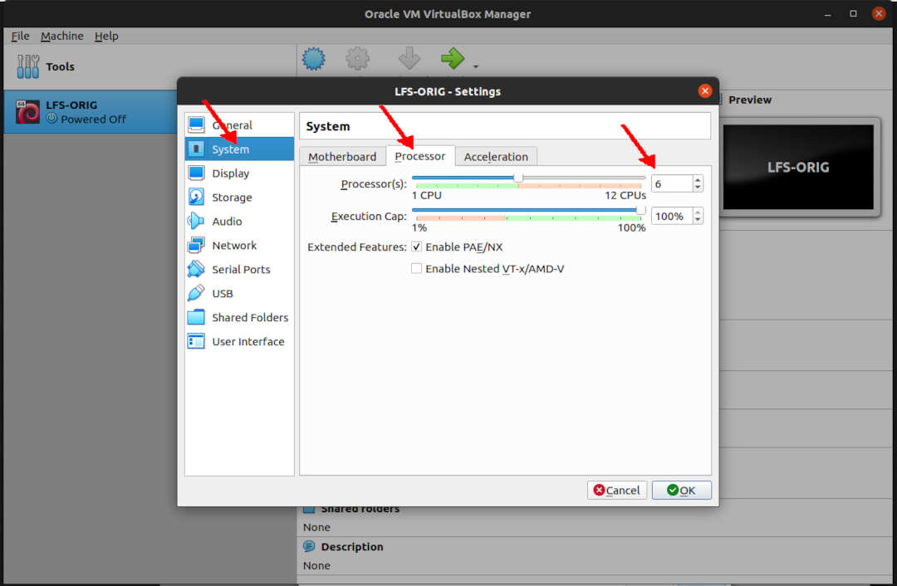
 

 
* Settings:Storage

  * Delete IDE Controller

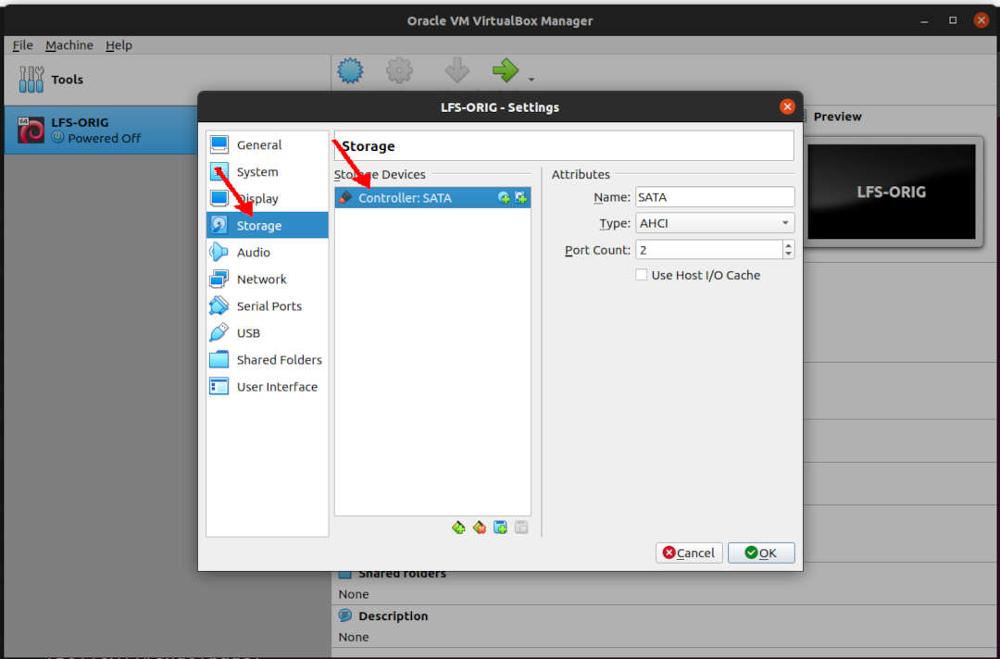
 

 
* Settings:Storage:Devices:Add SATA Optical Drive (ISO)

  * Add latest Debian NetInst ISO (subject to change): debian-10.6.0-amd64-netinst.iso

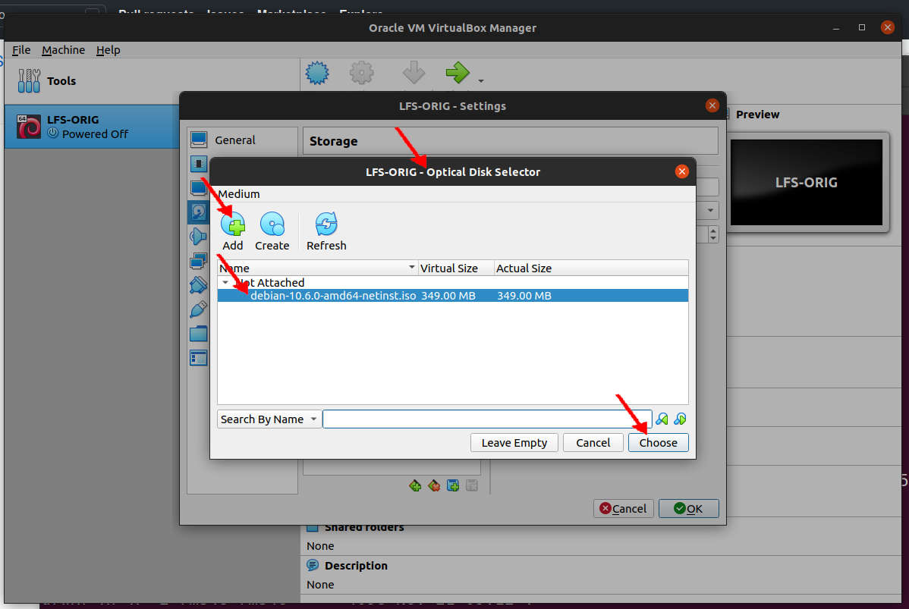
 

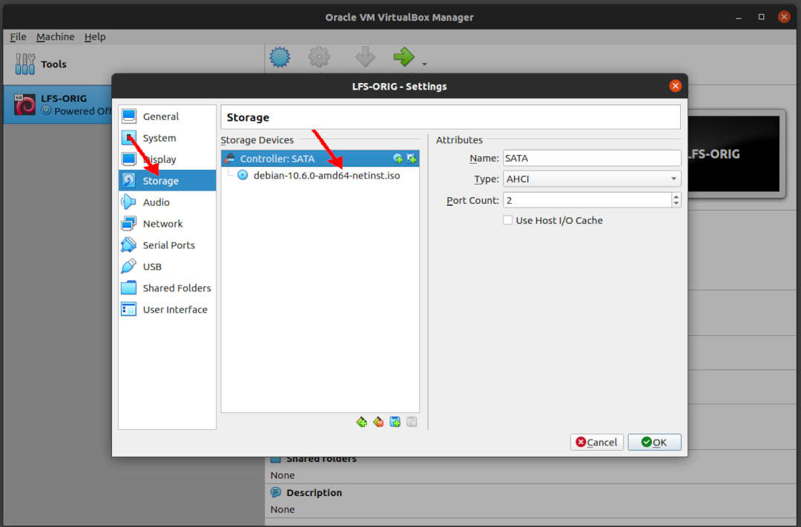
 

 
* Settings:Storage:Devices

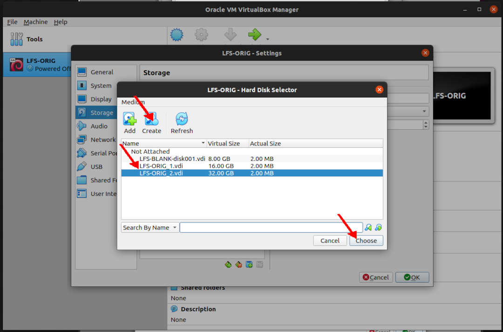
 

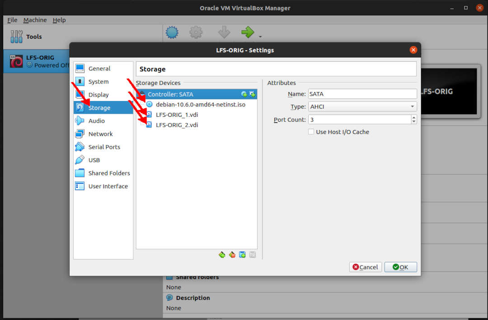
 

 
* Settings:Network:Adaptor 1

  * SSH: TCP Port Forwading 127.0.0.1:6024 (host) to 10.0.2.15:22 (guest)

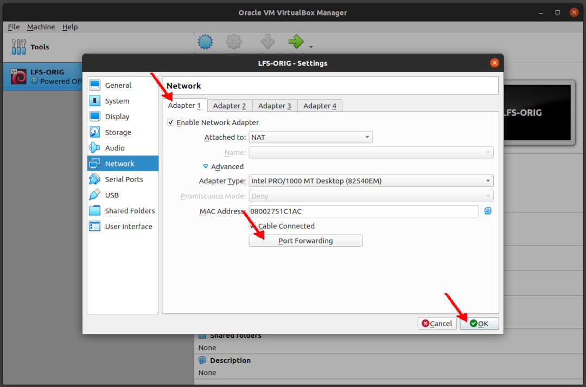
 

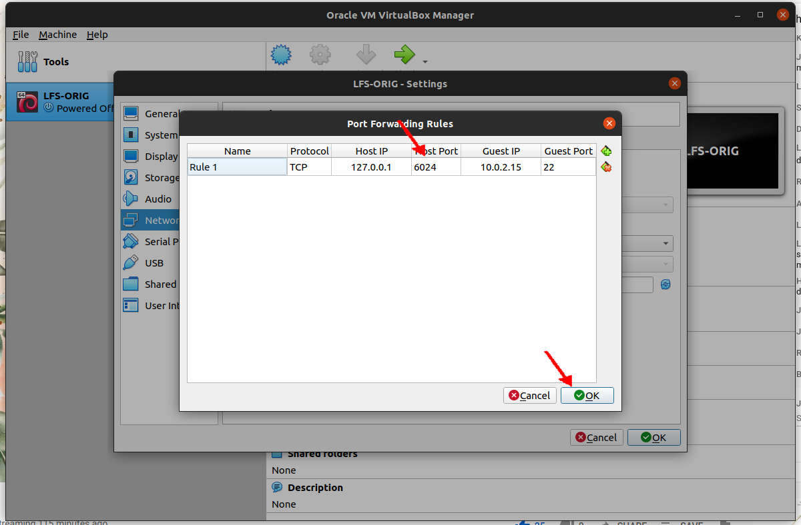
 

* Storage

  * Optical Drive: debian-10.6.0-amd64-netinst.iso (349 MB)

  * Main SATA Disk: 16 GB.

  * LFS SATA Disk: 32 GB.

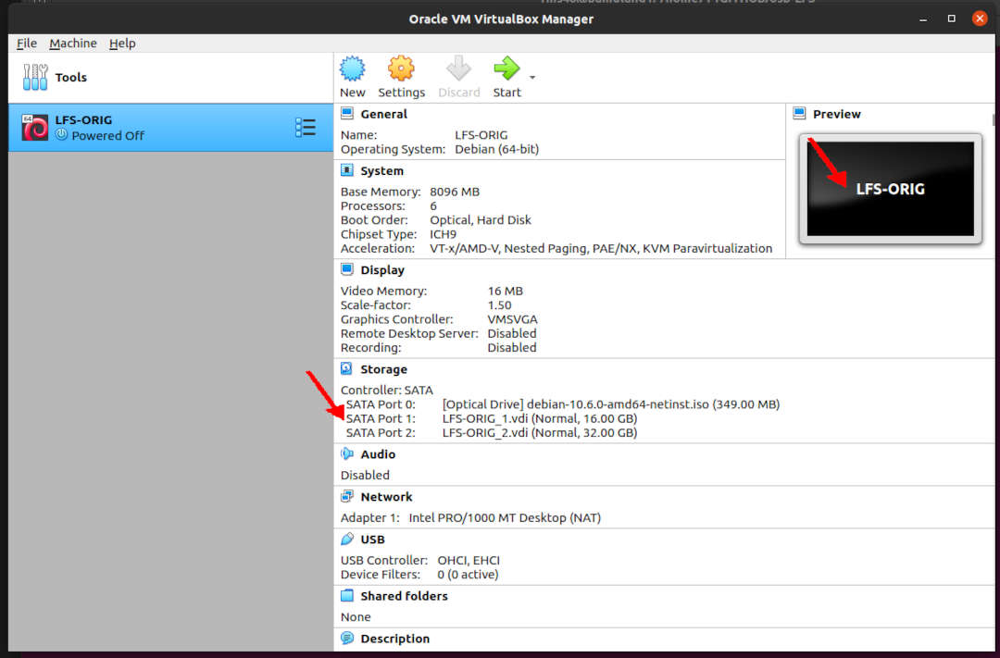
 

 
* Export as LFS-ORIG.ova

 
#### ENDOFPAGE
[HOME](index.md)
[ABOUT](README.md)
[WEB](https://lfs.vlsm.org/)
[GITHUB](https://github.com/OSP4DISS/lfs/)
[TOP](#)
[BOTTOM](#endofpage)
[PREV](index.md)
[NEXT](LFS-02.md)
 

