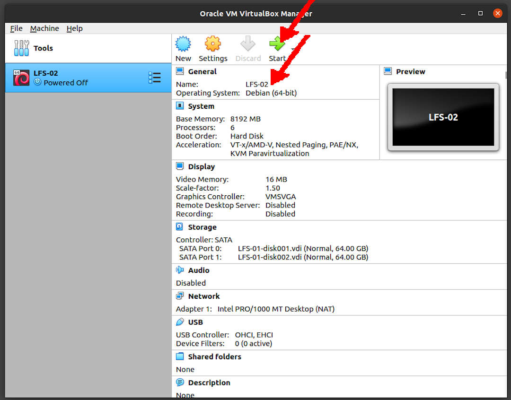

---
---

[HOME](index.md)
[ABOUT](README.md)
[WEB](https://lfs.vlsm.org/)
[GITHUB](https://github.com/OSP4DISS/lfs/)
[TOP](#)
[BOTTOM](#endofpage)
[PREV](LFS-02.md)
[NEXT](LFS-04.md)

<br>
# LFS: Chapter 2 (part 2)

## Virtual Box Guest LFS101-002

* Import LFS101-001.ova, rename to LFS101-002

<br>


<br>
### INPUT
```
ssh -p 6022 cbkadal@localhost

```

### OUTPUT
```
rms46@pamulang1:~$ ssh -p 6022 cbkadal@localhost
Linux osp 4.19.0-16-amd64 #1 SMP Debian 4.19.181-1 (2021-03-19) x86_64

The programs included with the Debian GNU/Linux system are free software;
the exact distribution terms for each program are described in the
individual files in /usr/share/doc/*/copyright.

Debian GNU/Linux comes with ABSOLUTELY NO WARRANTY, to the extent
permitted by applicable law.
Last login: Mon Apr 19 08:06:21 2021 from 10.0.2.2
cbkadal:~$ 

```

<br>
## Checking LFS

### INPUT-01
```
echo   "Checking LFS=$LFS"
ls -al $LFS/

```

### OUTPUT-01
```
cbkadal:~$ echo   "Checking LFS=$LFS"
Checking LFS=/mnt/lfs

cbkadal:~$ ls -al $LFS/
total 24
drwxr-xr-x 3 cbkadal cbkadal  4096 Feb 15 19:00 .
drwxr-xr-x 3 root    root     4096 Apr 19 10:10 ..
drwx------ 2 cbkadal cbkadal 16384 Apr 19 10:19 lost+found

cbkadal:~$ 

```

<br>
## <span style="color:red; font-weight:bold; font-size:larger;">Check It Out!</span>

* **RUN THE FOLLOWING**, to see whether the host system has all the appropriate versions, and the ability to compile programs (LFS Ch. 2.2).

### INPUT-02
```
cd /tmp
cat > version-check.sh << "EOF"
#!/bin/bash
# Simple script to list version numbers of critical development tools
export LC_ALL=C
bash --version | head -n1 | cut -d" " -f2-4
MYSH=$(readlink -f /bin/sh)
echo "/bin/sh -> $MYSH"
echo $MYSH | grep -q bash || echo "ERROR: /bin/sh does not point to bash"
unset MYSH

echo -n "Binutils: "; ld --version | head -n1 | cut -d" " -f3-
bison --version | head -n1

if [ -h /usr/bin/yacc ]; then
  echo "/usr/bin/yacc -> `readlink -f /usr/bin/yacc`";
elif [ -x /usr/bin/yacc ]; then
  echo yacc is `/usr/bin/yacc --version | head -n1`
else
  echo "yacc not found" 
fi

bzip2 --version 2>&1 < /dev/null | head -n1 | cut -d" " -f1,6-
echo -n "Coreutils: "; chown --version | head -n1 | cut -d")" -f2
diff --version | head -n1
find --version | head -n1
gawk --version | head -n1

if [ -h /usr/bin/awk ]; then
  echo "/usr/bin/awk -> `readlink -f /usr/bin/awk`";
elif [ -x /usr/bin/awk ]; then
  echo awk is `/usr/bin/awk --version | head -n1`
else 
  echo "awk not found" 
fi

gcc --version | head -n1
g++ --version | head -n1
ldd --version | head -n1 | cut -d" " -f2-  # glibc version
grep --version | head -n1
gzip --version | head -n1
cat /proc/version
m4 --version | head -n1
make --version | head -n1
patch --version | head -n1
echo Perl `perl -V:version`
python3 --version
sed --version | head -n1
tar --version | head -n1
makeinfo --version | head -n1  # texinfo version
xz --version | head -n1

echo 'int main(){}' > dummy.c && g++ -o dummy dummy.c
if [ -x dummy ]
  then echo "g++ compilation OK";
  else echo "g++ compilation failed"; fi
rm -f dummy.c dummy
EOF

bash version-check.sh
cd

```

### OUTPUT-02
```
cbkadal:~$ cd /tmp

cbkadal:/tmp$ cat > version-check.sh << "EOF"
> #!/bin/bash
> # Simple script to list version numbers of critical development tools
> export LC_ALL=C
> bash --version | head -n1 | cut -d" " -f2-4
> MYSH=$(readlink -f /bin/sh)
> echo "/bin/sh -> $MYSH"
> echo $MYSH | grep -q bash || echo "ERROR: /bin/sh does not point to bash"
> unset MYSH
> 
> echo -n "Binutils: "; ld --version | head -n1 | cut -d" " -f3-
> bison --version | head -n1
> 
> if [ -h /usr/bin/yacc ]; then
>   echo "/usr/bin/yacc -> `readlink -f /usr/bin/yacc`";
> elif [ -x /usr/bin/yacc ]; then
>   echo yacc is `/usr/bin/yacc --version | head -n1`
> else
>   echo "yacc not found" 
> fi
> 
> bzip2 --version 2>&1 < /dev/null | head -n1 | cut -d" " -f1,6-
> echo -n "Coreutils: "; chown --version | head -n1 | cut -d")" -f2
> diff --version | head -n1
> find --version | head -n1
> gawk --version | head -n1
> 
> if [ -h /usr/bin/awk ]; then
>   echo "/usr/bin/awk -> `readlink -f /usr/bin/awk`";
> elif [ -x /usr/bin/awk ]; then
>   echo awk is `/usr/bin/awk --version | head -n1`
> else 
>   echo "awk not found" 
> fi
> 
> gcc --version | head -n1
> g++ --version | head -n1
> ldd --version | head -n1 | cut -d" " -f2-  # glibc version
> grep --version | head -n1
> gzip --version | head -n1
> cat /proc/version
> m4 --version | head -n1
> make --version | head -n1
> patch --version | head -n1
> echo Perl `perl -V:version`
> python3 --version
> sed --version | head -n1
> tar --version | head -n1
> makeinfo --version | head -n1  # texinfo version
> xz --version | head -n1
> 
> echo 'int main(){}' > dummy.c && g++ -o dummy dummy.c
> if [ -x dummy ]
>   then echo "g++ compilation OK";
>   else echo "g++ compilation failed"; fi
> rm -f dummy.c dummy
> EOF

cbkadal:/tmp$ bash version-check.sh
bash, version 5.0.3(1)-release
/bin/sh -> /usr/bin/bash
Binutils: (GNU Binutils for Debian) 2.31.1
bison (GNU Bison) 3.3.2
/usr/bin/yacc -> /usr/bin/bison.yacc
bzip2,  Version 1.0.6, 6-Sept-2010.
Coreutils:  8.30
diff (GNU diffutils) 3.7
find (GNU findutils) 4.6.0.225-235f
GNU Awk 4.2.1, API: 2.0 (GNU MPFR 4.0.2, GNU MP 6.1.2)
/usr/bin/awk -> /usr/bin/gawk
gcc (Debian 8.3.0-6) 8.3.0
g++ (Debian 8.3.0-6) 8.3.0
(Debian GLIBC 2.28-10) 2.28
grep (GNU grep) 3.3
gzip 1.9
Linux version 4.19.0-16-amd64 (debian-kernel@lists.debian.org) (gcc version 8.3.0 (Debian 8.3.0-6)) #1 SMP Debian 4.19.181-1 (2021-03-19)
m4 (GNU M4) 1.4.18
GNU Make 4.2.1
GNU patch 2.7.6
Perl version='5.28.1';
Python 3.7.3
sed (GNU sed) 4.7
tar (GNU tar) 1.30
texi2any (GNU texinfo) 6.5
xz (XZ Utils) 5.2.4
g++ compilation OK

cbkadal:/tmp$ cd

cbkadal:~$ 

```

<br>
## SuperUser (root) mode

### INPUT-03
```
su -

```

### OUTPUT-03
```
cbkadal:~$ su -
Password: 

root:~# 

```

<br>
## PowerOff

### INPUT-04
```
poweroff

```

### OUTPUT-04
```
root:~# poweroff
Connection to localhost closed by remote host.
Connection to localhost closed.

rms46@pamulang1:~$

```

* Back to "pamulang1" host

* Export LFS101-002.OVA (backup)

<br>
#### ENDOFPAGE
[HOME](index.md)
[ABOUT](README.md)
[WEB](https://lfs.vlsm.org/)
[GITHUB](https://github.com/OSP4DISS/lfs/)
[TOP](#)
[BOTTOM](#endofpage)
[PREV](LFS-02.md)
[NEXT](LFS-04.md)
<br>

