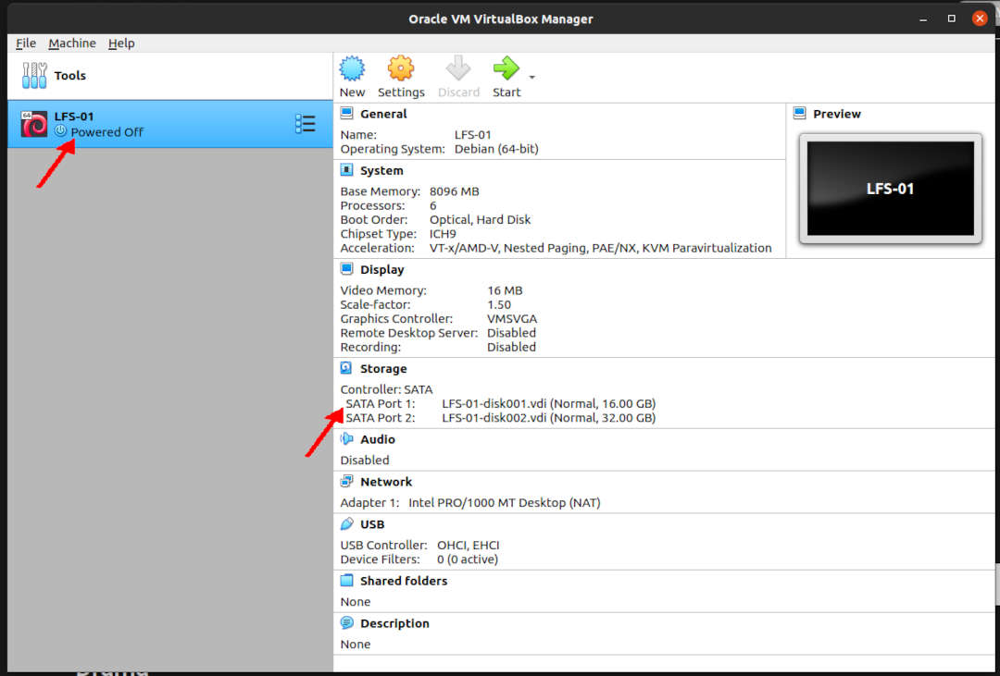

---
---

[HOME](index.md)
[ABOUT](README.md)
[WEB](https://lfs.vlsm.org/)
[GITHUB](https://github.com/OSP4DISS/lfs/)
[TOP](#)
[BOTTOM](#endofpage)
[PREV](LFS-02.md)
[NEXT](LFS-04.md)

# LFS: Chapter 2 part 1


<br>

<br>
### INPUT
```
ssh -p 6024 cbkadal@localhost
```

### OUTPUT
```
rms46@pamulang1:~$ ssh -p 6024 cbkadal@localhost
The authenticity of host '[localhost]:6024 ([127.0.0.1]:6024)' can't be established.
ECDSA key fingerprint is SHA256:XXXXXXXXXXXXXXXXXXXXXXXXXXXXXXXXXXXXXXXXXXX.
Are you sure you want to continue connecting (yes/no/[fingerprint])? yes
Warning: Permanently added '[localhost]:6024' (ECDSA) to the list of known hosts.
cbkadal@localhost's password: 
Linux osp 4.19.0-12-amd64 #1 SMP Debian 4.19.152-1 (2020-10-18) x86_64

The programs included with the Debian GNU/Linux system are free software;
the exact distribution terms for each program are described in the
individual files in /usr/share/doc/*/copyright.

Debian GNU/Linux comes with ABSOLUTELY NO WARRANTY, to the extent
permitted by applicable law.
cbkadal@osp:~$ 

```

<br>
### INPUT
```
cat > ~/.bash_profile << "EOF"
# Files .bash_profile
alias cl='clear'
alias h='history'
alias sss='. ~/.profile'
export EDITOR=/usr/bin/vi
export HISTSIZE=2000
export HISTFILESIZE=2000
export LFS=/mnt/lfs
EOF
source ~/.bash_profile
echo   "LFS=$LFS"

```

### OUTPUT
```
cbkadal@osp:~$ cat > ~/.bash_profile << "EOF"
> # Files .bash_profile
> alias cl='clear'
> alias h='history'
> alias sss='. ~/.profile'
> export EDITOR=/usr/bin/vi
> export HISTSIZE=2000
> export HISTFILESIZE=2000
> export LFS=/mnt/lfs
> EOF

cbkadal@osp:~$ source ~/.bash_profile

cbkadal@osp:~$ echo   "LFS=$LFS"
LFS=/mnt/lfs

```

# LFS (Ch. 2) Preparing the LFS Host (=VirtualBox Guest)

<br>
### INPUT
```
su -
```

### OUTPUT
```
cbkadal@osp:~$ su -
Password: 
root@osp:~# 
```

<br>
### INPUT
```
cat > ~/.bash_profile << "EOF"
# Files .bash_profile
alias cl='clear'
alias h='history'
alias sss='. ~/.profile'
export EDITOR=/usr/bin/vi
export HISTSIZE=2000
export HISTFILESIZE=2000
export LFS=/mnt/lfs
EOF
source ~/.bash_profile
echo   "LFS=$LFS"

```

### OUTPUT
```
root@osp:~# cat > ~/.bash_profile << "EOF"
> # Files .bash_profile
> alias cl='clear'
> alias h='history'
> alias sss='. ~/.profile'
> export EDITOR=/usr/bin/vi
> export HISTSIZE=2000
> export HISTFILESIZE=2000
> export LFS=/mnt/lfs
> EOF

root@osp:~# source ~/.bash_profile

root@osp:~# echo   "LFS=$LFS"
LFS=/mnt/lfs

root@osp:~#

```

<br>
### INPUT
```
apt-get update
apt-get dist-upgrade -y
apt-get autoremove --purge -y
apt-get autoclean -y
apt-get clean -y
cd /bin
ls -al sh
rm sh
ln -s bash sh
ls -al sh
cd

```

### OUTPUT
```
root@osp:~# apt-get update
Hit:1 http://security.debian.org/debian-security buster/updates InRelease
Hit:2 http://deb.debian.org/debian buster InRelease
Get:3 http://deb.debian.org/debian buster-updates InRelease [51.9 kB]
Fetched 51.9 kB in 1s (66.4 kB/s)
Reading package lists... Done

root@osp:~# apt-get dist-upgrade -y
Reading package lists... Done
Building dependency tree       
Reading state information... Done
Calculating upgrade... Done
0 upgraded, 0 newly installed, 0 to remove and 0 not upgraded.

root@osp:~# apt-get autoremove --purge -y
Reading package lists... Done
Building dependency tree       
Reading state information... Done
0 upgraded, 0 newly installed, 0 to remove and 0 not upgraded.

root@osp:~# apt-get autoclean -y
Reading package lists... Done
Building dependency tree       
Reading state information... Done

root@osp:~# apt-get clean -y

root@osp:~# cd /bin

root@osp:/bin# ls -al sh
lrwxrwxrwx 1 root root 4 Nov 21 13:29 sh -> dash

root@osp:/bin# rm sh

root@osp:/bin# ln -s bash sh

root@osp:/bin# ls -al sh
lrwxrwxrwx 1 root root 4 Nov 21 16:59 sh -> bash

root@osp:/bin# cd

root@osp:/~# 


```

<br>
### INPUT
```
DEBS="
apt-file
automake
bison
build-essential
gawk
texinfo
parted
"

apt-get install $DEBS -y

```

### OUTPUT
```
root@osp:~# DEBS="
> apt-file
> bison
> build-essential
> gawk
> texinfo
> parted
> "

root@osp:~# apt-get install $DEBS -y
Reading package lists... Done
Building dependency tree       
Reading state information... Done
The following additional packages will be installed:
  binutils binutils-common binutils-x86-64-linux-gnu cpp cpp-8 dirmngr dpkg-dev fakeroot g++ g++-8 gcc gcc-8 gnupg
  gnupg-l10n gnupg-utils gpg gpg-agent gpg-wks-client gpg-wks-server gpgconf gpgsm libalgorithm-diff-perl
  libalgorithm-diff-xs-perl libalgorithm-merge-perl libapt-pkg-perl libasan5 libassuan0 libatomic1 libauthen-sasl-perl

===== TL;DR =====

  libtimedate-perl libtry-tiny-perl libtsan0 libubsan1 liburi-perl libwww-perl libwww-robotrules-perl
  libxml-libxml-perl libxml-namespacesupport-perl libxml-parser-perl libxml-sax-base-perl libxml-sax-expat-perl
  libxml-sax-perl linux-libc-dev m4 make manpages-dev patch perl-openssl-defaults pinentry-curses tex-common
Suggested packages:
  binutils-doc bison-doc cpp-doc gcc-8-locales dbus-user-session pinentry-gnome3 tor debian-keyring g++-multilib

===== TL;DR =====

  texinfo-doc-nonfree texlive-fonts-recommended
The following NEW packages will be installed:
  apt-file binutils binutils-common binutils-x86-64-linux-gnu bison build-essential cpp cpp-8 dirmngr dpkg-dev

===== TL;DR =====

  parted pinentry-curses tex-common texinfo
0 upgraded, 102 newly installed, 0 to remove and 0 not upgraded.
Need to get 63.1 MB of archives.
After this operation, 224 MB of additional disk space will be used.
Get:1 http://security.debian.org/debian-security buster/updates/main amd64 linux-libc-dev amd64 4.19.152-1 [1,402 kB]
Get:2 http://deb.debian.org/debian buster/main amd64 libmpfr6 amd64 4.0.2-1 [775 kB]
Get:3 http://deb.debian.org/debian buster/main amd64 libsigsegv2 amd64 2.12-2 [32.8 kB]
Get:4 http://deb.debian.org/debian buster/main amd64 gawk amd64 1:4.2.1+dfsg-1 [660 kB]

===== TL;DR =====

Get:100 http://deb.debian.org/debian buster/main amd64 libxml-sax-expat-perl all 0.51-1 [12.0 kB]                      
Get:101 http://deb.debian.org/debian buster/main amd64 manpages-dev all 4.16-2 [2,232 kB]                              
Get:102 http://deb.debian.org/debian buster/main amd64 texinfo amd64 6.5.0.dfsg.1-4+b1 [1,431 kB]                      
Fetched 63.1 MB in 31s (2,055 kB/s)                                                                                    
Extracting templates from packages: 100%
Selecting previously unselected package libmpfr6:amd64.
(Reading database ... 31820 files and directories currently installed.)
Preparing to unpack .../libmpfr6_4.0.2-1_amd64.deb ...
Unpacking libmpfr6:amd64 (4.0.2-1) ...

===== TL;DR =====

Setting up liblwp-protocol-https-perl (6.07-2) ...
Setting up libwww-perl (6.36-2) ...
Setting up libxml-parser-perl (2.44-4) ...
Setting up libxml-sax-expat-perl (0.51-1) ...
update-perl-sax-parsers: Registering Perl SAX parser XML::SAX::Expat with priority 50...
update-perl-sax-parsers: Updating overall Perl SAX parser modules info file...
Replacing config file /etc/perl/XML/SAX/ParserDetails.ini with new version
Processing triggers for libc-bin (2.28-10) ...
Processing triggers for man-db (2.8.5-2) ...
root@osp:~# 

```

<br>
### INPUT
```
shutdown -h now

```

### OUTPUT
```
root@osp:~# shutdown -h now
Connection to localhost closed by remote host.
Connection to localhost closed.

rms46@pamulang1:~$

```

* Back to "pamulang1" host

* Create LFS-01.OVA (backup)

<br>
#### ENDOFPAGE
[HOME](index.md)
[ABOUT](README.md)
[WEB](https://lfs.vlsm.org/)
[GITHUB](https://github.com/OSP4DISS/lfs/)
[TOP](#)
[BOTTOM](#endofpage)
[PREV](LFS-02.md)
[NEXT](LFS-04.md)
<br>

