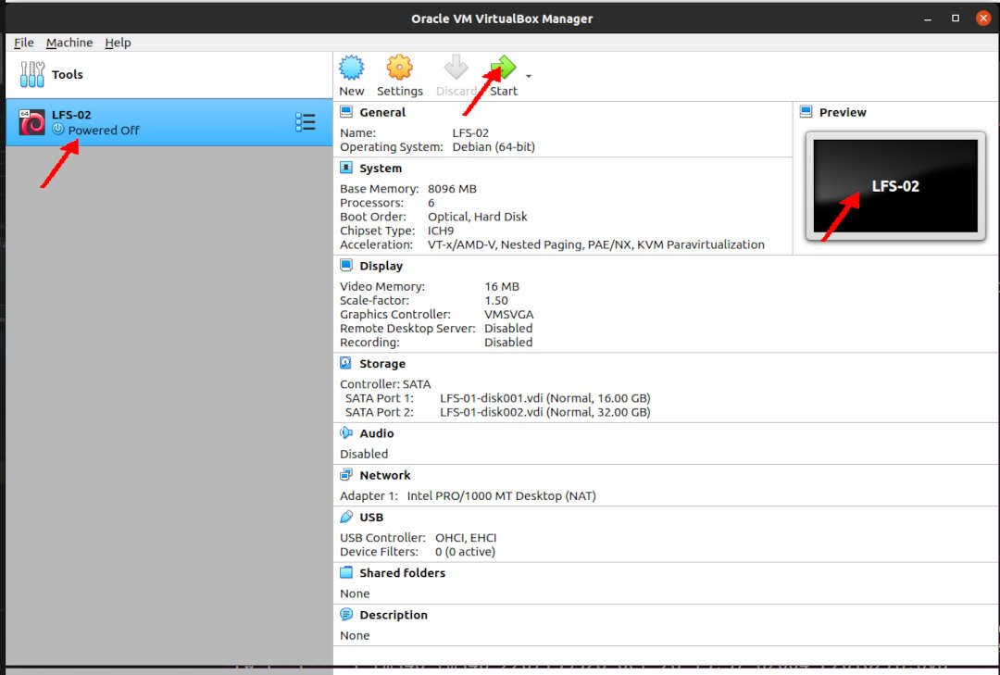

---
---

[HOME](index.md)
[ABOUT](README.md)
[WEB](https://lfs.vlsm.org/)
[GITHUB](https://github.com/OSP4DISS/lfs/)
[TOP](#)
[BOTTOM](#endofpage)
[PREV](LFS-03.md)
[NEXT](LFS-05.md)

# LFS: Chapter 2 part 2

<br>


<br>
### INPUT
```
ssh -p 6024 cbkadal@localhost

```

### OUTPUT
```
rms46@pamulang1:~$ ssh -p 6024 cbkadal@localhost
cbkadal@localhost's password: 
Linux osp 4.19.0-12-amd64 #1 SMP Debian 4.19.152-1 (2020-10-18) x86_64

The programs included with the Debian GNU/Linux system are free software;
the exact distribution terms for each program are described in the
individual files in /usr/share/doc/*/copyright.

Debian GNU/Linux comes with ABSOLUTELY NO WARRANTY, to the extent
permitted by applicable law.
Last login: Sat Nov 21 20:45:23 2020 from 10.0.2.2
cbkadal@osp:~$ 

```

<br>
### INPUT
```
echo "LFS=$LFS"

```

### OUTPUT
```
cbkadal@osp:~$ echo "LFS=$LFS"
LFS=/mnt/lfs

cbkadal@osp:~$ 

```

<br>
### INPUT
```
cd /tmp

cat > version-check.sh << "EOF"
#!/bin/bash
# Simple script to list version numbers of critical development tools
# Copyright 1999-2020 Gerard Beekmans; 
# Permission is hereby granted, free of charge, to any person obtaining
# a copy of this software and associated documentation files (the 
# "Software"), to deal in the Software without restriction, including 
# without limitation the rights to use, copy, modify, merge, publish, 
# distribute, sublicense, and/or sell copies of the Software, and to 
# permit persons to whom the Software is furnished to do so, subject 
# to the following conditions:
# The above copyright notice and this permission notice shall be 
# included in all copies or substantial portions of the Software.

export LC_ALL=C
bash --version | head -n1 | cut -d" " -f2-4
MYSH=$(readlink -f /bin/sh)
echo "/bin/sh -> $MYSH"
echo $MYSH | grep -q bash || echo "ERROR: /bin/sh does not point to bash"
unset MYSH

echo -n "Binutils: "; ld --version | head -n1 | cut -d" " -f3-
bison --version | head -n1

if [ -h /usr/bin/yacc ]; then
  echo "/usr/bin/yacc -> `readlink -f /usr/bin/yacc`";
elif [ -x /usr/bin/yacc ]; then
  echo yacc is `/usr/bin/yacc --version | head -n1`
else
  echo "yacc not found" 
fi

bzip2 --version 2>&1 < /dev/null | head -n1 | cut -d" " -f1,6-
echo -n "Coreutils: "; chown --version | head -n1 | cut -d")" -f2
diff --version | head -n1
find --version | head -n1
gawk --version | head -n1

if [ -h /usr/bin/awk ]; then
  echo "/usr/bin/awk -> `readlink -f /usr/bin/awk`";
elif [ -x /usr/bin/awk ]; then
  echo awk is `/usr/bin/awk --version | head -n1`
else 
  echo "awk not found" 
fi

gcc --version | head -n1
g++ --version | head -n1
ldd --version | head -n1 | cut -d" " -f2-  # glibc version
grep --version | head -n1
gzip --version | head -n1
cat /proc/version
m4 --version | head -n1
make --version | head -n1
patch --version | head -n1
echo Perl `perl -V:version`
python3 --version
sed --version | head -n1
tar --version | head -n1
makeinfo --version | head -n1  # texinfo version
xz --version | head -n1

echo 'int main(){}' > dummy.c && g++ -o dummy dummy.c
if [ -x dummy ]
  then echo "g++ compilation OK";
  else echo "g++ compilation failed"; fi
rm -f dummy.c dummy
EOF

bash version-check.sh

cd

```

### OUTPUT
```
cbkadal@osp:~$ cd /tmp

cbkadal@osp:/tmp$ cat > version-check.sh << "EOF"
> #!/bin/bash
> # Simple script to list version numbers of critical development tools
> # Copyright 1999-2020 Gerard Beekmans; 

===== TL;DR =====

> rm -f dummy.c dummy
> EOF

cbkadal@osp:/tmp$ bash version-check.sh
bash, version 5.0.3(1)-release
/bin/sh -> /usr/bin/bash
Binutils: (GNU Binutils for Debian) 2.31.1
bison (GNU Bison) 3.3.2
/usr/bin/yacc -> /usr/bin/bison.yacc
bzip2,  Version 1.0.6, 6-Sept-2010.
Coreutils:  8.30
diff (GNU diffutils) 3.7
find (GNU findutils) 4.6.0.225-235f
GNU Awk 4.2.1, API: 2.0 (GNU MPFR 4.0.2, GNU MP 6.1.2)
/usr/bin/awk -> /usr/bin/gawk
gcc (Debian 8.3.0-6) 8.3.0
g++ (Debian 8.3.0-6) 8.3.0
(Debian GLIBC 2.28-10) 2.28
grep (GNU grep) 3.3
gzip 1.9
Linux version 4.19.0-12-amd64 (debian-kernel@lists.debian.org) (gcc version 8.3.0 (Debian 8.3.0-6)) #1 SMP Debian 4.19.152-1 (2020-10-18)
m4 (GNU M4) 1.4.18
GNU Make 4.2.1
GNU patch 2.7.6
Perl version='5.28.1';
Python 3.7.3
sed (GNU sed) 4.7
tar (GNU tar) 1.30
texi2any (GNU texinfo) 6.5
xz (XZ Utils) 5.2.4
g++ compilation OK

cbkadal@osp:/tmp$ cd

cbkadal@osp:~$ 

```

<br>
### INPUT
```
su -

```

### OUTPUT
```
cbkadal@osp:~$ su -
Password:

root@osp:~#

```

<br>
### INPUT
```
echo      "LFS=$LFS"
mkdir     -v $LFS
dd        if=/dev/zero of=/var/tmp/.swapfile.bin bs=1MiB count=1024
chmod 600 /var/tmp/.swapfile.bin
mkswap    /var/tmp/.swapfile.bin
parted    -l

```

### OUTPUT
```
root@osp:~# echo      "LFS=$LFS"
LFS=/mnt/lfs

root@osp:~# mkdir     -v $LFS
mkdir: created directory '/mnt/lfs'

root@osp:~# dd if=/dev/zero of=/var/tmp/.swapfile.bin bs=1MiB count=1024
1024+0 records in
1024+0 records out
1073741824 bytes (1.1 GB, 1.0 GiB) copied, 0.454999 s, 2.4 GB/s

root@osp:~# chmod 600 /var/tmp/.swapfile.bin

root@osp:~# mkswap    /var/tmp/.swapfile.bin
Setting up swapspace version 1, size = 1024 MiB (1073737728 bytes)
no label, UUID=f9857393-ad65-43f9-b990-9f87a1e42581

root@osp:~# parted    -l
Model: ATA VBOX HARDDISK (scsi)
Disk /dev/sda: 17.2GB
Sector size (logical/physical): 512B/512B
Partition Table: msdos
Disk Flags: 

Number  Start   End     Size    Type     File system  Flags
 1      1049kB  17.2GB  17.2GB  primary  ext4         boot


Model: ATA VBOX HARDDISK (scsi)
Disk /dev/sdb: 34.4GB
Sector size (logical/physical): 512B/512B
Partition Table: msdos
Disk Flags: 

Number  Start   End     Size    Type     File system  Flags
 1      1049kB  34.4GB  34.4GB  primary  ext4

```

<br>
### INPUT
```
mv /etc/fstab /etc/ZOLD-$(date +%y%m%d)-fstab
cat > /etc/fstab << "EOF"
# /etc/fstab: static file system information.
#
# <file system>       <mount point> <type>       <options>     <dump> <pass>
/dev/sda1              /             ext4        errors=remount-ro 0   1
/dev/sdb1              /mnt/lfs      ext4        defaults          1   1
/var/tmp/.swapfile.bin none          swap        sw                0   0
/dev/sr0               /media/cdrom0 udf,iso9660 user,noauto       0   0
EOF
mount -a
df
swapon -a
swapon -s

```

### OUTPUT
```
root@osp:~# mv /etc/fstab /etc/ZOLD-$(date +%y%m%d)-fstab

root@osp:~# cat > /etc/fstab << "EOF"
> # /etc/fstab: static file system information.
> #
> # <file system>       <mount point> <type>       <options>     <dump> <pass>
> /dev/sda1              /             ext4        errors=remount-ro 0   1
> /dev/sdb1              /mnt/lfs      ext4        defaults          1   1
> /var/tmp/.swapfile.bin none          swap        sw                0   0
> /dev/sr0               /media/cdrom0 udf,iso9660 user,noauto       0   0
> EOF

root@osp:~# mount -a

root@osp:~# df
Filesystem     1K-blocks    Used Available Use% Mounted on
udev             4020820       0   4020820   0% /dev
tmpfs             807132    8620    798512   2% /run
/dev/sda1       16446332 2718668  12872524  18% /
tmpfs            4035644       0   4035644   0% /dev/shm
tmpfs               5120       0      5120   0% /run/lock
tmpfs            4035644       0   4035644   0% /sys/fs/cgroup
tmpfs             807128       0    807128   0% /run/user/1000
/dev/sdb1       32894736   49176  31151560   1% /mnt/lfs

root@osp:~# swapon -a

root@osp:~# swapon -s
Filename				Type		Size	Used	Priority
/var/tmp/.swapfile.bin                 	file    	1048572	0	-2

root@osp:~# 

```

<br>
### INPUT
```
shutdown -h now

```

### OUTPUT
```
root@osp:~# shutdown -h now
Connection to localhost closed by remote host.
Connection to localhost closed.

rms46@pamulang1:~$

```

* Back to "pamulang1" host

* Create LFS-02.OVA (backup)


<br>
#### ENDOFPAGE
[HOME](index.md)
[ABOUT](README.md)
[WEB](https://lfs.vlsm.org/)
[GITHUB](https://github.com/OSP4DISS/lfs/)
[TOP](#)
[BOTTOM](#endofpage)
[PREV](LFS-03.md)
[NEXT](LFS-05.md)
<br>

