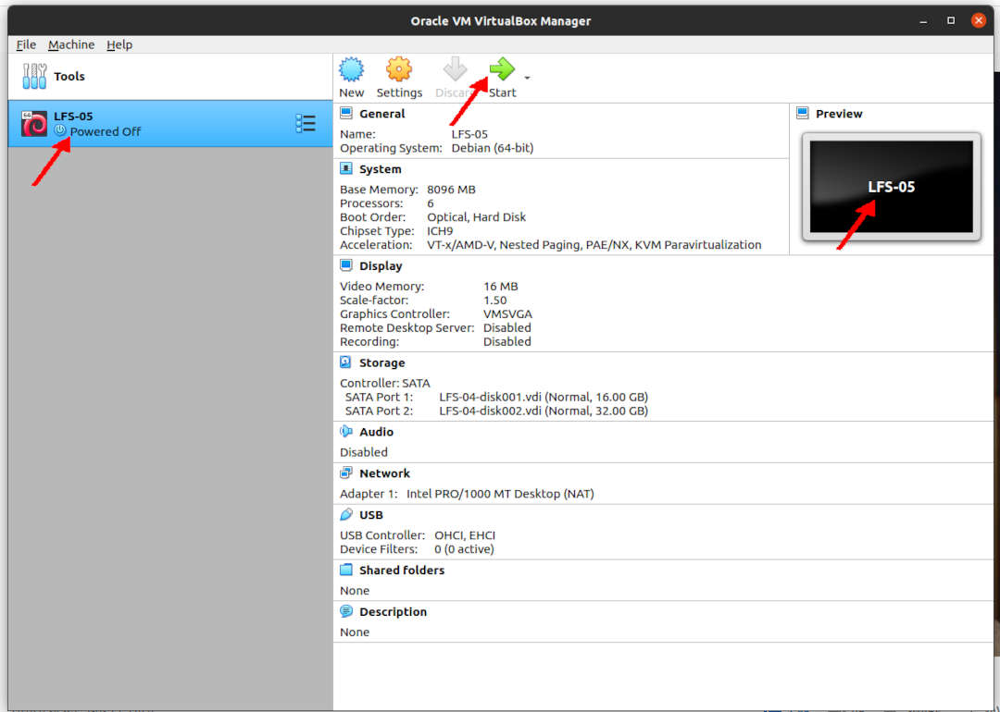
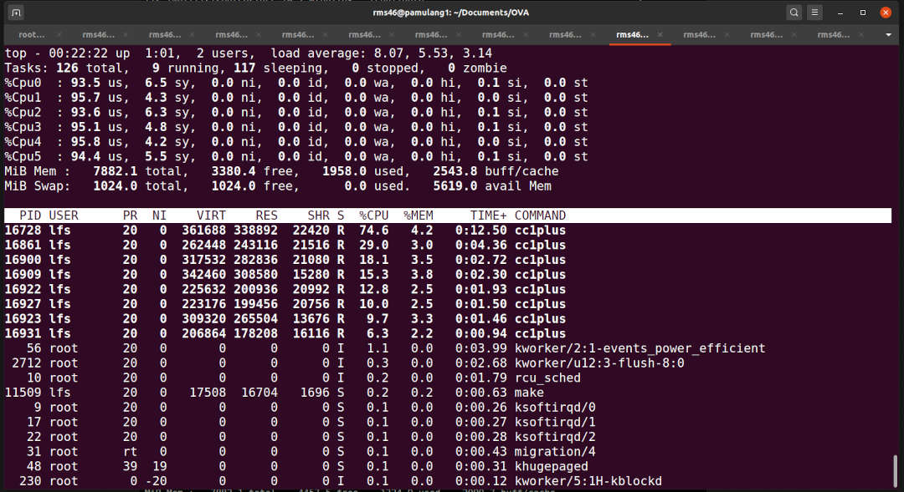

---
---

[HOME](index.md)
[ABOUT](README.md)
[WEB](https://lfs.vlsm.org/)
[GITHUB](https://github.com/OSP4DISS/lfs/)
[TOP](#)
[BOTTOM](#endofpage)
[PREV](LFS-04.md)
[NEXT](LFS-08.md)

<br>
# LFS: Chapter 5

## Virtual Box Guest LFS-05

* Import LFS-04.ova, rename to LFS-05

<br>


<br>
### INPUT-001
```
ssh -p 6023 lfs@localhost

```

### OUTPUT-001
```
rms46@pamulang1:~$ ssh -p 6023 lfs@localhost
lfs@localhost's password:

===== TL;DR =====

lfs@osp:~$ 

```

<br>
### INPUT-002
```
echo $LFS
cd $LFS/sources/

```

### OUTPUT-002
```
lfs:~$ echo $LFS
/mnt/lfs

lfs:~$ cd $LFS/sources/

```

<br>
## Binutils-2.36.1 - Pass 1

<br>
### INPUT-003
```
tar xf 
cd 
mkdir -v build
cd       build
../configure --prefix=$LFS/tools       \
             --with-sysroot=$LFS        \
             --target=$LFS_TGT          \
             --disable-nls              \
             --disable-werror

```

### OUTPUT-003
```
===== TL;DR =====


```

<br>
### INPUT-004
```
time make

```

### OUTPUT-004
```
===== TL;DR =====

```

<br>
### INPUT-005
```
time make install
cd ../..
rm -rf 

```

### OUTPUT-005
```
===== TL;DR =====

real	0m0.645s
user	0m1.203s
sys	0m0.255s


```

<br>
## GCC-10.2.0 - Pass 1

<br>
### INPUT-006
```
tar xf gcc-10.2.0.tar.xz
cd gcc-10.2.0/
tar -xf ../mpfr-4.1.0.tar.xz
mv -v mpfr-4.1.0 mpfr
tar -xf ../gmp-6.2.0.tar.xz
mv -v gmp-6.2.0 gmp
tar -xf ../mpc-1.1.0.tar.gz
mv -v mpc-1.1.0 mpc
case $(uname -m) in
  x86_64)
    sed -e '/m64=/s/lib64/lib/' \
        -i.orig gcc/config/i386/t-linux64
 ;;
esac

```

### OUTPUT
```
lfs:/mnt/lfs/sources$ tar xf gcc-10.2.0.tar.xz

lfs:/mnt/lfs/sources$ cd gcc-10.2.0/

lfs:/mnt/lfs/sources/gcc-10.2.0$ tar -xf ../mpfr-4.1.0.tar.xz

lfs:/mnt/lfs/sources/gcc-10.2.0$ mv -v mpfr-4.1.0 mpfr
renamed 'mpfr-4.1.0' -> 'mpfr'

lfs:/mnt/lfs/sources/gcc-10.2.0$ tar -xf ../gmp-6.2.0.tar.xz

lfs:/mnt/lfs/sources/gcc-10.2.0$ mv -v gmp-6.2.0 gmp
renamed 'gmp-6.2.0' -> 'gmp'

lfs:/mnt/lfs/sources/gcc-10.2.0$ tar -xf ../mpc-1.1.0.tar.gz

lfs:/mnt/lfs/sources/gcc-10.2.0$ mv -v mpc-1.1.0 mpc
renamed 'mpc-1.1.0' -> 'mpc'

lfs:/mnt/lfs/sources/gcc-10.2.0$ case $(uname -m) in
>   x86_64)
>     sed -e '/m64=/s/lib64/lib/' \
>         -i.orig gcc/config/i386/t-linux64
>  ;;
> esac

lfs:/mnt/lfs/sources/gcc-10.2.0$

```

<br>
### INPUT
```
mkdir -v build
cd       build
../configure                                       \
    --target=$LFS_TGT                              \
    --prefix=$LFS/tools                            \
    --with-glibc-version=2.11                      \
    --with-sysroot=$LFS                            \
    --with-newlib                                  \
    --without-headers                              \
    --enable-initfini-array                        \
    --disable-nls                                  \
    --disable-shared                               \
    --disable-multilib                             \
    --disable-decimal-float                        \
    --disable-threads                              \
    --disable-libatomic                            \
    --disable-libgomp                              \
    --disable-libquadmath                          \
    --disable-libssp                               \
    --disable-libvtv                               \
    --disable-libstdcxx                            \
    --enable-languages=c,c++

```

### OUTPUT
```
lfs:/mnt/lfs/sources/gcc-10.2.0$ mkdir -v build
mkdir: created directory 'build'

lfs:/mnt/lfs/sources/gcc-10.2.0$ cd       build

lfs:/mnt/lfs/sources/gcc-10.2.0/build$ ../configure                                       \
>     --target=$LFS_TGT                              \
>     --prefix=$LFS/tools                            \
>     --with-glibc-version=2.11                      \

===== TL;DR =====

checking whether to enable maintainer-specific portions of Makefiles... no
configure: creating ./config.status
config.status: creating Makefile

lfs:/mnt/lfs/sources/gcc-10.2.0/build$ 

```

<br>
### INPUT
```
time make

```

### OUTPUT
```
top - 00:23:22 up  1:02,  2 users,  load average: 4.38, 4.95, 3.09
Tasks: 122 total,   5 running, 117 sleeping,   0 stopped,   0 zombie
%Cpu0  :  5.3 us,  2.3 sy,  0.0 ni, 92.5 id,  0.0 wa,  0.0 hi,  0.0 si,  0.0 st
%Cpu1  :  1.1 us,  0.2 sy,  0.0 ni, 98.5 id,  0.0 wa,  0.0 hi,  0.2 si,  0.0 st
%Cpu2  : 29.7 us,  2.9 sy,  0.0 ni, 61.7 id,  5.7 wa,  0.0 hi,  0.0 si,  0.0 st
%Cpu3  : 67.6 us,  3.7 sy,  0.0 ni, 28.8 id,  0.0 wa,  0.0 hi,  0.0 si,  0.0 st
%Cpu4  :  0.5 us,  0.3 sy,  0.0 ni, 99.2 id,  0.0 wa,  0.0 hi,  0.0 si,  0.0 st
%Cpu5  :  6.4 us,  2.1 sy,  0.0 ni, 89.1 id,  2.3 wa,  0.0 hi,  0.1 si,  0.0 st
MiB Mem :   7882.1 total,   2676.5 free,   2514.3 used,   2691.4 buff/cache
MiB Swap:   1024.0 total,   1024.0 free,      0.0 used.   5063.0 avail Mem 

```

<br>


<br>
### INPUT
```
===== TL;DR =====

make[3]: Leaving directory '/mnt/lfs/sources/gcc-10.2.0/build/x86_64-lfs-linux-gnu/libgcc'
make[2]: Leaving directory '/mnt/lfs/sources/gcc-10.2.0/build/x86_64-lfs-linux-gnu/libgcc'
make[1]: Leaving directory '/mnt/lfs/sources/gcc-10.2.0/build'

real	5m20.700s
user	22m38.252s
sys	1m51.009s

```

<br>
### INPUT
```
time make install

```

### OUTPUT
```
===== TL;DR =====

make[2]: Leaving directory '/mnt/lfs/sources/gcc-10.2.0/build/gcc'
make[1]: Leaving directory '/mnt/lfs/sources/gcc-10.2.0/build'

real	0m3.396s
user	0m3.157s
sys	0m1.625s

lfs:/mnt/lfs/sources/gcc-10.2.0/build$

```

<br>
### INPUT
```
cd ..
cat gcc/limitx.h gcc/glimits.h gcc/limity.h > \
  `dirname $($LFS_TGT-gcc -print-libgcc-file-name)`/install-tools/include/limits.h
cd ..
rm -rf gcc-10.2.0

```

### OUTPUT
```
lfs:/mnt/lfs/sources/gcc-10.2.0/build$ cd ..

lfs:/mnt/lfs/sources/gcc-10.2.0$ cat gcc/limitx.h gcc/glimits.h gcc/limity.h > \
>   `dirname $($LFS_TGT-gcc -print-libgcc-file-name)`/install-tools/include/limits.h
lfs:/mnt/lfs/sources/gcc-10.2.0$ cd ..

lfs:/mnt/lfs/sources$ rm -rf gcc-10.2.0

lfs:/mnt/lfs/sources$ 

```

<br>
## Linux-5.8.3 API Headers

<br>
### INPUT
```
tar xf linux-5.8.3.tar.xz
cd linux-5.8.3
time make mrproper
time make headers
find usr/include -name '.*' -delete
rm usr/include/Makefile
cp -rv usr/include $LFS/usr

```

### OUTPUT
```
lfs:/mnt/lfs/sources$ tar xf linux-5.8.3.tar.xz

lfs:/mnt/lfs/sources$ cd linux-5.8.3

lfs:/mnt/lfs/sources/linux-5.8.3$ time make mrproper

real	0m4.248s
user	0m2.632s
sys	0m0.832s

lfs:/mnt/lfs/sources/linux-5.8.3$ time make headers
  HOSTCC  scripts/basic/fixdep
  WRAP    arch/x86/include/generated/uapi/asm/bpf_perf_event.h
  WRAP    arch/x86/include/generated/uapi/asm/errno.h
  WRAP    arch/x86/include/generated/uapi/asm/fcntl.h

===== TL;DR =====

  HDRINST usr/include/asm/fcntl.h
  HDRINST usr/include/asm/unistd_32.h
  HDRINST usr/include/asm/errno.h

real	0m10.397s
user	0m9.593s
sys	0m2.702s

lfs:/mnt/lfs/sources/linux-5.8.3$ find usr/include -name '.*' -delete

lfs:/mnt/lfs/sources/linux-5.8.3$ rm usr/include/Makefile

lfs:/mnt/lfs/sources/linux-5.8.3$ cp -rv usr/include $LFS/usr
'usr/include' -> '/mnt/lfs/usr/include'
'usr/include/asm-generic' -> '/mnt/lfs/usr/include/asm-generic'
'usr/include/asm-generic/auxvec.h' -> '/mnt/lfs/usr/include/asm-generic/auxvec.h'

===== TL;DR =====

'usr/include/asm/sockios.h' -> '/mnt/lfs/usr/include/asm/sockios.h'
'usr/include/asm/fcntl.h' -> '/mnt/lfs/usr/include/asm/fcntl.h'
'usr/include/asm/errno.h' -> '/mnt/lfs/usr/include/asm/errno.h'
lfs:/mnt/lfs/sources/linux-5.8.3$ 

```

<br>
### INPUT
```
cd ..
rm -rf linux-5.8.3

```

### OUTPUT
```
lfs:/mnt/lfs/sources/linux-5.8.3$ cd ..

lfs:/mnt/lfs/sources/$ rm -rf linux-5.8.3

lfs:/mnt/lfs/sources/$ 

```

## Glibc-2.32

<br>
### INPUT
```
tar xf glibc-2.32.tar.xz
cd glibc-2.32
case $(uname -m) in
    i?86)   ln -sfv ld-linux.so.2 $LFS/lib/ld-lsb.so.3
    ;;
    x86_64) ln -sfv ../lib/ld-linux-x86-64.so.2 $LFS/lib64
            ln -sfv ../lib/ld-linux-x86-64.so.2 $LFS/lib64/ld-lsb-x86-64.so.3
    ;;
esac
patch -Np1 -i ../glibc-2.32-fhs-1.patch
mkdir -v build
cd       build
../configure                             \
      --prefix=/usr                      \
      --host=$LFS_TGT                    \
      --build=$(../scripts/config.guess) \
      --enable-kernel=3.2                \
      --with-headers=$LFS/usr/include    \
      libc_cv_slibdir=/lib

```

### OUTPUT
```
lfs:/mnt/lfs/sources$ tar xf glibc-2.32.tar.xz

lfs:/mnt/lfs/sources$ cd glibc-2.32

lfs:/mnt/lfs/sources/glibc-2.32$ case $(uname -m) in
>     i?86)   ln -sfv ld-linux.so.2 $LFS/lib/ld-lsb.so.3
>     ;;
>     x86_64) ln -sfv ../lib/ld-linux-x86-64.so.2 $LFS/lib64
>             ln -sfv ../lib/ld-linux-x86-64.so.2 $LFS/lib64/ld-lsb-x86-64.so.3
>     ;;
> esac
'/mnt/lfs/lib64/ld-linux-x86-64.so.2' -> '../lib/ld-linux-x86-64.so.2'
'/mnt/lfs/lib64/ld-lsb-x86-64.so.3' -> '../lib/ld-linux-x86-64.so.2'

lfs:/mnt/lfs/sources/glibc-2.32$ patch -Np1 -i ../glibc-2.32-fhs-1.patch
patching file Makeconfig
Hunk #1 succeeded at 245 (offset -5 lines).
patching file nscd/nscd.h
Hunk #1 succeeded at 161 (offset 49 lines).
patching file nss/db-Makefile
patching file sysdeps/generic/paths.h
patching file sysdeps/unix/sysv/linux/paths.h

lfs:/mnt/lfs/sources/glibc-2.32$ mkdir -v build
mkdir: created directory 'build'

lfs:/mnt/lfs/sources/glibc-2.32$ cd       build

lfs:/mnt/lfs/sources/glibc-2.32/build$ ../configure                             \
>       --prefix=/usr                      \
>       --host=$LFS_TGT                    \
>       --build=$(../scripts/config.guess) \

===== TL;DR =====

config.status: creating Makefile
config.status: creating config.h
config.status: executing default commands

```

<br>
### INPUT
```
time make

```

### OUTPUT
```
lfs:/mnt/lfs/sources/glibc-2.32/build$ time make
make -r PARALLELMFLAGS="" -C .. objdir=`pwd` all
make[1]: Entering directory '/mnt/lfs/sources/glibc-2.32'
LC_ALL=C gawk -f scripts/sysd-rules.awk > /mnt/lfs/sources/glibc-2.32/build/sysd-rulesT \

===== TL;DR =====

make[2]: Leaving directory '/mnt/lfs/sources/glibc-2.32/elf'
make[1]: Leaving directory '/mnt/lfs/sources/glibc-2.32'

real    2m2.134s
user    8m6.755s
sys     1m53.313s

```

<br>
### INPUT
```
time make DESTDIR=$LFS install
echo 'int main(){}' > dummy.c
$LFS_TGT-gcc dummy.c
readelf -l a.out | grep '/ld-linux'
rm -v dummy.c a.out
$LFS/tools/libexec/gcc/$LFS_TGT/10.2.0/install-tools/mkheaders
cd ../..
rm -rf glibc-2.32

```

### OUTPUT
```
lfs:/mnt/lfs/sources/glibc-2.32/build$ time make DESTDIR=$LFS install
LC_ALL=C; export LC_ALL; \
make -r PARALLELMFLAGS="" -C .. objdir=`pwd` install
make[1]: Entering directory '/mnt/lfs/sources/glibc-2.32'

===== TL;DR =====

rm -f /mnt/lfs/sources/glibc-2.32/build/stubs.h
make[1]: Leaving directory '/mnt/lfs/sources/glibc-2.32'

real    0m29.065s
user    0m38.891s
sys     0m4.372s

lfs:/mnt/lfs/sources/glibc-2.32/build$ echo 'int main(){}' > dummy.c

lfs:/mnt/lfs/sources/glibc-2.32/build$ $LFS_TGT-gcc dummy.c

lfs:/mnt/lfs/sources/glibc-2.32/build$ readelf -l a.out | grep '/ld-linux'
      [Requesting program interpreter: /lib64/ld-linux-x86-64.so.2]

lfs:/mnt/lfs/sources/glibc-2.32/build$ rm -v dummy.c a.out
removed 'dummy.c'
removed 'a.out'

lfs:/mnt/lfs/sources/glibc-2.32/build$ $LFS/tools/libexec/gcc/$LFS_TGT/10.2.0/install-tools/mkheaders

lfs:/mnt/lfs/sources/glibc-2.32/build$ cd ../..

lfs:/mnt/lfs/sources$ rm -rf glibc-2.32

lfs:/mnt/lfs/sources$ 

```

<br>
## Libstdc++ from GCC-10.2.0, Pass 1

<br>
### INPUT
```
tar xf gcc-10.2.0.tar.xz
cd gcc-10.2.0
mkdir -v build
cd       build
../libstdc++-v3/configure           \
    --host=$LFS_TGT                 \
    --build=$(../config.guess)      \
    --prefix=/usr                   \
    --disable-multilib              \
    --disable-nls                   \
    --disable-libstdcxx-pch         \
    --with-gxx-include-dir=/tools/$LFS_TGT/include/c++/10.2.0

```

<br>
### INPUT
```
lfs:/mnt/lfs/sources$ tar xf gcc-10.2.0.tar.xz

lfs:/mnt/lfs/sources$ cd gcc-10.2.0

lfs:/mnt/lfs/sources/gcc-10.2.0$ mkdir -v build
mkdir: created directory 'build'

lfs:/mnt/lfs/sources/gcc-10.2.0$ cd       build

lfs:/mnt/lfs/sources/gcc-10.2.0/build$ ../libstdc++-v3/configure           \
>     --host=$LFS_TGT                 \
>     --build=$(../config.guess)      \
>     --prefix=/usr                   \

===== TL;DR =====

    -e 's/\([ABCDEFGHIJKLMNOPQRSTUVWXYZ_]*USE_WEAK\)/_GLIBCXX_\1/g' \
    -e 's,^#include "\(.*\)",#include <bits/\1>,g' \
    < /mnt/lfs/sources/gcc-10.2.0/libstdc++-v3/../libgcc/gthr-single.h > x86_64-lfs-linux-gnu/bits/gthr-default.h 

```

### OUTPUT
```
time make

```

<br>
### INPUT
```
lfs:/mnt/lfs/sources/gcc-10.2.0/build$ time make
make "AR_FLAGS=" "CC_FOR_BUILD=" "CC_FOR_TARGET=" "CFLAGS=-g -O2"
"CXXFLAGS=" "CFLAGS_FOR_BUILD=" "CFLAGS_FOR_TARGET="
"INSTALL=/usr/bin/install -c" "INSTALL_DATA=/usr/bin/install -c -m 644"

===== TL;DR =====

make[2]: Leaving directory '/mnt/lfs/sources/gcc-10.2.0/build'
make[1]: Leaving directory '/mnt/lfs/sources/gcc-10.2.0/build'

real    0m11.079s
user    0m41.301s
sys     0m4.571s

```

### OUTPUT
```
make DESTDIR=$LFS install
cd ../..
rm -rf gcc-10.2.0

```

<br>
### INPUT
```
lfs:/mnt/lfs/sources/gcc-10.2.0/build$ make DESTDIR=$LFS install
Making install in include
make[1]: Entering directory '/mnt/lfs/sources/gcc-10.2.0/build/include'
make[2]: Entering directory '/mnt/lfs/sources/gcc-10.2.0/build/include'

===== TL;DR =====

make[2]: Nothing to be done for 'install-data-am'.
make[2]: Leaving directory '/mnt/lfs/sources/gcc-10.2.0/build'
make[1]: Leaving directory '/mnt/lfs/sources/gcc-10.2.0/build'

lfs:/mnt/lfs/sources/gcc-10.2.0/build$ make DESTDIR=$LFS install
Making install in include
make[1]: Entering directory '/mnt/lfs/sources/gcc-10.2.0/build/include'
make[2]: Entering directory '/mnt/lfs/sources/gcc-10.2.0/build/include'
make[2]: Nothing to be done for 'install-exec-am'.

===== TL;DR =====

make[2]: Nothing to be done for 'install-data-am'.
make[2]: Leaving directory '/mnt/lfs/sources/gcc-10.2.0/build'
make[1]: Leaving directory '/mnt/lfs/sources/gcc-10.2.0/build'

lfs:/mnt/lfs/sources/gcc-10.2.0/build$ cd ../..

lfs:/mnt/lfs/sources$ rm -rf gcc-10.2.0

lfs:/mnt/lfs/sources$

```

<hr>
<hr>
<hr>


```
su -
```

```
cbkadal@osp:~$ su -
Password:

root:~#

```

```
shutdown -h now

```

```
root:~# shutdown -h now
Connection to localhost closed by remote host.
Connection to localhost closed.

rms46@pamulang1:~$

```

* Back to "pamulang1" host

* Export LFS-05.OVA (backup)

<br>
#### ENDOFPAGE
[HOME](index.md)
[ABOUT](README.md)
[WEB](https://lfs.vlsm.org/)
[GITHUB](https://github.com/OSP4DISS/lfs/)
[TOP](#)
[BOTTOM](#endofpage)
[PREV](LFS-04.md)
[NEXT](LFS-08.md)
<br>

