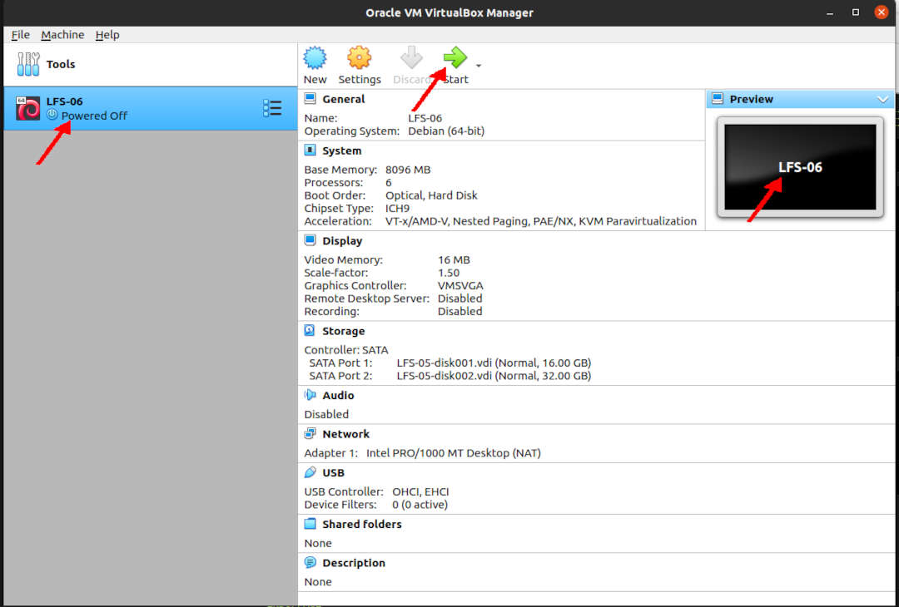

---
---

[HOME](index.md)
[ABOUT](README.md)
[WEB](https://lfs.vlsm.org/)
[GITHUB](https://github.com/OSP4DISS/lfs/)
[TOP](#)
[BOTTOM](#endofpage)
[PREV](LFS-04.md)
[NEXT](LFS-09.md)

<br>
# LFS: Chapter 6

## Virtual Box Guest LFS-06

* Import LFS-05.ova, rename to LFS-06

<br>


```
ssh -p 6023 lfs@localhost

```

```
echo $LFS
cd $LFS/sources/

```


<br>
## ###

<br>
## Done

```
su -
```

```
poweroff

```

* Back to "pamulang1" host

* Export LFS-06.OVA (backup)

<br>
#### ENDOFPAGE
[HOME](index.md)
[ABOUT](README.md)
[WEB](https://lfs.vlsm.org/)
[GITHUB](https://github.com/OSP4DISS/lfs/)
[TOP](#)
[BOTTOM](#endofpage)
[PREV](LFS-04.md)
[NEXT](LFS-09.md)
<br>

