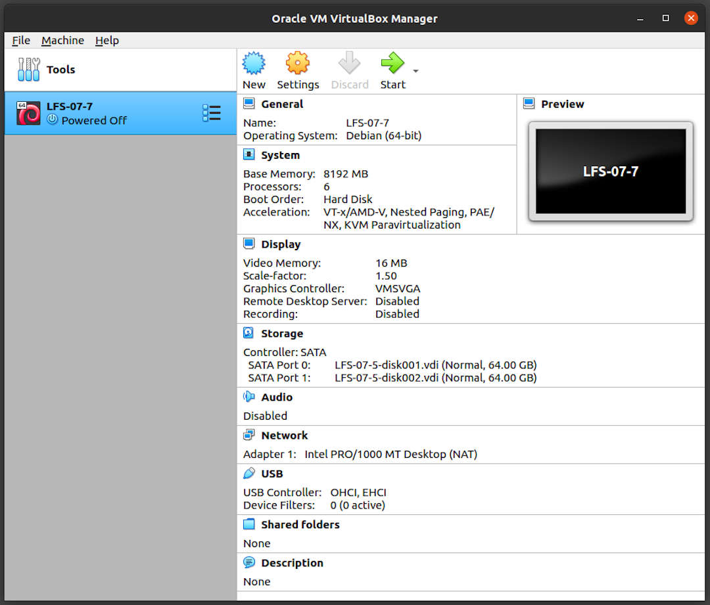

---
---

[HOME](index.md)
[ABOUT](README.md)
[WEB](https://lfs.vlsm.org/)
[GITHUB](https://github.com/OSP4DISS/lfs/)
[TOP](#)
[BOTTOM](#endofpage)
[PREV](LFS-07-1.md)
[NEXT](LFS-07-1.md)

<br>
# LFS: Chapter 7 part 7 - 14

## Virtual Box Guest LFS-07-7

* Import LFS-07-1.ova, rename to LFS-07-7

<br>


<br>
## Enter CHROOT
* [First, do chapter 7 part 3 - 6](LFS-07-3.md)

```
cd /sources/

```

<br>
## Libstdc++ from GCC-10.2.0, Pass 2

```
tar xvf gcc-10.2.0.tar.xz
cd gcc-10.2.0/

```

```
ln -s gthr-posix.h libgcc/gthr-default.h

```

```
mkdir -v build
cd       build

```

```
../libstdc++-v3/configure            \
    CXXFLAGS="-g -O2 -D_GNU_SOURCE"  \
    --prefix=/usr                    \
    --disable-multilib               \
    --disable-nls                    \
    --host=$(uname -m)-lfs-linux-gnu \
    --disable-libstdcxx-pch

```

```
time make

```

```
time make install

```

```
cd ../../
rm -rfv gcc-10.2.0/

```

<br>
## Gettext-0.21

```
tar xfv gettext-0.21.tar.xz
cd gettext-0.21/

```

```
./configure --disable-shared

```

```
time make

```

```
cp -v gettext-tools/src/{msgfmt,msgmerge,xgettext} /usr/bin

```

```
cd ../
rm -rfv gettext-0.21/

```

<br>
## Bison-3.7.5

```
tar xfv bison-3.7.5.tar.xz
cd bison-3.7.5/

```

```
./configure --prefix=/usr \
            --docdir=/usr/share/doc/bison-3.7.5

```

```
time make

```

```
time make install

```

```
cd ../
rm -rvf bison-3.7.5/

```

<br>
## Perl-5.32.1

```
tar xfv perl-5.32.1.tar.xz
cd perl-5.32.1/

```

```
sh Configure -des                                        \
             -Dprefix=/usr                               \
             -Dvendorprefix=/usr                         \
             -Dprivlib=/usr/lib/perl5/5.32/core_perl     \
             -Darchlib=/usr/lib/perl5/5.32/core_perl     \
             -Dsitelib=/usr/lib/perl5/5.32/site_perl     \
             -Dsitearch=/usr/lib/perl5/5.32/site_perl    \
             -Dvendorlib=/usr/lib/perl5/5.32/vendor_perl \
             -Dvendorarch=/usr/lib/perl5/5.32/vendor_perl

```

```
time make

```

```
time make install

```

```
cd ../
rm -rvf perl-5.32.1/

```

<br>
## Python-3.9.2

```
tar xfv Python-3.9.2.tar.xz
cd Python-3.9.2/

```

```
./configure --prefix=/usr   \
            --enable-shared \
            --without-ensurepip

```

```
time make

```

```
time make install

```

```
cd ../
rm -rfv Python-3.9.2/

```

<br>
## Texinfo-6.7

```
tar xvf texinfo-6.7.tar.xz
cd texinfo-6.7/

```

```
./configure --prefix=/usr

```

```
time make

```

```
time make install

```

```
cd ../
rm -rfv texinfo-6.7/

```

<br>
## Util-linux-2.36.2

```
tar xvf util-linux-2.36.2.tar.xz
cd util-linux-2.36.2/

```

```
mkdir -pv /var/lib/hwclock

```

```
./configure ADJTIME_PATH=/var/lib/hwclock/adjtime    \
            --docdir=/usr/share/doc/util-linux-2.36.2 \
            --disable-chfn-chsh  \
            --disable-login      \
            --disable-nologin    \
            --disable-su         \
            --disable-setpriv    \
            --disable-runuser    \
            --disable-pylibmount \
            --disable-static     \
            --without-python     \
            runstatedir=/run

```

```
time make

```

```
time make install

```

```
cd ../
rm -rfv util-linux-2.36.2/

```

<br>
## Cleaning up and Saving the Temporary System

```
find /usr/{lib,libexec} -name \*.la -delete

```

```
rm -rvf /usr/share/{info,man,doc}/*

```

<br>
## Exit CHROOT

```
exit

```

```
echo $LFS

```

```
umount $LFS/dev{/pts,}
umount $LFS/{sys,proc,run}

```

```
strip --strip-debug $LFS/usr/lib/*
strip --strip-unneeded $LFS/usr/{,s}bin/*
strip --strip-unneeded $LFS/tools/bin/*

```

```
cd $LFS
time tar -cpv . | xz -zve9T6 > $HOME/lfs-temp-tools-10.1.tar.xz 

```

```
tar tf $HOME/lfs-temp-tools-10.1.tar.xz

```

<br>
## Done

```
poweroff

```

* Back to "pamulang1" host

* Export LFS-07-7.OVA (backup)

<br>
#### ENDOFPAGE
[HOME](index.md)
[ABOUT](README.md)
[WEB](https://lfs.vlsm.org/)
[GITHUB](https://github.com/OSP4DISS/lfs/)
[TOP](#)
[BOTTOM](#endofpage)
[PREV](LFS-07-1.md)
[NEXT](LFS-07-1.md)
<br>

