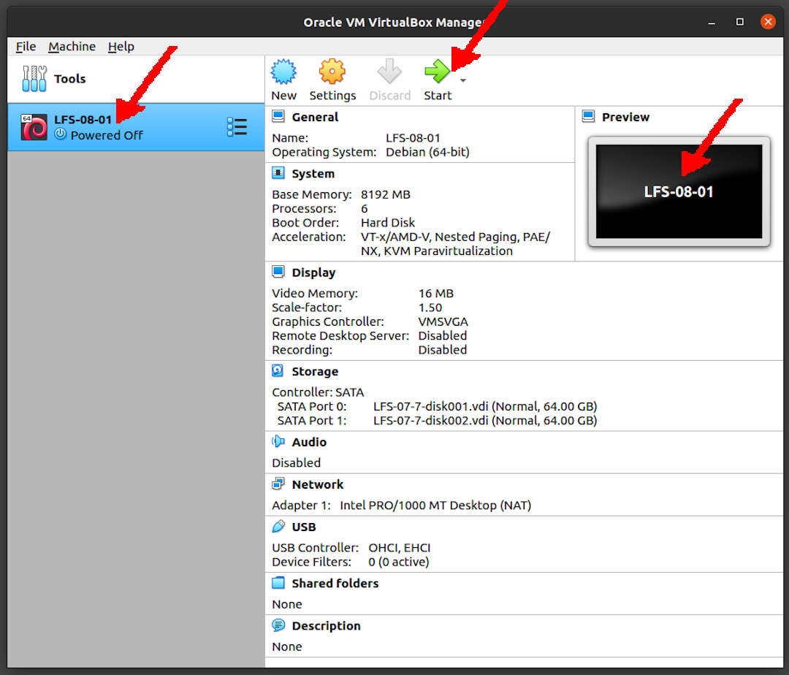

---
---

[HOME](index.md)
[ABOUT](README.md)
[WEB](https://lfs.vlsm.org/)
[GITHUB](https://github.com/OSP4DISS/lfs/)
[TOP](#)
[BOTTOM](#endofpage)
[PREV](LFS-07-7.md)
[NEXT](LFS-08-18.md)

<br>
# LFS: Chapter 8 part 1 - 17

## Virtual Box Guest LFS-08-01

* Import LFS-07-7.ova, rename to LFS-08-01

<br>


<br>
## Enter CHROOT
* [First, **REDO** chapter 7 part 3 - 4](LFS-07-3.md)

```
cd /sources/

```

<br>
## Man-pages-5.1

```
tar xvf man-pages-5.10.tar.xz
cd man-pages-5.10/

```

```
make install

```

```
cd ../
rm -rfv man-pages-5.10/

```

<br>
## Iana-Etc-20210202

```
tar xfv iana-etc-20210202.tar.gz
cd iana-etc-20210202/

```

```
cp services protocols /etc

```

```
cd ../
rm -rfv iana-etc-20210202/

```

<br>
## Glibc-2.33

```
tar xvf glibc-2.33.tar.xz
cd glibc-2.33/

```

```
patch -Np1 -i ../glibc-2.33-fhs-1.patch

```

```
sed -e '402a\      *result = local->data.services[database_index];' \
    -i nss/nss_database.c

```

```
mkdir -v build
cd       build

```

```
../configure --prefix=/usr                            \
             --disable-werror                         \
             --enable-kernel=3.2                      \
             --enable-stack-protector=strong          \
             --with-headers=/usr/include              \
             libc_cv_slibdir=/lib

```

```
time make

```

<br>
<span style="color:red; font-weight:bold; font-size:larger;">NO
WORRIES!</span>
* io/tst-lchmod is known to fail in the LFS chroot environment.
* misc/tst-ttyname is known to fail in the LFS chroot environment.

```
make check

# === TL;DR ===
# Summary of test results:
#      2 FAIL
#   4300 PASS
#     40 UNSUPPORTED
#     17 XFAIL
#      2 XPASS
# make[1]: *** [Makefile:642: tests] Error 1
# make[1]: Leaving directory '/sources/glibc-2.33'
# make: *** [Makefile:9: check] Error 2
# (lfs chroot) root:/sources/glibc-2.33/build#

```

```
touch /etc/ld.so.conf

```

```
sed '/test-installation/s@$(PERL)@echo not running@' -i ../Makefile

```

```
make install

```

```
cp -v ../nscd/nscd.conf /etc/nscd.conf
mkdir -pv /var/cache/nscd

```

```
mkdir -pv /usr/lib/locale
localedef -i POSIX -f UTF-8 C.UTF-8 2> /dev/null || true
localedef -i cs_CZ -f UTF-8 cs_CZ.UTF-8
localedef -i de_DE -f ISO-8859-1 de_DE
localedef -i de_DE@euro -f ISO-8859-15 de_DE@euro
localedef -i de_DE -f UTF-8 de_DE.UTF-8
localedef -i el_GR -f ISO-8859-7 el_GR
localedef -i en_GB -f UTF-8 en_GB.UTF-8
localedef -i en_HK -f ISO-8859-1 en_HK
localedef -i en_PH -f ISO-8859-1 en_PH
localedef -i en_US -f ISO-8859-1 en_US
localedef -i en_US -f UTF-8 en_US.UTF-8
localedef -i es_MX -f ISO-8859-1 es_MX
localedef -i fa_IR -f UTF-8 fa_IR
localedef -i fr_FR -f ISO-8859-1 fr_FR
localedef -i fr_FR@euro -f ISO-8859-15 fr_FR@euro
localedef -i fr_FR -f UTF-8 fr_FR.UTF-8
localedef -i it_IT -f ISO-8859-1 it_IT
localedef -i it_IT -f UTF-8 it_IT.UTF-8
localedef -i ja_JP -f EUC-JP ja_JP
localedef -i ja_JP -f SHIFT_JIS ja_JP.SIJS 2> /dev/null || true
localedef -i ja_JP -f UTF-8 ja_JP.UTF-8
localedef -i ru_RU -f KOI8-R ru_RU.KOI8-R
localedef -i ru_RU -f UTF-8 ru_RU.UTF-8
localedef -i tr_TR -f UTF-8 tr_TR.UTF-8
localedef -i zh_CN -f GB18030 zh_CN.GB18030
localedef -i zh_HK -f BIG5-HKSCS zh_HK.BIG5-HKSCS

```

```
make localedata/install-locales

```

```
cat > /etc/nsswitch.conf << "EOF"
# Begin /etc/nsswitch.conf

passwd: files
group: files
shadow: files

hosts: files dns
networks: files

protocols: files
services: files
ethers: files
rpc: files

# End /etc/nsswitch.conf
EOF

```

```
tar -xf ../../tzdata2021a.tar.gz

ZONEINFO=/usr/share/zoneinfo
mkdir -pv $ZONEINFO/{posix,right}

for tz in etcetera southamerica northamerica europe africa antarctica  \
          asia australasia backward; do
    zic -L /dev/null   -d $ZONEINFO       ${tz}
    zic -L /dev/null   -d $ZONEINFO/posix ${tz}
    zic -L leapseconds -d $ZONEINFO/right ${tz}
done

cp -v zone.tab zone1970.tab iso3166.tab $ZONEINFO
zic -d $ZONEINFO -p America/New_York
unset ZONEINFO

```

* Asia >>> Indonesia >>> Java

```
tzselect

```

### Eg. Asia/Jakarta (WIB)

```
ln -sfv /usr/share/zoneinfo/Asia/Jakarta /etc/localtime

```

```
cat > /etc/ld.so.conf << "EOF"
# Begin /etc/ld.so.conf
/usr/local/lib
/opt/lib

EOF

```

```
cat >> /etc/ld.so.conf << "EOF"
# Add an include directory
include /etc/ld.so.conf.d/*.conf

EOF
mkdir -pv /etc/ld.so.conf.d

```

```
cd ../../
rm -rfv glibc-2.33/

```

<br>
## Zlib-1.2.11

```
tar xvf zlib-1.2.11.tar.xz
cd zlib-1.2.11/

```

```
./configure --prefix=/usr

```

```
time make

```

```
make check

```

```
make install

```

```
mv -v /usr/lib/libz.so.* /lib
ln -sfv ../../lib/$(readlink /usr/lib/libz.so) /usr/lib/libz.so

```

```
rm -fv /usr/lib/libz.a

```

```
cd ../
rm -rfv zlib-1.2.11/

```

<br>
## Bzip2-1.0.8

```
tar xfv bzip2-1.0.8.tar.gz
cd bzip2-1.0.8/

```

```
patch -Np1 -i ../bzip2-1.0.8-install_docs-1.patch

```

```
sed -i 's@\(ln -s -f \)$(PREFIX)/bin/@\1@' Makefile

```

```
sed -i "s@(PREFIX)/man@(PREFIX)/share/man@g" Makefile

```

```
make -f Makefile-libbz2_so
make clean

```

```
time make

```

```
make PREFIX=/usr install

```

```
cp -v bzip2-shared /bin/bzip2
cp -av libbz2.so* /lib
ln -sv ../../lib/libbz2.so.1.0 /usr/lib/libbz2.so
rm -v /usr/bin/{bunzip2,bzcat,bzip2}
ln -sv bzip2 /bin/bunzip2
ln -sv bzip2 /bin/bzcat

```

```
rm -fv /usr/lib/libbz2.a

```

```
cd ../
rm -rfv bzip2-1.0.8/

```

<br>
## Xz-5.2.5

```
tar xvf xz-5.2.5.tar.xz
cd xz-5.2.5/

```

```
./configure --prefix=/usr    \
            --disable-static \
            --docdir=/usr/share/doc/xz-5.2.5

```

```
time make

```

```
make check

```

```
make install
mv -v   /usr/bin/{lzma,unlzma,lzcat,xz,unxz,xzcat} /bin
mv -v /usr/lib/liblzma.so.* /lib
ln -svf ../../lib/$(readlink /usr/lib/liblzma.so) /usr/lib/liblzma.so

```

```
cd ../
rm -rfv xz-5.2.5/

```

<br>
## Zstd-1.4.8

```
tar xvf zstd-1.4.8.tar.gz
cd zstd-1.4.8/

```

```
time make

```

```
make check

```

```
make prefix=/usr install

```

```
rm -v /usr/lib/libzstd.a
mv -v /usr/lib/libzstd.so.* /lib
ln -sfv ../../lib/$(readlink /usr/lib/libzstd.so) /usr/lib/libzstd.so

```

```
cd ../
rm -rfv zstd-1.4.8/

```

<br>
## File-5.39

```
tar xfv file-5.39.tar.gz
cd file-5.39/

```

```
./configure --prefix=/usr

```

```
time make

```

```
make check

```

```
make install

```

```
cd ../
rm -rfv file-5.39/

```

<br>
## Readline-8.1

```
tar vfx readline-8.1.tar.gz
cd readline-8.1/

```

```
sed -i '/MV.*old/d' Makefile.in
sed -i '/{OLDSUFF}/c:' support/shlib-install

```

```
./configure --prefix=/usr    \
            --disable-static \
            --with-curses    \
            --docdir=/usr/share/doc/readline-8.1

```

```
make SHLIB_LIBS="-lncursesw"

```

```
make SHLIB_LIBS="-lncursesw" install

```

```
mv -v /usr/lib/lib{readline,history}.so.* /lib
ln -sfv ../../lib/$(readlink /usr/lib/libreadline.so) /usr/lib/libreadline.so
ln -sfv ../../lib/$(readlink /usr/lib/libhistory.so ) /usr/lib/libhistory.so

```

```
install -v -m644 doc/*.{ps,pdf,html,dvi} /usr/share/doc/readline-8.1

```

```
cd ../
rm -rfv readline-8.1/

```

<br>
## M4-1.4.18

```
tar xfv m4-1.4.18.tar.xz
cd m4-1.4.18/

```

```
sed -i 's/IO_ftrylockfile/IO_EOF_SEEN/' lib/*.c
echo "#define _IO_IN_BACKUP 0x100" >> lib/stdio-impl.h

```

```
./configure --prefix=/usr

```

```
time make

```

```
make check

```

```
make install

```

```
cd ../
rm -rfv m4-1.4.18/

```

<br>
## Bc-3.3.0

```
tar xfv bc-3.3.0.tar.xz
cd bc-3.3.0/

```

```
PREFIX=/usr CC=gcc ./configure.sh -G -O3

```

```
time make

```

```
make test

```

```
make install

```

```
cd ../
rm -rfv bc-3.3.0/

```

<br>
## Flex-2.6.4

```
tar xvf flex-2.6.4.tar.gz
cd flex-2.6.4/

```

```
./configure --prefix=/usr \
            --docdir=/usr/share/doc/flex-2.6.4 \
            --disable-static

```

```
time make

```

```
make check

```

```
make install

```

```
ln -sv flex /usr/bin/lex

```

```
cd ../
rm -rfv flex-2.6.4/

```

<br>
## Tcl-8.6.11

```
tar xvf tcl8.6.11-src.tar.gz
cd tcl8.6.11/

```

```
tar -xvf ../tcl8.6.11-html.tar.gz --strip-components=1

```

```
SRCDIR=$(pwd)
cd unix
./configure --prefix=/usr           \
            --mandir=/usr/share/man \
            $([ "$(uname -m)" = x86_64 ] && echo --enable-64bit)

```

```
time make

sed -e "s|$SRCDIR/unix|/usr/lib|" \
    -e "s|$SRCDIR|/usr/include|"  \
    -i tclConfig.sh

sed -e "s|$SRCDIR/unix/pkgs/tdbc1.1.2|/usr/lib/tdbc1.1.2|" \
    -e "s|$SRCDIR/pkgs/tdbc1.1.2/generic|/usr/include|"    \
    -e "s|$SRCDIR/pkgs/tdbc1.1.2/library|/usr/lib/tcl8.6|" \
    -e "s|$SRCDIR/pkgs/tdbc1.1.2|/usr/include|"            \
    -i pkgs/tdbc1.1.2/tdbcConfig.sh

sed -e "s|$SRCDIR/unix/pkgs/itcl4.2.1|/usr/lib/itcl4.2.1|" \
    -e "s|$SRCDIR/pkgs/itcl4.2.1/generic|/usr/include|"    \
    -e "s|$SRCDIR/pkgs/itcl4.2.1|/usr/include|"            \
    -i pkgs/itcl4.2.1/itclConfig.sh

unset SRCDIR

```

* There are several places associated with clock.test that indicate a failure.

```
make test

```

```
make install

```

```
chmod -v u+w /usr/lib/libtcl8.6.so

```

```
make install-private-headers

```

```
ln -sfv tclsh8.6 /usr/bin/tclsh

```

```
mv /usr/share/man/man3/{Thread,Tcl_Thread}.3

```

```
cd ../../
rm -rfv tcl8.6.11/

```

<br>
## Expect-5.45.4

```
tar xvf expect5.45.4.tar.gz
cd expect5.45.4/

```

```
./configure --prefix=/usr           \
            --with-tcl=/usr/lib     \
            --enable-shared         \
            --mandir=/usr/share/man \
            --with-tclinclude=/usr/include

```

```
time make

```

```
make test

```

```
make install
ln -svf expect5.45.4/libexpect5.45.4.so /usr/lib

```

```
cd ../
rm -rfv expect5.45.4/

```

<br>
## DejaGNU-1.6.2

```
tar xvf dejagnu-1.6.2.tar.gz
cd dejagnu-1.6.2/

```

```
./configure --prefix=/usr
makeinfo --html --no-split -o doc/dejagnu.html doc/dejagnu.texi
makeinfo --plaintext       -o doc/dejagnu.txt  doc/dejagnu.texi

```

```
make install
install -v -dm755  /usr/share/doc/dejagnu-1.6.2
install -v -m644   doc/dejagnu.{html,txt} /usr/share/doc/dejagnu-1.6.2

```

```
make check

```

```
cd ../
rm -rfv dejagnu-1.6.2/

```

<br>
## Exit CHROOT

```
exit

```

<br>
## Done

```
df /dev/sd?2
poweroff

```

* Back to "pamulang1" host

* Export LFS-08-01.OVA (backup)

<br>
#### ENDOFPAGE
[HOME](index.md)
[ABOUT](README.md)
[WEB](https://lfs.vlsm.org/)
[GITHUB](https://github.com/OSP4DISS/lfs/)
[TOP](#)
[BOTTOM](#endofpage)
[PREV](LFS-07-7.md)
[NEXT](LFS-08-18.md)
<br>

