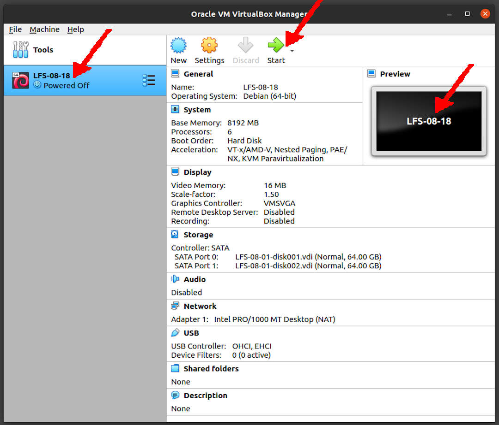

---
---

[HOME](index.md)
[ABOUT](README.md)
[WEB](https://lfs.vlsm.org/)
[GITHUB](https://github.com/OSP4DISS/lfs/)
[TOP](#)
[BOTTOM](#endofpage)
[PREV](LFS-08-01.md)
[NEXT](LFS-08-18.md)

<br>
# LFS: Chapter 8 part 18 - XX

## Virtual Box Guest LFS-08-18

* Import LFS-08-01.ova, rename to LFS-08-18

<br>


<br>
## Enter CHROOT
* [First, **REDO** chapter 7 part 3 - 4](LFS-07-3.md)

```
cd /sources/

```

<br>
## Binutils-2.36.1

```
tar xfv binutils-2.36.1.tar.xz
cd binutils-2.36.1/

```

* The output should be "spawn ls"

```
expect -c "spawn ls"

```

```
sed -i '/@\tincremental_copy/d' gold/testsuite/Makefile.in

```

```
mkdir -v build
cd       build

```


```
../configure --prefix=/usr       \
             --enable-gold       \
             --enable-ld=default \
             --enable-plugins    \
             --enable-shared     \
             --disable-werror    \
             --enable-64-bit-bfd \
             --with-system-zlib

```

```
make tooldir=/usr

```

* Four tests named “Run property ...” are known to fail.

```
make -k check

```

```
make tooldir=/usr
make tooldir=/usr install

```

```
rm -fv /usr/lib/lib{bfd,ctf,ctf-nobfd,opcodes}.a

```

```
cd ../../
rm -rfv binutils-2.36.1/

```

<br>
## GMP-6.2.1

```
tar vfx gmp-6.2.1.tar.xz
cd gmp-6.2.1/

```

```
./configure --prefix=/usr    \
            --enable-cxx     \
            --disable-static \
            --docdir=/usr/share/doc/gmp-6.2.1

```

```
make
make html

```

```
make check 2>&1 | tee gmp-check-log

```

* Ensure that all 197 tests in the test suite passed

```
awk '/# PASS:/{total+=$3} ; END{print total}' gmp-check-log

```

```
make install
make install-html

```

```
cd ../
rm -rfv gmp-6.2.1/

```

<br>
## MPFR-4.1.0

```
tar xvf mpfr-4.1.0.tar.xz
cd mpfr-4.1.0/

```

```
./configure --prefix=/usr        \
            --disable-static     \
            --enable-thread-safe \
            --docdir=/usr/share/doc/mpfr-4.1.0

```

```
make
make html

```

```
make check

```

```
make install
make install-html

```

```
cd ../
rm -rfv mpfr-4.1.0/

```

<br>
## MPC-1.2.1

```
tar xvf mpc-1.2.1.tar.gz
cd mpc-1.2.1/

```

```
./configure --prefix=/usr    \
            --disable-static \
            --docdir=/usr/share/doc/mpc-1.2.1

```

```
time make
time make html

```

```
make check

```

```
make install
make install-html

```

```
cd ../
rm -rfv mpc-1.2.1/

```

<br>
## ###

<br>
## Exit CHROOT

```
exit

```

<br>
## Done

```
poweroff

```

* Back to "pamulang1" host

* Export LFS-08-18.OVA (backup)

<br>
#### ENDOFPAGE
[HOME](index.md)
[ABOUT](README.md)
[WEB](https://lfs.vlsm.org/)
[GITHUB](https://github.com/OSP4DISS/lfs/)
[TOP](#)
[BOTTOM](#endofpage)
[PREV](LFS-08-01.md)
[NEXT](LFS-08-18.md)
<br>

