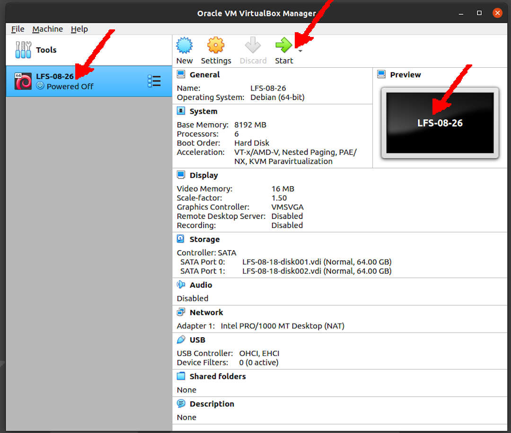

---
---

[HOME](index.md)
[ABOUT](README.md)
[WEB](https://lfs.vlsm.org/)
[GITHUB](https://github.com/OSP4DISS/lfs/)
[TOP](#)
[BOTTOM](#endofpage)
[PREV](LFS-08-18.md)
[NEXT](LFS-08-18.md)

<br>
# LFS: Chapter 8 part 26 - XX

## Virtual Box Guest LFS-08-26

* Import LFS-08-18.ova, rename to LFS-08-26

<br>


<br>
## Enter CHROOT
* [First, **REDO** chapter 7 part 3 - 4](LFS-07-3.md)

```
cd /sources/

```

<br>
## GCC-10.2.0 (95 SBU!)

```
tar xvf gcc-10.2.0.tar.xz
cd gcc-10.2.0/

```

```
case $(uname -m) in
  x86_64)
    sed -e '/m64=/s/lib64/lib/' \
        -i.orig gcc/config/i386/t-linux64
  ;;
esac

```

```
mkdir -v build
cd       build

```

```
../configure --prefix=/usr            \
             LD=ld                    \
             --enable-languages=c,c++ \
             --disable-multilib       \
             --disable-bootstrap      \
             --with-system-zlib

```

* real	7m28.825s
* user	29m11.045s
* sys	2m2.220s

```
time make

```

```
ulimit -s 32768

```

```
chown -Rv tester . 
su tester -c "PATH=$PATH make -k check"

```

```
../contrib/test_summary

```

```
make install
rm -rf /usr/lib/gcc/$(gcc -dumpmachine)/10.2.0/include-fixed/bits/

```

```
chown -v -R root:root \
    /usr/lib/gcc/*linux-gnu/10.2.0/include{,-fixed}

```

```
ln -sv ../usr/bin/cpp /lib

```

```
ln -sfv ../../libexec/gcc/$(gcc -dumpmachine)/10.2.0/liblto_plugin.so \
        /usr/lib/bfd-plugins/

```

* [Requesting program interpreter: /lib64/ld-linux-x86-64.so.2]

```
echo 'int main(){}' > dummy.c
cc dummy.c -v -Wl,--verbose &> dummy.log
readelf -l a.out | grep ': /lib'

```

* /usr/lib/gcc/x86_64-pc-linux-gnu/10.2.0/../../../../lib/crt1.o succeeded
* /usr/lib/gcc/x86_64-pc-linux-gnu/10.2.0/../../../../lib/crti.o succeeded
* /usr/lib/gcc/x86_64-pc-linux-gnu/10.2.0/../../../../lib/crtn.o succeeded

```
grep -o '/usr/lib.*/crt[1in].*succeeded' dummy.log

```

* #include <...> search starts here:
  * /usr/lib/gcc/x86_64-pc-linux-gnu/10.2.0/include
  * /usr/local/include
  * /usr/lib/gcc/x86_64-pc-linux-gnu/10.2.0/include-fixed
  * /usr/include

```
grep -B4 '^ /usr/include' dummy.log

```

* OUTPUT
  * SEARCH_DIR("/usr/x86_64-pc-linux-gnu/lib64")
  * SEARCH_DIR("/usr/local/lib64")
  * SEARCH_DIR("/lib64")
  * SEARCH_DIR("/usr/lib64")
  * SEARCH_DIR("/usr/x86_64-pc-linux-gnu/lib")
  * SEARCH_DIR("/usr/local/lib")
  * SEARCH_DIR("/lib")
  * SEARCH_DIR("/usr/lib");

```
grep 'SEARCH.*/usr/lib' dummy.log |sed 's|; |\n|g'

```

* attempt to open /lib/libc.so.6 succeeded

```
grep "/lib.*/libc.so.6 " dummy.log

```

* found ld-linux-x86-64.so.2 at /lib/ld-linux-x86-64.so.2

```
grep found dummy.log

```

```
rm -v dummy.c a.out dummy.log

```

```
mkdir -pv /usr/share/gdb/auto-load/usr/lib
mv -v /usr/lib/*gdb.py /usr/share/gdb/auto-load/usr/lib

```

```
cd ../../
rm -rfv gcc-10.2.0/

```

<br>
## Pkg-config-0.29.2

```
tar xvf pkg-config-0.29.2.tar.gz
cd pkg-config-0.29.2/

```

```
./configure --prefix=/usr              \
            --with-internal-glib       \
            --disable-host-tool        \
            --docdir=/usr/share/doc/pkg-config-0.29.2

```

```
time make

```

```
make check

```

```
make install

```

```
cd ../
rm -rvf pkg-config-0.29.2/

```

<br>
## Ncurses-6.2

```
tar xvf ncurses-6.2.tar.gz
cd ncurses-6.2/

```

```
./configure --prefix=/usr           \
            --mandir=/usr/share/man \
            --with-shared           \
            --without-debug         \
            --without-normal        \
            --enable-pc-files       \
            --enable-widec

```

```
time make

```

```
make install

```

```
mv -v /usr/lib/libncursesw.so.6* /lib

```

```
for lib in ncurses form panel menu ; do
    rm -vf                    /usr/lib/lib${lib}.so
    echo "INPUT(-l${lib}w)" > /usr/lib/lib${lib}.so
    ln -sfv ${lib}w.pc        /usr/lib/pkgconfig/${lib}.pc
done

```

```
rm -vf                     /usr/lib/libcursesw.so
echo "INPUT(-lncursesw)" > /usr/lib/libcursesw.so
ln -sfv libncurses.so      /usr/lib/libcurses.so

```

```
rm -fv /usr/lib/libncurses++w.a

```

```
mkdir -v       /usr/share/doc/ncurses-6.2
cp -v -R doc/* /usr/share/doc/ncurses-6.2

```

* non-wide-character Ncurses libraries

```
make distclean
./configure --prefix=/usr    \
            --with-shared    \
            --without-normal \
            --without-debug  \
            --without-cxx-binding \
            --with-abi-version=5 
make sources libs
cp -av lib/lib*.so.5* /usr/lib

```

```
cd ../
rm -rfv ncurses-6.2/

```

<br>
## Sed-4.8

```
tar xvf sed-4.8.tar.xz
cd sed-4.8/

```

```
./configure --prefix=/usr --bindir=/bin

```

```
make
make html

```

```
chown -Rv tester .
su tester -c "PATH=$PATH make check"

```

```
make install
install -d -m755           /usr/share/doc/sed-4.8
install -m644 doc/sed.html /usr/share/doc/sed-4.8

```

```
cd ../
rm -rfv sed-4.8/

```

<br>
## Psmisc-23.4

```
tar xvf psmisc-23.4.tar.xz
cd psmisc-23.4/

```

```
./configure --prefix=/usr

```

```
time make

```

```
make install

```

```
mv -v /usr/bin/fuser   /bin
mv -v /usr/bin/killall /bin

```

```
cd ../
rm -rfv psmisc-23.4/

```

<br>
## ###

<br>
## Exit CHROOT

```
exit

```

<br>
## Done

```
poweroff

```

* Back to "pamulang1" host

* Export LFS-08-26.OVA (backup)

<br>
#### ENDOFPAGE
[HOME](index.md)
[ABOUT](README.md)
[WEB](https://lfs.vlsm.org/)
[GITHUB](https://github.com/OSP4DISS/lfs/)
[TOP](#)
[BOTTOM](#endofpage)
[PREV](LFS-08-18.md)
[NEXT](LFS-08-18.md)
<br>

