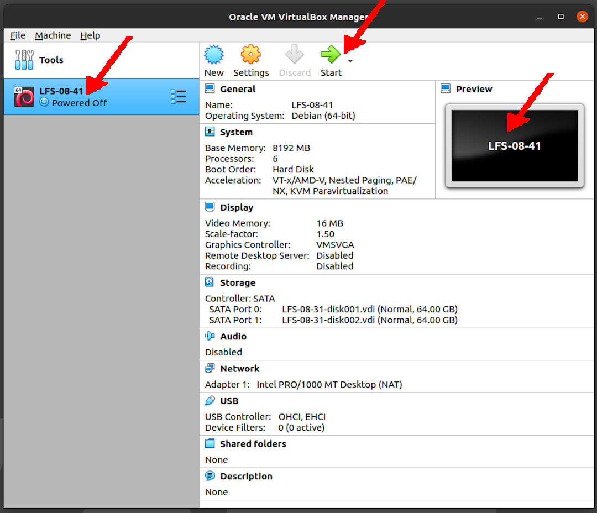

---
---

[HOME](index.md)
[ABOUT](README.md)
[WEB](https://lfs.vlsm.org/)
[GITHUB](https://github.com/OSP4DISS/lfs/)
[TOP](#)
[BOTTOM](#endofpage)
[PREV](LFS-08-31.md)
[NEXT](LFS-08-61.md)

<br>
# LFS: Chapter 8 part 41 - 60

## Virtual Box Guest LFS-08-41

* Import LFS-08-31.ova, rename to LFS-08-41

<br>


<br>
## Enter CHROOT
* [First, **REDO** chapter 7 part 3 - 4](LFS-07-3.md)

```
cd /sources/

```

<br>
## XML::Parser-2.46

```
tar xvf XML-Parser-2.46.tar.gz
cd XML-Parser-2.46/

```

```
perl Makefile.PL

```

```
time make

```

```
make test

```

```
make install

```

```
cd ../
rm -rfv XML-Parser-2.46/

```

<br>
## Intltool-0.51.0

```
tar xvf intltool-0.51.0.tar.gz
cd intltool-0.51.0/

```

```
sed -i 's:\\\${:\\\$\\{:' intltool-update.in

```

```
./configure --prefix=/usr

```

```
time make

```

```
make check

```

```
make install
install -v -Dm644 doc/I18N-HOWTO /usr/share/doc/intltool-0.51.0/I18N-HOWTO

```

```
cd ../
rm -rfv intltool-0.51.0/

```

<br>
## Autoconf-2.71

```
tar xvf autoconf-2.71.tar.xz
cd autoconf-2.71/

```

```
./configure --prefix=/usr

```

```
time make

```

```
make check

```

```
make install

```

```
cd ../
rm -rf autoconf-2.71/

```

<br>
## Automake-1.16.3

```
tar xvf automake-1.16.3.tar.xz
cd automake-1.16.3/

```

```
sed -i "s/''/etags/" t/tags-lisp-space.sh

```

```
./configure --prefix=/usr --docdir=/usr/share/doc/automake-1.16.3

```

```
time make

```

* FAIL:  2

```
make -j6 check

```

```
make install

```

```
cd ../
rm -rfv automake-1.16.3/

```

<br>
## REDO: Libtool-2.4.6 ##### #####

```
tar xvf libtool-2.4.6.tar.xz
cd libtool-2.4.6/

```

```
./configure --prefix=/usr

```

```
time make

```

* 139 tests behaved as expected.
* 31 tests were skipped.

```
make check TESTSUITEFLAGS=-j6

```

```
make install

```

```
rm -fv /usr/lib/libltdl.a

```

```
cd ..
rm -rfv libtool-2.4.6/

```

<br>
## Kmod-28

```
tar xvf kmod-28.tar.xz
cd kmod-28/

```

```
./configure --prefix=/usr          \
            --bindir=/bin          \
            --sysconfdir=/etc      \
            --with-rootlibdir=/lib \
            --with-xz              \
            --with-zstd            \
            --with-zlib

```

```
time make

```

```
make install

for target in depmod insmod lsmod modinfo modprobe rmmod; do
  ln -sfv ../bin/kmod /sbin/$target
done

ln -sfv kmod /bin/lsmod

```

```
cd ../
rm -rfv kmod-28/

```

<br>
## Libelf from Elfutils-0.183

```
tar xvf elfutils-0.183.tar.bz2
cd elfutils-0.183/

```

```
./configure --prefix=/usr                \
            --disable-debuginfod         \
            --enable-libdebuginfod=dummy \
            --libdir=/lib

```

```
time make

```

```
make check

```

```
make -C libelf install
install -vm644 config/libelf.pc /usr/lib/pkgconfig
rm /lib/libelf.a

```

```
cd ../
rm -rfv elfutils-0.183/

```

<br>
## Libffi-3.3

```
tar xvf libffi-3.3.tar.gz
cd libffi-3.3/

```

```
./configure --prefix=/usr --disable-static --with-gcc-arch=native

```

```
time make

```

* Expected passes		2284

```
make check

```

```
make install

```

* tmp hack

```
ln -s /usr/lib64/libffi.a /usr/lib/libffi.a
ln -s /usr/lib64/libffi.so /usr/lib/libffi.so
ln -s /usr/lib64/libffi.so.7 /usr/lib/libffi.so.7
ln -s /usr/lib64/libffi.so.7.1.0 /usr/lib/libffi.so.7.1.0

```

```
cd ../
rm -rfv libffi-3.3/

```

<br>
## OpenSSL-1.1.1j

```
tar xvf openssl-1.1.1j.tar.gz
cd openssl-1.1.1j/

```

```
./config --prefix=/usr         \
         --openssldir=/etc/ssl \
         --libdir=lib          \
         shared                \
         zlib-dynamic

```

```
time make

```

```
make test

```

```
sed -i '/INSTALL_LIBS/s/libcrypto.a libssl.a//' Makefile
make MANSUFFIX=ssl install

```

```
mv -v /usr/share/doc/openssl /usr/share/doc/openssl-1.1.1j

```

```
cp -vfr doc/* /usr/share/doc/openssl-1.1.1j

```

```
cd ../
rm -rfv openssl-1.1.1j/

```

<br>
## Python-3.9.2

```
tar xvf Python-3.9.2.tar.xz
cd Python-3.9.2/

```

```
./configure --prefix=/usr       \
            --enable-shared     \
            --with-system-expat \
            --with-system-ffi   \
            --with-ensurepip=yes

```

```
time make

```

* Some tests requiring a network connection or additional packages are skipped.
* Resource 'http://...' is not available
* 2 tests failed: test_curses test_unicodedata
* Tests result: FAILURE then FAILURE

```
make test

```

* One more time for Good and Bad Luck

```
make test

```

```
make install

```

```
install -v -dm755 /usr/share/doc/python-3.9.2/html 

tar --strip-components=1  \
    --no-same-owner       \
    --no-same-permissions \
    -C /usr/share/doc/python-3.9.2/html \
    -xvf ../python-3.9.2-docs-html.tar.bz2

```

```
cd ../
rm -rfv Python-3.9.2/

```

<br>
## Ninja-1.10.2

```
tar xvf ninja-1.10.2.tar.gz
cd ninja-1.10.2/

```

```
export NINJAJOBS=6

```

```
sed -i '/int Guess/a \
  int   j = 0;\
  char* jobs = getenv( "NINJAJOBS" );\
  if ( jobs != NULL ) j = atoi( jobs );\
  if ( j > 0 ) return j;\
' src/ninja.cc

```

```
python3 configure.py --bootstrap

```

```
./ninja ninja_test
./ninja_test --gtest_filter=-SubprocessTest.SetWithLots

```

```
install -vm755 ninja /usr/bin/
install -vDm644 misc/bash-completion /usr/share/bash-completion/completions/ninja
install -vDm644 misc/zsh-completion  /usr/share/zsh/site-functions/_ninja

```

```
cd ../
rm -rfv ninja-1.10.2/

```

<br>
## Meson-0.57.1

```
tar xvf meson-0.57.1.tar.gz
cd meson-0.57.1/

```

```
python3 setup.py build

```

```
python3 setup.py install --root=dest
cp -rv dest/* /

```

```
cd ../
rm -rfv meson-0.57.1/

```

<br>
## Coreutils-8.32

```
tar xvf coreutils-8.32.tar.xz
cd coreutils-8.32/

```

```
patch -Np1 -i ../coreutils-8.32-i18n-1.patch

```

```
sed -i '/test.lock/s/^/#/' gnulib-tests/gnulib.mk

```

```
autoreconf -fiv
FORCE_UNSAFE_CONFIGURE=1 ./configure \
            --prefix=/usr            \
            --enable-no-install-program=kill,uptime

```

```
time make

```

```
make NON_ROOT_USERNAME=tester check-root

```

```
echo "dummy:x:102:tester" >> /etc/group

```

```
chown -Rv tester . 

```

```
su tester -c "PATH=$PATH make RUN_EXPENSIVE_TESTS=yes check"

```

```
sed -i '/dummy/d' /etc/group

```

```
make install

```

```
mv -v /usr/bin/{cat,chgrp,chmod,chown,cp,date,dd,df,echo} /bin
mv -v /usr/bin/{false,ln,ls,mkdir,mknod,mv,pwd,rm} /bin
mv -v /usr/bin/{rmdir,stty,sync,true,uname} /bin
mv -v /usr/bin/chroot /usr/sbin
mv -v /usr/share/man/man1/chroot.1 /usr/share/man/man8/chroot.8
sed -i 's/"1"/"8"/' /usr/share/man/man8/chroot.8

```

```
mv -v /usr/bin/{head,nice,sleep,touch} /bin

```

```
cd ../
rm -rfv coreutils-8.32/

```

<br>
## Check-0.15.2

```
tar xvf check-0.15.2.tar.gz
cd check-0.15.2/

```

```
./configure --prefix=/usr --disable-static

```

```
time make

```

```
make check

```

```
make docdir=/usr/share/doc/check-0.15.2 install

```

```
cd ../
rm -rfv check-0.15.2/

```

<br>
## Diffutils-3.7

```
tar xvf diffutils-3.7.tar.xz
cd diffutils-3.7/

```

```
./configure --prefix=/usr

```

```
time make

```

```
make check

```

```
make install

```

```
cd ../
rm -rfv diffutils-3.7/

```

<br>
## Gawk-5.1.0

```
tar xvf gawk-5.1.0.tar.xz
cd gawk-5.1.0/

```

```
sed -i 's/extras//' Makefile.in

```

```
./configure --prefix=/usr

```

```
time make

```

```
make check

```

```
make install

```

```
mkdir -v /usr/share/doc/gawk-5.1.0
cp    -v doc/{awkforai.txt,*.{eps,pdf,jpg}} /usr/share/doc/gawk-5.1.0

```

```
cd ../
rm -rfv gawk-5.1.0/

```

<br>
## ###

<br>
## Exit CHROOT

```
exit

```

<br>
## Done

```
poweroff

```

* Back to "pamulang1" host

* Export LFS-08-41.OVA (backup)

<br>
#### ENDOFPAGE
[HOME](index.md)
[ABOUT](README.md)
[WEB](https://lfs.vlsm.org/)
[GITHUB](https://github.com/OSP4DISS/lfs/)
[TOP](#)
[BOTTOM](#endofpage)
[PREV](LFS-08-31.md)
[NEXT](LFS-08-61.md)
<br>

