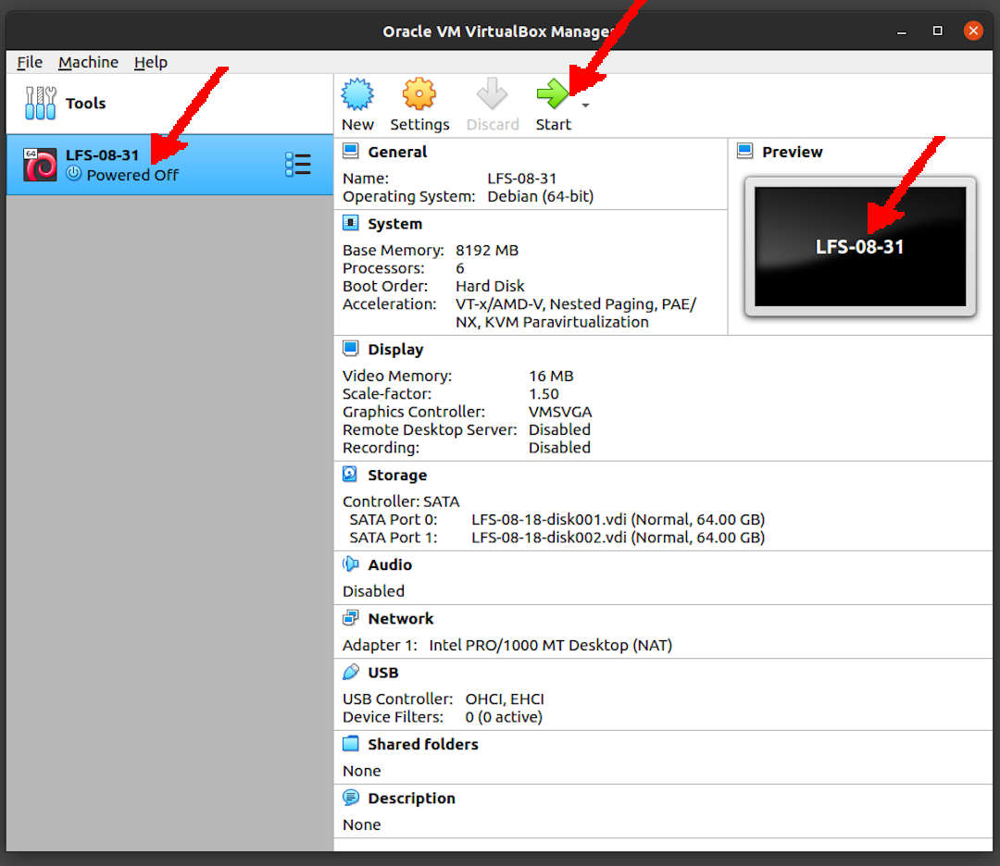

---
---

[HOME](index.md)
[ABOUT](README.md)
[WEB](https://lfs.vlsm.org/)
[GITHUB](https://github.com/OSP4DISS/lfs/)
[TOP](#)
[BOTTOM](#endofpage)
[PREV](LFS-08-61.md)
[NEXT](LFS-08-XX.md)

<br>
# LFS: Chapter 8 part 61 - XX

## Virtual Box Guest LFS-08-61

* Import LFS-08-41.ova, rename to LFS-08-61

<br>


<br>
## Enter CHROOT
* [First, **REDO** chapter 7 part 3 - 4](LFS-07-3.md)

```
cd /sources/

```

<br>
## ###

<br>
## Exit CHROOT

```
exit

```

<br>
## Done

```
poweroff

```

* Back to "pamulang1" host

* Export LFS-08-41.OVA (backup)

<br>
#### ENDOFPAGE
[HOME](index.md)
[ABOUT](README.md)
[WEB](https://lfs.vlsm.org/)
[GITHUB](https://github.com/OSP4DISS/lfs/)
[TOP](#)
[BOTTOM](#endofpage)
[PREV](LFS-08-41.md)
[NEXT](LFS-08-XX.md)
<br>

