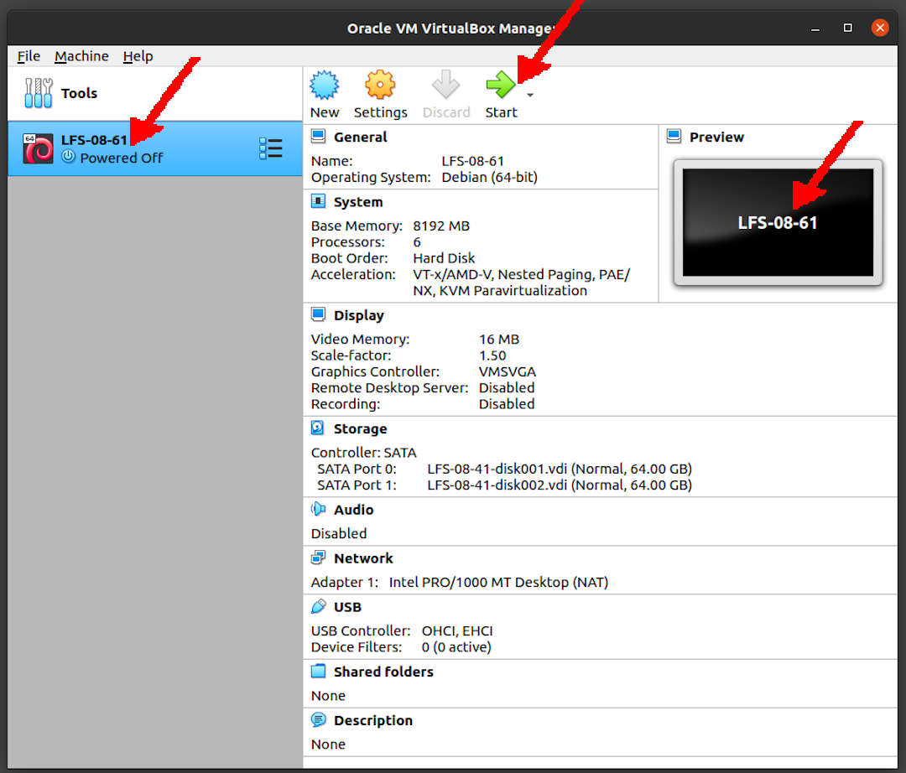

---
---

[HOME](index.md)
[ABOUT](README.md)
[WEB](https://lfs.vlsm.org/)
[GITHUB](https://github.com/OSP4DISS/lfs/)
[TOP](#)
[BOTTOM](#endofpage)
[PREV](LFS-08-41.md)
[NEXT](LFS-09.md)

<br>
# LFS: Chapter 8 part 61 - 78

## Virtual Box Guest LFS-08-61

* Import LFS-08-41.ova, rename to LFS-08-61

<br>


<br>
## Enter CHROOT
* [First, **REDO** chapter 7 part 3 - 4](LFS-07-3.md)

```
cd /sources/

```

<br>
## IPRoute2-5.10.0

```
tar xvf iproute2-5.10.0.tar.xz
cd iproute2-5.10.0/

```

```
sed -i /ARPD/d Makefile
rm -fv man/man8/arpd.8

```

```
sed -i 's/.m_ipt.o//' tc/Makefile

```

```
time make

```

```
make DOCDIR=/usr/share/doc/iproute2-5.10.0 install

```

```
cd ../
rm -rfv iproute2-5.10.0/

```

<br>
## Kbd-2.4.0

```
tar xvf kbd-2.4.0.tar.xz
cd kbd-2.4.0/

```

```
patch -Np1 -i ../kbd-2.4.0-backspace-1.patch

```

```
sed -i '/RESIZECONS_PROGS=/s/yes/no/' configure
sed -i 's/resizecons.8 //' docs/man/man8/Makefile.in

```

```
./configure --prefix=/usr --disable-vlock

```

```
time make

```

```
make check

```

```
make install

```

```
mkdir -v            /usr/share/doc/kbd-2.4.0
cp -R -v docs/doc/* /usr/share/doc/kbd-2.4.0

```

```
cd ../
rm -rfv kbd-2.4.0/

```

<br>
## Libpipeline-1.5.3

```
tar xvf libpipeline-1.5.3.tar.gz
cd libpipeline-1.5.3/

```

```
./configure --prefix=/usr

```

```
time make

```

```
make check

```

```
make install

```

```
cd ../
rm -rfv libpipeline-1.5.3/

```

<br>
## Make-4.3

```
tar xvf make-4.3.tar.gz
cd make-4.3/

```

```
./configure --prefix=/usr

```

```
time make

```

```
make check

```

```
make install

```

```
cd ..
rm -rfv make-4.3/

```

<br>
## Patch-2.7.6

```
tar xvf patch-2.7.6.tar.xz
cd patch-2.7.6/

```

```
./configure --prefix=/usr

```

```
time make

```

* TOTAL: 44
* PASS:  41
* SKIP:  1
* XFAIL: 2

```
make check

```

```
make install

```

```
cd ../
rm -rfv patch-2.7.6/

```

<br>
## Man-DB-2.9.4

```
tar xvf man-db-2.9.4.tar.xz
cd man-db-2.9.4/

```

```
./configure --prefix=/usr                        \
            --docdir=/usr/share/doc/man-db-2.9.4 \
            --sysconfdir=/etc                    \
            --disable-setuid                     \
            --enable-cache-owner=bin             \
            --with-browser=/usr/bin/lynx         \
            --with-vgrind=/usr/bin/vgrind        \
            --with-grap=/usr/bin/grap            \
            --with-systemdtmpfilesdir=           \
            --with-systemdsystemunitdir=

```

```
time make

```

```
make check

```

```
make install

```

```
cd ../
rm -rfv man-db-2.9.4/

```

<br>
## Tar-1.34

```
tar xvf tar-1.34.tar.xz
cd tar-1.34/

```

```
FORCE_UNSAFE_CONFIGURE=1  \
./configure --prefix=/usr \
            --bindir=/bin

```

```
time make

```

* (227) binary store/restore, is known to fail.
* ERROR: 218 tests were run,
* 1 failed unexpectedly.
* 20 tests were skipped.

```
make check

```

```
make install
make -C doc install-html docdir=/usr/share/doc/tar-1.34

```

```
cd ../
rm -rfv tar-1.34/

```

<br>
## Texinfo-6.7

```
tar xvf texinfo-6.7.tar.xz
cd texinfo-6.7/

```

```
./configure --prefix=/usr

```

```
time make

```

```
make check

```

```
make install

```

```
make TEXMF=/usr/share/texmf install-tex

```

```
pushd /usr/share/info
  rm -v dir
  for f in *
    do install-info $f dir 2>/dev/null
  done
popd

```

```
cd ../
rm -rfv texinfo-6.7/

```

<br>
## Vim-8.2.2433

```
tar xvf vim-8.2.2433.tar.gz
cd vim-8.2.2433/

```

```
echo '#define SYS_VIMRC_FILE "/etc/vimrc"' >> src/feature.h

```

```
./configure --prefix=/usr

```

```
time make

```

```
chown -Rv tester .

```

```
su tester -c "LANG=en_US.UTF-8 make -j1 test" &> vim-test.log

```

```
make install

```

```
ln -sv vim /usr/bin/vi
for L in  /usr/share/man/{,*/}man1/vim.1; do
    ln -sv vim.1 $(dirname $L)/vi.1
done

```

```
ln -sv ../vim/vim82/doc /usr/share/doc/vim-8.2.2433

```

```
cat > /etc/vimrc << "EOF"
" Begin /etc/vimrc

" Ensure defaults are set before customizing settings, not after
source $VIMRUNTIME/defaults.vim
let skip_defaults_vim=1 

set spelllang=en
set spell
set nocompatible
set backspace=2
set mouse=
syntax on
if (&term == "xterm") || (&term == "putty")
  set background=dark
endif

" End /etc/vimrc
EOF

```

* TEST

```
vim -c ':options'

```

```
cd ../
rm -rfv vim-8.2.2433/

```

<br>
## Eudev-3.2.10

```
tar xvf eudev-3.2.10.tar.gz
cd eudev-3.2.10/

```

```
./configure --prefix=/usr           \
            --bindir=/sbin          \
            --sbindir=/sbin         \
            --libdir=/usr/lib       \
            --sysconfdir=/etc       \
            --libexecdir=/lib       \
            --with-rootprefix=      \
            --with-rootlibdir=/lib  \
            --enable-manpages       \
            --disable-static

```

```
time make

```

```
mkdir -pv /lib/udev/rules.d
mkdir -pv /etc/udev/rules.d

```

```
make check

```

```
make install

```

```
tar -xvf ../udev-lfs-20171102.tar.xz
make -f udev-lfs-20171102/Makefile.lfs install

```

```
udevadm hwdb --update

```

```
cd ../
rm -rfv eudev-3.2.10/

```

<br>
## Procps-ng-3.3.17

```
tar xvf procps-ng-3.3.17.tar.xz
cd procps-3.3.17/

```

```
./configure --prefix=/usr                            \
            --exec-prefix=                           \
            --libdir=/usr/lib                        \
            --docdir=/usr/share/doc/procps-ng-3.3.17 \
            --disable-static                         \
            --disable-kill

```

```
time make

```

* Five tests related to pkill are known to fail

```
make check

```

```
make install

```

```
mv -v /usr/lib/libprocps.so.* /lib
ln -sfv ../../lib/$(readlink /usr/lib/libprocps.so) /usr/lib/libprocps.so

```

```
cd ../
rm -rfv procps-3.3.17/

```

<br>
## Util-linux-2.36.2

```
tar xvf util-linux-2.36.2.tar.xz
cd util-linux-2.36.2/

```

```
./configure ADJTIME_PATH=/var/lib/hwclock/adjtime   \
            --docdir=/usr/share/doc/util-linux-2.36.2 \
            --disable-chfn-chsh  \
            --disable-login      \
            --disable-nologin    \
            --disable-su         \
            --disable-setpriv    \
            --disable-runuser    \
            --disable-pylibmount \
            --disable-static     \
            --without-python     \
            --without-systemd    \
            --without-systemdsystemunitdir \
            runstatedir=/run

```

```
time make

```

```
chown -Rv tester .
su tester -c "make -k check"

```

```
make install

```

```
cd ../
rm -rfv util-linux-2.36.2/

```

<br>
## E2fsprogs-1.46.1

```
tar xvf e2fsprogs-1.46.1.tar.gz
cd e2fsprogs-1.46.1/

```

```
mkdir -v build
cd       build

```

```
../configure --prefix=/usr           \
             --bindir=/bin           \
             --with-root-prefix=""   \
             --enable-elf-shlibs     \
             --disable-libblkid      \
             --disable-libuuid       \
             --disable-uuidd         \
             --disable-fsck

```

```
time make

```

* 370 tests succeeded	1 tests failed
* m_rootdir_acl, is known to fail.

```
make check

```

```
make install

```

```
rm -fv /usr/lib/{libcom_err,libe2p,libext2fs,libss}.a

```

```
gunzip -v /usr/share/info/libext2fs.info.gz
install-info --dir-file=/usr/share/info/dir /usr/share/info/libext2fs.info

```

```
makeinfo -o      doc/com_err.info ../lib/et/com_err.texinfo
install -v -m644 doc/com_err.info /usr/share/info
install-info --dir-file=/usr/share/info/dir /usr/share/info/com_err.info

```

```
cd ../../
rm -rfv e2fsprogs-1.46.1/

```

<br>
## Sysklogd-1.5.1

```
tar xvf sysklogd-1.5.1.tar.gz
cd sysklogd-1.5.1/

```

```
sed -i '/Error loading kernel symbols/{n;n;d}' ksym_mod.c
sed -i 's/union wait/int/' syslogd.c

```

```
time make

```

```
make BINDIR=/sbin install

```

```
cat > /etc/syslog.conf << "EOF"
# Begin /etc/syslog.conf

auth,authpriv.* -/var/log/auth.log
*.*;auth,authpriv.none -/var/log/sys.log
daemon.* -/var/log/daemon.log
kern.* -/var/log/kern.log
mail.* -/var/log/mail.log
user.* -/var/log/user.log
*.emerg *

# End /etc/syslog.conf
EOF

```

```
cd ../
rm -rfv sysklogd-1.5.1/

```

<br>
## Sysvinit-2.98

```
tar xvf sysvinit-2.98.tar.xz
cd sysvinit-2.98/

```

```
patch -Np1 -i ../sysvinit-2.98-consolidated-1.patch

```

```
time make

```

```
make install

```

```
cd ../
rm -rfv sysvinit-2.98/

```

<br>
## About Debugging Symbols / Stripping Again

```
df /

save_lib="ld-2.33.so libc-2.33.so libpthread-2.33.so libthread_db-1.0.so"

cd /lib

for LIB in $save_lib; do
    objcopy --only-keep-debug $LIB $LIB.dbg 
    strip --strip-unneeded $LIB
    objcopy --add-gnu-debuglink=$LIB.dbg $LIB 
done    

save_usrlib="libquadmath.so.0.0.0 libstdc++.so.6.0.28
             libitm.so.1.0.0 libatomic.so.1.2.0" 

cd /usr/lib

for LIB in $save_usrlib; do
    objcopy --only-keep-debug $LIB $LIB.dbg
    strip --strip-unneeded $LIB
    objcopy --add-gnu-debuglink=$LIB.dbg $LIB
done

unset LIB save_lib save_usrlib

df /

```

```
df /

find /usr/lib -type f -name \*.a \
   -exec strip --strip-debug {} ';'

find /lib /usr/lib -type f -name \*.so* ! -name \*dbg \
   -exec strip --strip-unneeded {} ';'

find /{bin,sbin} /usr/{bin,sbin,libexec} -type f \
    -exec strip --strip-all {} ';'

df /

```

<br>
## Cleaning Up

```
df /
rm -rf /tmp/*
df /

```

<br>
## Exit and re-enter CHROOT

```
logout

```

```
chroot "$LFS" /usr/bin/env -i          \
    HOME=/root TERM="$TERM"            \
    PS1='(lfs chroot) \u:\w\$ '        \
    PATH=/bin:/usr/bin:/sbin:/usr/sbin \
    /bin/bash --login

```

```
df /
find /usr/lib /usr/libexec -name \*.la -delete
df /

```

```
df /
find /usr -depth -name $(uname -m)-lfs-linux-gnu\* | xargs rm -rf
df /

```

```
df /
rm -rf /tools
df /

```

```
userdel -r tester

```

<br>
## Exit CHROOT Again

```
exit

```

<br>
## Done

```
poweroff

```

* Back to "pamulang1" host

* Export LFS-08-61.OVA (backup)

<br>
#### ENDOFPAGE
[HOME](index.md)
[ABOUT](README.md)
[WEB](https://lfs.vlsm.org/)
[GITHUB](https://github.com/OSP4DISS/lfs/)
[TOP](#)
[BOTTOM](#endofpage)
[PREV](LFS-08-41.md)
[NEXT](LFS-09.md)
<br>

