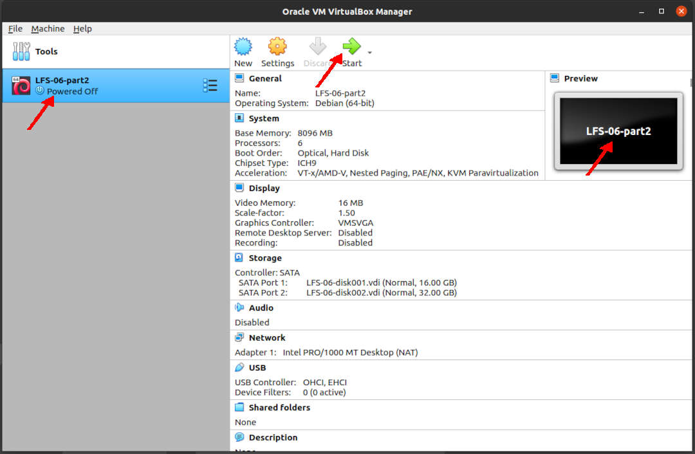

---
---

[HOME](index.md)
[ABOUT](README.md)
[WEB](https://lfs.vlsm.org/)
[GITHUB](https://github.com/OSP4DISS/lfs/)
[TOP](#)
[BOTTOM](#endofpage)
[PREV](LFS-08.md)
[NEXT](LFS-10.md)

<br>
<span style="color:red; font-weight:bold; font-size:larger;">
It is assumed that you understand how install a Debian VirtualBox Guest.
If you have never installed a VirtualBox Guest before, visit [OSP4DISS](https://osp4diss.vlsm.org/).
</span>

<br>
# LFS: Chapter 6 part 2

## Virtual Box Guest LFS-06-part2

* Import LFS-06.ova, rename to LFS-06-part2

<br>


<br>
### INPUT
```
ssh -p 6023 lfs@localhost

```

### OUTPUT
```
rms46@pamulang1:~$ ssh -p 6023 lfs@localhost
lfs@localhost's password:

===== TL;DR =====

lfs@osp:~$ 

```

<br>
### INPUT
```
echo $LFS
cd $LFS/sources/

```

### OUTPUT
```
lfs:~$ echo $LFS
/mnt/lfs

lfs:~$ cd $LFS/sources/

```

<br>
# Binutils-2.35 - Pass 2

### INPUT
```
tar xf binutils-2.35.tar.xz
cd binutils-2.35/
mkdir -v build
cd       build
../configure                   \
    --prefix=/usr              \
    --build=$(../config.guess) \
    --host=$LFS_TGT            \
    --disable-nls              \
    --enable-shared            \
    --disable-werror           \
    --enable-64-bit-bfd

```

### OUTPUT
```
lfs:/mnt/lfs/sources$ tar xf binutils-2.35.tar.xz

lfs:/mnt/lfs/sources$ cd binutils-2.35/

lfs:/mnt/lfs/sources/binutils-2.35$ mkdir -v build
mkdir: created directory 'build'

lfs:/mnt/lfs/sources/binutils-2.35$ cd       build

lfs:/mnt/lfs/sources/binutils-2.35/build$ ../configure                   \
>     --prefix=/usr              \
>     --build=$(../config.guess) \
>     --host=$LFS_TGT            \

===== TL;DR =====

checking where to find the target windmc... pre-installed
checking whether to enable maintainer-specific portions of Makefiles... no
configure: creating ./config.status
config.status: creating Makefile

lfs:/mnt/lfs/sources/binutils-2.35/build$ 

```

<br>
### INPUT
```
time make

```

### OUTPUT
```
lfs:/mnt/lfs/sources/binutils-2.35/build$ time make
make[1]: Entering directory '/mnt/lfs/sources/binutils-2.35/build'
make[1]: Nothing to be done for 'all-target'.
mkdir -p -- ./libiberty
mkdir -p -- ./intl
mkdir -p -- ./zlib
mkdir -p -- ./etc

===== TL;DR =====

real	0m47.657s
user	2m28.097s
sys	0m19.101s

lfs:/mnt/lfs/sources/binutils-2.35/build$ 

```

<br>
### INPUT
```
time make DESTDIR=$LFS install
cd ../../
rm -rf binutils-2.35/

```

### OUTPUT
```
lfs:/mnt/lfs/sources/binutils-2.35/build$ time make DESTDIR=$LFS install
make[1]: Entering directory '/mnt/lfs/sources/binutils-2.35/build'
/bin/sh ../mkinstalldirs /mnt/lfs/usr /mnt/lfs/usr
make[1]: Nothing to be done for 'install-target'.

===== TL;DR =====

real	0m1.175s
user	0m1.325s
sys	0m0.329s

lfs:/mnt/lfs/sources/binutils-2.35/build$ 

lfs:/mnt/lfs/sources/binutils-2.35/build$ cd ../../

lfs:/mnt/lfs/sources$ rm -rf binutils-2.35/

lfs:/mnt/lfs/sources$ 

```

<br>
# GCC-10.2.0 - Pass 2

### INPUT
```
tar xf gcc-10.2.0.tar.xz
cd gcc-10.2.0/
tar -xf ../mpfr-4.1.0.tar.xz
mv -v mpfr-4.1.0 mpfr
tar -xf ../gmp-6.2.0.tar.xz
mv -v gmp-6.2.0 gmp
tar -xf ../mpc-1.1.0.tar.gz
mv -v mpc-1.1.0 mpc
case $(uname -m) in
  x86_64)
    sed -e '/m64=/s/lib64/lib/' -i.orig gcc/config/i386/t-linux64
  ;;
esac
mkdir -v build
cd       build
mkdir -pv $LFS_TGT/libgcc
ln -s ../../../libgcc/gthr-posix.h $LFS_TGT/libgcc/gthr-default.h
../configure                                       \
    --build=$(../config.guess)                     \
    --host=$LFS_TGT                                \
    --prefix=/usr                                  \
    CC_FOR_TARGET=$LFS_TGT-gcc                     \
    --with-build-sysroot=$LFS                      \
    --enable-initfini-array                        \
    --disable-nls                                  \
    --disable-multilib                             \
    --disable-decimal-float                        \
    --disable-libatomic                            \
    --disable-libgomp                              \
    --disable-libquadmath                          \
    --disable-libssp                               \
    --disable-libvtv                               \
    --disable-libstdcxx                            \
    --enable-languages=c,c++

```

### OUTPUT
```
lfs:/mnt/lfs/sources$ tar xf gcc-10.2.0.tar.xz

lfs:/mnt/lfs/sources$ cd gcc-10.2.0/

lfs:/mnt/lfs/sources/gcc-10.2.0$ tar -xf ../mpfr-4.1.0.tar.xz

lfs:/mnt/lfs/sources/gcc-10.2.0$ mv -v mpfr-4.1.0 mpfr
renamed 'mpfr-4.1.0' -> 'mpfr'

lfs:/mnt/lfs/sources/gcc-10.2.0$ tar -xf ../gmp-6.2.0.tar.xz

lfs:/mnt/lfs/sources/gcc-10.2.0$ mv -v gmp-6.2.0 gmp
renamed 'gmp-6.2.0' -> 'gmp'

lfs:/mnt/lfs/sources/gcc-10.2.0$ tar -xf ../mpc-1.1.0.tar.gz

lfs:/mnt/lfs/sources/gcc-10.2.0$ mv -v mpc-1.1.0 mpc
renamed 'mpc-1.1.0' -> 'mpc'

lfs:/mnt/lfs/sources/gcc-10.2.0$ case $(uname -m) in
>   x86_64)
>     sed -e '/m64=/s/lib64/lib/' -i.orig gcc/config/i386/t-linux64
>   ;;
> esac

lfs:/mnt/lfs/sources/gcc-10.2.0$ mkdir -v build
mkdir: created directory 'build'

lfs:/mnt/lfs/sources/gcc-10.2.0$ cd       build

lfs:/mnt/lfs/sources/gcc-10.2.0/build$ mkdir -pv $LFS_TGT/libgcc
mkdir: created directory 'x86_64-lfs-linux-gnu'
mkdir: created directory 'x86_64-lfs-linux-gnu/libgcc'

lfs:/mnt/lfs/sources/gcc-10.2.0/build$ ln -s ../../../libgcc/gthr-posix.h $LFS_TGT/libgcc/gthr-default.h

lfs:/mnt/lfs/sources/gcc-10.2.0/build$ ../configure                                       \
>     --build=$(../config.guess)                     \
>     --host=$LFS_TGT                                \
>     --prefix=/usr                                  \
>     CC_FOR_TARGET=$LFS_TGT-gcc                     \

===== TL;DR =====

checking where to find the target windmc... pre-installed
checking whether to enable maintainer-specific portions of Makefiles... no
configure: creating ./config.status
config.status: creating Makefile

lfs:/mnt/lfs/sources/gcc-10.2.0/build$ 

```

<br>
### INPUT
```
time make

```

### MEMORY USAGE UPTO 2400 MBytes

```
top - 19:08:16 up  1:33,  3 users,  load average: 6.96, 2.79, 1.06
Tasks: 132 total,  10 running, 122 sleeping,   0 stopped,   0 zombie
%Cpu(s): 96.5 us,  3.5 sy,  0.0 ni,  0.0 id,  0.0 wa,  0.0 hi,  0.0 si,  0.0 st
MiB Mem :   7882.1 total,   3454.3 free,   2362.2 used,   2065.6 buff/cache
MiB Swap:   1024.0 total,   1024.0 free,      0.0 used.   5214.8 avail Mem 
```

### OUTPUT
```
lfs:/mnt/lfs/sources/gcc-10.2.0/build$ time make
make[1]: Entering directory '/mnt/lfs/sources/gcc-10.2.0/build'
mkdir -p -- ./libiberty
mkdir -p -- ./fixincludes
mkdir -p -- ./intl

===== TL;DR =====

real	6m15.462s
user	27m31.142s
sys	1m58.345s

lfs:/mnt/lfs/sources/gcc-10.2.0/build$ 

```

<br>
### INPUT
```
time make DESTDIR=$LFS install
ln -sv gcc $LFS/usr/bin/cc
cd ../../
rm -rf xf gcc-10.2.0/

```

### OUTPUT
```
lfs:/mnt/lfs/sources/gcc-10.2.0/build$ time make DESTDIR=$LFS install
make[1]: Entering directory '/mnt/lfs/sources/gcc-10.2.0/build'
/bin/sh ../mkinstalldirs /mnt/lfs/usr /mnt/lfs/usr
make[2]: Entering directory '/mnt/lfs/sources/gcc-10.2.0/build/intl'
make[2]: Nothing to be done for 'install'.

===== TL;DR =====

real	0m3.801s
user	0m3.006s
sys	0m1.503s

lfs:/mnt/lfs/sources/gcc-10.2.0/build$ ln -sv gcc $LFS/usr/bin/cc
'/mnt/lfs/usr/bin/cc' -> 'gcc'

lfs:/mnt/lfs/sources/gcc-10.2.0/build$ cd ../../

lfs:/mnt/lfs/sources$ rm -rf xf gcc-10.2.0/

lfs:/mnt/lfs/sources$ 

```

<hr>
<hr>
<hr>

```
su -
```

```
cbkadal@osp:~$ su -
Password:

root:~#

```

```
shutdown -h now

```

```
root:~# shutdown -h now
Connection to localhost closed by remote host.
Connection to localhost closed.

rms46@pamulang1:~$

```

* Back to "pamulang1" host

* Export LFS-06-part2.OVA (backup)

<br>
#### ENDOFPAGE
[HOME](index.md)
[ABOUT](README.md)
[WEB](https://lfs.vlsm.org/)
[GITHUB](https://github.com/OSP4DISS/lfs/)
[TOP](#)
[BOTTOM](#endofpage)
[PREV](LFS-08.md)
[NEXT](LFS-10.md)
<br>

