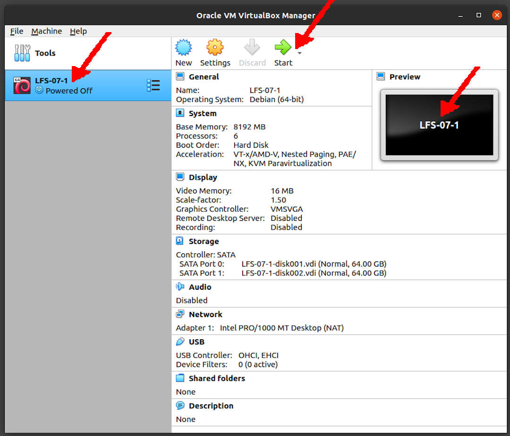

---
---

[HOME](index.md)
[ABOUT](README.md)
[WEB](https://lfs.vlsm.org/)
[GITHUB](https://github.com/OSP4DISS/lfs/)
[TOP](#)
[BOTTOM](#endofpage)
[PREV](LFS-09.md)
[NEXT](LFS-11.md)

<br>
<span style="color:red; font-weight:bold; font-size:larger;">
It is assumed that you understand how install a Debian VirtualBox Guest.
If you have never installed a VirtualBox Guest before, visit [OSP4DISS](https://osp4diss.vlsm.org/).
</span>

<br>
# LFS: Chapter 7

## Virtual Box Guest LFS-07

* Import LFS-06-part2.ova, rename to LFS-07

<br>


<br>
### INPUT
```
ssh -p 6024 lfs@localhost

```

### OUTPUT
```
rms46@pamulang1:~$ ssh -p 6024 lfs@localhost
lfs@localhost's password:

===== TL;DR =====

lfs@osp:~$ 

```

<br>
### INPUT
```
echo $LFS
su -

```

### OUTPUT
```
lfs:~$ echo $LFS
/mnt/lfs

lfs:~$ su -
Password:

root:~#

```

<br>
# Changing Ownership

### INPUT
```
echo $LFS
chown -R root:root $LFS/{usr,lib,var,etc,bin,sbin,tools}
case $(uname -m) in
  x86_64) chown -R root:root $LFS/lib64 ;;
esac

```

### OUTPUT
```
root:~# chown -R root:root $LFS/{usr,lib,var,etc,bin,sbin,tools}

root:~# case $(uname -m) in
>   x86_64) chown -R root:root $LFS/lib64 ;;
> esac

root:~# 

```

<br>
# Preparing Virtual Kernel File Systems

### INPUT
```
mkdir -pv $LFS/{dev,proc,sys,run}
mknod -m 600 $LFS/dev/console c 5 1
mknod -m 666 $LFS/dev/null c 1 3
mount -v --bind /dev $LFS/dev
mount -v --bind /dev/pts $LFS/dev/pts
mount -vt proc proc $LFS/proc
mount -vt sysfs sysfs $LFS/sys
mount -vt tmpfs tmpfs $LFS/run
if [ -h $LFS/dev/shm ]; then
  mkdir -pv $LFS/$(readlink $LFS/dev/shm)
fi

```

### OUTPUT
```
root:~# mkdir -pv $LFS/{dev,proc,sys,run}
mkdir: created directory '/mnt/lfs/dev'
mkdir: created directory '/mnt/lfs/proc'
mkdir: created directory '/mnt/lfs/sys'
mkdir: created directory '/mnt/lfs/run'

root:~# mknod -m 600 $LFS/dev/console c 5 1

root:~# mknod -m 666 $LFS/dev/null c 1 3

root:~# mount -v --bind /dev $LFS/dev
mount: /dev bound on /mnt/lfs/dev.

root:~# mount -v --bind /dev/pts $LFS/dev/pts
mount: /dev/pts bound on /mnt/lfs/dev/pts.

root:~# mount -vt proc proc $LFS/proc
mount: proc mounted on /mnt/lfs/proc.

root:~# mount -vt sysfs sysfs $LFS/sys
mount: sysfs mounted on /mnt/lfs/sys.

root:~# mount -vt tmpfs tmpfs $LFS/run
mount: tmpfs mounted on /mnt/lfs/run.

root:~# if [ -h $LFS/dev/shm ]; then
>   mkdir -pv $LFS/$(readlink $LFS/dev/shm)
> fi

root:~# 

```

<br>
# Entering the Chroot Environment

<span style="color:red; font-weight:bold; font-size:larger;">
ATTN: CHROOT! Compare File System: "df" before, and "df" after.
</span>


### INPUT
```
df

chroot "$LFS" /usr/bin/env -i   \
    HOME=/root                  \
    TERM="$TERM"                \
    PS1='(lfs chroot) \u:\w\$ ' \
    PATH=/bin:/usr/bin:/sbin:/usr/sbin \
    /bin/bash --login +h

df

```

### OUTPUT
```
root:~# df
Filesystem     1K-blocks    Used Available Use% Mounted on
udev             4020816       0   4020816   0% /dev
tmpfs             807128    8636    798492   2% /run
/dev/sda1       16446332 2724032  12867160  18% /
tmpfs            4035640       0   4035640   0% /dev/shm
tmpfs               5120       0      5120   0% /run/lock
tmpfs            4035640       0   4035640   0% /sys/fs/cgroup
/dev/sdb1       32894736 5859592  25341144  19% /mnt/lfs
tmpfs             807128       0    807128   0% /run/user/1001
tmpfs            4035640       0   4035640   0% /mnt/lfs/run

root:~# chroot "$LFS" /usr/bin/env -i   \
>     HOME=/root                  \
>     TERM="$TERM"                \
>     PS1='(lfs chroot) \u:\w\$ ' \
>     PATH=/bin:/usr/bin:/sbin:/usr/sbin \
>     /bin/bash --login +h

(lfs chroot) I have no name!:/# df
Filesystem     1K-blocks    Used Available Use% Mounted on
/dev/sdb1       32894736 5859592  25341144  19% /
udev             4020816       0   4020816   0% /dev
tmpfs            4035640       0   4035640   0% /run

(lfs chroot) I have no name!:/# 

```

<br>
# Creating Directories

### INPUT
```
mkdir -pv /{boot,home,mnt,opt,srv}
mkdir -pv /etc/{opt,sysconfig}
mkdir -pv /lib/firmware
mkdir -pv /media/{floppy,cdrom}
mkdir -pv /usr/{,local/}{bin,include,lib,sbin,src}
mkdir -pv /usr/{,local/}share/{color,dict,doc,info,locale,man}
mkdir -pv /usr/{,local/}share/{misc,terminfo,zoneinfo}
mkdir -pv /usr/{,local/}share/man/man{1..8}
mkdir -pv /var/{cache,local,log,mail,opt,spool}
mkdir -pv /var/lib/{color,misc,locate}
ln -sfv /run /var/run
ln -sfv /run/lock /var/lock
install -dv -m 0750 /root
install -dv -m 1777 /tmp /var/tmp

```

### OUTPUT
```
(lfs chroot) I have no name!:/# mkdir -pv /{boot,home,mnt,opt,srv}
mkdir: created directory '/boot'
mkdir: created directory '/home'
mkdir: created directory '/mnt'
mkdir: created directory '/opt'
mkdir: created directory '/srv'

(lfs chroot) I have no name!:/# mkdir -pv /etc/{opt,sysconfig}
mkdir: created directory '/etc/opt'
mkdir: created directory '/etc/sysconfig'

(lfs chroot) I have no name!:/# mkdir -pv /lib/firmware
mkdir: created directory '/lib/firmware'

(lfs chroot) I have no name!:/# mkdir -pv /media/{floppy,cdrom}
mkdir: created directory '/media'
mkdir: created directory '/media/floppy'
mkdir: created directory '/media/cdrom'

(lfs chroot) I have no name!:/# mkdir -pv /usr/{,local/}{bin,include,lib,sbin,src}
mkdir: created directory '/usr/src'
mkdir: created directory '/usr/local'
mkdir: created directory '/usr/local/bin'
mkdir: created directory '/usr/local/include'
mkdir: created directory '/usr/local/lib'
mkdir: created directory '/usr/local/sbin'
mkdir: created directory '/usr/local/src'

(lfs chroot) I have no name!:/# mkdir -pv /usr/{,local/}share/{color,dict,doc,info,locale,man}
mkdir: created directory '/usr/share/color'
mkdir: created directory '/usr/share/dict'
mkdir: created directory '/usr/local/share'
mkdir: created directory '/usr/local/share/color'
mkdir: created directory '/usr/local/share/dict'
mkdir: created directory '/usr/local/share/doc'
mkdir: created directory '/usr/local/share/info'
mkdir: created directory '/usr/local/share/locale'
mkdir: created directory '/usr/local/share/man'

(lfs chroot) I have no name!:/# mkdir -pv /usr/{,local/}share/{misc,terminfo,zoneinfo}
mkdir: created directory '/usr/share/zoneinfo'
mkdir: created directory '/usr/local/share/misc'
mkdir: created directory '/usr/local/share/terminfo'
mkdir: created directory '/usr/local/share/zoneinfo'

(lfs chroot) I have no name!:/# mkdir -pv /usr/{,local/}share/man/man{1..8}
mkdir: created directory '/usr/share/man/man2'
mkdir: created directory '/usr/share/man/man6'
mkdir: created directory '/usr/local/share/man/man1'
mkdir: created directory '/usr/local/share/man/man2'
mkdir: created directory '/usr/local/share/man/man3'
mkdir: created directory '/usr/local/share/man/man4'
mkdir: created directory '/usr/local/share/man/man5'
mkdir: created directory '/usr/local/share/man/man6'
mkdir: created directory '/usr/local/share/man/man7'
mkdir: created directory '/usr/local/share/man/man8'

(lfs chroot) I have no name!:/# mkdir -pv /var/{cache,local,log,mail,opt,spool}
mkdir: created directory '/var/cache'
mkdir: created directory '/var/local'
mkdir: created directory '/var/log'
mkdir: created directory '/var/mail'
mkdir: created directory '/var/opt'
mkdir: created directory '/var/spool'

(lfs chroot) I have no name!:/# mkdir -pv /var/lib/{color,misc,locate}
mkdir: created directory '/var/lib/color'
mkdir: created directory '/var/lib/misc'
mkdir: created directory '/var/lib/locate'

(lfs chroot) I have no name!:/# ln -sfv /run /var/run
'/var/run' -> '/run'

(lfs chroot) I have no name!:/# ln -sfv /run/lock /var/lock
'/var/lock' -> '/run/lock'

(lfs chroot) I have no name!:/# install -dv -m 0750 /root
install: creating directory '/root'

(lfs chroot) I have no name!:/# install -dv -m 1777 /tmp /var/tmp
install: creating directory '/tmp'
install: creating directory '/var/tmp'

(lfs chroot) I have no name!:/# 

```

<br>
# Creating Essential Files and Symlinks

### INPUT
```
ln -sv /proc/self/mounts /etc/mtab
echo "127.0.0.1 localhost $(hostname)" > /etc/hosts
cat > /etc/passwd << "EOF"
root:x:0:0:root:/root:/bin/bash
bin:x:1:1:bin:/dev/null:/bin/false
daemon:x:6:6:Daemon User:/dev/null:/bin/false
messagebus:x:18:18:D-Bus Message Daemon User:/var/run/dbus:/bin/false
nobody:x:99:99:Unprivileged User:/dev/null:/bin/false
EOF

cat > /etc/group << "EOF"
root:x:0:
bin:x:1:daemon
sys:x:2:
kmem:x:3:
tape:x:4:
tty:x:5:
daemon:x:6:
floppy:x:7:
disk:x:8:
lp:x:9:
dialout:x:10:
audio:x:11:
video:x:12:
utmp:x:13:
usb:x:14:
cdrom:x:15:
adm:x:16:
messagebus:x:18:
input:x:24:
mail:x:34:
kvm:x:61:
wheel:x:97:
nogroup:x:99:
users:x:999:
EOF

echo "tester:x:$(ls -n $(tty) | cut -d" " -f3):101::/home/tester:/bin/bash" >> /etc/passwd
echo "tester:x:101:" >> /etc/group
install -o tester -d /home/tester
exec /bin/bash --login +h
touch /var/log/{btmp,lastlog,faillog,wtmp}
chgrp -v utmp /var/log/lastlog
chmod -v 664  /var/log/lastlog
chmod -v 600  /var/log/btmp

```

### OUTPUT
```
(lfs chroot) I have no name!:/# ln -sv /proc/self/mounts /etc/mtab
'/etc/mtab' -> '/proc/self/mounts'

(lfs chroot) I have no name!:/# echo "127.0.0.1 localhost $(hostname)" > /etc/hosts

(lfs chroot) I have no name!:/# cat > /etc/passwd << "EOF"
> root:x:0:0:root:/root:/bin/bash
> bin:x:1:1:bin:/dev/null:/bin/false
> daemon:x:6:6:Daemon User:/dev/null:/bin/false
> messagebus:x:18:18:D-Bus Message Daemon User:/var/run/dbus:/bin/false
> nobody:x:99:99:Unprivileged User:/dev/null:/bin/false
> EOF

(lfs chroot) I have no name!:/# cat > /etc/group << "EOF"
> root:x:0:
> bin:x:1:daemon

===== TL;DR =====

> nogroup:x:99:
> users:x:999:
> EOF

(lfs chroot) I have no name!:/# echo "tester:x:$(ls -n $(tty) | cut -d" " -f3):101::/home/tester:/bin/bash" >> /etc/passwd

(lfs chroot) I have no name!:/# echo "tester:x:101:" >> /etc/group

(lfs chroot) I have no name!:/# install -o tester -d /home/tester

(lfs chroot) I have no name!:/# exec /bin/bash --login +h

(lfs chroot) root:/# touch /var/log/{btmp,lastlog,faillog,wtmp}

(lfs chroot) root:/# chgrp -v utmp /var/log/lastlog
changed group of '/var/log/lastlog' from root to utmp

(lfs chroot) root:/# chmod -v 664  /var/log/lastlog
mode of '/var/log/lastlog' changed from 0644 (rw-r--r--) to 0664 (rw-rw-r--)

(lfs chroot) root:/# chmod -v 600  /var/log/btmp
mode of '/var/log/btmp' changed from 0644 (rw-r--r--) to 0600 (rw-------)

(lfs chroot) root:/# 

```

<br>
# Libstdc++ from GCC-10.2.0, Pass 2

### INPUT
```
tar xf gcc-10.2.0.tar.xz
cd gcc-10.2.0/
ln -s gthr-posix.h libgcc/gthr-default.h
mkdir -v build
cd       build
../libstdc++-v3/configure            \
    CXXFLAGS="-g -O2 -D_GNU_SOURCE"  \
    --prefix=/usr                    \
    --disable-multilib               \
    --disable-nls                    \
    --host=$(uname -m)-lfs-linux-gnu \
    --disable-libstdcxx-pch

```

### OUTPUT
```
(lfs chroot) root:/sources# tar xf gcc-10.2.0.tar.xz

(lfs chroot) root:/sources# cd gcc-10.2.0/

(lfs chroot) root:/sources/gcc-10.2.0# ln -s gthr-posix.h libgcc/gthr-default.h

(lfs chroot) root:/sources/gcc-10.2.0# mkdir -v build
mkdir: created directory 'build'

(lfs chroot) root:/sources/gcc-10.2.0# cd       build

(lfs chroot) root:/sources/gcc-10.2.0/build# ../libstdc++-v3/configure            \
>     CXXFLAGS="-g -O2 -D_GNU_SOURCE"  \
>     --prefix=/usr                    \
>     --disable-multilib               \

===== TL;DR =====

    -e 's/\([ABCDEFGHIJKLMNOPQRSTUVWXYZ_]*USE_WEAK\)/_GLIBCXX_\1/g' \
    -e 's,^#include "\(.*\)",#include <bits/\1>,g' \
    < /sources/gcc-10.2.0/libstdc++-v3/../libgcc/gthr-posix.h > x86_64-lfs-linux-gnu/bits/gthr-default.h
(lfs chroot) root:/sources/gcc-10.2.0/build# 

```

<br>
### INPUT
```
time make

```

### OUTPUT
```
(lfs chroot) root:/sources/gcc-10.2.0/build# time make
make "AR_FLAGS=" "CC_FOR_BUILD=" "CC_FOR_TARGET=" "CFLAGS=-g -O2" "CXXFLAGS=-g -O2 -D_GNU_SOURCE"

===== TL;DR =====

real	1m20.735s
user	1m13.227s
sys	0m5.271s

(lfs chroot) root:/sources/gcc-10.2.0/build# 

```

<br>
### INPUT
```
time make install
cd ../../
rm -rf gcc-10.2.0/

```

### OUTPUT
```
(lfs chroot) root:/sources/gcc-10.2.0/build# time make install
Making install in include
make[1]: Entering directory '/sources/gcc-10.2.0/build/include'
make[2]: Entering directory '/sources/gcc-10.2.0/build/include'

===== TL;DR =====

real	0m2.715s
user	0m1.763s
sys	0m0.709s

(lfs chroot) root:/sources/gcc-10.2.0/build# cd ../..

(lfs chroot) root:/sources# rm -rf gcc-10.2.0/

(lfs chroot) root:/sources# 

```

<br>
# Gettext-0.21

### INPUT
```
tar xf gettext-0.21.tar.xz
cd gettext-0.21/
./configure --disable-shared

```

### OUTPUT
```
(lfs chroot) root:/sources# tar xf gettext-0.21.tar.xz

(lfs chroot) root:/sources# cd gettext-0.21/

(lfs chroot) root:/sources/gettext-0.21# ./configure --disable-shared
checking for a BSD-compatible install... /usr/bin/install -c
checking whether build environment is sane... yes
checking for a thread-safe mkdir -p... /bin/mkdir -p

===== TL;DR =====

config.status: creating installpaths
config.status: creating po/Makefile
config.status: executing po-directories commands

(lfs chroot) root:/sources/gettext-0.21# 

```

<br>
### INPUT
```
time make

```

### OUTPUT
```
(lfs chroot) root:/sources/gettext-0.21# time make

===== TL;DR =====

real	2m40.902s
user	2m27.278s
sys	0m16.910s

(lfs chroot) root:/sources/gettext-0.21# 

```

<br>
### INPUT
```
cp -v gettext-tools/src/{msgfmt,msgmerge,xgettext} /usr/bin
cd ../
rm -rf gettext-0.21/

```

### OUTPUT
```
(lfs chroot) root:/sources/gettext-0.21# cp -v gettext-tools/src/{msgfmt,msgmerge,xgettext} /usr/bin
'gettext-tools/src/msgfmt' -> '/usr/bin/msgfmt'
'gettext-tools/src/msgmerge' -> '/usr/bin/msgmerge'
'gettext-tools/src/xgettext' -> '/usr/bin/xgettext'

(lfs chroot) root:/sources/gettext-0.21# cd ../

(lfs chroot) root:/sources# rm -rf gettext-0.21

(lfs chroot) root:/sources# 

```

<br>
# Bison-3.7.1

### INPUT
```
tar xf bison-3.7.1.tar.xz
cd bison-3.7.1/
./configure --prefix=/usr \
            --docdir=/usr/share/doc/bison-3.7.1

```

### OUTPUT
```
(lfs chroot) root:/sources# tar xf bison-3.7.1.tar.xz

(lfs chroot) root:/sources# cd bison-3.7.1/

(lfs chroot) root:/sources/bison-3.7.1# ./configure --prefix=/usr \
>             --docdir=/usr/share/doc/bison-3.7.1
checking for a BSD-compatible install... /usr/bin/install -c
checking whether build environment is sane... yes
checking for a race-free mkdir -p... /bin/mkdir -p

===== TL;DR =====

config.status: creating po/POTFILES
config.status: creating po/Makefile
config.status: executing tests/atconfig commands

(lfs chroot) root:/sources/bison-3.7.1# 

```

<br>
### INPUT
```
time make

```

### OUTPUT
```
(lfs chroot) root:/sources/bison-3.7.1# time make

===== TL;DR =====

real	0m15.110s
user	0m13.464s
sys	0m1.071s

(lfs chroot) root:/sources/bison-3.7.1# 
```

<br>
### INPUT
```
time make install
cd ../
rm -rf bison-3.7.1/

```

### OUTPUT
```
(lfs chroot) root:/sources/bison-3.7.1# time make install

===== TL;DR =====

real	0m1.035s
user	0m0.925s
sys	0m0.169s

(lfs chroot) root:/sources/bison-3.7.1# cd ../

(lfs chroot) root:/sources# rm -rf bison-3.7.1/

(lfs chroot) root:/sources# 

```

<br>
# Perl-5.32.0

### INPUT
```
tar xf perl-5.32.0.tar.xz
cd perl-5.32.0/
sh Configure -des                                        \
             -Dprefix=/usr                               \
             -Dvendorprefix=/usr                         \
             -Dprivlib=/usr/lib/perl5/5.32/core_perl     \
             -Darchlib=/usr/lib/perl5/5.32/core_perl     \
             -Dsitelib=/usr/lib/perl5/5.32/site_perl     \
             -Dsitearch=/usr/lib/perl5/5.32/site_perl    \
             -Dvendorlib=/usr/lib/perl5/5.32/vendor_perl \
             -Dvendorarch=/usr/lib/perl5/5.32/vendor_perl

```

### OUTPUT
```
(lfs chroot) root:/sources/perl-5.32.0# tar xf perl-5.32.0.tar.xz

===== TL;DR =====

Finding dependencies for miniperlmain.o
Finding dependencies for opmini.o
Finding dependencies for perlmini.o
Updating makefile...
Now you must run 'make'.

If you compile perl5 on a different machine or from a different object
directory, copy the Policy.sh file from this object directory to the
new one before you run Configure -- this will help you with most of
the policy defaults.

(lfs chroot) root:/sources/perl-5.32.0#

```

<br>
### INPUT
```
time make

```

### OUTPUT
```
(lfs chroot) root:/sources/perl-5.32.0# time make

===== TL;DR =====

Extracting streamzip (with variable substitutions)
make[1]: Leaving directory '/sources/perl-5.32.0/utils'
 
	Everything is up to date. Type 'make test' to run test suite.

real	2m32.970s
user	2m25.214s
sys	0m7.930s

(lfs chroot) root:/sources/perl-5.32.0# 

```

<br>
### INPUT
```
time make test

```

### OUTPUT

* Ignore these following failed tests (Just FYI) 

```
(lfs chroot) root:/sources/perl-5.32.0# time make test

===== TL;DR =====

Failed 6 tests out of 2450, 99.76% okay.
	../cpan/Socket/t/getnameinfo.t
	../dist/Net-Ping/t/110_icmp_inst.t
	../dist/Net-Ping/t/500_ping_icmp.t
	../dist/Net-Ping/t/501_ping_icmpv6.t
	../dist/Net-Ping/t/520_icmp_ttl.t
	../lib/Net/hostent.t
### Since not all tests were successful, you may want to run some of
### them individually and examine any diagnostic messages they produce.
### See the INSTALL document's section on "make test".
### You have a good chance to get more information by running
###   ./perl harness
### in the 't' directory since most (>=80%) of the tests succeeded.
### You may have to set your dynamic library search path,
### LD_LIBRARY_PATH, to point to the build directory:
###   setenv LD_LIBRARY_PATH `pwd`; cd t; ./perl harness
###   LD_LIBRARY_PATH=`pwd`; export LD_LIBRARY_PATH; cd t; ./perl harness
###   export LD_LIBRARY_PATH=`pwd`; cd t; ./perl harness
### for csh-style shells, like tcsh; or for traditional/modern
### Bourne-style shells, like bash, ksh, and zsh, respectively.
Elapsed: 629 sec
u=5.80  s=5.07  cu=362.97  cs=30.14  scripts=2450  tests=1143706
make: *** [makefile:800: test] Error 1

real	10m35.015s
user	6m14.547s
sys	0m35.947s
(lfs chroot) root:/sources/perl-5.32.0#

```

<br>
### INPUT
```
time make install
cd ../
rm -rf perl-5.32.0/

```

### OUTPUT
```
(lfs chroot) root:/sources/perl-5.32.0# time make install

===== TL;DR =====

  /usr/lib/perl5/5.32/core_perl/pod/perltodo.pod
  /usr/lib/perl5/5.32/core_perl/pod/perltooc.pod
  /usr/lib/perl5/5.32/core_perl/pod/perltoot.pod
./perl -Ilib -I. installman --destdir= 
Manual page installation was disabled by Configure

real	0m7.100s
user	0m6.054s
sys	0m1.017s

(lfs chroot) root:/sources/perl-5.32.0# cd ../

(lfs chroot) root:/sources# rm -rf perl-5.32.0/

(lfs chroot) root:/sources# 

```

<br>
# Python-3.8.5

### INPUT
```
tar xf Python-3.8.5.tar.xz
cd Python-3.8.5/
./configure --prefix=/usr   \
            --enable-shared \
            --without-ensurepip

```

### OUTPUT
```
(lfs chroot) root:/sources/Python-3.8.5# tar xf Python-3.8.5.tar.xz

===== TL;DR =====

creating Modules/Setup.local
creating Makefile

If you want a release build with all stable optimizations active (PGO, etc),
please run ./configure --enable-optimizations

(lfs chroot) root:/sources/Python-3.8.5#

```

<br>
### INPUT
```
time make

```

### OUTPUT
```
(lfs chroot) root:/sources/Python-3.8.5# time make

===== TL;DR =====

gcc -pthread     -Xlinker -export-dynamic -o Programs/_testembed Programs/_testembed.o -L. -lpython3.8 -lcrypt -lpthread -ldl  -lutil -lm   -lm 
sed -e "s,@EXENAME@,/usr/bin/python3.8," < ./Misc/python-config.in >python-config.py
LC_ALL=C sed -e 's,\$(\([A-Za-z0-9_]*\)),\$\{\1\},g' < Misc/python-config.sh >python-config

real	1m52.537s
user	1m46.532s
sys	0m4.885s

(lfs chroot) root:/sources/Python-3.8.5# 

```

<br>
### INPUT
```
time make install
cd ../
rm -rf Python-3.8.5/

```

### OUTPUT
```
(lfs chroot) root:/sources/Python-3.8.5# time make install

===== TL;DR =====

	LD_LIBRARY_PATH=/sources/Python-3.8.5 ./python -E -m ensurepip \
		$ensurepip --root=/ ; \
fi

real	0m9.523s
user	0m19.831s
sys	0m4.367s

(lfs chroot) root:/sources/Python-3.8.5# cd ../

(lfs chroot) root:/sources# rm -rf Python-3.8.5/

(lfs chroot) root:/sources# 

```

<br>
# Texinfo-6.7

### INPUT
```
tar xf texinfo-6.7.tar.xz
cd texinfo-6.7/
./configure --prefix=/usr

```

### OUTPUT
```
(lfs chroot) root:/sources/texinfo-6.7# tar xf texinfo-6.7.tar.xz

===== TL;DR =====

config.status: creating po/POTFILES
config.status: creating po/Makefile
config.status: creating po_document/POTFILES
config.status: creating po_document/Makefile

(lfs chroot) root:/sources/texinfo-6.7# 

```

<br>
### INPUT
```
time make

```

### OUTPUT
```
(lfs chroot) root:/sources/texinfo-6.7# time make

===== TL;DR =====

make[2]: Entering directory '/sources/texinfo-6.7'
make[2]: Leaving directory '/sources/texinfo-6.7'
make[1]: Leaving directory '/sources/texinfo-6.7'

real	0m20.947s
user	0m19.742s
sys	0m1.743s

(lfs chroot) root:/sources/texinfo-6.7# 

```

<br>
### INPUT
```
time make install

cd ../
rm -rf texinfo-6.7/

```

### OUTPUT
```
(lfs chroot) root:/sources/texinfo-6.7# time make install

===== TL;DR =====

make[2]: Nothing to be done for 'install-data-am'.
make[2]: Leaving directory '/sources/texinfo-6.7'
make[1]: Leaving directory '/sources/texinfo-6.7'

real	0m0.676s
user	0m0.597s
sys	0m0.096s

(lfs chroot) root:/sources/texinfo-6.7# cd ../

(lfs chroot) root:/sources# rm -rf texinfo-6.7/

(lfs chroot) root:/sources# 

```

<br>
# Util-linux-2.36

### INPUT
```
tar xf util-linux-2.36.tar.xz
cd util-linux-2.36/
mkdir -pv /var/lib/hwclock
./configure ADJTIME_PATH=/var/lib/hwclock/adjtime    \
            --docdir=/usr/share/doc/util-linux-2.36 \
            --disable-chfn-chsh  \
            --disable-login      \
            --disable-nologin    \
            --disable-su         \
            --disable-setpriv    \
            --disable-runuser    \
            --disable-pylibmount \
            --disable-static     \
            --without-python

```

### OUTPUT
```
(lfs chroot) root:/sources/util-linux-2.36# tar xf util-linux-2.36.tar.xz

===== TL;DR =====

	warnings:

 -fno-common -Wall -Wextra -Wmissing-declarations -Wmissing-parameter-type -Wmissing-prototypes -Wno-missing-field-initializers -Wredundant-decls -Wsign-compare -Wtype-limits -Wuninitialized -Wunused-but-set-parameter -Wunused-but-set-variable -Wunused-parameter -Wunused-result -Wunused-variable -Wnested-externs -Wpointer-arith -Wstrict-prototypes -Wimplicit-function-declaration -Wdiscarded-qualifiers -Waddress-of-packed-member -Werror=sequence-point

	Type 'make' or 'make <utilname>' to compile.

(lfs chroot) root:/sources/util-linux-2.36#

```

<br>
### INPUT
```
time make

```

### OUTPUT
```
(lfs chroot) root:/sources/util-linux-2.36# time make

===== TL;DR =====

  GEN      libmount/mount.pc
  GEN      libsmartcols/smartcols.pc
  GEN      libfdisk/fdisk.pc
make[2]: Leaving directory '/sources/util-linux-2.36'
make[1]: Leaving directory '/sources/util-linux-2.36'

real	1m22.561s
user	1m13.930s
sys	0m7.893s

(lfs chroot) root:/sources/util-linux-2.36# 

```

<br>
### INPUT
```
time make install
cd ../
rm -rf util-linux-2.36/

```

### OUTPUT
```
(lfs chroot) root:/sources/util-linux-2.36# time make install

===== TL;DR =====

make[3]: Leaving directory '/sources/util-linux-2.36'
make[2]: Leaving directory '/sources/util-linux-2.36'
make[1]: Leaving directory '/sources/util-linux-2.36'

real	0m2.683s
user	0m2.102s
sys	0m0.351s

(lfs chroot) root:/sources/util-linux-2.36# cd ../

(lfs chroot) root:/sources# rm -rf util-linux-2.36/

(lfs chroot) root:/sources# 

```

<br>
# Cleaning up and Saving the Temporary System

### INPUT
```
find /usr/{lib,libexec} -name \*.la -delete
rm -rf /usr/share/{info,man,doc}/*
exit

```

### OUTPUT
```
(lfs chroot) root:/sources# find /usr/{lib,libexec} -name \*.la -delete

(lfs chroot) root:/sources# rm -rf /usr/share/{info,man,doc}/*

(lfs chroot) root:/sources# exit

```

<br>
<span style="color:red; font-weight:bold; font-size:larger;">
EXIT CHROOT
</span>

### INPUT
```
pwd
umount $LFS/dev{/pts,}
umount $LFS/{sys,proc,run}
strip --strip-debug $LFS/usr/lib/*
strip --strip-unneeded $LFS/usr/{,s}bin/*
strip --strip-unneeded $LFS/tools/bin/*

```

### OUTPUT
```
root:/mnt/lfs# pwd
/mnt/lfs

root:/mnt/lfs# umount $LFS/dev{/pts,}

root:/mnt/lfs# umount $LFS/{sys,proc,run}

root:/mnt/lfs# strip --strip-debug $LFS/usr/lib/*
strip: Warning: '/mnt/lfs/usr/lib/audit' is a directory
strip: Warning: '/mnt/lfs/usr/lib/bash' is a directory
strip: Warning: '/mnt/lfs/usr/lib/gawk' is a directory
strip: Warning: '/mnt/lfs/usr/lib/gcc' is a directory
strip: Warning: '/mnt/lfs/usr/lib/gconv' is a directory
strip:/mnt/lfs/usr/lib/libc.so: file format not recognized
strip:/mnt/lfs/usr/lib/libgcc_s.so: file format not recognized
strip:/mnt/lfs/usr/lib/libm.a: file format not recognized
strip:/mnt/lfs/usr/lib/libm.so: file format not recognized
strip:/mnt/lfs/usr/lib/libncurses.so: file format not recognized
strip:/mnt/lfs/usr/lib/libstdc++.so.6.0.28-gdb.py: file format not recognized
strip: Warning: '/mnt/lfs/usr/lib/perl5' is a directory
strip: Warning: '/mnt/lfs/usr/lib/pkgconfig' is a directory
strip: Warning: '/mnt/lfs/usr/lib/python3.8' is a directory
strip: Warning: '/mnt/lfs/usr/lib/terminfo' is a directory
strip: Warning: '/mnt/lfs/usr/lib/texinfo' is a directory
root:/mnt/lfs# strip --strip-unneeded $LFS/usr/{,s}bin/*
strip:/mnt/lfs/usr/bin/2to3: file format not recognized
strip:/mnt/lfs/usr/bin/2to3-3.8: file format not recognized
strip:/mnt/lfs/usr/bin/bashbug: file format not recognized
strip:/mnt/lfs/usr/bin/catchsegv: file format not recognized
strip:/mnt/lfs/usr/bin/corelist: file format not recognized
strip:/mnt/lfs/usr/bin/cpan: file format not recognized
strip:/mnt/lfs/usr/bin/enc2xs: file format not recognized
strip:/mnt/lfs/usr/bin/encguess: file format not recognized
strip:/mnt/lfs/usr/bin/gunzip: file format not recognized
strip:/mnt/lfs/usr/bin/gzexe: file format not recognized
strip:/mnt/lfs/usr/bin/h2ph: file format not recognized
strip:/mnt/lfs/usr/bin/h2xs: file format not recognized
strip:/mnt/lfs/usr/bin/idle3: file format not recognized
strip:/mnt/lfs/usr/bin/idle3.8: file format not recognized
strip:/mnt/lfs/usr/bin/instmodsh: file format not recognized
strip:/mnt/lfs/usr/bin/json_pp: file format not recognized
strip:/mnt/lfs/usr/bin/ldd: file format not recognized
strip:/mnt/lfs/usr/bin/libnetcfg: file format not recognized
strip:/mnt/lfs/usr/bin/lzcmp: file format not recognized
strip:/mnt/lfs/usr/bin/lzdiff: file format not recognized
strip:/mnt/lfs/usr/bin/lzegrep: file format not recognized
strip:/mnt/lfs/usr/bin/lzfgrep: file format not recognized
strip:/mnt/lfs/usr/bin/lzgrep: file format not recognized
strip:/mnt/lfs/usr/bin/lzless: file format not recognized
strip:/mnt/lfs/usr/bin/lzmore: file format not recognized
strip:/mnt/lfs/usr/bin/makeinfo: file format not recognized
strip:/mnt/lfs/usr/bin/mtrace: file format not recognized
strip:/mnt/lfs/usr/bin/ncursesw6-config: file format not recognized
strip:/mnt/lfs/usr/bin/pdftexi2dvi: file format not recognized
strip:/mnt/lfs/usr/bin/perlbug: file format not recognized
strip:/mnt/lfs/usr/bin/perldoc: file format not recognized
strip:/mnt/lfs/usr/bin/perlivp: file format not recognized
strip:/mnt/lfs/usr/bin/perlthanks: file format not recognized
strip:/mnt/lfs/usr/bin/piconv: file format not recognized
strip:/mnt/lfs/usr/bin/pl2pm: file format not recognized
strip:/mnt/lfs/usr/bin/pod2html: file format not recognized
strip:/mnt/lfs/usr/bin/pod2man: file format not recognized
strip:/mnt/lfs/usr/bin/pod2texi: file format not recognized
strip:/mnt/lfs/usr/bin/pod2text: file format not recognized
strip:/mnt/lfs/usr/bin/pod2usage: file format not recognized
strip:/mnt/lfs/usr/bin/podchecker: file format not recognized
strip:/mnt/lfs/usr/bin/prove: file format not recognized
strip:/mnt/lfs/usr/bin/ptar: file format not recognized
strip:/mnt/lfs/usr/bin/ptardiff: file format not recognized
strip:/mnt/lfs/usr/bin/ptargrep: file format not recognized
strip:/mnt/lfs/usr/bin/pydoc3: file format not recognized
strip:/mnt/lfs/usr/bin/pydoc3.8: file format not recognized
strip:/mnt/lfs/usr/bin/python3.8-config: file format not recognized
strip:/mnt/lfs/usr/bin/python3-config: file format not recognized
strip:/mnt/lfs/usr/bin/shasum: file format not recognized
strip:/mnt/lfs/usr/bin/sotruss: file format not recognized
strip:/mnt/lfs/usr/bin/splain: file format not recognized
strip:/mnt/lfs/usr/bin/streamzip: file format not recognized
strip:/mnt/lfs/usr/bin/texi2any: file format not recognized
strip:/mnt/lfs/usr/bin/texi2dvi: file format not recognized
strip:/mnt/lfs/usr/bin/texi2pdf: file format not recognized
strip:/mnt/lfs/usr/bin/texindex: file format not recognized
strip:/mnt/lfs/usr/bin/tzselect: file format not recognized
strip:/mnt/lfs/usr/bin/uncompress: file format not recognized
strip:/mnt/lfs/usr/bin/updatedb: file format not recognized
strip:/mnt/lfs/usr/bin/xsubpp: file format not recognized
strip:/mnt/lfs/usr/bin/xtrace: file format not recognized
strip:/mnt/lfs/usr/bin/xzcmp: file format not recognized
strip:/mnt/lfs/usr/bin/xzdiff: file format not recognized
strip:/mnt/lfs/usr/bin/xzegrep: file format not recognized
strip:/mnt/lfs/usr/bin/xzfgrep: file format not recognized
strip:/mnt/lfs/usr/bin/xzgrep: file format not recognized
strip:/mnt/lfs/usr/bin/xzless: file format not recognized
strip:/mnt/lfs/usr/bin/xzmore: file format not recognized
strip:/mnt/lfs/usr/bin/yacc: file format not recognized
strip:/mnt/lfs/usr/bin/zcat: file format not recognized
strip:/mnt/lfs/usr/bin/zcmp: file format not recognized
strip:/mnt/lfs/usr/bin/zdiff: file format not recognized
strip:/mnt/lfs/usr/bin/zegrep: file format not recognized
strip:/mnt/lfs/usr/bin/zfgrep: file format not recognized
strip:/mnt/lfs/usr/bin/zforce: file format not recognized
strip:/mnt/lfs/usr/bin/zgrep: file format not recognized
strip:/mnt/lfs/usr/bin/zipdetails: file format not recognized
strip:/mnt/lfs/usr/bin/zless: file format not recognized
strip:/mnt/lfs/usr/bin/zmore: file format not recognized
strip:/mnt/lfs/usr/bin/znew: file format not recognized

root:/mnt/lfs# strip --strip-unneeded $LFS/tools/bin/*

root:/mnt/lfs# 

```

<br>
# BACKUP 

### INPUT
```
cd $LFS && tar -cJpf $HOME/lfs-temp-tools-10.0.tar.xz .
ls -al $HOME/lfs-temp-tools-10.0.tar.xz 

```

### OUTPUT
```
root:/mnt/lfs# cd $LFS && tar -cJpf $HOME/lfs-temp-tools-10.0.tar.xz .

root:/mnt/lfs# ls -al $HOME/lfs-temp-tools-10.0.tar.xz 
-rw-r--r-- 1 root root 866660400 Nov 30 16:31 /root/lfs-temp-tools-10.0.tar.xz

root:/mnt/lfs# 

```

<hr>
<hr>
<hr>

```
shutdown -h now

```

```
root:/mnt/lfs# shutdown -h now
Connection to localhost closed by remote host.
Connection to localhost closed.

rms46@pamulang1:~$

```

* Back to "pamulang1" host

* Create LFS-07.OVA (backup)

<br>
# OVA Files

* Use the VirtualBox utility to compact the OVA file size.

```
rms46@pamulang1:~/Documents$ ls -al LFS-0*
-rw-r--r-- 1 rms46 rms46  669637120 Dec  1 01:37 LFS-01.ova
-rw-r--r-- 1 rms46 rms46  669640192 Dec  1 01:37 LFS-02.ova
-rw-r--r-- 1 rms46 rms46 1107378176 Dec  1 01:37 LFS-03.ova
-rw-r--r-- 1 rms46 rms46 1115932160 Dec  1 01:37 LFS-04.ova
-rw-r--r-- 1 rms46 rms46 1632316416 Dec  1 01:37 LFS-05.ova
-rw-r--r-- 1 rms46 rms46 1652909568 Dec  1 01:37 LFS-06.ova
-rw-r--r-- 1 rms46 rms46 2819810816 Dec  1 01:37 LFS-06-part2.ova
-rw-r--r-- 1 rms46 rms46 1835484672 Dec  1 01:37 LFS-07.ova

rms46@pamulang1:~/Documents$

```


<br>
#### ENDOFPAGE
[HOME](index.md)
[ABOUT](README.md)
[WEB](https://lfs.vlsm.org/)
[GITHUB](https://github.com/OSP4DISS/lfs/)
[TOP](#)
[BOTTOM](#endofpage)
[PREV](LFS-09.md)
[NEXT](LFS-11.md)
<br>

