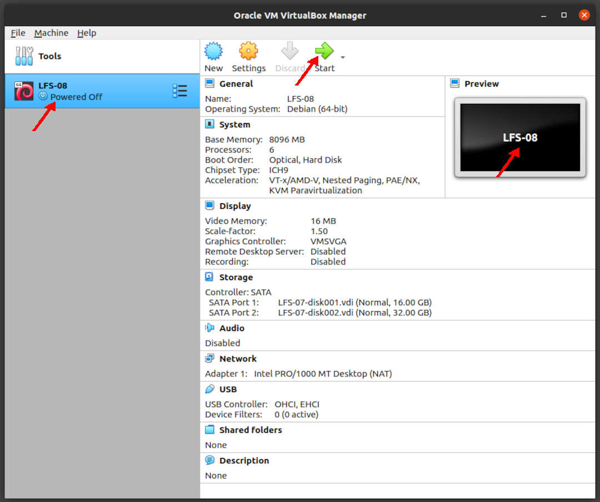

---
---

[HOME](index.md)
[ABOUT](README.md)
[WEB](https://lfs.vlsm.org/)
[GITHUB](https://github.com/OSP4DISS/lfs/)
[TOP](#)
[BOTTOM](#endofpage)
[PREV](LFS-10.md)
[NEXT](LFS-12.md)

<br>
<span style="color:red; font-weight:bold; font-size:larger;">
It is assumed that you understand how install a Debian VirtualBox Guest.
If you have never installed a VirtualBox Guest before, visit [OSP4DISS](https://osp4diss.vlsm.org/).
</span>

<br>
# LFS: Chapter 8 part 1

## Virtual Box Guest LFS-08

* Import LFS-07.ova, rename to LFS-08

<br>


<br>
### INPUT
```
ssh -p 6022 lfs@localhost

```

### OUTPUT
```
rms46@pamulang1:~$ ssh -p 6022 lfs@localhost
lfs@localhost's password:

===== TL;DR =====

lfs@osp:~$ 

```

<br>
### INPUT
```
echo $LFS
su -

```

<br>
# Mounting AGAIN (/dev and the File System)

### INPUT
```
echo $LFS
mount -v --bind /dev $LFS/dev
mount -v --bind /dev/pts $LFS/dev/pts
mount -vt proc proc $LFS/proc
mount -vt sysfs sysfs $LFS/sys
mount -vt tmpfs tmpfs $LFS/run
if [ -h $LFS/dev/shm ]; then
  mkdir -pv $LFS/$(readlink $LFS/dev/shm)
fi

```

### OUTPUT
```
root:~# echo $LFS
/mnt/lfs

root:~# mount -v --bind /dev $LFS/dev
mount: /dev bound on /mnt/lfs/dev.

root:~# mount -v --bind /dev/pts $LFS/dev/pts
mount: /dev/pts bound on /mnt/lfs/dev/pts.

root:~# mount -vt proc proc $LFS/proc
mount: proc mounted on /mnt/lfs/proc.

root:~# mount -vt sysfs sysfs $LFS/sys
mount: sysfs mounted on /mnt/lfs/sys.

root:~# mount -vt tmpfs tmpfs $LFS/run
mount: tmpfs mounted on /mnt/lfs/run.

root:~# if [ -h $LFS/dev/shm ]; then
>   mkdir -pv $LFS/$(readlink $LFS/dev/shm)
> fi

root:~# 

```

<br>
# Entering the Chroot Environment

### INPUT
```
df
chroot "$LFS" /usr/bin/env -i   \
    HOME=/root                  \
    TERM="$TERM"                \
    PS1='(lfs chroot) \u:\w\$ ' \
    PATH=/bin:/usr/bin:/sbin:/usr/sbin \
    MAKEFLAGS='-j6' \
    /bin/bash --login +h
df
cd /sources/

```

### OUTPUT
```
root:~# df
Filesystem     1K-blocks    Used Available Use% Mounted on
udev             4020860       0   4020860   0% /dev
tmpfs             807140    8644    798496   2% /run
/dev/sda1       16446332 2724804  12866388  18% /
tmpfs            4035684       0   4035684   0% /dev/shm
tmpfs               5120       0      5120   0% /run/lock
tmpfs            4035684       0   4035684   0% /sys/fs/cgroup
/dev/sdb1       32894736 2688836  28511900   9% /mnt/lfs
tmpfs             807136       0    807136   0% /run/user/1000
tmpfs            4035684       0   4035684   0% /mnt/lfs/run

root:~# chroot "$LFS" /usr/bin/env -i   \
>     HOME=/root                  \
>     TERM="$TERM"                \
>     PS1='(lfs chroot) \u:\w\$ ' \
>     PATH=/bin:/usr/bin:/sbin:/usr/sbin \
>     MAKEFLAGS='-j6' \
>     /bin/bash --login +h

(lfs chroot) root:/# df
Filesystem     1K-blocks    Used Available Use% Mounted on
/dev/sdb1       32894736 2688836  28511900   9% /
udev             4020860       0   4020860   0% /dev
tmpfs            4035684       0   4035684   0% /run

(lfs chroot) root:~# cd /sources/

(lfs chroot) root:/sources#

```

<br>
# Man-pages-5.08

### INPUT
```
tar xf man-pages-5.08.tar.xz
cd man-pages-5.08/
time make install
cd ../
rm -rf man-pages-5.08/

```

### OUTPUT
```
(lfs chroot) root:/sources# tar xf man-pages-5.08.tar.xz

(lfs chroot) root:/sources# cd man-pages-5.08/

(lfs chroot) root:/sources/man-pages-5.08# time make install
for i in man?; do \
	install -d -m 755 /usr/share/man/"$i" || exit $?; \
	install -m 644 "$i"/* /usr/share/man/"$i" || exit $?; \
done

real	0m0.090s
user	0m0.015s
sys	0m0.075s

(lfs chroot) root:/sources/man-pages-5.08# cd ../

(lfs chroot) root:/sources# rm -rf man-pages-5.08/

(lfs chroot) root:/sources# 

```

<br>
# Tcl-8.6.10

### INPUT
```
tar xf tcl8.6.10-src.tar.gz
cd tcl8.6.10/
tar -xf ../tcl8.6.10-html.tar.gz --strip-components=1

```

### OUTPUT
```
(lfs chroot) root:/sources# tar xf tcl8.6.10-src.tar.gz

(lfs chroot) root:/sources# cd tcl8.6.10/

(lfs chroot) root:/sources/tcl8.6.10# tar -xf ../tcl8.6.10-html.tar.gz --strip-components=1

(lfs chroot) root:/sources/tcl8.6.10# 

```

<br>
### INPUT
```
SRCDIR=$(pwd)
cd unix/
./configure --prefix=/usr           \
            --mandir=/usr/share/man \
            $([ "$(uname -m)" = x86_64 ] && echo --enable-64bit)

```

### OUTPUT
```
(lfs chroot) root:/sources/tcl8.6.10# SRCDIR=$(pwd)

(lfs chroot) root:/sources/tcl8.6.10# cd unix/

(lfs chroot) root:/sources/tcl8.6.10/unix# ./configure --prefix=/usr           \
>             --mandir=/usr/share/man \
>             $([ "$(uname -m)" = x86_64 ] && echo --enable-64bit)
checking whether to use symlinks for manpages... no
checking whether to compress the manpages... no

===== TL;DR =====

config.status: creating dltest/Makefile
config.status: creating tclConfig.sh
config.status: creating tcl.pc

(lfs chroot) root:/sources/tcl8.6.10/unix# 

```

<br>
### INPUT
```
time make

```

### OUTPUT
```
===== TL;DR =====

s.o threadCmd.o threadSvCmd.o threadSpCmd.o threadPoolCmd.o psGdbm.o psLmdb.o threadSvListCmd.o threadSvKeylistCmd.o tclXkeylist.o threadUnix.o  -L/sources/tcl8.6.10/unix -ltclstub8.6 
: libthread2.8.5.so
make[1]: Leaving directory '/sources/tcl8.6.10/unix/pkgs/thread2.8.5'

real	0m58.700s
user	1m36.391s
sys	0m7.823s

(lfs chroot) root:/sources/tcl8.6.10/unix#

```

<br>
### INPUT
```
sed -e "s|$SRCDIR/unix|/usr/lib|" \
    -e "s|$SRCDIR|/usr/include|"  \
    -i tclConfig.sh

sed -e "s|$SRCDIR/unix/pkgs/tdbc1.1.1|/usr/lib/tdbc1.1.1|" \
    -e "s|$SRCDIR/pkgs/tdbc1.1.1/generic|/usr/include|"    \
    -e "s|$SRCDIR/pkgs/tdbc1.1.1/library|/usr/lib/tcl8.6|" \
    -e "s|$SRCDIR/pkgs/tdbc1.1.1|/usr/include|"            \
    -i pkgs/tdbc1.1.1/tdbcConfig.sh

sed -e "s|$SRCDIR/unix/pkgs/itcl4.2.0|/usr/lib/itcl4.2.0|" \
    -e "s|$SRCDIR/pkgs/itcl4.2.0/generic|/usr/include|"    \
    -e "s|$SRCDIR/pkgs/itcl4.2.0|/usr/include|"            \
    -i pkgs/itcl4.2.0/itclConfig.sh

unset SRCDIR

```

### OUTPUT
```
(lfs chroot) root:/sources/tcl8.6.10/unix# sed -e "s|$SRCDIR/unix|/usr/lib|" \
>     -e "s|$SRCDIR|/usr/include|"  \
>     -i tclConfig.sh

(lfs chroot) root:/sources/tcl8.6.10/unix# sed -e "s|$SRCDIR/unix/pkgs/tdbc1.1.1|/usr/lib/tdbc1.1.1|" \
>     -e "s|$SRCDIR/pkgs/tdbc1.1.1/generic|/usr/include|"    \
>     -e "s|$SRCDIR/pkgs/tdbc1.1.1/library|/usr/lib/tcl8.6|" \
>     -e "s|$SRCDIR/pkgs/tdbc1.1.1|/usr/include|"            \
>     -i pkgs/tdbc1.1.1/tdbcConfig.sh

(lfs chroot) root:/sources/tcl8.6.10/unix# sed -e "s|$SRCDIR/unix/pkgs/itcl4.2.0|/usr/lib/itcl4.2.0|" \
>     -e "s|$SRCDIR/pkgs/itcl4.2.0/generic|/usr/include|"    \
>     -e "s|$SRCDIR/pkgs/itcl4.2.0|/usr/include|"            \
>     -i pkgs/itcl4.2.0/itclConfig.sh

(lfs chroot) root:/sources/tcl8.6.10/unix# unset SRCDIR

(lfs chroot) root:/sources/tcl8.6.10/unix# 

```

<br>
### INPUT
```
time make test

```

### OUTPUT
```
===== TL;DR =====

Test files exiting with errors:  

  clock.test

real	4m15.176s
user	0m43.204s
sys	0m7.417s

(lfs chroot) root:/sources/tcl8.6.10/unix# 

```

<br>
### INPUT
```
time make install

```

### OUTPUT
```
===== TL;DR =====

Installing /sources/tcl8.6.10/pkgs/thread2.8.5/doc/man/ttrace.n
make[1]: Leaving directory '/sources/tcl8.6.10/unix/pkgs/thread2.8.5'
Installing and cross-linking command (.n) docs to /usr/share/man/mann/

real	0m4.219s
user	0m6.429s
sys	0m1.834s

(lfs chroot) root:/sources/tcl8.6.10/unix# 

```

<br>
### INPUT
```
chmod -v u+w /usr/lib/libtcl8.6.so
make install-private-headers
ln -sfv tclsh8.6 /usr/bin/tclsh
cd ../../
rm -rf tcl8.6.10/

```

### OUTPUT
```
(lfs chroot) root:/sources/tcl8.6.10/unix# chmod -v u+w /usr/lib/libtcl8.6.so
mode of '/usr/lib/libtcl8.6.so' changed from 0555 (r-xr-xr-x) to 0755 (rwxr-xr-x)

(lfs chroot) root:/sources/tcl8.6.10/unix# make install-private-headers
Installing private header files to /usr/include/

(lfs chroot) root:/sources/tcl8.6.10/unix# ln -sfv tclsh8.6 /usr/bin/tclsh
'/usr/bin/tclsh' -> 'tclsh8.6'

(lfs chroot) root:/sources/tcl8.6.10/unix# cd ../../

(lfs chroot) root:/sources# rm -rf tcl8.6.10/

(lfs chroot) root:/sources# 

```

<br>
# Expect-5.45.4

### INPUT
```
tar xf expect5.45.4.tar.gz
cd expect5.45.4/
./configure --prefix=/usr           \
            --with-tcl=/usr/lib     \
            --enable-shared         \
            --mandir=/usr/share/man \
            --with-tclinclude=/usr/include

```

### OUTPUT
```
===== TL;DR =====

checking sys/param.h presence... yes
checking for sys/param.h... yes
configure: creating ./config.status
config.status: creating Makefile

(lfs chroot) root:/sources/expect5.45.4# 

```

<br>
### INPUT
```
time make

```

### OUTPUT
```
===== TL;DR =====

	-Wl,-rpath,/usr/lib \
	-Wl,-rpath,/usr/lib/expect5.45.4
: expect

real	0m0.767s
user	0m3.334s
sys	0m0.363s

(lfs chroot) root:/sources/expect5.45.4#

```

<br>
### INPUT
```
time make test

```

### OUTPUT
```
(lfs chroot) root:/sources/expect5.45.4# time make test
(echo 'if {![package vsatisfies [package provide Tcl] 8.6]} {return}' ; \
 echo 'package ifneeded Expect 5.45.4 \
    [list load [file join $dir libexpect5.45.4.so]]'\
) > pkgIndex.tcl
TCL_LIBRARY=`echo /usr/include/library` LD_LIBRARY_PATH=".:/usr/lib:" PATH=".:/usr/lib:/bin:/usr/bin:/sbin:/usr/sbin" TCLLIBPATH="." /usr/bin/tclsh8.6 `echo ./tests/all.tcl` 
cat.test
expect.test
logfile.test
via sendvia send_uservia send_stdoutvia send_ttypid.test
send.test
spawn.test
stty.test
all.tcl:	Total	29	Passed	29	Skipped	0	Failed	0
Sourced 0 Test Files.

real	0m13.284s
user	0m0.105s
sys	0m0.063s

(lfs chroot) root:/sources/expect5.45.4# 

```

<br>
### INPUT
```
time make install
ln -svf expect5.45.4/libexpect5.45.4.so /usr/lib
cd ../
rm -rf expect5.45.4/

```

### OUTPUT
```
===== TL;DR =====

    /usr/bin/install -c $i /usr/bin/$i ; \
    rm -f $i ; \
  else true; fi ; \
done

real	0m0.062s
user	0m0.125s
sys	0m0.023s

(lfs chroot) root:/sources/expect5.45.4# ln -svf expect5.45.4/libexpect5.45.4.so /usr/lib
'/usr/lib/libexpect5.45.4.so' -> 'expect5.45.4/libexpect5.45.4.so'

(lfs chroot) root:/sources/expect5.45.4# cd ../

(lfs chroot) root:/sources# rm -rf expect5.45.4/

(lfs chroot) root:/sources# 

```

<br>
# DejaGNU-1.6.2

### INPUT
```
tar xf dejagnu-1.6.2.tar.gz
cd dejagnu-1.6.2/
./configure --prefix=/usr
makeinfo --html --no-split -o doc/dejagnu.html doc/dejagnu.texi
makeinfo --plaintext       -o doc/dejagnu.txt  doc/dejagnu.texi

```

### OUTPUT
```
(lfs chroot) root:/sources# tar xf dejagnu-1.6.2.tar.gz

(lfs chroot) root:/sources# cd dejagnu-1.6.2/

(lfs chroot) root:/sources/dejagnu-1.6.2# ./configure --prefix=/usr
checking for a BSD-compatible install... /usr/bin/install -c
checking whether build environment is sane... yes
checking for a thread-safe mkdir -p... /bin/mkdir -p

===== TL;DR =====

configure: creating ./config.status
config.status: creating Makefile
config.status: executing depfiles commands

(lfs chroot) root:/sources/dejagnu-1.6.2# makeinfo --html --no-split -o doc/dejagnu.html doc/dejagnu.texi

(lfs chroot) root:/sources/dejagnu-1.6.2# makeinfo --plaintext       -o doc/dejagnu.txt  doc/dejagnu.texi

(lfs chroot) root:/sources/dejagnu-1.6.2#

```

<br>
### INPUT
```
time make install
install -v -dm755  /usr/share/doc/dejagnu-1.6.2
install -v -m644   doc/dejagnu.{html,txt} /usr/share/doc/dejagnu-1.6.2

```

### OUTPUT
```
(lfs chroot) root:/sources/dejagnu-1.6.2# time make install
Done. Now run 'make install'.
make[1]: Entering directory '/sources/dejagnu-1.6.2'
 /bin/mkdir -p '/usr/bin'

===== TL;DR =====

 install-info --info-dir='/usr/share/info' '/usr/share/info/dejagnu.info'
make[1]: Leaving directory '/sources/dejagnu-1.6.2'

real	0m0.069s
user	0m0.062s
sys	0m0.008s

(lfs chroot) root:/sources/dejagnu-1.6.2# install -v -dm755  /usr/share/doc/dejagnu-1.6.2
install: creating directory '/usr/share/doc/dejagnu-1.6.2'

(lfs chroot) root:/sources/dejagnu-1.6.2# install -v -m644   doc/dejagnu.{html,txt} /usr/share/doc/dejagnu-1.6.2
'doc/dejagnu.html' -> '/usr/share/doc/dejagnu-1.6.2/dejagnu.html'
'doc/dejagnu.txt' -> '/usr/share/doc/dejagnu-1.6.2/dejagnu.txt'

(lfs chroot) root:/sources/dejagnu-1.6.2# 

```

<br>
### INPUT
```
time make check

```

### OUTPUT
```
(lfs chroot) root:/sources/dejagnu-1.6.2# time make check
Done. Now run 'make install'.
make  unit
make[1]: Entering directory '/sources/dejagnu-1.6.2'

===== TL;DR =====

Running ./testsuite/runtest.all/libs.exp ...
Running ./testsuite/runtest.all/load_lib.exp ...
Running ./testsuite/runtest.all/options.exp ...
Running ./testsuite/runtest.all/stats-sub.exp ...
Running ./testsuite/runtest.all/stats.exp ...

===== TL;DR =====

		=== runtest Summary ===

# of expected passes		77
DejaGnu version	1.6.2
Expect version	5.45.4
Tcl version	8.6

make[1]: Leaving directory '/sources/dejagnu-1.6.2'

real	0m2.291s
user	0m1.574s
sys	0m0.279s
(lfs chroot) root:/sources/dejagnu-1.6.2#

```

<br>
### INPUT
```
cd ../
rm -rf dejagnu-1.6.2/

```

### OUTPUT
```
(lfs chroot) root:/sources/dejagnu-1.6.2# cd ../

(lfs chroot) root:/sources# rm -rf dejagnu-1.6.2/

(lfs chroot) root:/sources# 

```

<br>
# Iana-Etc-20200821

### INPUT
```
tar xf iana-etc-20200821.tar.gz
cd iana-etc-20200821/
cp services protocols /etc/

```

### OUTPUT
```
(lfs chroot) root:/sources# tar xf iana-etc-20200821.tar.gz

(lfs chroot) root:/sources# cd iana-etc-20200821/

(lfs chroot) root:/sources/iana-etc-20200821# cp services protocols /etc/

(lfs chroot) root:/sources/iana-etc-20200821# 

```

<br>
### INPUT
```
cd ../
rm -rf iana-etc-20200821/

```

### OUTPUT
```
(lfs chroot) root:/sources/iana-etc-20200821# cd ../

(lfs chroot) root:/sources# rm -rf iana-etc-20200821/

(lfs chroot) root:/sources# 

```

<br>
# Glibc-2.32

### INPUT
```
tar xf glibc-2.32.tar.xz
cd glibc-2.32/
patch -Np1 -i ../glibc-2.32-fhs-1.patch
mkdir -v build
cd       build
../configure --prefix=/usr                            \
             --disable-werror                         \
             --enable-kernel=3.2                      \
             --enable-stack-protector=strong          \
             --with-headers=/usr/include              \
             libc_cv_slibdir=/lib

```

### OUTPUT
```
(lfs chroot) root:/sources# tar xf glibc-2.32.tar.xz

(lfs chroot) root:/sources# cd glibc-2.32/

(lfs chroot) root:/sources/glibc-2.32# patch -Np1 -i ../glibc-2.32-fhs-1.patch
patching file Makeconfig
Hunk #1 succeeded at 245 (offset -5 lines).
patching file nscd/nscd.h

(lfs chroot) root:/sources/glibc-2.32# mkdir -v build
mkdir: created directory 'build'

(lfs chroot) root:/sources/glibc-2.32# cd       build

(lfs chroot) root:/sources/glibc-2.32/build# ../configure --prefix=/usr                            \
>              --disable-werror                         \
>              --enable-kernel=3.2                      \
>              --enable-stack-protector=strong          \

===== TL;DR =====

config.status: creating Makefile
config.status: creating config.h
config.status: executing default commands

(lfs chroot) root:/sources/glibc-2.32/build#

```

<br>
### INPUT
```
time make

```

### OUTPUT
```

===== TL;DR =====
make[2]: Leaving directory '/sources/glibc-2.32/elf'
make[1]: Leaving directory '/sources/glibc-2.32'

real	2m35.656s
user	9m45.811s
sys	2m30.884s

(lfs chroot) root:/sources/glibc-2.32/build# 

```

<br>
### INPUT
```
case $(uname -m) in
  i?86)   ln -sfnv $PWD/elf/ld-linux.so.2        /lib ;;
  x86_64) ln -sfnv $PWD/elf/ld-linux-x86-64.so.2 /lib ;;
esac
time make check

```

### OUTPUT
```

===== TL;DR =====

UNSUPPORTED: resolv/tst-resolv-ai_idn
UNSUPPORTED: resolv/tst-resolv-ai_idn-latin1
UNSUPPORTED: stdlib/tst-system
UNSUPPORTED: string/tst-strerror
UNSUPPORTED: string/tst-strsignal
Summary of test results:
      3 FAIL
   4233 PASS
     28 UNSUPPORTED
     17 XFAIL
      2 XPASS
make[1]: *** [Makefile:633: tests] Error 1
make[1]: Leaving directory '/sources/glibc-2.32'
make: *** [Makefile:9: check] Error 2

real	17m42.348s
user	26m39.834s
sys	5m16.890s

(lfs chroot) root:/sources/glibc-2.32/build# 

```

<br>
### INPUT
```
touch /etc/ld.so.conf
sed '/test-installation/s@$(PERL)@echo not running@' -i ../Makefile
time make install
cp -v ../nscd/nscd.conf /etc/nscd.conf
mkdir -pv /var/cache/nscd
mkdir -pv /usr/lib/locale

```

### OUTPUT
```

===== TL;DR =====

  /sources/glibc-2.32/build/elf/ldconfig  \
			/lib /usr/lib
LD_SO=ld-linux-x86-64.so.2 CC="gcc" echo not running scripts/test-installation.pl /sources/glibc-2.32/build/
not running scripts/test-installation.pl /sources/glibc-2.32/build/
make[1]: Leaving directory '/sources/glibc-2.32'

real	0m28.986s
user	0m37.396s
sys	0m5.469s

(lfs chroot) root:/sources/glibc-2.32/build# cp -v ../nscd/nscd.conf /etc/nscd.conf
'../nscd/nscd.conf' -> '/etc/nscd.conf'

(lfs chroot) root:/sources/glibc-2.32/build# mkdir -pv /var/cache/nscd
mkdir: created directory '/var/cache/nscd'

(lfs chroot) root:/sources/glibc-2.32/build# mkdir -pv /usr/lib/locale
mkdir: created directory '/usr/lib/locale'

(lfs chroot) root:/sources/glibc-2.32/build# 

```

<br>
### INPUT
```
localedef -i POSIX -f UTF-8 C.UTF-8 2> /dev/null || true
localedef -i cs_CZ -f UTF-8 cs_CZ.UTF-8
localedef -i de_DE -f ISO-8859-1 de_DE
localedef -i de_DE@euro -f ISO-8859-15 de_DE@euro
localedef -i de_DE -f UTF-8 de_DE.UTF-8
localedef -i el_GR -f ISO-8859-7 el_GR
localedef -i en_GB -f UTF-8 en_GB.UTF-8
localedef -i en_HK -f ISO-8859-1 en_HK
localedef -i en_PH -f ISO-8859-1 en_PH
localedef -i en_US -f ISO-8859-1 en_US
localedef -i en_US -f UTF-8 en_US.UTF-8
localedef -i es_MX -f ISO-8859-1 es_MX
localedef -i fa_IR -f UTF-8 fa_IR
localedef -i fr_FR -f ISO-8859-1 fr_FR
localedef -i fr_FR@euro -f ISO-8859-15 fr_FR@euro
localedef -i fr_FR -f UTF-8 fr_FR.UTF-8
localedef -i it_IT -f ISO-8859-1 it_IT
localedef -i it_IT -f UTF-8 it_IT.UTF-8
localedef -i ja_JP -f EUC-JP ja_JP
localedef -i ja_JP -f SHIFT_JIS ja_JP.SIJS 2> /dev/null || true
localedef -i ja_JP -f UTF-8 ja_JP.UTF-8
localedef -i ru_RU -f KOI8-R ru_RU.KOI8-R
localedef -i ru_RU -f UTF-8 ru_RU.UTF-8
localedef -i tr_TR -f UTF-8 tr_TR.UTF-8
localedef -i zh_CN -f GB18030 zh_CN.GB18030
localedef -i zh_HK -f BIG5-HKSCS zh_HK.BIG5-HKSCS
make localedata/install-locales

```

### OUTPUT
```

===== TL;DR =====

zh_SG.GB2312... done
 done
zh_TW.UTF-8...zh_TW.EUC-TW... done
 done
zh_TW.BIG5...zu_ZA.UTF-8... done
zu_ZA.ISO-8859-1... done
 done
 done
 done
 done
 done
make[2]: Leaving directory '/sources/glibc-2.32/localedata'
make[1]: Leaving directory '/sources/glibc-2.32'

(lfs chroot) root:/sources/glibc-2.32/build#

```

<br>
# Configuring Glibc

### INPUT
```
cat > /etc/nsswitch.conf << "EOF"
# Begin /etc/nsswitch.conf

passwd: files
group: files
shadow: files

hosts: files dns
networks: files

protocols: files
services: files
ethers: files
rpc: files

# End /etc/nsswitch.conf
EOF

```

### OUTPUT
```
(lfs chroot) root:/sources/glibc-2.32/build# cat > /etc/nsswitch.conf << "EOF"
> # Begin /etc/nsswitch.conf
> 
> passwd: files
> group: files
> shadow: files
> 
> hosts: files dns
> networks: files
> 
> protocols: files
> services: files
> ethers: files
> rpc: files
> 
> # End /etc/nsswitch.conf
> EOF

(lfs chroot) root:/sources/glibc-2.32/build# 

```

<br>
### INPUT
```
tar -xf ../../tzdata2020a.tar.gz

ZONEINFO=/usr/share/zoneinfo
mkdir -pv $ZONEINFO/{posix,right}

for tz in etcetera southamerica northamerica europe africa antarctica  \
          asia australasia backward pacificnew systemv; do
    zic -L /dev/null   -d $ZONEINFO       ${tz}
    zic -L /dev/null   -d $ZONEINFO/posix ${tz}
    zic -L leapseconds -d $ZONEINFO/right ${tz}
done

cp -v zone.tab zone1970.tab iso3166.tab $ZONEINFO
zic -d $ZONEINFO -p America/New_York
unset ZONEINFO

tzselect

```

### OUTPUT
```
(lfs chroot) root:/sources/glibc-2.32/build# tar -xf ../../tzdata2020a.tar.gz

(lfs chroot) root:/sources/glibc-2.32/build# ZONEINFO=/usr/share/zoneinfo

(lfs chroot) root:/sources/glibc-2.32/build# mkdir -pv $ZONEINFO/{posix,right}
mkdir: created directory '/usr/share/zoneinfo/posix'
mkdir: created directory '/usr/share/zoneinfo/right'

(lfs chroot) root:/sources/glibc-2.32/build# for tz in etcetera southamerica northamerica europe africa antarctica  \
>           asia australasia backward pacificnew systemv; do
>     zic -L /dev/null   -d $ZONEINFO       ${tz}
>     zic -L /dev/null   -d $ZONEINFO/posix ${tz}
>     zic -L leapseconds -d $ZONEINFO/right ${tz}

===== TL;DR =====

warning: "leapseconds", line 79: "#expires" is obsolescent; use "Expires"
warning: "leapseconds", line 79: "#expires" is obsolescent; use "Expires"
warning: "leapseconds", line 79: "#expires" is obsolescent; use "Expires"

(lfs chroot) root:/sources/glibc-2.32/build# cp -v zone.tab zone1970.tab iso3166.tab $ZONEINFO
'zone.tab' -> '/usr/share/zoneinfo/zone.tab'
'zone1970.tab' -> '/usr/share/zoneinfo/zone1970.tab'
'iso3166.tab' -> '/usr/share/zoneinfo/iso3166.tab'

(lfs chroot) root:/sources/glibc-2.32/build# zic -d $ZONEINFO -p America/New_York

(lfs chroot) root:/sources/glibc-2.32/build# unset ZONEINFO

(lfs chroot) root:/sources/glibc-2.32/build# tzselect
Please identify a location so that time zone rules can be set correctly.
Please select a continent, ocean, "coord", or "TZ".
 1) Africa
 2) Americas
 3) Antarctica
 4) Asia
 5) Atlantic Ocean
 6) Australia
 7) Europe
 8) Indian Ocean
 9) Pacific Ocean
10) coord - I want to use geographical coordinates.
11) TZ - I want to specify the timezone using the Posix TZ format.
#? 4

Please select a country whose clocks agree with yours.
 1) Afghanistan		  14) India		    27) Lebanon		      40) Singapore
 2) Armenia		  15) Indonesia		    28) Macau		      41) Sri Lanka
 3) Azerbaijan		  16) Iran		    29) Malaysia	      42) Syria
 4) Bahrain		  17) Iraq		    30) Mongolia	      43) Taiwan
 5) Bangladesh		  18) Israel		    31) Myanmar (Burma)	      44) Tajikistan
 6) Bhutan		  19) Japan		    32) Nepal		      45) Thailand
 7) Brunei		  20) Jordan		    33) Oman		      46) Turkmenistan
 8) Cambodia		  21) Kazakhstan	    34) Pakistan	      47) United Arab Emirates
 9) China		  22) Korea (North)	    35) Palestine	      48) Uzbekistan
10) Cyprus		  23) Korea (South)	    36) Philippines	      49) Vietnam
11) East Timor		  24) Kuwait		    37) Qatar		      50) Yemen
12) Georgia		  25) Kyrgyzstan	    38) Russia
13) Hong Kong		  26) Laos		    39) Saudi Arabia
#? 15

Please select one of the following timezones.
1) Java, Sumatra
2) Borneo (west, central)
3) Borneo (east, south); Sulawesi/Celebes, Bali, Nusa Tengarra; Timor (west)
4) New Guinea (West Papua / Irian Jaya); Malukus/Moluccas
#? 1

The following information has been given:

	Indonesia
	Java, Sumatra

Therefore TZ='Asia/Jakarta' will be used.
Selected time is now:	Sun Dec  6 16:11:54 WIB 2020.
Universal Time is now:	Sun Dec  6 09:11:54 UTC 2020.
Is the above information OK?
1) Yes
2) No
#? 1

You can make this change permanent for yourself by appending the line
	TZ='Asia/Jakarta'; export TZ
to the file '.profile' in your home directory; then log out and log in again.

Here is that TZ value again, this time on standard output so that you
can use the /usr/bin/tzselect command in shell scripts:
Asia/Jakarta

(lfs chroot) root:/sources/glibc-2.32/build#

```

### INPUT
```
ln -sfv /usr/share/zoneinfo/Asia/Jakarta /etc/localtime

```

### OUTPUT
```
(lfs chroot) root:/sources/glibc-2.32/build# ln -sfv /usr/share/zoneinfo/Asia/Jakarta /etc/localtime
'/etc/localtime' -> '/usr/share/zoneinfo/Asia/Jakarta'

(lfs chroot) root:/sources/glibc-2.32/build# 

```

<br>
# Configuring the Dynamic Loader

### INPUT
```
cat > /etc/ld.so.conf << "EOF"
# Begin /etc/ld.so.conf
/usr/local/lib
/opt/lib

EOF

cat >> /etc/ld.so.conf << "EOF"
# Add an include directory
include /etc/ld.so.conf.d/*.conf

EOF
mkdir -pv /etc/ld.so.conf.d

```

### OUTPUT
```
(lfs chroot) root:/sources/glibc-2.32/build# cat > /etc/ld.so.conf << "EOF"
> # Begin /etc/ld.so.conf
> /usr/local/lib
> /opt/lib
> 
> EOF

(lfs chroot) root:/sources/glibc-2.32/build# cat >> /etc/ld.so.conf << "EOF"
> # Add an include directory
> include /etc/ld.so.conf.d/*.conf
> 
> EOF

(lfs chroot) root:/sources/glibc-2.32/build# mkdir -pv /etc/ld.so.conf.d
mkdir: created directory '/etc/ld.so.conf.d'

(lfs chroot) root:/sources/glibc-2.32/build# 

```

<br>
### INPUT
```
cd ../../
rm -rf glibc-2.32/

```

### OUTPUT
```
(lfs chroot) root:/sources/glibc-2.32/build# cd ../../

(lfs chroot) root:/sources# rm -rf glibc-2.32/

(lfs chroot) root:/sources# 

```

<br>
# Zlib-1.2.11

### INPUT
```
tar xf zlib-1.2.11.tar.xz
cd zlib-1.2.11/
./configure --prefix=/usr

```

### OUTPUT
```
(lfs chroot) root:/sources# tar xf zlib-1.2.11.tar.xz

(lfs chroot) root:/sources# cd zlib-1.2.11/

(lfs chroot) root:/sources/zlib-1.2.11# ./configure --prefix=/usr
Checking for gcc...
Checking for shared library support...
Building shared library libz.so.1.2.11 with gcc.
Checking for size_t... Yes.
Checking for off64_t... Yes.
Checking for fseeko... Yes.
Checking for strerror... Yes.
Checking for unistd.h... Yes.
Checking for stdarg.h... Yes.
Checking whether to use vs[n]printf() or s[n]printf()... using vs[n]printf().
Checking for vsnprintf() in stdio.h... Yes.
Checking for return value of vsnprintf()... Yes.
Checking for attribute(visibility) support... Yes.

(lfs chroot) root:/sources/zlib-1.2.11# 

```

<br>
### INPUT
```
time make

```

### OUTPUT
```
(lfs chroot) root:/sources/zlib-1.2.11# time make
gcc -O3 -D_LARGEFILE64_SOURCE=1 -DHAVE_HIDDEN -I. -c -o example.o test/example.c
gcc -O3 -D_LARGEFILE64_SOURCE=1 -DHAVE_HIDDEN  -c -o adler32.o adler32.c
gcc -O3 -D_LARGEFILE64_SOURCE=1 -DHAVE_HIDDEN  -c -o crc32.o crc32.c

===== TL;DR =====

real	0m1.280s
user	0m6.074s
sys	0m0.660s

(lfs chroot) root:/sources/zlib-1.2.11# 

```

<br>
### INPUT
```
time make check

```

### OUTPUT
```
(lfs chroot) root:/sources/zlib-1.2.11# time make check
hello world
hello world
hello world
zlib version 1.2.11 = 0x12b0, compile flags = 0xa9
uncompress(): hello, hello!
zlib version 1.2.11 = 0x12b0, compile flags = 0xa9
uncompress(): hello, hello!
gzread(): hello, hello!
gzgets() after gzseek:  hello!
gzread(): hello, hello!
gzgets() after gzseek:  hello!
inflate(): hello, hello!
inflate(): hello, hello!
zlib version 1.2.11 = 0x12b0, compile flags = 0xa9
large_inflate(): OK
after inflateSync(): hello, hello!
uncompress(): hello, hello!
inflate with dictionary: hello, hello!
		*** zlib shared test OK ***
gzread(): hello, hello!
gzgets() after gzseek:  hello!
inflate(): hello, hello!
large_inflate(): OK
large_inflate(): OK
after inflateSync(): hello, hello!
after inflateSync(): hello, hello!
inflate with dictionary: hello, hello!
inflate with dictionary: hello, hello!
		*** zlib 64-bit test OK ***
		*** zlib test OK ***

real	0m0.024s
user	0m0.018s
sys	0m0.058s

(lfs chroot) root:/sources/zlib-1.2.11# 

```

<br>
### INPUT
```
time make install
mv -v /usr/lib/libz.so.* /lib
ln -sfv ../../lib/$(readlink /usr/lib/libz.so) /usr/lib/libz.so

cd ../
rm -rf zlib-1.2.11/

```

### OUTPUT
```
(lfs chroot) root:/sources/zlib-1.2.11# time make install
rm -f /usr/lib/libz.a
cp libz.a /usr/lib
chmod 644 /usr/lib/libz.a
cp libz.so.1.2.11 /usr/lib
chmod 755 /usr/lib/libz.so.1.2.11
rm -f /usr/share/man/man3/zlib.3
cp zlib.3 /usr/share/man/man3
chmod 644 /usr/share/man/man3/zlib.3
rm -f /usr/lib/pkgconfig/zlib.pc
cp zlib.pc /usr/lib/pkgconfig
chmod 644 /usr/lib/pkgconfig/zlib.pc
rm -f /usr/include/zlib.h /usr/include/zconf.h
cp zlib.h zconf.h /usr/include
chmod 644 /usr/include/zlib.h /usr/include/zconf.h

real	0m0.625s
user	0m0.020s
sys	0m0.004s

(lfs chroot) root:/sources/zlib-1.2.11# mv -v /usr/lib/libz.so.* /lib
renamed '/usr/lib/libz.so.1' -> '/lib/libz.so.1'
renamed '/usr/lib/libz.so.1.2.11' -> '/lib/libz.so.1.2.11'

(lfs chroot) root:/sources/zlib-1.2.11# ln -sfv ../../lib/$(readlink /usr/lib/libz.so) /usr/lib/libz.so
'/usr/lib/libz.so' -> '../../lib/libz.so.1.2.11'

(lfs chroot) root:/sources/zlib-1.2.11# cd ../

(lfs chroot) root:/sources# rm -rf zlib-1.2.11/

(lfs chroot) root:/sources# 

```

<br>
# Bzip2-1.0.8

### INPUT
```
tar xf bzip2-1.0.8.tar.gz
cd bzip2-1.0.8/
patch -Np1 -i ../bzip2-1.0.8-install_docs-1.patch
sed -i 's@\(ln -s -f \)$(PREFIX)/bin/@\1@' Makefile
sed -i "s@(PREFIX)/man@(PREFIX)/share/man@g" Makefile
make -f Makefile-libbz2_so
make clean

```

### OUTPUT
```
(lfs chroot) root:/sources# tar xf bzip2-1.0.8.tar.gz

(lfs chroot) root:/sources# cd bzip2-1.0.8/

(lfs chroot) root:/sources/bzip2-1.0.8# patch -Np1 -i ../bzip2-1.0.8-install_docs-1.patch
patching file Makefile

(lfs chroot) root:/sources/bzip2-1.0.8# sed -i 's@\(ln -s -f \)$(PREFIX)/bin/@\1@' Makefile

(lfs chroot) root:/sources/bzip2-1.0.8# sed -i "s@(PREFIX)/man@(PREFIX)/share/man@g" Makefile

(lfs chroot) root:/sources/bzip2-1.0.8# make -f Makefile-libbz2_so
gcc -fpic -fPIC -Wall -Winline -O2 -g -D_FILE_OFFSET_BITS=64 -c blocksort.c
gcc -fpic -fPIC -Wall -Winline -O2 -g -D_FILE_OFFSET_BITS=64 -c huffman.c
gcc -fpic -fPIC -Wall -Winline -O2 -g -D_FILE_OFFSET_BITS=64 -c crctable.c

===== TL;DR =====

gcc -fpic -fPIC -Wall -Winline -O2 -g -D_FILE_OFFSET_BITS=64 -o bzip2-shared bzip2.c libbz2.so.1.0.8
rm -f libbz2.so.1.0
ln -s libbz2.so.1.0.8 libbz2.so.1.0

(lfs chroot) root:/sources/bzip2-1.0.8# make clean
rm -f *.o libbz2.a bzip2 bzip2recover \
sample1.rb2 sample2.rb2 sample3.rb2 \
sample1.tst sample2.tst sample3.tst

(lfs chroot) root:/sources/bzip2-1.0.8# 

```

<br>
### INPUT
```
time make

```

### OUTPUT
```
(lfs chroot) root:/sources/bzip2-1.0.8# time make
gcc -Wall -Winline -O2 -g -D_FILE_OFFSET_BITS=64 -c huffman.c

If compilation produces errors, or a large number of warnings,
please read README.COMPILATION.PROBLEMS -- you might be able to
adjust the flags in this Makefile to improve matters.

===== TL;DR =====

real	0m1.211s
user	0m3.037s
sys	0m0.199s

(lfs chroot) root:/sources/bzip2-1.0.8#

```

<br>
### INPUT
```
time make PREFIX=/usr install
cp -v bzip2-shared /bin/bzip2
cp -av libbz2.so* /lib
ln -sv ../../lib/libbz2.so.1.0 /usr/lib/libbz2.so
rm -v /usr/bin/{bunzip2,bzcat,bzip2}
ln -sv bzip2 /bin/bunzip2
ln -sv bzip2 /bin/bzcat

cd ../
rm -rf bzip2-1.0.8/

```

### OUTPUT
```
(lfs chroot) root:/sources/bzip2-1.0.8# time make PREFIX=/usr install
if ( test ! -d /usr/bin ) ; then mkdir -p /usr/bin ; fi
if ( test ! -d /usr/lib ) ; then mkdir -p /usr/lib ; fi
if ( test ! -d /usr/share/man ) ; then mkdir -p /usr/share/man ; fi

===== TL;DR =====

real	0m0.142s
user	0m0.076s
sys	0m0.043s

(lfs chroot) root:/sources/bzip2-1.0.8# cp -v bzip2-shared /bin/bzip2
'bzip2-shared' -> '/bin/bzip2'

(lfs chroot) root:/sources/bzip2-1.0.8# cp -av libbz2.so* /lib
'libbz2.so.1.0' -> '/lib/libbz2.so.1.0'
'libbz2.so.1.0.8' -> '/lib/libbz2.so.1.0.8'

(lfs chroot) root:/sources/bzip2-1.0.8# ln -sv ../../lib/libbz2.so.1.0 /usr/lib/libbz2.so
'/usr/lib/libbz2.so' -> '../../lib/libbz2.so.1.0'

(lfs chroot) root:/sources/bzip2-1.0.8# rm -v /usr/bin/{bunzip2,bzcat,bzip2}
removed '/usr/bin/bunzip2'
removed '/usr/bin/bzcat'
removed '/usr/bin/bzip2'

(lfs chroot) root:/sources/bzip2-1.0.8# ln -sv bzip2 /bin/bunzip2
'/bin/bunzip2' -> 'bzip2'

(lfs chroot) root:/sources/bzip2-1.0.8# ln -sv bzip2 /bin/bzcat
'/bin/bzcat' -> 'bzip2'

(lfs chroot) root:/sources/bzip2-1.0.8# cd ../

(lfs chroot) root:/sources# rm -rf bzip2-1.0.8/

(lfs chroot) root:/sources# 

```

<br>
# Xz-5.2.5

### INPUT
```
tar xf xz-5.2.5.tar.xz
cd xz-5.2.5/
./configure --prefix=/usr    \
            --disable-static \
            --docdir=/usr/share/doc/xz-5.2.5

```

### OUTPUT
```
(lfs chroot) root:/sources# tar xf xz-5.2.5.tar.xz

(lfs chroot) root:/sources# cd xz-5.2.5/

(lfs chroot) root:/sources/xz-5.2.5# ./configure --prefix=/usr    \
>             --disable-static \
>             --docdir=/usr/share/doc/xz-5.2.5

===== TL;DR =====

config.status: executing po-directories commands
config.status: creating po/POTFILES
config.status: creating po/Makefile

(lfs chroot) root:/sources/xz-5.2.5#

```

<br>
### INPUT
```
time make

```

### OUTPUT
```
(lfs chroot) root:/sources/xz-5.2.5# time make
make  all-recursive
make[1]: Entering directory '/sources/xz-5.2.5'
Making all in src

===== TL;DR =====

make[2]: Entering directory '/sources/xz-5.2.5'
make[2]: Leaving directory '/sources/xz-5.2.5'
make[1]: Leaving directory '/sources/xz-5.2.5'

real	0m3.195s
user	0m11.290s
sys	0m1.975s

(lfs chroot) root:/sources/xz-5.2.5#

```

<br>
### INPUT
```
time make check

```

### OUTPUT
```
(lfs chroot) root:/sources/xz-5.2.5# time make check
Making check in src
make[1]: Entering directory '/sources/xz-5.2.5/src'
Making check in liblzma
make[2]: Entering directory '/sources/xz-5.2.5/src/liblzma'

===== TL;DR =====

==================
All 9 tests passed
==================
make[2]: Leaving directory '/sources/xz-5.2.5/tests'
make[1]: Leaving directory '/sources/xz-5.2.5/tests'
make[1]: Entering directory '/sources/xz-5.2.5'
make[1]: Leaving directory '/sources/xz-5.2.5'

real	0m7.546s
user	0m7.816s
sys	0m1.844s

(lfs chroot) root:/sources/xz-5.2.5#

```

<br>
### INPUT
```
time make install
mv -v   /usr/bin/{lzma,unlzma,lzcat,xz,unxz,xzcat} /bin
mv -v /usr/lib/liblzma.so.* /lib
ln -svf ../../lib/$(readlink /usr/lib/liblzma.so) /usr/lib/liblzma.so
cd ../
rm -rf xz-5.2.5/

```

### OUTPUT
```
(lfs chroot) root:/sources/xz-5.2.5# time make install
Making install in src
make[1]: Entering directory '/sources/xz-5.2.5/src'
Making install in liblzma

===== TL;DR =====

make[2]: Leaving directory '/sources/xz-5.2.5'
make[1]: Leaving directory '/sources/xz-5.2.5'

real	0m0.630s
user	0m0.725s
sys	0m0.120s

(lfs chroot) root:/sources/xz-5.2.5# mv -v   /usr/bin/{lzma,unlzma,lzcat,xz,unxz,xzcat} /bin
renamed '/usr/bin/lzma' -> '/bin/lzma'
renamed '/usr/bin/unlzma' -> '/bin/unlzma'
renamed '/usr/bin/lzcat' -> '/bin/lzcat'
renamed '/usr/bin/xz' -> '/bin/xz'
renamed '/usr/bin/unxz' -> '/bin/unxz'
renamed '/usr/bin/xzcat' -> '/bin/xzcat'

(lfs chroot) root:/sources/xz-5.2.5# mv -v /usr/lib/liblzma.so.* /lib
renamed '/usr/lib/liblzma.so.5' -> '/lib/liblzma.so.5'
renamed '/usr/lib/liblzma.so.5.2.5' -> '/lib/liblzma.so.5.2.5'

(lfs chroot) root:/sources/xz-5.2.5# ln -svf ../../lib/$(readlink /usr/lib/liblzma.so) /usr/lib/liblzma.so
'/usr/lib/liblzma.so' -> '../../lib/liblzma.so.5.2.5'

(lfs chroot) root:/sources/xz-5.2.5# cd ../

(lfs chroot) root:/sources# rm -rf xz-5.2.5/

(lfs chroot) root:/sources# 

```

<br>
# Zstd-1.4.5

### INPUT
```
tar xf zstd-1.4.5.tar.gz
cd zstd-1.4.5/
time make

```

### OUTPUT
```
(lfs chroot) root:/sources# tar xf zstd-1.4.5.tar.gz

(lfs chroot) root:/sources# cd zstd-1.4.5/

(lfs chroot) root:/sources/zstd-1.4.5# time make
make[1]: Entering directory '/sources/zstd-1.4.5/lib'
make[1]: Entering directory '/sources/zstd-1.4.5/programs'
make[1]: Nothing to be done for 'lib-release'.

===== TL;DR =====

cp programs/zstd .

real	0m25.783s
user	0m24.555s
sys	0m0.657s

(lfs chroot) root:/sources/zstd-1.4.5#

```

<br>
### INPUT
```
make prefix=/usr install
rm -v /usr/lib/libzstd.a
mv -v /usr/lib/libzstd.so.* /lib
ln -sfv ../../lib/$(readlink /usr/lib/libzstd.so) /usr/lib/libzstd.so
cd ../
rm -rf zstd-1.4.5/

```

### OUTPUT
```
(lfs chroot) root:/sources/zstd-1.4.5# make prefix=/usr install
make[1]: Entering directory '/sources/zstd-1.4.5/lib'
cc -Wall -Wextra -Wcast-qual -Wcast-align -Wshadow -Wstrict-aliasing=1 

===== TL;DR =====

Installing binaries
Installing man pages
zstd installation completed
make[1]: Leaving directory '/sources/zstd-1.4.5/programs'

(lfs chroot) root:/sources/zstd-1.4.5# rm -v /usr/lib/libzstd.a
removed '/usr/lib/libzstd.a'

(lfs chroot) root:/sources/zstd-1.4.5# mv -v /usr/lib/libzstd.so.* /lib
renamed '/usr/lib/libzstd.so.1' -> '/lib/libzstd.so.1'
renamed '/usr/lib/libzstd.so.1.4.5' -> '/lib/libzstd.so.1.4.5'

(lfs chroot) root:/sources/zstd-1.4.5# ln -sfv ../../lib/$(readlink /usr/lib/libzstd.so) /usr/lib/libzstd.so
'/usr/lib/libzstd.so' -> '../../lib/libzstd.so.1.4.5'

(lfs chroot) root:/sources/zstd-1.4.5# cd ../

(lfs chroot) root:/sources# rm -rf zstd-1.4.5/

(lfs chroot) root:/sources#

```

<br>
# File-5.39

### INPUT
```
tar xf file-5.39.tar.gz
cd file-5.39/
./configure --prefix=/usr

```

### OUTPUT
```
(lfs chroot) root:/sources# tar xf file-5.39.tar.gz

(lfs chroot) root:/sources# cd file-5.39/

(lfs chroot) root:/sources/file-5.39# ./configure --prefix=/usr
checking for a BSD-compatible install... /usr/bin/install -c
checking whether build environment is sane... yes
checking for a thread-safe mkdir -p... /bin/mkdir -p

===== TL;DR =====

config.status: creating config.h
config.status: executing depfiles commands
config.status: executing libtool commands

(lfs chroot) root:/sources/file-5.39# 

```

<br>
### INPUT
```
time make

```

### OUTPUT
```
(lfs chroot) root:/sources/file-5.39# time make
make  all-recursive
make[1]: Entering directory '/sources/file-5.39'
Making all in src
make[2]: Entering directory '/sources/file-5.39/src'

===== TL;DR =====

real	0m1.881s
user	0m6.464s
sys	0m0.862s

(lfs chroot) root:/sources/file-5.39# 

```

<br>
### INPUT
```
time make check

```

### OUTPUT
```
(lfs chroot) root:/sources/file-5.39# time make check
Making check in src
make[1]: Entering directory '/sources/file-5.39/src'
make  check-am
make[2]: Entering directory '/sources/file-5.39/src'

===== TL;DR =====

real	0m0.421s
user	0m0.382s
sys	0m0.051s

(lfs chroot) root:/sources/file-5.39#

```

<br>
### INPUT
```
time make install
cd ../
rm -rf file-5.39/

```

### OUTPUT
```
(lfs chroot) root:/sources/file-5.39# time make install
Making install in src
make[1]: Entering directory '/sources/file-5.39/src'
make  install-am
make[2]: Entering directory '/sources/file-5.39/src'

===== TL;DR =====

real	0m0.259s
user	0m0.156s
sys	0m0.036s

(lfs chroot) root:/sources/file-5.39# cd ../

(lfs chroot) root:/sources# rm -rf file-5.39/

(lfs chroot) root:/sources# 

```

<br>
# Readline-8.0

### INPUT
```
tar xf readline-8.0.tar.gz
cd readline-8.0/
sed -i '/MV.*old/d' Makefile.in
sed -i '/{OLDSUFF}/c:' support/shlib-install
./configure --prefix=/usr    \
            --disable-static \
            --with-curses    \
            --docdir=/usr/share/doc/readline-8.0

```

### OUTPUT
```
(lfs chroot) root:/sources# tar xf readline-8.0.tar.gz

(lfs chroot) root:/sources# cd readline-8.0/

(lfs chroot) root:/sources/readline-8.0# sed -i '/MV.*old/d' Makefile.in

(lfs chroot) root:/sources/readline-8.0# sed -i '/{OLDSUFF}/c:' support/shlib-install

(lfs chroot) root:/sources/readline-8.0# ./configure --prefix=/usr    \
>             --disable-static \
>             --with-curses    \
>             --docdir=/usr/share/doc/readline-8.0

===== TL;DR =====

config.status: creating readline.pc
config.status: creating config.h
config.status: executing default commands

(lfs chroot) root:/sources/readline-8.0# 

```

<br>
### INPUT
```
time make SHLIB_LIBS="-lncursesw"

```

### OUTPUT
```
(lfs chroot) root:/sources/readline-8.0# time make SHLIB_LIBS="-lncursesw"
test -d shlib || mkdir shlib
( cd shlib ; make -j6 --jobserver-auth=3,4 all )
make[1]: warning: -j6 forced in submake: resetting jobserver mode.

===== TL;DR =====

real	0m1.068s
user	0m4.845s
sys	0m0.685s

(lfs chroot) root:/sources/readline-8.0# 

```

<br>
### INPUT
```
time make SHLIB_LIBS="-lncursesw" install
mv -v /usr/lib/lib{readline,history}.so.* /lib
chmod -v u+w /lib/lib{readline,history}.so.*
ln -sfv ../../lib/$(readlink /usr/lib/libreadline.so) /usr/lib/libreadline.so
ln -sfv ../../lib/$(readlink /usr/lib/libhistory.so ) /usr/lib/libhistory.so
install -v -m644 doc/*.{ps,pdf,html,dvi} /usr/share/doc/readline-8.0
cd ../
rm -rf readline-8.0/

```

### OUTPUT
```
(lfs chroot) root:/sources/readline-8.0# time make SHLIB_LIBS="-lncursesw" install
/bin/sh ./support/mkinstalldirs /usr/include \
	/usr/include/readline /usr/lib \
	/usr/share/info /usr/share/man/man3 /usr/share/doc/readline-8.0 \
	/usr/lib/pkgconfig

===== TL;DR =====

real	0m0.125s
user	0m0.060s
sys	0m0.011s

(lfs chroot) root:/sources/readline-8.0# mv -v /usr/lib/lib{readline,history}.so.* /lib
renamed '/usr/lib/libreadline.so.8' -> '/lib/libreadline.so.8'
renamed '/usr/lib/libreadline.so.8.0' -> '/lib/libreadline.so.8.0'
renamed '/usr/lib/libhistory.so.8' -> '/lib/libhistory.so.8'
renamed '/usr/lib/libhistory.so.8.0' -> '/lib/libhistory.so.8.0'

(lfs chroot) root:/sources/readline-8.0# chmod -v u+w /lib/lib{readline,history}.so.*
mode of '/lib/libreadline.so.8' retained as 0755 (rwxr-xr-x)
mode of '/lib/libreadline.so.8.0' retained as 0755 (rwxr-xr-x)
mode of '/lib/libhistory.so.8' retained as 0755 (rwxr-xr-x)
mode of '/lib/libhistory.so.8.0' retained as 0755 (rwxr-xr-x)

(lfs chroot) root:/sources/readline-8.0# ln -sfv ../../lib/$(readlink /usr/lib/libreadline.so) /usr/lib/libreadline.so
'/usr/lib/libreadline.so' -> '../../lib/libreadline.so.8'

(lfs chroot) root:/sources/readline-8.0# ln -sfv ../../lib/$(readlink /usr/lib/libhistory.so ) /usr/lib/libhistory.so
'/usr/lib/libhistory.so' -> '../../lib/libhistory.so.8'

(lfs chroot) root:/sources/readline-8.0# install -v -m644 doc/*.{ps,pdf,html,dvi} /usr/share/doc/readline-8.0
'doc/history.ps' -> '/usr/share/doc/readline-8.0/history.ps'
'doc/history_3.ps' -> '/usr/share/doc/readline-8.0/history_3.ps'
'doc/readline.ps' -> '/usr/share/doc/readline-8.0/readline.ps'

===== TL;DR =====

'doc/history.dvi' -> '/usr/share/doc/readline-8.0/history.dvi'
'doc/readline.dvi' -> '/usr/share/doc/readline-8.0/readline.dvi'
'doc/rluserman.dvi' -> '/usr/share/doc/readline-8.0/rluserman.dvi'

(lfs chroot) root:/sources/readline-8.0# cd ../

(lfs chroot) root:/sources# rm -rf readline-8.0/

(lfs chroot) root:/sources# 

```

<br>
# M4-1.4.18

### INPUT
```
tar xf m4-1.4.18.tar.xz
cd m4-1.4.18/
sed -i 's/IO_ftrylockfile/IO_EOF_SEEN/' lib/*.c
echo "#define _IO_IN_BACKUP 0x100" >> lib/stdio-impl.h
./configure --prefix=/usr

```

### OUTPUT
```
(lfs chroot) root:/sources# tar xf m4-1.4.18.tar.xz

(lfs chroot) root:/sources# cd m4-1.4.18/

(lfs chroot) root:/sources/m4-1.4.18# sed -i 's/IO_ftrylockfile/IO_EOF_SEEN/' lib/*.c

(lfs chroot) root:/sources/m4-1.4.18# echo "#define _IO_IN_BACKUP 0x100" >> lib/stdio-impl.h

(lfs chroot) root:/sources/m4-1.4.18# ./configure --prefix=/usr

checking for a BSD-compatible install... /usr/bin/install -c
checking whether build environment is sane... yes
checking for a thread-safe mkdir -p... /bin/mkdir -p

===== TL;DR =====

config.status: creating lib/config.h
config.status: executing depfiles commands
config.status: executing stamp-h commands

(lfs chroot) root:/sources/m4-1.4.18# 

```

<br>
### INPUT
```
time make

```

### OUTPUT
```
(lfs chroot) root:/sources/m4-1.4.18# time make
make  all-recursive
make[1]: Entering directory '/sources/m4-1.4.18'
Making all in .
make[2]: Entering directory '/sources/m4-1.4.18'

===== TL;DR =====

real	0m2.096s
user	0m6.527s
sys	0m1.192s

(lfs chroot) root:/sources/m4-1.4.18# 

```

<br>
### INPUT
```
time make check

```

### OUTPUT
```
(lfs chroot) root:/sources/m4-1.4.18# time make check
  GEN      public-submodule-commit
make  check-recursive
make[1]: Entering directory '/sources/m4-1.4.18'
Making check in .

===== TL;DR =====

============================================================================
Testsuite summary for GNU M4 1.4.18
============================================================================
# TOTAL: 170
# PASS:  157
# SKIP:  13
# XFAIL: 0
# FAIL:  0
# XPASS: 0
# ERROR: 0
============================================================================
make[6]: Leaving directory '/sources/m4-1.4.18/tests'
make[5]: Leaving directory '/sources/m4-1.4.18/tests'
make[4]: Leaving directory '/sources/m4-1.4.18/tests'
make[3]: Leaving directory '/sources/m4-1.4.18/tests'
make[2]: Leaving directory '/sources/m4-1.4.18/tests'
make[1]: Leaving directory '/sources/m4-1.4.18'

real	0m11.022s
user	0m22.038s
sys	0m4.207s

(lfs chroot) root:/sources/m4-1.4.18# 

```

<br>
### INPUT
```
time make install

cd ../
rm -rf m4-1.4.18/

```

### OUTPUT
```
(lfs chroot) root:/sources/m4-1.4.18# time make install
make  install-recursive
make[1]: Entering directory '/sources/m4-1.4.18'
Making install in .

===== TL;DR =====

real	0m0.373s
user	0m0.348s
sys	0m0.026s

(lfs chroot) root:/sources/m4-1.4.18# cd ../

(lfs chroot) root:/sources# rm -rf m4-1.4.18/

(lfs chroot) root:/sources# 

```

<br>
# Bc-3.1.5 

### INPUT
```
tar xf bc-3.1.5.tar.xz
cd bc-3.1.5/
PREFIX=/usr CC=gcc CFLAGS="-std=c99" ./configure.sh -G -O3

```

### OUTPUT
```
(lfs chroot) root:/sources# tar xf bc-3.1.5.tar.xz

(lfs chroot) root:/sources# cd bc-3.1.5/

(lfs chroot) root:/sources/bc-3.1.5# PREFIX=/usr CC=gcc CFLAGS="-std=c99" ./configure.sh -G -O3
Testing NLS...
NLS works.

Testing gencat...
gencat works.

Testing history...
History works.

Building bc
Building dc

===== TL;DR =====

LONG_BIT=
GEN_HOST=1
GEN_EMU=

(lfs chroot) root:/sources/bc-3.1.5# 

```

<br>
### INPUT
```
time make

```

### OUTPUT
```
(lfs chroot) root:/sources/bc-3.1.5# time make
mkdir -p bin
gcc -std=c99 -o gen/strgen gen/strgen.c
gcc -DBC_ENABLED=1 -DDC_ENABLED=1 -I./include/ -DVERSION=3.1.5  -DEXECPREFIX= -DMAINEXEC=bc 

===== TL;DR =====

real	0m1.358s
user	0m3.315s
sys	0m0.271s
(lfs chroot) root:/sources/bc-3.1.5# 

```

<br>
### INPUT
```
time make test

```

### OUTPUT
```
(lfs chroot) root:/sources/bc-3.1.5# time make test
***********************************************************************

===== TL;DR =====

All dc tests passed.

===== TL;DR =====

All bc tests passed.

***********************************************************************

real	0m1.696s
user	0m1.842s
sys	0m0.539s

(lfs chroot) root:/sources/bc-3.1.5# 

```

<br>
### INPUT
```
time make install

cd ../
rm -rf bc-3.1.5/

```

### OUTPUT
```
(lfs chroot) root:/sources/bc-3.1.5# time make install
./locale_install.sh /usr/share/locale/%L/%N bc 
./safe-install.sh -Dm644 manuals/bc.1 /usr/share/man/man1/bc.1
./safe-install.sh -Dm644 manuals/dc.1 /usr/share/man/man1/dc.1
./install.sh /usr/bin ""

real	0m10.579s
user	0m10.435s
sys	0m0.265s

(lfs chroot) root:/sources/bc-3.1.5# cd ../

(lfs chroot) root:/sources# rm -rf bc-3.1.5/

(lfs chroot) root:/sources# 

```

<br>
# Flex-2.6.4

### INPUT
```
tar xf flex-2.6.4.tar.gz
cd flex-2.6.4/
./configure --prefix=/usr --docdir=/usr/share/doc/flex-2.6.4

```

### OUTPUT
```
(lfs chroot) root:/sources# tar xf flex-2.6.4.tar.gz

(lfs chroot) root:/sources# cd flex-2.6.4/

(lfs chroot) root:/sources/flex-2.6.4# ./configure --prefix=/usr --docdir=/usr/share/doc/flex-2.6.4
checking build system type... x86_64-pc-linux-gnu
checking host system type... x86_64-pc-linux-gnu
checking how to print strings... printf

===== TL;DR =====

config.status: executing po-directories commands
config.status: creating po/POTFILES
config.status: creating po/Makefile

(lfs chroot) root:/sources/flex-2.6.4# 

```

<br>
### INPUT
```
time make

```

### OUTPUT
```
(lfs chroot) root:/sources/flex-2.6.4# time make
Making all in src
make[1]: Entering directory '/sources/flex-2.6.4/src'
make  all-am

===== TL;DR =====

real	0m3.273s
user	0m10.860s
sys	0m0.935s

(lfs chroot) root:/sources/flex-2.6.4# 

```

<br>
### INPUT
```
time make check

```

### OUTPUT
```
(lfs chroot) root:/sources/flex-2.6.4# time make check
Making check in src
make[1]: Entering directory '/sources/flex-2.6.4/src'
make[1]: Nothing to be done for 'check'.

===== TL;DR =====

============================================================================
Testsuite summary for the fast lexical analyser generator 2.6.4
============================================================================
# TOTAL: 114
# PASS:  114
# SKIP:  0
# XFAIL: 0
# FAIL:  0
# XPASS: 0
# ERROR: 0
============================================================================
make[3]: Leaving directory '/sources/flex-2.6.4/tests'
make[2]: Leaving directory '/sources/flex-2.6.4/tests'
make[1]: Leaving directory '/sources/flex-2.6.4/tests'
Making check in tools
make[1]: Entering directory '/sources/flex-2.6.4/tools'
make[1]: Nothing to be done for 'check'.
make[1]: Leaving directory '/sources/flex-2.6.4/tools'
make[1]: Entering directory '/sources/flex-2.6.4'
make[1]: Nothing to be done for 'check-am'.
make[1]: Leaving directory '/sources/flex-2.6.4'

real	0m8.171s
user	0m38.032s
sys	0m3.412s

(lfs chroot) root:/sources/flex-2.6.4# 

```

<br>
### INPUT

```
time make install
ln -sv flex /usr/bin/lex
cd ../
rm -rf flex-2.6.4/

```

### OUTPUT
```
(lfs chroot) root:/sources/flex-2.6.4# time make install
Making install in src
make[1]: Entering directory '/sources/flex-2.6.4/src'
make[2]: Entering directory '/sources/flex-2.6.4/src'

===== TL;DR =====

real	0m0.518s
user	0m0.398s
sys	0m0.119s

(lfs chroot) root:/sources/flex-2.6.4# ln -sv flex /usr/bin/lex
'/usr/bin/lex' -> 'flex'

(lfs chroot) root:/sources/flex-2.6.4# cd ../

(lfs chroot) root:/sources# rm -rf flex-2.6.4/

(lfs chroot) root:/sources#

```

<br>
# Binutils-2.35 

### INPUT
```
tar xf binutils-2.35.tar.xz
cd binutils-2.35/
expect -c "spawn ls"

```

### OUTPUT
```
(lfs chroot) root:/sources# tar xf binutils-2.35.tar.xz

(lfs chroot) root:/sources# cd binutils-2.35/

(lfs chroot) root:/sources/binutils-2.35# expect -c "spawn ls"
spawn ls

(lfs chroot) root:/sources/binutils-2.35# 

```

<br>
### INPUT
```
sed -i '/@\tincremental_copy/d' gold/testsuite/Makefile.in
mkdir -v build
cd       build
../configure --prefix=/usr       \
             --enable-gold       \
             --enable-ld=default \
             --enable-plugins    \
             --enable-shared     \
             --disable-werror    \
             --enable-64-bit-bfd \
             --with-system-zlib

```

### OUTPUT
```
(lfs chroot) root:/sources/binutils-2.35# sed -i '/@\tincremental_copy/d' gold/testsuite/Makefile.in

(lfs chroot) root:/sources/binutils-2.35# mkdir -v build
mkdir: created directory 'build'

(lfs chroot) root:/sources/binutils-2.35# cd       build

(lfs chroot) root:/sources/binutils-2.35/build# ../configure --prefix=/usr       \
>              --enable-gold       \
>              --enable-ld=default \
>              --enable-plugins    \
>              --enable-shared     \

===== TL;DR =====

checking whether to enable maintainer-specific portions of Makefiles... no
configure: creating ./config.status
config.status: creating Makefile

(lfs chroot) root:/sources/binutils-2.35/build# 

```

<br>
### INPUT
```
time make tooldir=/usr

```

### OUTPUT
```

(lfs chroot) root:/sources/binutils-2.35/build# time make tooldir=/usr
make[1]: Entering directory '/sources/binutils-2.35/build'
make[1]: Nothing to be done for 'all-target'.
mkdir -p -- ./libiberty

===== TL;DR =====

real	2m0.515s
user	8m46.501s
sys	0m38.007s
(lfs chroot) root:/sources/binutils-2.35/build# 

```

<br>
### INPUT
```
time make -k check

```

### OUTPUT
```
(lfs chroot) root:/sources/binutils-2.35/build# time make -k check
make[1]: Entering directory '/sources/binutils-2.35/build'
make[2]: Entering directory '/sources/binutils-2.35/build/etc'
make[2]: Nothing to be done for 'check'.

===== TL;DR =====

		=== binutils Summary ===

# of expected passes		274
# of unsupported tests		2

===== TL;DR =====

============================================================================
Testsuite summary for gold 0.1
============================================================================
# TOTAL: 277
# PASS:  277
# SKIP:  0
# XFAIL: 0
# FAIL:  0
# XPASS: 0
# ERROR: 0
============================================================================

===== TL;DR =====

============================================================================
Testsuite summary for gold 0.1
============================================================================
# TOTAL: 4
# PASS:  4
# SKIP:  0
# XFAIL: 0
# FAIL:  0
# XPASS: 0
# ERROR: 0
============================================================================

===== TL;DR =====

		=== gas Summary ===

# of expected passes		1445
/sources/binutils-2.35/build/gas/as-new 2.35

===== TL;DR =====

		=== ld Summary ===

# of expected passes		2565
# of expected failures		57
# of untested testcases		1
# of unsupported tests		23
./ld-new 2.35

===== TL;DR =====

real	4m45.134s
user	5m26.275s
sys	1m24.328s

(lfs chroot) root:/sources/binutils-2.35/build# 

```

<br>
### INPUT
```
make tooldir=/usr install
cd ../../
rm -rf binutils-2.35/

```

### OUTPUT
```
(lfs chroot) root:/sources/binutils-2.35/build# make tooldir=/usr install
make[1]: Entering directory '/sources/binutils-2.35/build'
/bin/sh ../mkinstalldirs /usr /usr
make[1]: Nothing to be done for 'install-target'.

===== TL;DR =====

----------------------------------------------------------------------
Libraries have been installed in:
   /usr/lib

If you ever happen to want to link against installed libraries
in a given directory, LIBDIR, you must either use libtool, and
specify the full pathname of the library, or use the `-LLIBDIR'
flag during linking and do at least one of the following:
   - add LIBDIR to the `LD_LIBRARY_PATH' environment variable
     during execution
   - add LIBDIR to the `LD_RUN_PATH' environment variable
     during linking
   - use the `-Wl,-rpath -Wl,LIBDIR' linker flag
   - have your system administrator add LIBDIR to `/etc/ld.so.conf'

See any operating system documentation about shared libraries for
more information, such as the ld(1) and ld.so(8) manual pages.
----------------------------------------------------------------------

===== TL;DR =====

make[3]: Leaving directory '/sources/binutils-2.35/build/ld'
make[2]: Leaving directory '/sources/binutils-2.35/build/ld'
make[1]: Leaving directory '/sources/binutils-2.35/build'

(lfs chroot) root:/sources/binutils-2.35/build# cd ../../

(lfs chroot) root:/sources# rm -rf binutils-2.35/

(lfs chroot) root:/sources#

```

<br>
# GMP-6.2.0

### INPUT
```
tar xf gmp-6.2.0.tar.xz
cd gmp-6.2.0/
./configure --prefix=/usr    \
            --enable-cxx     \
            --disable-static \
            --docdir=/usr/share/doc/gmp-6.2.0

```

### OUTPUT
```
(lfs chroot) root:/sources# tar xf gmp-6.2.0.tar.xz

(lfs chroot) root:/sources# cd gmp-6.2.0/

(lfs chroot) root:/sources/gmp-6.2.0# ./configure --prefix=/usr    \
>             --enable-cxx     \
>             --disable-static \
>             --docdir=/usr/share/doc/gmp-6.2.0

===== TL;DR =====

configure: summary of build options:

  Version:           GNU MP 6.2.0
  Host type:         kabylake-pc-linux-gnu
  ABI:               64
  Install prefix:    /usr
  Compiler:          gcc
  Static libraries:  no
  Shared libraries:  yes

(lfs chroot) root:/sources/gmp-6.2.0# 

```

<br>
### INPUT
```
time make
time make html

```

### OUTPUT
```
(lfs chroot) root:/sources/gmp-6.2.0# time make
gcc `test -f 'gen-fac.c' || echo './'`gen-fac.c -o gen-fac
gcc `test -f 'gen-fib.c' || echo './'`gen-fib.c -o gen-fib
gcc `test -f 'gen-bases.c' || echo './'`gen-bases.c -o gen-bases -lm

===== TL;DR =====

real	0m11.202s
user	0m41.589s
sys	0m6.513s

(lfs chroot) root:/sources/gmp-6.2.0# time make html
Making html in tests
make[1]: Entering directory '/sources/gmp-6.2.0/tests'
Making html in .
make[2]: Entering directory '/sources/gmp-6.2.0/tests'

===== TL;DR =====

real	0m2.189s
user	0m1.896s
sys	0m0.037s

(lfs chroot) root:/sources/gmp-6.2.0# 

```

<br>
### INPUT
```
make check 2>&1 | tee gmp-check-log

```

### OUTPUT
```
(lfs chroot) root:/sources/gmp-6.2.0# make check 2>&1 | tee gmp-check-log
make  check-recursive
make[1]: Entering directory '/sources/gmp-6.2.0'
Making check in tests
make[2]: Entering directory '/sources/gmp-6.2.0/tests'
Making check in .

===== TL;DR =====

============================================================================
Testsuite summary for GNU MP 6.2.0
============================================================================
# TOTAL: 8
# PASS:  8
# SKIP:  0
# XFAIL: 0
# FAIL:  0
# XPASS: 0
# ERROR: 0
============================================================================

===== TL;DR =====

============================================================================
Testsuite summary for GNU MP 6.2.0
============================================================================
# TOTAL: 50
# PASS:  50
# SKIP:  0
# XFAIL: 0
# FAIL:  0
# XPASS: 0
# ERROR: 0
============================================================================

===== TL;DR =====

============================================================================
Testsuite summary for GNU MP 6.2.0
============================================================================
# TOTAL: 64
# PASS:  64
# SKIP:  0
# XFAIL: 0
# FAIL:  0
# XPASS: 0
# ERROR: 0
============================================================================

===== TL;DR =====

============================================================================
Testsuite summary for GNU MP 6.2.0
============================================================================
# TOTAL: 15
# PASS:  15
# SKIP:  0
# XFAIL: 0
# FAIL:  0
# XPASS: 0
# ERROR: 0
============================================================================

===== TL;DR =====

============================================================================
Testsuite summary for GNU MP 6.2.0
============================================================================
# TOTAL: 28
# PASS:  28
# SKIP:  0
# XFAIL: 0
# FAIL:  0
# XPASS: 0
# ERROR: 0
============================================================================

===== TL;DR =====

============================================================================
Testsuite summary for GNU MP 6.2.0
============================================================================
# TOTAL: 7
# PASS:  7
# SKIP:  0
# XFAIL: 0
# FAIL:  0
# XPASS: 0
# ERROR: 0
============================================================================

===== TL;DR =====

============================================================================
Testsuite summary for GNU MP 6.2.0
============================================================================
# TOTAL: 3
# PASS:  3
# SKIP:  0
# XFAIL: 0
# FAIL:  0
# XPASS: 0
# ERROR: 0
============================================================================

===== TL;DR =====

============================================================================
Testsuite summary for GNU MP 6.2.0
============================================================================
# TOTAL: 22
# PASS:  22
# SKIP:  0
# XFAIL: 0
# FAIL:  0
# XPASS: 0
# ERROR: 0
============================================================================

===== TL;DR =====

make[2]: Nothing to be done for 'check-am'.
make[2]: Leaving directory '/sources/gmp-6.2.0'
make[1]: Leaving directory '/sources/gmp-6.2.0'

(lfs chroot) root:/sources/gmp-6.2.0# 

```

<br>
### INPUT
```
awk '/# PASS:/{total+=$3} ; END{print total}' gmp-check-log

```

### OUTPUT
```
(lfs chroot) root:/sources/gmp-6.2.0# awk '/# PASS:/{total+=$3} ; END{print total}' gmp-check-log
197

(lfs chroot) root:/sources/gmp-6.2.0# 

```

<br>
### INPUT
```
make install
make install-html
cd ../
rm -rf gmp-6.2.0/

```

### OUTPUT
```
(lfs chroot) root:/sources/gmp-6.2.0# make install
make  install-recursive
make[1]: Entering directory '/sources/gmp-6.2.0'
Making install in tests

===== TL;DR =====

+-------------------------------------------------------------+
| CAUTION:                                                    |
|                                                             |
| If you have not already run "make check", then we strongly  |
| recommend you do so.                                        |
|                                                             |
| GMP has been carefully tested by its authors, but compilers |
| are all too often released with serious bugs.  GMP tends to |
| explore interesting corners in compilers and has hit bugs   |
| on quite a few occasions.                                   |
|                                                             |
+-------------------------------------------------------------+

===== TL;DR =====

----------------------------------------------------------------------
Libraries have been installed in:
   /usr/lib

If you ever happen to want to link against installed libraries
in a given directory, LIBDIR, you must either use libtool, and
specify the full pathname of the library, or use the '-LLIBDIR'
flag during linking and do at least one of the following:
   - add LIBDIR to the 'LD_LIBRARY_PATH' environment variable
     during execution
   - add LIBDIR to the 'LD_RUN_PATH' environment variable
     during linking
   - use the '-Wl,-rpath -Wl,LIBDIR' linker flag
   - have your system administrator add LIBDIR to '/etc/ld.so.conf'

See any operating system documentation about shared libraries for
more information, such as the ld(1) and ld.so(8) manual pages.
----------------------------------------------------------------------

make[3]: Leaving directory '/sources/gmp-6.2.0'
make[2]: Leaving directory '/sources/gmp-6.2.0'
make[1]: Leaving directory '/sources/gmp-6.2.0'

(lfs chroot) root:/sources/gmp-6.2.0# make install-html
Making install-html in tests
make[1]: Entering directory '/sources/gmp-6.2.0/tests'
Making install-html in .
make[2]: Entering directory '/sources/gmp-6.2.0/tests'

===== TL;DR =====

make[1]: Entering directory '/sources/gmp-6.2.0'
make[1]: Nothing to be done for 'install-html-am'.
make[1]: Leaving directory '/sources/gmp-6.2.0'

(lfs chroot) root:/sources/gmp-6.2.0# cd ../

(lfs chroot) root:/sources# rm -rf gmp-6.2.0/

(lfs chroot) root:/sources#

```

<br>
# MPFR-4.1.0

### INPUT
```
tar xf mpfr-4.1.0.tar.xz
cd mpfr-4.1.0/
./configure --prefix=/usr        \
            --disable-static     \
            --enable-thread-safe \
            --docdir=/usr/share/doc/mpfr-4.1.0

```

### OUTPUT
```
(lfs chroot) root:/sources# tar xf mpfr-4.1.0.tar.xz

(lfs chroot) root:/sources# cd mpfr-4.1.0/

(lfs chroot) root:/sources/mpfr-4.1.0# ./configure --prefix=/usr        \
>             --disable-static     \
>             --enable-thread-safe \
>             --docdir=/usr/share/doc/mpfr-4.1.0

===== TL;DR =====

config.status: creating tools/bench/Makefile
config.status: executing depfiles commands
config.status: executing libtool commands

(lfs chroot) root:/sources/mpfr-4.1.0# 

```

<br>
### INPUT
```
time make

```

### OUTPUT
```
(lfs chroot) root:/sources/mpfr-4.1.0# time make
Making all in doc
make[1]: Entering directory '/sources/mpfr-4.1.0/doc'
make[1]: Nothing to be done for 'all'.
make[1]: Leaving directory '/sources/mpfr-4.1.0/doc'

===== TL;DR =====

make[1]: Entering directory '/sources/mpfr-4.1.0'
make[1]: Nothing to be done for 'all-am'.
make[1]: Leaving directory '/sources/mpfr-4.1.0'

real	0m6.602s
user	0m28.749s
sys	0m3.936s

(lfs chroot) root:/sources/mpfr-4.1.0# 

```

<br>
### INPUT
```
time make html

```

### OUTPUT
```
(lfs chroot) root:/sources/mpfr-4.1.0# time make html
Making html in doc
make[1]: Entering directory '/sources/mpfr-4.1.0/doc'
rm -rf mpfr.htp

===== TL;DR =====

real	0m1.730s
user	0m1.170s
sys	0m0.055s

(lfs chroot) root:/sources/mpfr-4.1.0# 

```

<br>
### INPUT
```
time make check

```

### OUTPUT
```
(lfs chroot) root:/sources/mpfr-4.1.0# time make check
Making check in doc
make[1]: Entering directory '/sources/mpfr-4.1.0/doc'
make[1]: Nothing to be done for 'check'.

===== TL;DR =====

============================================================================
Testsuite summary for MPFR 4.1.0
============================================================================
# TOTAL: 183
# PASS:  181
# SKIP:  2
# XFAIL: 0
# FAIL:  0
# XPASS: 0
# ERROR: 0
============================================================================

===== TL;DR =====

real	0m15.442s
user	1m12.167s
sys	0m6.399s

(lfs chroot) root:/sources/mpfr-4.1.0# 

```

<br>
### INPUT
```
time make install
time make install-html
cd ../
rm -rf mpfr-4.1.0/

```

### OUTPUT
```
(lfs chroot) root:/sources/mpfr-4.1.0# time make install
Making install in doc
make[1]: Entering directory '/sources/mpfr-4.1.0/doc'
make[2]: Entering directory '/sources/mpfr-4.1.0/doc'

===== TL;DR =====

----------------------------------------------------------------------
Libraries have been installed in:
   /usr/lib

If you ever happen to want to link against installed libraries
in a given directory, LIBDIR, you must either use libtool, and
specify the full pathname of the library, or use the '-LLIBDIR'
flag during linking and do at least one of the following:
   - add LIBDIR to the 'LD_LIBRARY_PATH' environment variable
     during execution
   - add LIBDIR to the 'LD_RUN_PATH' environment variable
     during linking
   - use the '-Wl,-rpath -Wl,LIBDIR' linker flag
   - have your system administrator add LIBDIR to '/etc/ld.so.conf'

See any operating system documentation about shared libraries for
more information, such as the ld(1) and ld.so(8) manual pages.
----------------------------------------------------------------------

===== TL;DR =====

real	0m0.759s
user	0m0.343s
sys	0m0.088s

(lfs chroot) root:/sources/mpfr-4.1.0# time make install-html
Making install-html in doc
make[1]: Entering directory '/sources/mpfr-4.1.0/doc'
 /bin/mkdir -p '/usr/share/doc/mpfr-4.1.0'
 /bin/mkdir -p '/usr/share/doc/mpfr-4.1.0/mpfr.html'

===== TL;DR =====

real	0m0.073s
user	0m0.067s
sys	0m0.006s

(lfs chroot) root:/sources/mpfr-4.1.0# cd ../

(lfs chroot) root:/sources# rm -rf mpfr-4.1.0/

(lfs chroot) root:/sources# 

```

<br>
# MPC-1.1.0

### INPUT
```
tar xf mpc-1.1.0.tar.gz
cd mpc-1.1.0/
./configure --prefix=/usr    \
            --disable-static \
            --docdir=/usr/share/doc/mpc-1.1.0

```

### OUTPUT
```
(lfs chroot) root:/sources# tar xf mpc-1.1.0.tar.gz

(lfs chroot) root:/sources# cd mpc-1.1.0/

(lfs chroot) root:/sources/mpc-1.1.0# ./configure --prefix=/usr    \
>             --disable-static \
>             --docdir=/usr/share/doc/mpc-1.1.0
checking for a BSD-compatible install... /usr/bin/install -c

===== TL;DR =====

config.status: creating config.h
config.status: executing depfiles commands
config.status: executing libtool commands

(lfs chroot) root:/sources/mpc-1.1.0# 

```

<br>
### INPUT
```
time make

```

### OUTPUT
```
(lfs chroot) root:/sources/mpc-1.1.0# time make
make  all-recursive
make[1]: Entering directory '/sources/mpc-1.1.0'
Making all in src

===== TL;DR =====

real	0m1.479s
user	0m5.392s
sys	0m0.854s

(lfs chroot) root:/sources/mpc-1.1.0# 

```

<br>
### INPUT
```
time make html

```

### OUTPUT
```
(lfs chroot) root:/sources/mpc-1.1.0# time make html
Making html in src
make[1]: Entering directory '/sources/mpc-1.1.0/src'
make[1]: Nothing to be done for 'html'.

===== TL;DR =====

real	0m1.085s
user	0m0.522s
sys	0m0.027s

(lfs chroot) root:/sources/mpc-1.1.0# 

```

<br>
### INPUT
```
time make check

```

### OUTPUT
```
(lfs chroot) root:/sources/mpc-1.1.0# time make check
Making check in src
make[1]: Entering directory '/sources/mpc-1.1.0/src'
make[1]: Nothing to be done for 'check'.

===== TL;DR =====

============================================================================
Testsuite summary for mpc 1.1.0
============================================================================
# TOTAL: 67
# PASS:  67
# SKIP:  0
# XFAIL: 0
# FAIL:  0
# XPASS: 0
# ERROR: 0
============================================================================

===== TL;DR =====

real	0m5.527s
user	0m23.119s
sys	0m2.254s

(lfs chroot) root:/sources/mpc-1.1.0#

```

<br>
### INPUT
```
make install
make install-html
cd ../
rm -rf mpc-1.1.0/

```

### OUTPUT
```
(lfs chroot) root:/sources/mpc-1.1.0# make install
Making install in src
make[1]: Entering directory '/sources/mpc-1.1.0/src'
make[2]: Entering directory '/sources/mpc-1.1.0/src'

===== TL;DR =====

----------------------------------------------------------------------
Libraries have been installed in:
   /usr/lib

If you ever happen to want to link against installed libraries
in a given directory, LIBDIR, you must either use libtool, and
specify the full pathname of the library, or use the '-LLIBDIR'
flag during linking and do at least one of the following:
   - add LIBDIR to the 'LD_LIBRARY_PATH' environment variable
     during execution
   - add LIBDIR to the 'LD_RUN_PATH' environment variable
     during linking
   - use the '-Wl,-rpath -Wl,LIBDIR' linker flag
   - have your system administrator add LIBDIR to '/etc/ld.so.conf'

See any operating system documentation about shared libraries for
more information, such as the ld(1) and ld.so(8) manual pages.
----------------------------------------------------------------------

===== TL;DR =====

make[1]: Entering directory '/sources/mpc-1.1.0'
make[1]: Nothing to be done for 'install-html-am'.
make[1]: Leaving directory '/sources/mpc-1.1.0'

(lfs chroot) root:/sources/mpc-1.1.0# cd ../

(lfs chroot) root:/sources# rm -rf mpc-1.1.0/

(lfs chroot) root:/sources# 

```

<br>
# Attr-2.4.48

### INPUT
```
tar xf attr-2.4.48.tar.gz
cd attr-2.4.48/
./configure --prefix=/usr     \
            --bindir=/bin     \
            --disable-static  \
            --sysconfdir=/etc \
            --docdir=/usr/share/doc/attr-2.4.48

```

### OUTPUT
```
(lfs chroot) root:/sources# tar xf attr-2.4.48.tar.gz

(lfs chroot) root:/sources# cd attr-2.4.48/

(lfs chroot) root:/sources/attr-2.4.48# ./configure --prefix=/usr     \
>             --bindir=/bin     \
>             --disable-static  \
>             --sysconfdir=/etc \
>             --docdir=/usr/share/doc/attr-2.4.48

===== TL;DR =====

config.status: creating po/POTFILES
config.status: creating po/Makefile
config.status: executing include/attr commands

(lfs chroot) root:/sources/attr-2.4.48# 

```

<br>
### INPUT
```
time make

```

### OUTPUT
```
(lfs chroot) root:/sources/attr-2.4.48# time make
Making all in po
make[1]: Entering directory '/sources/attr-2.4.48/po'
make[1]: Nothing to be done for 'all'.

===== TL;DR =====

real	0m0.505s
user	0m1.626s
sys	0m0.149s

(lfs chroot) root:/sources/attr-2.4.48# 

```

<br>
### INPUT
```
time make check

```

### OUTPUT
```
(lfs chroot) root:/sources/attr-2.4.48# time make check
Making check in po
make[1]: Entering directory '/sources/attr-2.4.48/po'
make[1]: Nothing to be done for 'check'.

===== TL;DR =====

============================================================================
Testsuite summary for attr 2.4.48
============================================================================
# TOTAL: 2
# PASS:  2
# SKIP:  0
# XFAIL: 0
# FAIL:  0
# XPASS: 0
# ERROR: 0
============================================================================

===== TL;DR =====

real	0m1.692s
user	0m0.221s
sys	0m0.082s

(lfs chroot) root:/sources/attr-2.4.48# 

```

<br>
### INPUT
```
make install
mv -v /usr/lib/libattr.so.* /lib
ln -sfv ../../lib/$(readlink /usr/lib/libattr.so) /usr/lib/libattr.so
cd ../
rm -rf attr-2.4.48/

```

### OUTPUT
```
(lfs chroot) root:/sources/attr-2.4.48# make install
Making install in po
make[1]: Entering directory '/sources/attr-2.4.48/po'
installing cs.gmo as /usr/share/locale/cs/LC_MESSAGES/attr.mo

===== TL;DR =====

----------------------------------------------------------------------
Libraries have been installed in:
   /usr/lib

If you ever happen to want to link against installed libraries
in a given directory, LIBDIR, you must either use libtool, and
specify the full pathname of the library, or use the '-LLIBDIR'
flag during linking and do at least one of the following:
   - add LIBDIR to the 'LD_LIBRARY_PATH' environment variable
     during execution
   - add LIBDIR to the 'LD_RUN_PATH' environment variable
     during linking
   - use the '-Wl,-rpath -Wl,LIBDIR' linker flag
   - have your system administrator add LIBDIR to '/etc/ld.so.conf'

See any operating system documentation about shared libraries for
more information, such as the ld(1) and ld.so(8) manual pages.
----------------------------------------------------------------------

===== TL;DR =====

(lfs chroot) root:/sources/attr-2.4.48# cd ../

(lfs chroot) root:/sources# rm -rf attr-2.4.48/

(lfs chroot) root:/sources# 

```

<br>
# Acl-2.2.53

### INPUT
```
tar xf acl-2.2.53.tar.gz
cd acl-2.2.53/
./configure --prefix=/usr         \
            --bindir=/bin         \
            --disable-static      \
            --libexecdir=/usr/lib \
            --docdir=/usr/share/doc/acl-2.2.53

```

### OUTPUT
```
(lfs chroot) root:/sources# tar xf acl-2.2.53.tar.gz

(lfs chroot) root:/sources# cd acl-2.2.53/

(lfs chroot) root:/sources/acl-2.2.53# ./configure --prefix=/usr         \
>             --bindir=/bin         \
>             --disable-static      \
>             --libexecdir=/usr/lib \
>             --docdir=/usr/share/doc/acl-2.2.53

===== TL;DR =====

config.status: creating po/Makefile
config.status: executing include/acl commands
config.status: executing include/sys commands

(lfs chroot) root:/sources/acl-2.2.53# 

```

<br>
### INPUT
```
time make

```

### OUTPUT
```
(lfs chroot) root:/sources/acl-2.2.53# time make
Making all in po
make[1]: Entering directory '/sources/acl-2.2.53/po'
make[1]: Nothing to be done for 'all'.
make[1]: Leaving directory '/sources/acl-2.2.53/po'

===== TL;DR =====

real	0m1.264s
user	0m4.749s
sys	0m0.701s

(lfs chroot) root:/sources/acl-2.2.53# 

```

<br>
### INPUT
```
time make install
mv -v /usr/lib/libacl.so.* /lib
ln -sfv ../../lib/$(readlink /usr/lib/libacl.so) /usr/lib/libacl.so
cd ../
rm -rf acl-2.2.53/

```

### OUTPUT
```
(lfs chroot) root:/sources/acl-2.2.53# time make install
Making install in po
make[1]: Entering directory '/sources/acl-2.2.53/po'
installing de.gmo as /usr/share/locale/de/LC_MESSAGES/acl.mo

===== TL;DR =====

----------------------------------------------------------------------
Libraries have been installed in:
   /usr/lib

If you ever happen to want to link against installed libraries
in a given directory, LIBDIR, you must either use libtool, and
specify the full pathname of the library, or use the '-LLIBDIR'
flag during linking and do at least one of the following:
   - add LIBDIR to the 'LD_LIBRARY_PATH' environment variable
     during execution
   - add LIBDIR to the 'LD_RUN_PATH' environment variable
     during linking
   - use the '-Wl,-rpath -Wl,LIBDIR' linker flag
   - have your system administrator add LIBDIR to '/etc/ld.so.conf'

See any operating system documentation about shared libraries for
more information, such as the ld(1) and ld.so(8) manual pages.
----------------------------------------------------------------------

===== TL;DR =====

real	0m0.252s
user	0m0.290s
sys	0m0.027s

(lfs chroot) root:/sources/acl-2.2.53# mv -v /usr/lib/libacl.so.* /lib
renamed '/usr/lib/libacl.so.1' -> '/lib/libacl.so.1'
renamed '/usr/lib/libacl.so.1.1.2253' -> '/lib/libacl.so.1.1.2253'

(lfs chroot) root:/sources/acl-2.2.53# ln -sfv ../../lib/$(readlink /usr/lib/libacl.so) /usr/lib/libacl.so
'/usr/lib/libacl.so' -> '../../lib/libacl.so.1.1.2253'

(lfs chroot) root:/sources/acl-2.2.53# cd ../

(lfs chroot) root:/sources# rm -rf acl-2.2.53/

(lfs chroot) root:/sources# 

```

<br>
# Libcap-2.42

### INPUT
```
tar xf libcap-2.42.tar.xz
cd libcap-2.42/
sed -i '/install -m.*STACAPLIBNAME/d' libcap/Makefile

```

### OUTPUT
```
(lfs chroot) root:/sources# tar xf libcap-2.42.tar.xz

(lfs chroot) root:/sources# cd libcap-2.42/

(lfs chroot) root:/sources/libcap-2.42# sed -i '/install -m.*STACAPLIBNAME/d' libcap/Makefile

(lfs chroot) root:/sources/libcap-2.42# 

```

<br>
### INPUT
```
time make lib=lib

```

### OUTPUT
```
(lfs chroot) root:/sources/libcap-2.42# time make lib=lib
make -C libcap all
make[1]: Entering directory '/sources/libcap-2.42/libcap'
sed -e 's,@prefix@,/usr,' \

===== TL;DR =====

real	0m1.418s
user	0m1.657s
sys	0m0.295s

(lfs chroot) root:/sources/libcap-2.42# 

```

<br>
### INPUT
```
time make test

```

### OUTPUT
```
(lfs chroot) root:/sources/libcap-2.42# time make test
make -C libcap all
make[1]: Entering directory '/sources/libcap-2.42/libcap'
make[1]: Nothing to be done for 'all'.

===== TL;DR =====

hello libcap and libpsx .......... PASSED
make[1]: Leaving directory '/sources/libcap-2.42/tests'
make -C progs test
make[1]: warning: jobserver unavailable: using -j1.  Add '+' to parent make rule.
make[1]: Entering directory '/sources/libcap-2.42/progs'
make[1]: Nothing to be done for 'test'.
make[1]: Leaving directory '/sources/libcap-2.42/progs'

real	0m0.411s
user	0m0.277s
sys	0m0.161s

(lfs chroot) root:/sources/libcap-2.42# 

```

<br>
### INPUT
```
make lib=lib PKGCONFIGDIR=/usr/lib/pkgconfig install
chmod -v 755 /lib/libcap.so.2.42
mv -v /lib/libpsx.a /usr/lib
rm -v /lib/libcap.so
ln -sfv ../../lib/libcap.so.2 /usr/lib/libcap.so
cd ../
rm -rf libcap-2.42/

```

### OUTPUT
```
(lfs chroot) root:/sources/libcap-2.42# make lib=lib PKGCONFIGDIR=/usr/lib/pkgconfig install
make -C libcap install
make[1]: Entering directory '/sources/libcap-2.42/libcap'
mkdir -p -m 0755 /usr/include/sys
install -m 0644 include/sys/capability.h /usr/include/sys

===== TL;DR =====

(lfs chroot) root:/sources/libcap-2.42# rm -v /lib/libcap.so
removed '/lib/libcap.so'
(lfs chroot) root:/sources/libcap-2.42# ln -sfv ../../lib/libcap.so.2 /usr/lib/libcap.so
'/usr/lib/libcap.so' -> '../../lib/libcap.so.2'

(lfs chroot) root:/sources/libcap-2.42# cd ../

(lfs chroot) root:/sources# rm -rf libcap-2.42/

(lfs chroot) root:/sources# 

```

<br>
# Shadow-4.8.1

### INPUT
```
tar xf shadow-4.8.1.tar.xz
cd shadow-4.8.1/
sed -i 's/groups$(EXEEXT) //' src/Makefile.in
find man -name Makefile.in -exec sed -i 's/groups\.1 / /'   {} \;
find man -name Makefile.in -exec sed -i 's/getspnam\.3 / /' {} \;
find man -name Makefile.in -exec sed -i 's/passwd\.5 / /'   {} \;
sed -e 's:#ENCRYPT_METHOD DES:ENCRYPT_METHOD SHA512:' \
    -e 's:/var/spool/mail:/var/mail:'                 \
    -i etc/login.defs
sed -i 's/1000/999/' etc/useradd
touch /usr/bin/passwd
./configure --sysconfdir=/etc \
            --with-group-name-max-length=32

```

### OUTPUT
```
(lfs chroot) root:/sources# tar xf shadow-4.8.1.tar.xz

(lfs chroot) root:/sources# cd shadow-4.8.1/

(lfs chroot) root:/sources/shadow-4.8.1# sed -i 's/groups$(EXEEXT) //' src/Makefile.in

(lfs chroot) root:/sources/shadow-4.8.1# find man -name Makefile.in -exec sed -i 's/groups\.1 / /'   {} \;

(lfs chroot) root:/sources/shadow-4.8.1# find man -name Makefile.in -exec sed -i 's/getspnam\.3 / /' {} \;

(lfs chroot) root:/sources/shadow-4.8.1# find man -name Makefile.in -exec sed -i 's/passwd\.5 / /'   {} \;

(lfs chroot) root:/sources/shadow-4.8.1# sed -e 's:#ENCRYPT_METHOD DES:ENCRYPT_METHOD SHA512:' \
>     -e 's:/var/spool/mail:/var/mail:'                 \
>     -i etc/login.defs

(lfs chroot) root:/sources/shadow-4.8.1# sed -i 's/1000/999/' etc/useradd

(lfs chroot) root:/sources/shadow-4.8.1# touch /usr/bin/passwd

(lfs chroot) root:/sources/shadow-4.8.1# ./configure --sysconfdir=/etc \
>             --with-group-name-max-length=32
checking for a BSD-compatible install... /usr/bin/install -c
checking whether build environment is sane... yes

===== TL;DR =====

shadow will be compiled with the following features:

	auditing support:		no
	CrackLib support:		no
	PAM support:			no
	SELinux support:		no
	BtrFS support:			yes
	ACL support:			yes
	Extended Attributes support:	yes
	tcb support (incomplete):	no
	shadow group support:		yes
	S/Key support:			no
	SHA passwords encryption:	yes
	bcrypt passwords encryption:	no
	nscd support:			yes
	sssd support:			yes
	subordinate IDs support:	yes
	use file caps:			no
	install su:			yes

(lfs chroot) root:/sources/shadow-4.8.1# 

```

<br>
### INPUT
```
time make

```

### OUTPUT
```
(lfs chroot) root:/sources/shadow-4.8.1# time make
make  all-recursive
make[1]: Entering directory '/sources/shadow-4.8.1'
Making all in po

===== TL;DR =====

real	0m3.613s
user	0m15.331s
sys	0m2.937s

(lfs chroot) root:/sources/shadow-4.8.1# 

```

<br>
### INPUT
```
time make install

```

### OUTPUT
```
(lfs chroot) root:/sources/shadow-4.8.1# time make install
Making install in po
make[1]: Entering directory '/sources/shadow-4.8.1/po'
/bin/mkdir -p /usr/share

===== TL;DR =====

real	0m0.681s
user	0m0.858s
sys	0m0.208s

(lfs chroot) root:/sources/shadow-4.8.1# 

```

<br>
### INPUT
```
pwconv
grpconv
sed -i 's/yes/no/' /etc/default/useradd
passwd root

```

### OUTPUT
```
(lfs chroot) root:/sources/shadow-4.8.1# pwconv

(lfs chroot) root:/sources/shadow-4.8.1# grpconv

(lfs chroot) root:/sources/shadow-4.8.1# sed -i 's/yes/no/' /etc/default/useradd

(lfs chroot) root:/sources/shadow-4.8.1# passwd root
Changing password for root
Enter the new password (minimum of 5 characters)
Please use a combination of upper and lower case letters and numbers.
New password: 
Bad password: too short.  
Warning: weak password (enter it again to use it anyway).
New password: 
Re-enter new password: 
passwd: password changed.

(lfs chroot) root:/sources/shadow-4.8.1# 

```

<br>
### INPUT
```
cd ../
rm -rf shadow-4.8.1/

```

### OUTPUT
```
(lfs chroot) root:/sources/shadow-4.8.1# cd ../

(lfs chroot) root:/sources# rm -rf shadow-4.8.1/

(lfs chroot) root:/sources# 

```

<br>
# GCC-10.2.0

### INPUT
```
tar xf gcc-10.2.0.tar.xz
cd gcc-10.2.0/
case $(uname -m) in
  x86_64)
    sed -e '/m64=/s/lib64/lib/' \
        -i.orig gcc/config/i386/t-linux64
  ;;
esac
mkdir -v build
cd       build
../configure --prefix=/usr            \
             LD=ld                    \
             --enable-languages=c,c++ \
             --disable-multilib       \
             --disable-bootstrap      \
             --with-system-zlib

```

### OUTPUT
```
(lfs chroot) root:/sources# tar xf gcc-10.2.0.tar.xz

(lfs chroot) root:/sources# cd gcc-10.2.0/

(lfs chroot) root:/sources/gcc-10.2.0# case $(uname -m) in
>   x86_64)
>     sed -e '/m64=/s/lib64/lib/' \
>         -i.orig gcc/config/i386/t-linux64
>   ;;
> esac

(lfs chroot) root:/sources/gcc-10.2.0# mkdir -v build
mkdir: created directory 'build'

(lfs chroot) root:/sources/gcc-10.2.0# cd       build

(lfs chroot) root:/sources/gcc-10.2.0/build# ../configure --prefix=/usr            \
>              LD=ld                    \
>              --enable-languages=c,c++ \
>              --disable-multilib       \

===== TL;DR =====

checking whether to enable maintainer-specific portions of Makefiles... no
configure: creating ./config.status
config.status: creating Makefile

(lfs chroot) root:/sources/gcc-10.2.0/build# 

```

<br>
### INPUT
```
time make

```

### OUTPUT
```

===== TL;DR =====

make[4]: Leaving directory '/sources/gcc-10.2.0/build/x86_64-pc-linux-gnu/libsanitizer'
make[3]: Leaving directory '/sources/gcc-10.2.0/build/x86_64-pc-linux-gnu/libsanitizer'
make[2]: Leaving directory '/sources/gcc-10.2.0/build/x86_64-pc-linux-gnu/libsanitizer'
make[1]: Leaving directory '/sources/gcc-10.2.0/build'

real	8m37.131s
user	35m10.035s
sys	2m41.296s

(lfs chroot) root:/sources/gcc-10.2.0/build#

```

<br>
### INPUT
```
ulimit -s 32768
chown -Rv tester . 
su tester -c "PATH=$PATH make -k check"

```

### OUTPUT
```

===== TL;DR =====

changed ownership of './gcc/version.o' from root to tester
changed ownership of './gcc/dojump.o' from root to tester
changed ownership of './gcc/insn-opinit.c' from root to tester
changed ownership of './gcc' from root to tester
changed ownership of '.' from root to tester

(lfs chroot) root:/sources/gcc-10.2.0/build# su tester -c "PATH=$PATH make -k check"

===== TL;DR =====

		=== g++ tests ===

Schedule of variations:
    unix

Running target unix
Using /usr/share/dejagnu/baseboards/unix.exp as board description file for target.
Using /usr/share/dejagnu/config/unix.exp as generic interface file for target.
Using /sources/gcc-10.2.0/gcc/testsuite/config/default.exp as tool-and-target-specific interface file.

===== TL;DR =====

make[1]: Target 'check-host' not remade because of errors.
make[1]: Leaving directory '/sources/gcc-10.2.0/build'
make: *** [Makefile:2350: do-check] Error 2
make: Target 'check' not remade because of errors.

(lfs chroot) root:/sources/gcc-10.2.0/build# 

```

<br>
### INPUT
```
../contrib/test_summary

```

### OUTPUT
```
(lfs chroot) root:/sources/gcc-10.2.0/build# ../contrib/test_summary
cat <<'EOF' |
LAST_UPDATED: Obtained from git: releases/gcc-10.2.0 revision ee5c3db6c5b2c3332912fb4c9cfa2864569ebd9a

Native configuration is x86_64-pc-linux-gnu

		=== g++ tests ===


Running target unix
FAIL: g++.dg/asan/asan_test.C   -O2  (test for excess errors)
UNRESOLVED: g++.dg/asan/asan_test.C   -O2  compilation failed to produce executable
FAIL: g++.dg/coroutines/torture/co-ret-17-void-ret-coro.C execution test
FAIL: g++.dg/coroutines/torture/pr95519-05-gro.C execution test
FAIL: g++.dg/coroutines/torture/co-ret-17-void-ret-coro.C   -O0  execution test
FAIL: g++.dg/coroutines/torture/co-ret-17-void-ret-coro.C   -O1  execution test
FAIL: g++.dg/coroutines/torture/co-ret-17-void-ret-coro.C   -O2  execution test
FAIL: g++.dg/coroutines/torture/co-ret-17-void-ret-coro.C   -O3 -g  execution test
FAIL: g++.dg/coroutines/torture/co-ret-17-void-ret-coro.C   -Os  execution test
FAIL: g++.dg/coroutines/torture/co-ret-17-void-ret-coro.C   -O2 -flto -fno-use-linker-plugin -flto-partition=none  execution test
FAIL: g++.dg/coroutines/torture/co-ret-17-void-ret-coro.C   -O2 -flto -fuse-linker-plugin -fno-fat-lto-objects  execution test
FAIL: g++.dg/coroutines/torture/pr95519-05-gro.C   -O0  execution test
FAIL: g++.dg/coroutines/torture/pr95519-05-gro.C   -O1  execution test
FAIL: g++.dg/coroutines/torture/pr95519-05-gro.C   -O2  execution test
FAIL: g++.dg/coroutines/torture/pr95519-05-gro.C   -O3 -g  execution test
FAIL: g++.dg/coroutines/torture/pr95519-05-gro.C   -Os  execution test
FAIL: g++.dg/coroutines/torture/pr95519-05-gro.C   -O2 -flto -fno-use-linker-plugin -flto-partition=none  execution test
FAIL: g++.dg/coroutines/torture/pr95519-05-gro.C   -O2 -flto -fuse-linker-plugin -fno-fat-lto-objects  execution test

		=== g++ Summary ===

# of expected passes		191448
# of unexpected failures	17
# of expected failures		709
# of unresolved testcases	1
# of unsupported tests		7994
/sources/gcc-10.2.0/build/gcc/xg++  version 10.2.0 (GCC) 

		=== gcc tests ===


Running target unix
FAIL: gcc.dg/asan/pr80166.c   -O0  (test for excess errors)
FAIL: gcc.dg/asan/pr80166.c   -O1  (test for excess errors)
FAIL: gcc.dg/asan/pr80166.c   -O2  (test for excess errors)
FAIL: gcc.dg/asan/pr80166.c   -O3 -g  (test for excess errors)
FAIL: gcc.dg/asan/pr80166.c   -Os  (test for excess errors)
FAIL: gcc.dg/asan/pr80166.c   -O2 -flto -fno-use-linker-plugin -flto-partition=none  (test for excess errors)
FAIL: gcc.dg/asan/pr80166.c   -O2 -flto -fuse-linker-plugin -fno-fat-lto-objects  (test for excess errors)

		=== gcc Summary ===

# of expected passes		149288
# of unexpected failures	7
# of expected failures		695
# of unsupported tests		2221
/sources/gcc-10.2.0/build/gcc/xgcc  version 10.2.0 (GCC) 

		=== libatomic tests ===


Running target unix

		=== libatomic Summary ===

# of expected passes		54
		=== libgomp tests ===


Running target unix

		=== libgomp Summary ===

# of expected passes		2664
# of expected failures		2
# of unsupported tests		302
		=== libitm tests ===


Running target unix

		=== libitm Summary ===

# of expected passes		42
# of expected failures		3
# of unsupported tests		1
		=== libstdc++ tests ===


Running target unix
FAIL: 22_locale/numpunct/members/char/3.cc execution test
FAIL: 22_locale/time_get/get_time/char/2.cc execution test
FAIL: 22_locale/time_get/get_time/char/wrapped_env.cc execution test
FAIL: 22_locale/time_get/get_time/char/wrapped_locale.cc execution test
FAIL: 22_locale/time_get/get_time/wchar_t/2.cc execution test
FAIL: 22_locale/time_get/get_time/wchar_t/wrapped_env.cc execution test
FAIL: 22_locale/time_get/get_time/wchar_t/wrapped_locale.cc execution test

		=== libstdc++ Summary ===

# of expected passes		14233
# of unexpected failures	7
# of expected failures		93
# of unsupported tests		343

Compiler version: 10.2.0 (GCC) 
Platform: x86_64-pc-linux-gnu

===== TL;DR =====

mv /sources/gcc-10.2.0/build/./x86_64-pc-linux-gnu/libstdc++-v3/testsuite/libstdc++.log /sources/gcc-10.2.0/build/./x86_64-pc-linux-gnu/libstdc++-v3/testsuite/libstdc++.log.sent &&
true

(lfs chroot) root:/sources/gcc-10.2.0/build# 

```

<br>
### INPUT
```
time make install
rm -rf /usr/lib/gcc/$(gcc -dumpmachine)/10.2.0/include-fixed/bits/
chown -v -R root:root \
    /usr/lib/gcc/*linux-gnu/10.2.0/include{,-fixed}
ln -sv ../usr/bin/cpp /lib
install -v -dm755 /usr/lib/bfd-plugins
ln -sfv ../../libexec/gcc/$(gcc -dumpmachine)/10.2.0/liblto_plugin.so \
        /usr/lib/bfd-plugins/
echo 'int main(){}' > dummy.c
cc dummy.c -v -Wl,--verbose &> dummy.log
readelf -l a.out | grep ': /lib'

```

### OUTPUT
```
(lfs chroot) root:/sources/gcc-10.2.0/build# time make install
make[1]: Entering directory '/sources/gcc-10.2.0/build'
/bin/sh ../mkinstalldirs /usr /usr
make[2]: Entering directory '/sources/gcc-10.2.0/build/fixincludes'
rm -rf /usr/libexec/gcc/x86_64-pc-linux-gnu/10.2.0/install-tools

===== TL;DR =====

----------------------------------------------------------------------
Libraries have been installed in:
   /usr/lib/../lib

If you ever happen to want to link against installed libraries
in a given directory, LIBDIR, you must either use libtool, and
specify the full pathname of the library, or use the `-LLIBDIR'
flag during linking and do at least one of the following:
   - add LIBDIR to the `LD_LIBRARY_PATH' environment variable
     during execution
   - add LIBDIR to the `LD_RUN_PATH' environment variable
     during linking
   - use the `-Wl,-rpath -Wl,LIBDIR' linker flag
   - have your system administrator add LIBDIR to `/etc/ld.so.conf'

See any operating system documentation about shared libraries for
more information, such as the ld(1) and ld.so(8) manual pages.
----------------------------------------------------------------------

===== TL;DR =====

real	0m11.736s
user	0m5.751s
sys	0m1.763s

(lfs chroot) root:/sources/gcc-10.2.0/build# rm -rf /usr/lib/gcc/$(gcc -dumpmachine)/10.2.0/include-fixed/bits/

(lfs chroot) root:/sources/gcc-10.2.0/build# chown -v -R root:root \
>     /usr/lib/gcc/*linux-gnu/10.2.0/include{,-fixed}
ownership of '/usr/lib/gcc/x86_64-lfs-linux-gnu/10.2.0/include/shaintrin.h' retained as root:root
ownership of '/usr/lib/gcc/x86_64-lfs-linux-gnu/10.2.0/include/avx512bf16intrin.h' retained as root:root
ownership of '/usr/lib/gcc/x86_64-lfs-linux-gnu/10.2.0/include/tmmintrin.h' retained as root:root

===== TL;DR =====

changed ownership of '/usr/lib/gcc/x86_64-pc-linux-gnu/10.2.0/include-fixed/syslimits.h' from tester:root to root:root
changed ownership of '/usr/lib/gcc/x86_64-pc-linux-gnu/10.2.0/include-fixed/limits.h' from tester:root to root:root
changed ownership of '/usr/lib/gcc/x86_64-pc-linux-gnu/10.2.0/include-fixed/README' from tester:root to root:root
changed ownership of '/usr/lib/gcc/x86_64-pc-linux-gnu/10.2.0/include-fixed' from tester:root to root:root

(lfs chroot) root:/sources/gcc-10.2.0/build# ln -sv ../usr/bin/cpp /lib
'/lib/cpp' -> '../usr/bin/cpp'

(lfs chroot) root:/sources/gcc-10.2.0/build# install -v -dm755 /usr/lib/bfd-plugins
install: creating directory '/usr/lib/bfd-plugins'

(lfs chroot) root:/sources/gcc-10.2.0/build# ln -sfv ../../libexec/gcc/$(gcc -dumpmachine)/10.2.0/liblto_plugin.so \
>         /usr/lib/bfd-plugins/
'/usr/lib/bfd-plugins/liblto_plugin.so' -> '../../libexec/gcc/x86_64-pc-linux-gnu/10.2.0/liblto_plugin.so'

(lfs chroot) root:/sources/gcc-10.2.0/build# echo 'int main(){}' > dummy.c

(lfs chroot) root:/sources/gcc-10.2.0/build# cc dummy.c -v -Wl,--verbose &> dummy.log

(lfs chroot) root:/sources/gcc-10.2.0/build# readelf -l a.out | grep ': /lib'
      [Requesting program interpreter: /lib64/ld-linux-x86-64.so.2]

(lfs chroot) root:/sources/gcc-10.2.0/build# 

```

* [Requesting program interpreter: /lib64/ld-linux-x86-64.so.2]

<br>
### INPUT
```
grep -o '/usr/lib.*/crt[1in].*succeeded' dummy.log

```

### OUTPUT
```
(lfs chroot) root:/sources/gcc-10.2.0/build# grep -o '/usr/lib.*/crt[1in].*succeeded' dummy.log
/usr/lib/gcc/x86_64-pc-linux-gnu/10.2.0/../../../../lib/crt1.o succeeded
/usr/lib/gcc/x86_64-pc-linux-gnu/10.2.0/../../../../lib/crti.o succeeded
/usr/lib/gcc/x86_64-pc-linux-gnu/10.2.0/../../../../lib/crtn.o succeeded

(lfs chroot) root:/sources/gcc-10.2.0/build# 

```
* /usr/lib/gcc/x86_64-pc-linux-gnu/10.2.0/../../../../lib/crt1.o succeeded
* /usr/lib/gcc/x86_64-pc-linux-gnu/10.2.0/../../../../lib/crti.o succeeded
* /usr/lib/gcc/x86_64-pc-linux-gnu/10.2.0/../../../../lib/crtn.o succeeded

<br>
### INPUT
```
grep -B4 '^ /usr/include' dummy.log

```

### OUTPUT
```
(lfs chroot) root:/sources/gcc-10.2.0/build# grep -B4 '^ /usr/include' dummy.log
#include <...> search starts here:
 /usr/lib/gcc/x86_64-pc-linux-gnu/10.2.0/include
 /usr/local/include
 /usr/lib/gcc/x86_64-pc-linux-gnu/10.2.0/include-fixed
 /usr/include

(lfs chroot) root:/sources/gcc-10.2.0/build# 

```
* #include <...> search starts here:
* /usr/lib/gcc/x86_64-pc-linux-gnu/10.2.0/include
* /usr/local/include
* /usr/lib/gcc/x86_64-pc-linux-gnu/10.2.0/include-fixed
* /usr/include

<br>
### INPUT
```
grep 'SEARCH.*/usr/lib' dummy.log |sed 's|; |\n|g'

```

### OUTPUT
```
(lfs chroot) root:/sources/gcc-10.2.0/build# grep 'SEARCH.*/usr/lib' dummy.log |sed 's|; |\n|g'
SEARCH_DIR("/usr/x86_64-pc-linux-gnu/lib64")
SEARCH_DIR("/usr/local/lib64")
SEARCH_DIR("/lib64")
SEARCH_DIR("/usr/lib64")
SEARCH_DIR("/usr/x86_64-pc-linux-gnu/lib")
SEARCH_DIR("/usr/local/lib")
SEARCH_DIR("/lib")
SEARCH_DIR("/usr/lib");

(lfs chroot) root:/sources/gcc-10.2.0/build# 

===== TL;DR =====
```
* SEARCH_DIR("/usr/x86_64-pc-linux-gnu/lib64")
* SEARCH_DIR("/usr/local/lib64")
* SEARCH_DIR("/lib64")
* SEARCH_DIR("/usr/lib64")
* SEARCH_DIR("/usr/x86_64-pc-linux-gnu/lib")
* SEARCH_DIR("/usr/local/lib")
* SEARCH_DIR("/lib")
* SEARCH_DIR("/usr/lib");

<br>
### INPUT
```
grep "/lib.*/libc.so.6 " dummy.log

```

### OUTPUT
```
(lfs chroot) root:/sources/gcc-10.2.0/build# grep "/lib.*/libc.so.6 " dummy.log
attempt to open /lib/libc.so.6 succeeded

(lfs chroot) root:/sources/gcc-10.2.0/build# 

```
* attempt to open /lib/libc.so.6 succeeded

<br>
### INPUT
```
grep found dummy.log

```

### OUTPUT
```
(lfs chroot) root:/sources/gcc-10.2.0/build# grep found dummy.log
found ld-linux-x86-64.so.2 at /lib/ld-linux-x86-64.so.2

(lfs chroot) root:/sources/gcc-10.2.0/build# 

```
* found ld-linux-x86-64.so.2 at /lib/ld-linux-x86-64.so.2

<br>
### INPUT
```
rm -v dummy.c a.out dummy.log
mkdir -pv /usr/share/gdb/auto-load/usr/lib
mv -v /usr/lib/*gdb.py /usr/share/gdb/auto-load/usr/lib
cd ../../
rm -rf gcc-10.2.0/

```

### OUTPUT
```
(lfs chroot) root:/sources/gcc-10.2.0/build# rm -v dummy.c a.out dummy.log
removed 'dummy.c'
removed 'a.out'
removed 'dummy.log'

(lfs chroot) root:/sources/gcc-10.2.0/build# mkdir -pv /usr/share/gdb/auto-load/usr/lib
mkdir: created directory '/usr/share/gdb'
mkdir: created directory '/usr/share/gdb/auto-load'
mkdir: created directory '/usr/share/gdb/auto-load/usr'
mkdir: created directory '/usr/share/gdb/auto-load/usr/lib'

(lfs chroot) root:/sources/gcc-10.2.0/build# mv -v /usr/lib/*gdb.py /usr/share/gdb/auto-load/usr/lib
renamed '/usr/lib/libstdc++.so.6.0.28-gdb.py' -> '/usr/share/gdb/auto-load/usr/lib/libstdc++.so.6.0.28-gdb.py'

(lfs chroot) root:/sources/gcc-10.2.0/build# cd ../../

(lfs chroot) root:/sources# rm -rf gcc-10.2.0/

(lfs chroot) root:/sources#

```

<br>
# Pkg-config-0.29.2

<br>
### INPUT
```
tar xf pkg-config-0.29.2.tar.gz
cd pkg-config-0.29.2/
./configure --prefix=/usr              \
            --with-internal-glib       \
            --disable-host-tool        \
            --docdir=/usr/share/doc/pkg-config-0.29.2

```

### OUTPUT
```
(lfs chroot) root:/sources# tar xf pkg-config-0.29.2.tar.gz

(lfs chroot) root:/sources# cd pkg-config-0.29.2/

(lfs chroot) root:/sources/pkg-config-0.29.2# ./configure --prefix=/usr              \
>             --with-internal-glib       \
>             --disable-host-tool        \
>             --docdir=/usr/share/doc/pkg-config-0.29.2

===== TL;DR =====

config.status: executing depfiles commands
config.status: executing libtool commands
config.status: executing glib/glibconfig.h commands

(lfs chroot) root:/sources/pkg-config-0.29.2# 

```

<br>
### INPUT
```
time make

```

### OUTPUT
```
(lfs chroot) root:/sources/pkg-config-0.29.2# time make
make  all-recursive
make[1]: Entering directory '/sources/pkg-config-0.29.2'
Making all in glib

===== TL;DR =====

real	0m6.398s
user	0m26.713s
sys	0m3.561s

(lfs chroot) root:/sources/pkg-config-0.29.2# 

```

<br>
### INPUT
```
time make check

```

### OUTPUT
```
(lfs chroot) root:/sources/pkg-config-0.29.2# time make check
Making check in glib
make[1]: Entering directory '/sources/pkg-config-0.29.2/glib'
make  check-recursive
make[2]: Entering directory '/sources/pkg-config-0.29.2/glib'

===== TL;DR =====

============================================================================
Testsuite summary for glib 2.38.2
============================================================================
# TOTAL: 0
# PASS:  0
# SKIP:  0
# XFAIL: 0
# FAIL:  0
# XPASS: 0
# ERROR: 0
============================================================================

===== TL;DR =====

============================================================================
Testsuite summary for glib 2.38.2
============================================================================
# TOTAL: 0
# PASS:  0
# SKIP:  0
# XFAIL: 0
# FAIL:  0
# XPASS: 0
# ERROR: 0
============================================================================

===== TL;DR =====

===================
All 30 tests passed
===================

===== TL;DR =====

real	0m1.222s
user	0m1.243s
sys	0m0.181s

(lfs chroot) root:/sources/pkg-config-0.29.2# 

```

<br>
### INPUT
```
time make install
cd ../
rm -rf pkg-config-0.29.2/

```

### OUTPUT
```
(lfs chroot) root:/sources/pkg-config-0.29.2# time make install
Making install in glib
make[1]: Entering directory '/sources/pkg-config-0.29.2/glib'
make  install-recursive
make[2]: Entering directory '/sources/pkg-config-0.29.2/glib'

real	0m0.184s
user	0m0.225s
sys	0m0.029s

===== TL;DR =====

(lfs chroot) root:/sources/pkg-config-0.29.2# cd ../

(lfs chroot) root:/sources# rm -rf pkg-config-0.29.2/

(lfs chroot) root:/sources# 

```

<br>
# Ncurses-6.2

### INPUT
```
tar xf ncurses-6.2.tar.gz
cd ncurses-6.2/
sed -i '/LIBTOOL_INSTALL/d' c++/Makefile.in
./configure --prefix=/usr           \
            --mandir=/usr/share/man \
            --with-shared           \
            --without-debug         \
            --without-normal        \
            --enable-pc-files       \
            --enable-widec

```

### OUTPUT
```
(lfs chroot) root:/sources# tar xf ncurses-6.2.tar.gz

(lfs chroot) root:/sources# cd ncurses-6.2/

(lfs chroot) root:/sources/ncurses-6.2# sed -i '/LIBTOOL_INSTALL/d' c++/Makefile.in

(lfs chroot) root:/sources/ncurses-6.2# ./configure --prefix=/usr           \
>             --mandir=/usr/share/man \
>             --with-shared           \
>             --without-debug         \
>             --without-normal        \
>             --enable-pc-files       \
>             --enable-widec

===== TL;DR =====

** Configuration summary for NCURSES 6.2 20200212:

       extended funcs: yes
       xterm terminfo: xterm-new

        bin directory: /usr/bin
        lib directory: /usr/lib
    include directory: /usr/include
        man directory: /usr/share/man
   terminfo directory: /usr/share/terminfo
 pkg-config directory: /usr/lib/pkgconfig

(lfs chroot) root:/sources/ncurses-6.2# 

```

<br>
### INPUT
```
time make

```

### OUTPUT
```
(lfs chroot) root:/sources/ncurses-6.2# time make
cd man && make DESTDIR="" RPATH_LIST="/usr/lib" all
make[1]: Entering directory '/sources/ncurses-6.2/man'
/bin/sh ./MKterminfo.sh ./terminfo.head ./../include/Caps ./../include/Caps-ncurses ./terminfo.tail >terminfo.5

===== TL;DR =====

real	0m8.685s
user	0m34.046s
sys	0m4.935s

(lfs chroot) root:/sources/ncurses-6.2# 

```

<br>
### INPUT
```
time make install

```

### OUTPUT
```
(lfs chroot) root:/sources/ncurses-6.2# time make install
cd man && make DESTDIR="" RPATH_LIST="/usr/lib" install
make[1]: Entering directory '/sources/ncurses-6.2/man'
/bin/sh ../edit_man.sh normal installing /usr/share/man . terminfo.5 *-config.1 ./*.[0-9]*

===== TL;DR =====

1750 entries written to /usr/share/terminfo

===== TL;DR =====

real	0m5.923s
user	0m3.672s
sys	0m0.978s

(lfs chroot) root:/sources/ncurses-6.2# 

```

<br>
### INPUT
```
mv -v /usr/lib/libncursesw.so.6* /lib
ln -sfv ../../lib/$(readlink /usr/lib/libncursesw.so) /usr/lib/libncursesw.so
for lib in ncurses form panel menu ; do
    rm -vf                    /usr/lib/lib${lib}.so
    echo "INPUT(-l${lib}w)" > /usr/lib/lib${lib}.so
    ln -sfv ${lib}w.pc        /usr/lib/pkgconfig/${lib}.pc
done
rm -vf                     /usr/lib/libcursesw.so
echo "INPUT(-lncursesw)" > /usr/lib/libcursesw.so
ln -sfv libncurses.so      /usr/lib/libcurses.so
mkdir -v       /usr/share/doc/ncurses-6.2
cp -v -R doc/* /usr/share/doc/ncurses-6.2
cd ../
rm -rf ncurses-6.2/

```

### OUTPUT
```
(lfs chroot) root:/sources/ncurses-6.2# mv -v /usr/lib/libncursesw.so.6* /lib
renamed '/usr/lib/libncursesw.so.6' -> '/lib/libncursesw.so.6'
renamed '/usr/lib/libncursesw.so.6.2' -> '/lib/libncursesw.so.6.2'

(lfs chroot) root:/sources/ncurses-6.2# ln -sfv ../../lib/$(readlink /usr/lib/libncursesw.so) /usr/lib/libncursesw.so
'/usr/lib/libncursesw.so' -> '../../lib/libncursesw.so.6'

(lfs chroot) root:/sources/ncurses-6.2# for lib in ncurses form panel menu ; do
>     rm -vf                    /usr/lib/lib${lib}.so
>     echo "INPUT(-l${lib}w)" > /usr/lib/lib${lib}.so
>     ln -sfv ${lib}w.pc        /usr/lib/pkgconfig/${lib}.pc
> done
removed '/usr/lib/libncurses.so'
'/usr/lib/pkgconfig/ncurses.pc' -> 'ncursesw.pc'
'/usr/lib/pkgconfig/form.pc' -> 'formw.pc'
'/usr/lib/pkgconfig/panel.pc' -> 'panelw.pc'
'/usr/lib/pkgconfig/menu.pc' -> 'menuw.pc'

(lfs chroot) root:/sources/ncurses-6.2# rm -vf                     /usr/lib/libcursesw.so

(lfs chroot) root:/sources/ncurses-6.2# echo "INPUT(-lncursesw)" > /usr/lib/libcursesw.so

(lfs chroot) root:/sources/ncurses-6.2# ln -sfv libncurses.so      /usr/lib/libcurses.so
'/usr/lib/libcurses.so' -> 'libncurses.so'

(lfs chroot) root:/sources/ncurses-6.2# mkdir -v       /usr/share/doc/ncurses-6.2
mkdir: created directory '/usr/share/doc/ncurses-6.2'

(lfs chroot) root:/sources/ncurses-6.2# cp -v -R doc/* /usr/share/doc/ncurses-6.2
'doc/hackguide.doc' -> '/usr/share/doc/ncurses-6.2/hackguide.doc'
'doc/html' -> '/usr/share/doc/ncurses-6.2/html'
'doc/html/index.html' -> '/usr/share/doc/ncurses-6.2/html/index.html'

===== TL;DR =====

(lfs chroot) root:/sources/ncurses-6.2# cd ../

(lfs chroot) root:/sources# rm -rf ncurses-6.2/

(lfs chroot) root:/sources# 

```

<br>
# Sed-4.8

### INPUT
```
tar xf sed-4.8.tar.xz
cd sed-4.8/
./configure --prefix=/usr --bindir=/bin

```

### OUTPUT
```
(lfs chroot) root:/sources# tar xf sed-4.8.tar.xz

(lfs chroot) root:/sources# cd sed-4.8/

(lfs chroot) root:/sources/sed-4.8# ./configure --prefix=/usr --bindir=/bin
checking for a BSD-compatible install... /usr/bin/install -c
checking whether build environment is sane... yes
checking for a race-free mkdir -p... /bin/mkdir -p

===== TL;DR =====

config.status: executing po-directories commands
config.status: creating po/POTFILES
config.status: creating po/Makefile

(lfs chroot) root:/sources/sed-4.8# 

```

<br>
### INPUT
```
time make

```

### OUTPUT
```
(lfs chroot) root:/sources/sed-4.8# time make
  GEN      lib/alloca.h
  GEN      lib/ctype.h
  GEN      lib/fcntl.h

===== TL;DR =====

real	0m2.877s
user	0m6.648s
sys	0m0.707s

(lfs chroot) root:/sources/sed-4.8# 

```

<br>
### INPUT
```
time make html

```

### OUTPUT
```
(lfs chroot) root:/sources/sed-4.8# time make html
Making html in po
make[1]: Entering directory '/sources/sed-4.8/po'
make[1]: Nothing to be done for 'html'.

===== TL;DR =====

real	0m0.721s
user	0m0.637s
sys	0m0.066s

(lfs chroot) root:/sources/sed-4.8# 

```

<br>
### INPUT
```
chown -Rv tester .
su tester -c "PATH=$PATH make check"

```

### OUTPUT
```
(lfs chroot) root:/sources/sed-4.8# chown -Rv tester .
changed ownership of './bootstrap.conf' from root to tester
changed ownership of './bootstrap' from root to tester
changed ownership of './Makefile.in' from root to tester

===== TL;DR =====

============================================================================
Testsuite summary for GNU sed 4.8
============================================================================
# TOTAL: 67
# PASS:  59
# SKIP:  8
# XFAIL: 0
# FAIL:  0
# XPASS: 0
# ERROR: 0
============================================================================

===== TL;DR =====

============================================================================
Testsuite summary for GNU sed 4.8
============================================================================
# TOTAL: 178
# PASS:  157
# SKIP:  21
# XFAIL: 0
# FAIL:  0
# XPASS: 0
# ERROR: 0
============================================================================

===== TL;DR =====

make[2]: Leaving directory '/sources/sed-4.8/gnulib-tests'
make[1]: Leaving directory '/sources/sed-4.8'

(lfs chroot) root:/sources/sed-4.8# 

```

<br>
### INPUT
```
time make install

```

### OUTPUT
```
(lfs chroot) root:/sources/sed-4.8# time make install
make  install-recursive
make[1]: Entering directory '/sources/sed-4.8'
Making install in po
make[2]: Entering directory '/sources/sed-4.8/po'

===== TL;DR =====

real	0m0.866s
user	0m0.661s
sys	0m0.229s

(lfs chroot) root:/sources/sed-4.8# 

```

<br>
### INPUT
```
install -d -m755           /usr/share/doc/sed-4.8
install -m644 doc/sed.html /usr/share/doc/sed-4.8
cd ../
rm -rf sed-4.8/

```

### OUTPUT
```
(lfs chroot) root:/sources/sed-4.8# install -d -m755           /usr/share/doc/sed-4.8

(lfs chroot) root:/sources/sed-4.8# install -m644 doc/sed.html /usr/share/doc/sed-4.8

(lfs chroot) root:/sources/sed-4.8# cd ../

(lfs chroot) root:/sources# rm -rf sed-4.8/

(lfs chroot) root:/sources# 

```

<br>
# Psmisc-23.3

### INPUT
```
tar xf psmisc-23.3.tar.xz
cd psmisc-23.3/
./configure --prefix=/usr

```

### OUTPUT
```
(lfs chroot) root:/sources# tar xf psmisc-23.3.tar.xz

(lfs chroot) root:/sources# cd psmisc-23.3/

(lfs chroot) root:/sources/psmisc-23.3# ./configure --prefix=/usr
checking for a BSD-compatible install... /usr/bin/install -c
checking whether build environment is sane... yes
checking for a thread-safe mkdir -p... /bin/mkdir -p

===== TL;DR =====

config.status: executing po-directories commands
config.status: creating po/POTFILES
config.status: creating po/Makefile

(lfs chroot) root:/sources/psmisc-23.3# 

```

<br>
### INPUT
```
time make

```

### OUTPUT
```
(lfs chroot) root:/sources/psmisc-23.3# time make
export LC_ALL=C ; \
	gcc -E -dM src/signames.c |\
	tr -s '\t ' ' ' | sort -n -k 3 | sed \

===== TL;DR =====

real	0m0.580s
user	0m1.494s
sys	0m0.192s

(lfs chroot) root:/sources/psmisc-23.3# 

```

<br>
### INPUT
```
time make install

```

### OUTPUT
```
(lfs chroot) root:/sources/psmisc-23.3# time make install
make  install-recursive
make[1]: Entering directory '/sources/psmisc-23.3'
Making install in doc

===== TL;DR =====

real	0m0.488s
user	0m0.354s
sys	0m0.186s

(lfs chroot) root:/sources/psmisc-23.3#

```

<br>
### INPUT
```
mv -v /usr/bin/fuser   /bin
mv -v /usr/bin/killall /bin
cd ../
rm -rf psmisc-23.3/

```

### OUTPUT
```
(lfs chroot) root:/sources/psmisc-23.3# mv -v /usr/bin/fuser   /bin
renamed '/usr/bin/fuser' -> '/bin/fuser'

(lfs chroot) root:/sources/psmisc-23.3# mv -v /usr/bin/killall /bin
renamed '/usr/bin/killall' -> '/bin/killall'

(lfs chroot) root:/sources/psmisc-23.3# cd ../

(lfs chroot) root:/sources# rm -rf psmisc-23.3/

(lfs chroot) root:/sources# 

```

<br>
# Gettext-0.21

### INPUT
```
tar xf gettext-0.21.tar.xz
cd gettext-0.21/
./configure --prefix=/usr    \
            --disable-static \
            --docdir=/usr/share/doc/gettext-0.21

```

### OUTPUT
```
(lfs chroot) root:/sources# tar xf gettext-0.21.tar.xz

(lfs chroot) root:/sources# cd gettext-0.21/

(lfs chroot) root:/sources/gettext-0.21# ./configure --prefix=/usr    \
>             --disable-static \
>             --docdir=/usr/share/doc/gettext-0.21
checking for a BSD-compatible install... /usr/bin/install -c

===== TL;DR =====

config.status: creating installpaths
config.status: creating po/Makefile
config.status: executing po-directories commands

(lfs chroot) root:/sources/gettext-0.21# 

```

<br>
### INPUT
```
time make

```

### OUTPUT
```
(lfs chroot) root:/sources/gettext-0.21# time make

===== TL;DR =====

make[2]: Nothing to be done for 'all-am'.
make[2]: Leaving directory '/sources/gettext-0.21'
make[1]: Leaving directory '/sources/gettext-0.21'

real	1m29.631s
user	2m30.243s
sys	0m17.733s

(lfs chroot) root:/sources/gettext-0.21# 

```

<br>
### INPUT
```
time make check

```

### OUTPUT
```
(lfs chroot) root:/sources/gettext-0.21# time make check
make  check-recursive
make[1]: Entering directory '/sources/gettext-0.21'
Making check in gnulib-local
make[2]: Entering directory '/sources/gettext-0.21/gnulib-local'

===== TL;DR =====

============================================================================
Testsuite summary for gettext-runtime 0.21
============================================================================
# TOTAL: 0
# PASS:  0
# SKIP:  0
# XFAIL: 0
# FAIL:  0
# XPASS: 0
# ERROR: 0
============================================================================

===== TL;DR =====

============================================================================
Testsuite summary for 
============================================================================
# TOTAL: 2
# PASS:  2
# SKIP:  0
# XFAIL: 0
# FAIL:  0
# XPASS: 0
# ERROR: 0
============================================================================

===== TL;DR =====

============================================================================
Testsuite summary for gettext-tools 0.21
============================================================================
# TOTAL: 445
# PASS:  422
# SKIP:  23
# XFAIL: 0
# FAIL:  0
# XPASS: 0
# ERROR: 0
============================================================================

===== TL;DR =====

============================================================================
Testsuite summary for gettext-tools 0.21
============================================================================
# TOTAL: 14
# PASS:  14
# SKIP:  0
# XFAIL: 0
# FAIL:  0
# XPASS: 0
# ERROR: 0
============================================================================

===== TL;DR =====

============================================================================
Testsuite summary for gettext-tools 0.21
============================================================================
# TOTAL: 266
# PASS:  252
# SKIP:  14
# XFAIL: 0
# FAIL:  0
# XPASS: 0
# ERROR: 0
============================================================================

===== TL;DR =====

real	0m41.428s
user	2m15.708s
sys	0m31.576s

(lfs chroot) root:/sources/gettext-0.21# 

```

<br>
### INPUT
```
make install
chmod -v 0755 /usr/lib/preloadable_libintl.so
cd ../
rm -rf gettext-0.21/

```

### OUTPUT
```
(lfs chroot) root:/sources/gettext-0.21# make install
make  install-recursive
make[1]: Entering directory '/sources/gettext-0.21'
Making install in gnulib-local

===== TL;DR =====

----------------------------------------------------------------------
Libraries have been installed in:
   /usr/lib

If you ever happen to want to link against installed libraries
in a given directory, LIBDIR, you must either use libtool, and
specify the full pathname of the library, or use the '-LLIBDIR'
flag during linking and do at least one of the following:
   - add LIBDIR to the 'LD_LIBRARY_PATH' environment variable
     during execution
   - add LIBDIR to the 'LD_RUN_PATH' environment variable
     during linking
   - use the '-Wl,-rpath -Wl,LIBDIR' linker flag
   - have your system administrator add LIBDIR to '/etc/ld.so.conf'

See any operating system documentation about shared libraries for
more information, such as the ld(1) and ld.so(8) manual pages.
----------------------------------------------------------------------

===== TL;DR =====

make[3]: Leaving directory '/sources/gettext-0.21'
make[2]: Leaving directory '/sources/gettext-0.21'
make[1]: Leaving directory '/sources/gettext-0.21'

(lfs chroot) root:/sources/gettext-0.21# chmod -v 0755 /usr/lib/preloadable_libintl.so
mode of '/usr/lib/preloadable_libintl.so' changed from 0644 (rw-r--r--) to 0755 (rwxr-xr-x)

(lfs chroot) root:/sources/gettext-0.21# cd ../

(lfs chroot) root:/sources# rm -rf gettext-0.21/

(lfs chroot) root:/sources# 

```

<br>
# Bison-3.7.1

### INPUT
```
tar xf bison-3.7.1.tar.xz
cd bison-3.7.1/
./configure --prefix=/usr --docdir=/usr/share/doc/bison-3.7.1

```

### OUTPUT
```
(lfs chroot) root:/sources# tar xf bison-3.7.1.tar.xz

(lfs chroot) root:/sources# cd bison-3.7.1/

(lfs chroot) root:/sources/bison-3.7.1# ./configure --prefix=/usr --docdir=/usr/share/doc/bison-3.7.1
checking for a BSD-compatible install... /usr/bin/install -c
checking whether build environment is sane... yes
checking for a race-free mkdir -p... /bin/mkdir -p
checking for gawk... gawk

===== TL;DR =====

config.status: creating po/POTFILES
config.status: creating po/Makefile
config.status: executing tests/atconfig commands

(lfs chroot) root:/sources/bison-3.7.1# 

```

<br>
### INPUT
```
time make

```

### OUTPUT
```
(lfs chroot) root:/sources/bison-3.7.1# time make
  LEX      examples/c/reccalc/scan.stamp
  GEN      lib/alloca.h
  GEN      lib/configmake.h

===== TL;DR =====

real	0m3.387s
user	0m15.963s
sys	0m1.657s

(lfs chroot) root:/sources/bison-3.7.1# 

```

<br>
### INPUT
```
time make check

```

### OUTPUT
```
(lfs chroot) root:/sources/bison-3.7.1# time make check
  GEN      public-submodule-commit
make  check-recursive
make[1]: Entering directory '/sources/bison-3.7.1'
Making check in po

===== TL;DR =====

## --------------------------- ##
## GNU Bison 3.7.1 test suite. ##
## --------------------------- ##

===== TL;DR =====

============================================================================
Testsuite summary for GNU Bison 3.7.1
============================================================================
# TOTAL: 11
# PASS:  11
# SKIP:  0
# XFAIL: 0
# FAIL:  0
# XPASS: 0
# ERROR: 0
============================================================================

===== TL;DR =====

## ------------- ##
## Test results. ##
## ------------- ##

617 tests were successful.
43 tests were skipped.

===== TL;DR =====

real	2m32.173s
user	12m38.290s
sys	0m54.384s

(lfs chroot) root:/sources/bison-3.7.1# 

```

<br>
### INPUT
```
time make install
cd ../
rm -rf bison-3.7.1/

```

### OUTPUT
```
(lfs chroot) root:/sources/bison-3.7.1# time make install
make  install-recursive
make[1]: Entering directory '/sources/bison-3.7.1'
Making install in po
make[2]: Entering directory '/sources/bison-3.7.1/po'

===== TL;DR =====

real	0m1.135s
user	0m0.984s
sys	0m0.284s

(lfs chroot) root:/sources/bison-3.7.1# cd ../

(lfs chroot) root:/sources# rm -rf bison-3.7.1/

(lfs chroot) root:/sources# 

```

<br>
# Grep-3.4

### INPUT
```
tar xf grep-3.4.tar.xz
cd grep-3.4/
./configure --prefix=/usr --bindir=/bin

```

### OUTPUT
```
(lfs chroot) root:/sources# tar xf grep-3.4.tar.xz

(lfs chroot) root:/sources# cd grep-3.4/

(lfs chroot) root:/sources/grep-3.4# ./configure --prefix=/usr --bindir=/bin
checking for a BSD-compatible install... /usr/bin/install -c
checking whether build environment is sane... yes
checking for a race-free mkdir -p... /bin/mkdir -p

===== TL;DR =====

config.status: executing po-directories commands
config.status: creating po/POTFILES
config.status: creating po/Makefile

(lfs chroot) root:/sources/grep-3.4# 

```

<br>
### INPUT
```
time make

```

### OUTPUT
```
(lfs chroot) root:/sources/grep-3.4# time make
make  all-recursive
make[1]: Entering directory '/sources/grep-3.4'
Making all in po

===== TL;DR =====

real	0m3.727s
user	0m8.606s
sys	0m1.157s

(lfs chroot) root:/sources/grep-3.4# 

```

<br>
### INPUT
```
time make check

```

### OUTPUT
```
(lfs chroot) root:/sources/grep-3.4# time make check
  GEN      public-submodule-commit
Making check in po
make[1]: Entering directory '/sources/grep-3.4/po'

===== TL;DR =====

============================================================================
Testsuite summary for GNU grep 3.4
============================================================================
# TOTAL: 113
# PASS:  92
# SKIP:  19
# XFAIL: 2
# FAIL:  0
# XPASS: 0
# ERROR: 0
============================================================================

===== TL;DR =====

============================================================================
Testsuite summary for GNU grep 3.4
============================================================================
# TOTAL: 185
# PASS:  177
# SKIP:  8
# XFAIL: 0
# FAIL:  0
# XPASS: 0
# ERROR: 0
============================================================================

===== TL;DR =====

real	0m21.542s
user	1m0.421s
sys	0m5.272s

(lfs chroot) root:/sources/grep-3.4# 

```

<br>
### INPUT
```
time make install
cd ../
rm -rf grep-3.4/

```

### OUTPUT
```
(lfs chroot) root:/sources/grep-3.4# time make install
Making install in po
make[1]: Entering directory '/sources/grep-3.4/po'
installing af.gmo as /usr/share/locale/af/LC_MESSAGES/grep.mo

===== TL;DR =====

real	0m0.913s
user	0m0.772s
sys	0m0.227s

(lfs chroot) root:/sources/grep-3.4# cd ../

(lfs chroot) root:/sources# rm -rf grep-3.4/

(lfs chroot) root:/sources# 

```

<br>
# Bash-5.0

### INPUT
```
tar xf bash-5.0.tar.gz
cd bash-5.0/
patch -Np1 -i ../bash-5.0-upstream_fixes-1.patch
./configure --prefix=/usr                    \
            --docdir=/usr/share/doc/bash-5.0 \
            --without-bash-malloc            \
            --with-installed-readline

```

### OUTPUT
```
(lfs chroot) root:/sources# tar xf bash-5.0.tar.gz

(lfs chroot) root:/sources# cd bash-5.0/

(lfs chroot) root:/sources/bash-5.0# patch -Np1 -i ../bash-5.0-upstream_fixes-1.patch
patching file bashhist.c
patching file bashline.c
patching file builtins/evalstring.c

===== TL;DR =====

patching file tests/varenv.right
patching file variables.c
patching file y.tab.c

(lfs chroot) root:/sources/bash-5.0# ./configure --prefix=/usr                    \
>             --docdir=/usr/share/doc/bash-5.0 \
>             --without-bash-malloc            \
>             --with-installed-readline

===== TL;DR =====

config.status: creating po/POTFILES
config.status: creating po/Makefile
config.status: executing default commands

(lfs chroot) root:/sources/bash-5.0# 

```

<br>
### INPUT
```
time make

```

### OUTPUT
```
(lfs chroot) root:/sources/bash-5.0# time make
rm -f mksyntax
gcc -DPROGRAM='"bash"' -DCONF_HOSTTYPE='"x86_64"' -DCONF_OSTYPE='"linux-gnu"' -DCONF_MACHTYPE='"x86_64-pc-linux-gnu"' -DCONF_VENDOR='"pc"' -DLOCALEDIR='"/usr/share/locale"' -DPACKAGE='"bash"' -DSHELL -DHAVE_CONFIG_H   -I.  -I. -I./include -I./lib   -g -O2   -rdynamic -g -O2 -Wno-parentheses -Wno-format-security   -rdynamic -g -O2  -o mksyntax ./mksyntax.c 
rm -f mksignames.o

===== TL;DR =====

real	0m7.503s
user	0m24.112s
sys	0m2.264s

(lfs chroot) root:/sources/bash-5.0# 

```

<br>
### INPUT
```
echo $(tty)
chown -Rv tester . $(tty)
su tester << EOF
PATH=$PATH make tests < $(tty)
EOF

```

### OUTPUT
```
(lfs chroot) root:/sources/bash-5.0# echo $(tty)
/dev/pts/0

(lfs chroot) root:/sources/bash-5.0# chown -Rv tester . $(tty)
changed ownership of './parse.y' from 286 to tester
changed ownership of './y.tab.o' from root to tester
changed ownership of './bashhist.c' from 286 to tester

===== TL;DR =====

changed ownership of './version.o' from root to tester
changed ownership of '.' from 286 to tester
changed ownership of '/dev/pts/0' from 1000 to tester

(lfs chroot) root:/sources/bash-5.0# su tester << EOF
> PATH=$PATH make tests < $(tty)
> EOF

	  ***********************************************************
	  *                                                         *
	  * GNU bash, version 5.0.11(1)-release (x86_64-pc-linux-gnu)
	  *                                                         *
	  ***********************************************************

===== TL;DR =====

warning: UNIX versions number signals and schedule processes differently.
warning: If output differing only in line numbers is produced, please
warning: do not consider this a test failure.

===== TL;DR =====

run-type
run-varenv
run-vredir

(lfs chroot) root:/sources/bash-5.0# 

```

<br>
### INPUT
```
time make install
mv -vf /usr/bin/bash /bin

```

### OUTPUT
```
(lfs chroot) root:/sources/bash-5.0# time make install

	  ***********************************************************
	  *                                                         *
	  * GNU bash, version 5.0.11(1)-release (x86_64-pc-linux-gnu)
	  *                                                         *
	  ***********************************************************

===== TL;DR =====

real	0m1.650s
user	0m2.630s
sys	0m0.836s

(lfs chroot) root:/sources/bash-5.0# mv -vf /usr/bin/bash /bin
renamed '/usr/bin/bash' -> '/bin/bash'

(lfs chroot) root:/sources/bash-5.0# 

```

<br>
### INPUT
```
exec /bin/bash --login +h
/bin/bash --version

```

### OUTPUT
```
(lfs chroot) root:/sources/bash-5.0# exec /bin/bash --login +h

(lfs chroot) root:/sources/bash-5.0# /bin/bash --version
GNU bash, version 5.0.11(1)-release (x86_64-pc-linux-gnu)
Copyright (C) 2019 Free Software Foundation, Inc.
License GPLv3+: GNU GPL version 3 or later <http://gnu.org/licenses/gpl.html>

This is free software; you are free to change and redistribute it.
There is NO WARRANTY, to the extent permitted by law.

(lfs chroot) root:/sources/bash-5.0# 

```

<br>
### INPUT
```
cd ../
rm -rf bash-5.0/

```

### OUTPUT
```
(lfs chroot) root:/sources/bash-5.0# cd ../

(lfs chroot) root:/sources# rm -rf bash-5.0/

(lfs chroot) root:/sources# 

```

<br>
# Libtool-2.4.6

### INPUT
```
tar xf libtool-2.4.6.tar.xz
cd libtool-2.4.6/
./configure --prefix=/usr

```

### OUTPUT
```
(lfs chroot) root:/sources# tar xf libtool-2.4.6.tar.xz

(lfs chroot) root:/sources# cd libtool-2.4.6/

(lfs chroot) root:/sources/libtool-2.4.6# ./configure --prefix=/usr
## ------------------------- ##
## Configuring libtool 2.4.6 ##
## ------------------------- ##

===== TL;DR =====

config.status: executing tests/atconfig commands
config.status: executing depfiles commands
config.status: executing libtool commands

(lfs chroot) root:/sources/libtool-2.4.6# 

```

<br>
### INPUT
```
time make

```

### OUTPUT
```
(lfs chroot) root:/sources/libtool-2.4.6# time make
  GEN      libtoolize
make  all-recursive
make[1]: Entering directory '/sources/libtool-2.4.6'
Making all in .
make[2]: Entering directory '/sources/libtool-2.4.6'
  CC       libltdl/lt__strl.lo
  CC       libltdl/loaders/libltdl_libltdl_la-preopen.lo
  CC       libltdl/libltdl_libltdl_la-lt__alloc.lo
  CC       libltdl/libltdl_libltdl_la-lt_dlloader.lo
  CC       libltdl/libltdl_libltdl_la-lt_error.lo
  CC       libltdl/libltdl_libltdl_la-ltdl.lo
  CC       libltdl/libltdl_libltdl_la-slist.lo
  CC       libltdl/loaders/dlopen.lo
  CCLD     libltdl/dlopen.la
  CCLD     libltdl/libltdl.la
make[2]: Leaving directory '/sources/libtool-2.4.6'
make[1]: Leaving directory '/sources/libtool-2.4.6'

real	0m1.125s
user	0m1.951s
sys	0m0.231s

(lfs chroot) root:/sources/libtool-2.4.6# 

===== TL;DR =====
```

<br>
### INPUT
```
time make check

```

### OUTPUT
```
(lfs chroot) root:/sources/libtool-2.4.6# time make check
  GEN      public-submodule-commit
make  check-recursive
make[1]: Entering directory '/sources/libtool-2.4.6'
Making check in .

===== TL;DR =====

## ----------------------------- ##
## GNU Libtool 2.4.6 test suite. ##
## ----------------------------- ##

===== TL;DR =====

## ------------- ##
## Test results. ##
## ------------- ##

ERROR: 139 tests were run,
64 failed (59 expected failures).
31 tests were skipped.
## -------------------------- ##
## testsuite.log was created. ##
## -------------------------- ##

Please send `tests/testsuite.log' and all information you think might help:

   To: <bug-libtool@gnu.org>
   Subject: [GNU Libtool 2.4.6] testsuite: 123 124 125 126 130 failed

You may investigate any problem if you feel able to do so, in which
case the test suite provides a good starting point.  Its output may
be found below `tests/testsuite.dir'.

===== TL;DR =====

real	4m19.301s
user	3m44.835s
sys	0m43.692s

(lfs chroot) root:/sources/libtool-2.4.6#

```

<br>
### INPUT
```
time make install
cd ../
rm -rf libtool-2.4.6/

```

### OUTPUT
```
(lfs chroot) root:/sources/libtool-2.4.6# time make install
make  install-recursive
make[1]: Entering directory '/sources/libtool-2.4.6'
Making install in .

===== TL;DR =====

----------------------------------------------------------------------
Libraries have been installed in:
   /usr/lib

If you ever happen to want to link against installed libraries
in a given directory, LIBDIR, you must either use libtool, and
specify the full pathname of the library, or use the '-LLIBDIR'
flag during linking and do at least one of the following:
   - add LIBDIR to the 'LD_LIBRARY_PATH' environment variable
     during execution
   - add LIBDIR to the 'LD_RUN_PATH' environment variable
     during linking
   - use the '-Wl,-rpath -Wl,LIBDIR' linker flag
   - have your system administrator add LIBDIR to '/etc/ld.so.conf'

See any operating system documentation about shared libraries for
more information, such as the ld(1) and ld.so(8) manual pages.
----------------------------------------------------------------------

===== TL;DR =====

real	0m0.310s
user	0m0.354s
sys	0m0.057s

(lfs chroot) root:/sources/libtool-2.4.6# cd ../

(lfs chroot) root:/sources# rm -rf libtool-2.4.6/

(lfs chroot) root:/sources# 

```

<br>
# GDBM-1.18.1

### INPUT
```
tar xf gdbm-1.18.1.tar.gz
cd gdbm-1.18.1/
sed -r -i '/^char.*parseopt_program_(doc|args)/d' src/parseopt.c
./configure --prefix=/usr    \
            --disable-static \
            --enable-libgdbm-compat

```

### OUTPUT
```
(lfs chroot) root:/sources# tar xf gdbm-1.18.1.tar.gz

(lfs chroot) root:/sources# cd gdbm-1.18.1/

(lfs chroot) root:/sources/gdbm-1.18.1# sed -r -i '/^char.*parseopt_program_(doc|args)/d' src/parseopt.c

(lfs chroot) root:/sources/gdbm-1.18.1# ./configure --prefix=/usr    \
>             --disable-static \
>             --enable-libgdbm-compat

===== TL;DR =====

*******************************************************************
GDBM settings summary:

Compatibility library ......................... yes
Memory mapped I/O ............................. yes
GNU Readline .................................. yes
Debugging support ............................. no
*******************************************************************

(lfs chroot) root:/sources/gdbm-1.18.1# 

```

<br>
### INPUT
```
time make

```

### OUTPUT
```
(lfs chroot) root:/sources/gdbm-1.18.1# time make
make  all-recursive
make[1]: Entering directory '/sources/gdbm-1.18.1'

===== TL;DR =====

real	0m1.347s
user	0m4.560s
sys	0m0.647s

(lfs chroot) root:/sources/gdbm-1.18.1# 

```

<br>
### INPUT
```
time make check

```

### OUTPUT
```
(lfs chroot) root:/sources/gdbm-1.18.1# time make check
Making check in po
make[1]: Entering directory '/sources/gdbm-1.18.1/po'
make[1]: Leaving directory '/sources/gdbm-1.18.1/po'

===== TL;DR =====

## ----------------------- ##
## gdbm 1.18.1 test suite. ##
## ----------------------- ##

===== TL;DR =====

## ------------- ##
## Test results. ##
## ------------- ##

All 30 tests were successful.

===== TL;DR =====

real	0m14.587s
user	0m5.038s
sys	0m1.756s

(lfs chroot) root:/sources/gdbm-1.18.1# 

```

<br>
### INPUT
```
time make install

```

### OUTPUT
```
(lfs chroot) root:/sources/gdbm-1.18.1# time make install
Making install in po
make[1]: Entering directory '/sources/gdbm-1.18.1/po'
installing da.gmo as /usr/share/locale/da/LC_MESSAGES/gdbm.mo
installing de.gmo as /usr/share/locale/de/LC_MESSAGES/gdbm.mo

===== TL;DR =====

----------------------------------------------------------------------
Libraries have been installed in:
   /usr/lib

If you ever happen to want to link against installed libraries
in a given directory, LIBDIR, you must either use libtool, and
specify the full pathname of the library, or use the `-LLIBDIR'
flag during linking and do at least one of the following:
   - add LIBDIR to the `LD_LIBRARY_PATH' environment variable
     during execution
   - add LIBDIR to the `LD_RUN_PATH' environment variable
     during linking
   - use the `-Wl,-rpath -Wl,LIBDIR' linker flag
   - have your system administrator add LIBDIR to `/etc/ld.so.conf'

See any operating system documentation about shared libraries for
more information, such as the ld(1) and ld.so(8) manual pages.
----------------------------------------------------------------------

===== TL;DR =====

real	0m0.969s
user	0m0.587s
sys	0m0.179s

(lfs chroot) root:/sources/gdbm-1.18.1# 

```

<br>
### INPUT
```
cd ../
rm -rf gdbm-1.18.1/

```

### OUTPUT
```
(lfs chroot) root:/sources/gdbm-1.18.1# cd ../

(lfs chroot) root:/sources# rm -rf gdbm-1.18.1/

(lfs chroot) root:/sources# 

```

<br>
# Gperf-3.1

### INPUT
```
tar xf gperf-3.1.tar.gz
cd gperf-3.1/
./configure --prefix=/usr --docdir=/usr/share/doc/gperf-3.1

```

### OUTPUT
```
(lfs chroot) root:/sources# tar xf gperf-3.1.tar.gz

(lfs chroot) root:/sources# cd gperf-3.1/

(lfs chroot) root:/sources/gperf-3.1# ./configure --prefix=/usr --docdir=/usr/share/doc/gperf-3.1
checking whether make sets $(MAKE)... yes
configure: creating ./config.status
config.status: creating Makefile

===== TL;DR =====

checking for a BSD compatible install... /usr/bin/install -c
configure: creating ./config.status
config.status: creating Makefile

(lfs chroot) root:/sources/gperf-3.1# 

```

<br>
### INPUT
```
time make

```

### OUTPUT
```
(lfs chroot) root:/sources/gperf-3.1# time make
cd lib; make all
make[1]: Entering directory '/sources/gperf-3.1/lib'
gcc -g -O2 -I. -c ./getopt.c
gcc -g -O2 -I. -c ./getopt1.c

===== TL;DR =====

real	0m1.080s
user	0m1.843s
sys	0m0.180s

(lfs chroot) root:/sources/gperf-3.1# 

```

<br>
### INPUT
```
time make -j1 check

```

### OUTPUT
```
(lfs chroot) root:/sources/gperf-3.1# time make -j1 check
cd lib; make check
make[1]: Entering directory '/sources/gperf-3.1/lib'
make[1]: Nothing to be done for 'check'.

===== TL;DR =====

real	0m0.798s
user	0m0.704s
sys	0m0.092s

(lfs chroot) root:/sources/gperf-3.1# 

```

<br>
### INPUT
```
time make install

```

### OUTPUT
```
(lfs chroot) root:/sources/gperf-3.1# time make install
cd lib; make install
make[1]: Entering directory '/sources/gperf-3.1/lib'
make[1]: Nothing to be done for 'install'.
make[1]: Leaving directory '/sources/gperf-3.1/lib'
cd src; make install
make[1]: Entering directory '/sources/gperf-3.1/src'
/bin/sh ./../build-aux/mkinstalldirs /usr/bin
/usr/bin/install -c gperf /usr/bin/gperf
make[1]: Leaving directory '/sources/gperf-3.1/src'
cd tests; make install
make[1]: Entering directory '/sources/gperf-3.1/tests'
make[1]: Nothing to be done for 'install'.
make[1]: Leaving directory '/sources/gperf-3.1/tests'
cd doc; make install
make[1]: Entering directory '/sources/gperf-3.1/doc'
/bin/sh ./../build-aux/mkinstalldirs /usr/share/info
/usr/bin/install -c -m 644 ./gperf.info /usr/share/info/gperf.info
/bin/sh ./../build-aux/mkinstalldirs /usr/share/man/man1
/usr/bin/install -c -m 644 ./gperf.1 /usr/share/man/man1/gperf.1
/bin/sh ./../build-aux/mkinstalldirs /usr/share/doc/gperf-3.1
mkdir -p -- /usr/share/doc/gperf-3.1
/usr/bin/install -c -m 644 ./gperf.html /usr/share/doc/gperf-3.1/gperf.html
make[1]: Leaving directory '/sources/gperf-3.1/doc'

real	0m0.108s
user	0m0.037s
sys	0m0.010s

(lfs chroot) root:/sources/gperf-3.1# 

```

<br>
### INPUT
```
cd ../
rm -rf gperf-3.1/

```

### OUTPUT
```
(lfs chroot) root:/sources/gperf-3.1# cd ../

(lfs chroot) root:/sources# rm -rf gperf-3.1/

(lfs chroot) root:/sources# 

```

<br>
# Expat-2.2.9

### INPUT
```
tar xf expat-2.2.9.tar.xz
cd expat-2.2.9/
./configure --prefix=/usr    \
            --disable-static \
            --docdir=/usr/share/doc/expat-2.2.9

```

### OUTPUT
```
(lfs chroot) root:/sources# tar xf expat-2.2.9.tar.xz

(lfs chroot) root:/sources# cd expat-2.2.9/

(lfs chroot) root:/sources/expat-2.2.9# ./configure --prefix=/usr    \
>             --disable-static \
>             --docdir=/usr/share/doc/expat-2.2.9
checking build system type... x86_64-pc-linux-gnu

===== TL;DR =====

config.status: expat_config.h is unchanged
config.status: executing depfiles commands
config.status: executing libtool commands

(lfs chroot) root:/sources/expat-2.2.9# 

```

<br>
### INPUT
```
time make

```

### OUTPUT
```
(lfs chroot) root:/sources/expat-2.2.9# time make
make  all-recursive
make[1]: Entering directory '/sources/expat-2.2.9'
Making all in lib

===== TL;DR =====

real	0m2.512s
user	0m4.299s
sys	0m0.216s

(lfs chroot) root:/sources/expat-2.2.9# 

```

<br>
### INPUT
```
time make check

```

### OUTPUT
```
(lfs chroot) root:/sources/expat-2.2.9# time make check
Making check in lib
make[1]: Entering directory '/sources/expat-2.2.9/lib'
make[1]: Nothing to be done for 'check'.

===== TL;DR =====

============================================================================
Testsuite summary for expat 2.2.9
============================================================================
# TOTAL: 2
# PASS:  2
# SKIP:  0
# XFAIL: 0
# FAIL:  0
# XPASS: 0
# ERROR: 0
============================================================================

===== TL;DR =====

real	0m3.521s
user	0m6.535s
sys	0m0.227s

(lfs chroot) root:/sources/expat-2.2.9# 

```

<br>
### INPUT
```
time make install

```

### OUTPUT
```
(lfs chroot) root:/sources/expat-2.2.9# time make install
Making install in lib
make[1]: Entering directory '/sources/expat-2.2.9/lib'
make[2]: Entering directory '/sources/expat-2.2.9/lib'

===== TL;DR =====

----------------------------------------------------------------------
Libraries have been installed in:
   /usr/lib

If you ever happen to want to link against installed libraries
in a given directory, LIBDIR, you must either use libtool, and
specify the full pathname of the library, or use the '-LLIBDIR'
flag during linking and do at least one of the following:
   - add LIBDIR to the 'LD_LIBRARY_PATH' environment variable
     during execution
   - add LIBDIR to the 'LD_RUN_PATH' environment variable
     during linking
   - use the '-Wl,-rpath -Wl,LIBDIR' linker flag
   - have your system administrator add LIBDIR to '/etc/ld.so.conf'

See any operating system documentation about shared libraries for
more information, such as the ld(1) and ld.so(8) manual pages.
----------------------------------------------------------------------

===== TL;DR =====

real	0m0.258s
user	0m0.226s
sys	0m0.056s

(lfs chroot) root:/sources/expat-2.2.9# 

```

<br>
### INPUT
```
install -v -m644 doc/*.{html,png,css} /usr/share/doc/expat-2.2.9
cd ../
rm -rf expat-2.2.9/

```

### OUTPUT
```
(lfs chroot) root:/sources/expat-2.2.9# install -v -m644 doc/*.{html,png,css} /usr/share/doc/expat-2.2.9
'doc/reference.html' -> '/usr/share/doc/expat-2.2.9/reference.html'
'doc/expat.png' -> '/usr/share/doc/expat-2.2.9/expat.png'
'doc/valid-xhtml10.png' -> '/usr/share/doc/expat-2.2.9/valid-xhtml10.png'
'doc/style.css' -> '/usr/share/doc/expat-2.2.9/style.css'

(lfs chroot) root:/sources/expat-2.2.9# cd ../

(lfs chroot) root:/sources# rm -rf expat-2.2.9/

(lfs chroot) root:/sources# 

```

<br>
# Inetutils-1.9.4

### INPUT
```
tar xf inetutils-1.9.4.tar.xz
cd inetutils-1.9.4/
./configure --prefix=/usr        \
            --localstatedir=/var \
            --disable-logger     \
            --disable-whois      \
            --disable-rcp        \
            --disable-rexec      \
            --disable-rlogin     \
            --disable-rsh        \
            --disable-servers

```

### OUTPUT
```
(lfs chroot) root:/sources# tar xf inetutils-1.9.4.tar.xz

(lfs chroot) root:/sources# cd inetutils-1.9.4/

(lfs chroot) root:/sources/inetutils-1.9.4# ./configure --prefix=/usr        \
>             --localstatedir=/var \
>             --disable-logger     \
>             --disable-whois      \

===== TL;DR =====

Summary of build decisions:

  Clients:

    dnsdomainname  yes
    ftp            yes  /usr/lib/libreadline.so
    hostname       yes
    ifconfig       yes
    logger         no
    ping           yes  
    ping6          yes  
    rcp            no
    rexec          no
    rlogin         no
    rsh            no
    talk           yes  -lcurses
    telnet         yes  -lcurses
    tftp           yes
    traceroute     yes  
    whois          no

  Servers:

    ftpd           no
    inetd          no
    rexecd         no
    rlogind        no
    rshd           no
    syslogd        no
    talkd          no
    telnetd        no
    tftpd          no
    uucpd          no

  Support:

    libls          yes

(lfs chroot) root:/sources/inetutils-1.9.4# 

```

<br>
### INPUT
```
time make

```

### OUTPUT
```
(lfs chroot) root:/sources/inetutils-1.9.4# time make
echo 1.9.4 > .version-t && mv .version-t .version
make  all-recursive
make[1]: Entering directory '/sources/inetutils-1.9.4'

===== TL;DR =====

real	0m3.611s
user	0m10.324s
sys	0m1.372s

(lfs chroot) root:/sources/inetutils-1.9.4# 

```

<br>
### INPUT
```
time make check

```

### OUTPUT
```
(lfs chroot) root:/sources/inetutils-1.9.4# time make check
  GEN      public-submodule-commit
make  check-recursive
make[1]: Entering directory '/sources/inetutils-1.9.4'
Making check in lib

===== TL;DR =====

============================================================================
Testsuite summary for GNU inetutils 1.9.4
============================================================================
# TOTAL: 10
# PASS:  10
# SKIP:  0
# XFAIL: 0
# FAIL:  0
# XPASS: 0
# ERROR: 0
============================================================================

===== TL;DR =====

real	0m0.617s
user	0m0.664s
sys	0m0.128s

(lfs chroot) root:/sources/inetutils-1.9.4# 

```

<br>
### INPUT
```
time make install

```

### OUTPUT
```
(lfs chroot) root:/sources/inetutils-1.9.4# time make install
make  install-recursive
make[1]: Entering directory '/sources/inetutils-1.9.4'
Making install in lib

===== TL;DR =====

real	0m0.626s
user	0m0.595s
sys	0m0.077s

(lfs chroot) root:/sources/inetutils-1.9.4# 

```

<br>
### INPUT
```
mv -v /usr/bin/{hostname,ping,ping6,traceroute} /bin
mv -v /usr/bin/ifconfig /sbin

cd ../
rm -rf inetutils-1.9.4/

```

### OUTPUT
```
(lfs chroot) root:/sources/inetutils-1.9.4# mv -v /usr/bin/{hostname,ping,ping6,traceroute} /bin
renamed '/usr/bin/hostname' -> '/bin/hostname'
renamed '/usr/bin/ping' -> '/bin/ping'
renamed '/usr/bin/ping6' -> '/bin/ping6'
renamed '/usr/bin/traceroute' -> '/bin/traceroute'

(lfs chroot) root:/sources/inetutils-1.9.4# mv -v /usr/bin/ifconfig /sbin
renamed '/usr/bin/ifconfig' -> '/sbin/ifconfig'

(lfs chroot) root:/sources/inetutils-1.9.4# cd ../

(lfs chroot) root:/sources# rm -rf inetutils-1.9.4/

(lfs chroot) root:/sources# 

```

<br>
# Perl-5.32.0

### INPUT
```
tar xf perl-5.32.0.tar.xz
cd perl-5.32.0/
export BUILD_ZLIB=False
export BUILD_BZIP2=0
sh Configure -des                                         \
             -Dprefix=/usr                                \
             -Dvendorprefix=/usr                          \
             -Dprivlib=/usr/lib/perl5/5.32/core_perl      \
             -Darchlib=/usr/lib/perl5/5.32/core_perl      \
             -Dsitelib=/usr/lib/perl5/5.32/site_perl      \
             -Dsitearch=/usr/lib/perl5/5.32/site_perl     \
             -Dvendorlib=/usr/lib/perl5/5.32/vendor_perl  \
             -Dvendorarch=/usr/lib/perl5/5.32/vendor_perl \
             -Dman1dir=/usr/share/man/man1                \
             -Dman3dir=/usr/share/man/man3                \
             -Dpager="/usr/bin/less -isR"                 \
             -Duseshrplib                                 \
             -Dusethreads

```

### OUTPUT
```
(lfs chroot) root:/sources# tar xf perl-5.32.0.tar.xz

(lfs chroot) root:/sources# cd perl-5.32.0/

(lfs chroot) root:/sources/perl-5.32.0# export BUILD_ZLIB=False

(lfs chroot) root:/sources/perl-5.32.0# export BUILD_BZIP2=0

(lfs chroot) root:/sources/perl-5.32.0# sh Configure -des                                         \
>              -Dprefix=/usr                                \
>              -Dvendorprefix=/usr                          \
>              -Dprivlib=/usr/lib/perl5/5.32/core_perl      \

===== TL;DR =====

If you compile perl5 on a different machine or from a different object
directory, copy the Policy.sh file from this object directory to the
new one before you run Configure -- this will help you with most of
the policy defaults.

===== TL;DR =====

(lfs chroot) root:/sources/perl-5.32.0# 

```

<br>
### INPUT
```
time make

```

### OUTPUT
```
(lfs chroot) root:/sources/perl-5.32.0# time make
makefile:258: warning: ignoring prerequisites on suffix rule definition
makefile:254: warning: ignoring prerequisites on suffix rule definition
makefile:258: warning: ignoring prerequisites on suffix rule definition

===== TL;DR =====

	Everything is up to date. Type 'make test' to run test suite.

real	0m38.923s
user	2m56.380s
sys	0m11.043s

(lfs chroot) root:/sources/perl-5.32.0# 

```

<br>
### INPUT
```
time make test

```

### OUTPUT
```
(lfs chroot) root:/sources/perl-5.32.0# time make test
makefile:258: warning: ignoring prerequisites on suffix rule definition
makefile:254: warning: ignoring prerequisites on suffix rule definition
makefile:258: warning: ignoring prerequisites on suffix rule definition

===== TL;DR =====

All tests successful.
Elapsed: 843 sec
u=7.53  s=3.44  cu=464.40  cs=35.90  scripts=2554  tests=1220605

real	14m5.076s
user	7m58.432s
sys	0m40.190s

(lfs chroot) root:/sources/perl-5.32.0# 

```

<br>
### INPUT
```
time make install

```

### OUTPUT
```
(lfs chroot) root:/sources/perl-5.32.0# time make install
makefile:258: warning: ignoring prerequisites on suffix rule definition
makefile:254: warning: ignoring prerequisites on suffix rule definition
makefile:258: warning: ignoring prerequisites on suffix rule definition

===== TL;DR =====

real	0m17.170s
user	0m21.790s
sys	0m1.954s

(lfs chroot) root:/sources/perl-5.32.0# 

```

<br>
### INPUT
```
unset BUILD_ZLIB BUILD_BZIP2
cd ../
rm -rf perl-5.32.0/

```

### OUTPUT
```
(lfs chroot) root:/sources/perl-5.32.0# unset BUILD_ZLIB BUILD_BZIP2

(lfs chroot) root:/sources/perl-5.32.0# cd ../

(lfs chroot) root:/sources# rm -rf perl-5.32.0/

(lfs chroot) root:/sources# 

```

<br>
# XML::Parser-2.46

### INPUT
```
tar xf XML-Parser-2.46.tar.gz
cd XML-Parser-2.46/
perl Makefile.PL

```

### OUTPUT
```
(lfs chroot) root:/sources# tar xf XML-Parser-2.46.tar.gz

(lfs chroot) root:/sources# cd XML-Parser-2.46/

(lfs chroot) root:/sources/XML-Parser-2.46# perl Makefile.PL
Checking if your kit is complete...
Looks good
Warning: prerequisite LWP::UserAgent 0 not found.
Writing MYMETA.yml and MYMETA.json
Generating a Unix-style Makefile
Writing Makefile for XML::Parser
Writing MYMETA.yml and MYMETA.json

(lfs chroot) root:/sources/XML-Parser-2.46# 

```

<br>
### INPUT
```
time make

```

### OUTPUT
```
(lfs chroot) root:/sources/XML-Parser-2.46# time make
make[1]: Entering directory '/sources/XML-Parser-2.46/Expat'
cp Parser/Encodings/iso-8859-7.enc blib/lib/XML/Parser/Encodings/iso-8859-7.enc
cp Parser/Encodings/big5.enc blib/lib/XML/Parser/Encodings/big5.enc

===== TL;DR =====

real	0m1.501s
user	0m1.646s
sys	0m0.137s

(lfs chroot) root:/sources/XML-Parser-2.46# 

```

<br>
### INPUT
```
time make test

```

### OUTPUT
```
(lfs chroot) root:/sources/XML-Parser-2.46# time make test
make[1]: Entering directory '/sources/XML-Parser-2.46/Expat'
"/usr/bin/perl" -MExtUtils::Command::MM -e 'cp_nonempty' -- Expat.bs ../blib/arch/auto/XML/Parser/Expat/Expat.bs 644
Manifying 1 pod document
make[1]: Leaving directory '/sources/XML-Parser-2.46/Expat'
PERL_DL_NONLAZY=1 "/usr/bin/perl" "-MExtUtils::Command::MM" "-MTest::Harness" "-e" "undef *Test::Harness::Switches; test_harness(0, 'blib/lib', 'blib/arch')" t/*.t
t/astress.t ........... ok     
t/cdata.t ............. ok   
t/decl.t .............. ok     
t/defaulted.t ......... ok   
t/encoding.t .......... ok   
t/external_ent.t ...... Couldn't load LWP based external entity handler
Switching to file-based external entity handler
 (To avoid this message, use NoLWP option to XML::Parser)
t/external_ent.t ...... ok   
t/file.t .............. ok   
t/file_open_scalar.t .. ok   
t/finish.t ............ ok   
t/namespaces.t ........ ok     
t/parament.t .......... 1/13 Couldn't load LWP based external entity handler
Switching to file-based external entity handler
 (To avoid this message, use NoLWP option to XML::Parser)
t/parament.t .......... ok     
t/partial.t ........... ok   
t/skip.t .............. ok   
t/stream.t ............ ok   
t/styles.t ............ ok     
All tests successful.
Files=15, Tests=140,  0 wallclock secs ( 0.03 usr  0.01 sys +  0.43 cusr  0.03 csys =  0.50 CPU)
Result: PASS

real	0m0.600s
user	0m0.554s
sys	0m0.066s

(lfs chroot) root:/sources/XML-Parser-2.46# 

```

<br>
### INPUT
```
time make install

```

### OUTPUT
```
(lfs chroot) root:/sources/XML-Parser-2.46# time make install
make[1]: Entering directory '/sources/XML-Parser-2.46/Expat'
"/usr/bin/perl" -MExtUtils::Command::MM -e 'cp_nonempty' -- Expat.bs ../blib/arch/auto/XML/Parser/Expat/Expat.bs 644
Manifying 1 pod document

===== TL;DR =====

real	0m0.167s
user	0m0.163s
sys	0m0.029s

(lfs chroot) root:/sources/XML-Parser-2.46#

```

<br>
### INPUT
```
cd ../
rm -rf XML-Parser-2.46/

```

### OUTPUT
```
(lfs chroot) root:/sources/XML-Parser-2.46# cd ../

(lfs chroot) root:/sources# rm -rf XML-Parser-2.46/

(lfs chroot) root:/sources# 

```

<br>
# Intltool-0.51.0

### INPUT
```
tar xf intltool-0.51.0.tar.gz
cd intltool-0.51.0/
sed -i 's:\\\${:\\\$\\{:' intltool-update.in
./configure --prefix=/usr

```

### OUTPUT
```
(lfs chroot) root:/sources# tar xf intltool-0.51.0.tar.gz

(lfs chroot) root:/sources# cd intltool-0.51.0/

(lfs chroot) root:/sources/intltool-0.51.0# sed -i 's:\\\${:\\\$\\{:' intltool-update.in

(lfs chroot) root:/sources/intltool-0.51.0# ./configure --prefix=/usr
checking for a BSD-compatible install... /usr/bin/install -c
checking whether build environment is sane... yes
checking for a thread-safe mkdir -p... /bin/mkdir -p

===== TL;DR =====

config.status: creating tests/cases/Makefile
config.status: creating tests/results/Makefile
config.status: creating tests/selftest.pl

(lfs chroot) root:/sources/intltool-0.51.0#

```

<br>
### INPUT
```
time make

```

### OUTPUT
```
(lfs chroot) root:/sources/intltool-0.51.0# time make
Making all in tests
make[1]: Entering directory '/sources/intltool-0.51.0/tests'
Making all in cases

===== TL;DR =====

real	0m0.022s
user	0m0.024s
sys	0m0.009s

(lfs chroot) root:/sources/intltool-0.51.0# 

```

<br>
### INPUT
```
time make check

```

### OUTPUT
```
(lfs chroot) root:/sources/intltool-0.51.0# time make check
Making check in tests
make[1]: Entering directory '/sources/intltool-0.51.0/tests'
Making check in cases

===== TL;DR =====

============================================================================
Testsuite summary for intltool 0.51.0
============================================================================
# TOTAL: 1
# PASS:  1
# SKIP:  0
# XFAIL: 0
# FAIL:  0
# XPASS: 0
# ERROR: 0
============================================================================

===== TL;DR =====

real	0m1.378s
user	0m1.224s
sys	0m0.153s

(lfs chroot) root:/sources/intltool-0.51.0#

```

<br>
### INPUT
```
time make install

```

### OUTPUT
```
(lfs chroot) root:/sources/intltool-0.51.0# time make install
Making install in tests
make[1]: Entering directory '/sources/intltool-0.51.0/tests'
Making install in cases

===== TL;DR =====

real	0m0.061s
user	0m0.043s
sys	0m0.005s

(lfs chroot) root:/sources/intltool-0.51.0#

```

<br>
### INPUT
```
install -v -Dm644 doc/I18N-HOWTO /usr/share/doc/intltool-0.51.0/I18N-HOWTO
cd ../
rm -rf intltool-0.51.0/

```

### OUTPUT
```
(lfs chroot) root:/sources/intltool-0.51.0# install -v -Dm644 doc/I18N-HOWTO /usr/share/doc/intltool-0.51.0/I18N-HOWTO
install: creating directory '/usr/share/doc/intltool-0.51.0'
'doc/I18N-HOWTO' -> '/usr/share/doc/intltool-0.51.0/I18N-HOWTO'

(lfs chroot) root:/sources/intltool-0.51.0# cd ../

(lfs chroot) root:/sources# rm -rf intltool-0.51.0/

(lfs chroot) root:/sources# 

```

<hr>
<hr>
<hr>

<br>
### INPUT

```
exit

```

### OUTPUT
```
(lfs chroot) root:/sources# exit
logout

root:~#

```

<br>
### INPUT
```
shutdown -h now

```

### OUTPUT
```
root:~# shutdown -h now
Connection to localhost closed by remote host.
Connection to localhost closed.

rms46@pamulang1:~$

```

* Back to "pamulang1" host

* Create LFS-08.OVA (backup)

<br>
#### ENDOFPAGE
[HOME](index.md)
[ABOUT](README.md)
[WEB](https://lfs.vlsm.org/)
[GITHUB](https://github.com/OSP4DISS/lfs/)
[TOP](#)
[BOTTOM](#endofpage)
[PREV](LFS-10.md)
[NEXT](LFS-12.md)
<br>

