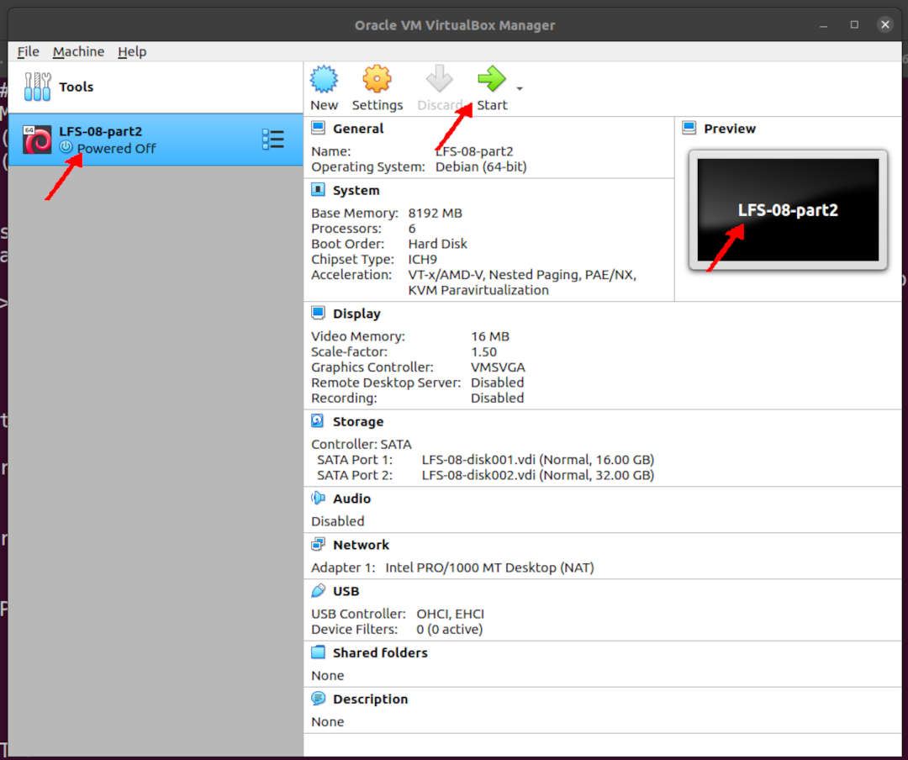

---
---

[HOME](index.md)
[ABOUT](README.md)
[WEB](https://lfs.vlsm.org/)
[GITHUB](https://github.com/OSP4DISS/lfs/)
[TOP](#)
[BOTTOM](#endofpage)
[PREV](LFS-11.md)
[NEXT](index.md)

<br>
<span style="color:red; font-weight:bold; font-size:larger;">
It is assumed that you understand how install a Debian VirtualBox Guest.
If you have never installed a VirtualBox Guest before, visit [OSP4DISS](https://osp4diss.vlsm.org/).
</span>

<br>
# LFS: Chapter 8 part 2

## Virtual Box Guest LFS-08-part2

* Import LFS-08.ova, rename to LFS-08-part2

<br>


<br>
### INPUT
```
ssh -p 6024 lfs@localhost

```

### OUTPUT
```
rms46@pamulang1:~$ ssh -p 6024 lfs@localhost
lfs@localhost's password:

===== TL;DR =====

lfs@osp:~$ 

```

<br>
### INPUT
```
echo $LFS
su -

```

<br>
# Mounting AGAIN (/dev and the File System)

### INPUT
```
echo $LFS
mount -v --bind /dev $LFS/dev
mount -v --bind /dev/pts $LFS/dev/pts
mount -vt proc proc $LFS/proc
mount -vt sysfs sysfs $LFS/sys
mount -vt tmpfs tmpfs $LFS/run
if [ -h $LFS/dev/shm ]; then
  mkdir -pv $LFS/$(readlink $LFS/dev/shm)
fi

```

### OUTPUT
```
root:~# echo $LFS
/mnt/lfs

root:~# mount -v --bind /dev $LFS/dev
mount: /dev bound on /mnt/lfs/dev.

root:~# mount -v --bind /dev/pts $LFS/dev/pts
mount: /dev/pts bound on /mnt/lfs/dev/pts.

root:~# mount -vt proc proc $LFS/proc
mount: proc mounted on /mnt/lfs/proc.

root:~# mount -vt sysfs sysfs $LFS/sys
mount: sysfs mounted on /mnt/lfs/sys.

root:~# mount -vt tmpfs tmpfs $LFS/run
mount: tmpfs mounted on /mnt/lfs/run.

root:~# if [ -h $LFS/dev/shm ]; then
>   mkdir -pv $LFS/$(readlink $LFS/dev/shm)
> fi

root:~# 

```

<br>
# Entering the Chroot Environment

### INPUT
```
df
chroot "$LFS" /usr/bin/env -i   \
    HOME=/root                  \
    TERM="$TERM"                \
    PS1='(lfs chroot) \u:\w\$ ' \
    PATH=/bin:/usr/bin:/sbin:/usr/sbin \
    MAKEFLAGS='-j6' \
    /bin/bash --login +h
df
cd /sources/

```

### OUTPUT
```
root:~# df
Filesystem     1K-blocks    Used Available Use% Mounted on
udev             4020860       0   4020860   0% /dev
tmpfs             807140    8644    798496   2% /run
/dev/sda1       16446332 2724804  12866388  18% /
tmpfs            4035684       0   4035684   0% /dev/shm
tmpfs               5120       0      5120   0% /run/lock
tmpfs            4035684       0   4035684   0% /sys/fs/cgroup
/dev/sdb1       32894736 2688836  28511900   9% /mnt/lfs
tmpfs             807136       0    807136   0% /run/user/1000
tmpfs            4035684       0   4035684   0% /mnt/lfs/run

root:~# chroot "$LFS" /usr/bin/env -i   \
>     HOME=/root                  \
>     TERM="$TERM"                \
>     PS1='(lfs chroot) \u:\w\$ ' \
>     PATH=/bin:/usr/bin:/sbin:/usr/sbin \
>     MAKEFLAGS='-j6' \
>     /bin/bash --login +h

(lfs chroot) root:/# df
Filesystem     1K-blocks    Used Available Use% Mounted on
/dev/sdb1       32894736 2688836  28511900   9% /
udev             4020860       0   4020860   0% /dev
tmpfs            4035684       0   4035684   0% /run

(lfs chroot) root:~# cd /sources/

(lfs chroot) root:/sources#

```

<br>
# Autoconf-2.69

### INPUT
```
tar xf autoconf-2.69.tar.xz
cd autoconf-2.69/
sed -i '361 s/{/\\{/' bin/autoscan.in
./configure --prefix=/usr

```

### OUTPUT
```
(lfs chroot) root:/sources# tar xf autoconf-2.69.tar.xz

(lfs chroot) root:/sources# cd autoconf-2.69/

(lfs chroot) root:/sources/autoconf-2.69# sed -i '361 s/{/\\{/' bin/autoscan.in

(lfs chroot) root:/sources/autoconf-2.69# ./configure --prefix=/usr
checking for a BSD-compatible install... /usr/bin/install -c
checking whether build environment is sane... yes
checking for a thread-safe mkdir -p... /bin/mkdir -p

===== TL;DR =====

config.status: creating lib/autotest/Makefile
config.status: creating bin/Makefile
config.status: executing tests/atconfig commands

(lfs chroot) root:/sources/autoconf-2.69# 

```

<br>
### INPUT
```
time make

```

### OUTPUT
```
(lfs chroot) root:/sources/autoconf-2.69# time make
make  all-recursive
make[1]: Entering directory '/sources/autoconf-2.69'
Making all in bin

===== TL;DR =====

real	0m1.050s
user	0m0.899s
sys	0m0.219s

(lfs chroot) root:/sources/autoconf-2.69#

```

<br>
### INPUT
```
time make check

```

### OUTPUT
```
(lfs chroot) root:/sources/autoconf-2.69# time make check
if test -d ./.git; then			\
  cd . &&						\
  git submodule --quiet foreach test '$(git rev-parse $sha1)'	\

===== TL;DR =====

/bin/sh ./testsuite 
## ----------------------------- ##
## GNU Autoconf 2.69 test suite. ##
## ----------------------------- ##

===== TL;DR =====

## ------------- ##
## Test results. ##
## ------------- ##

ERROR: 450 tests were run,
137 failed (4 expected failures).
53 tests were skipped.
## -------------------------- ##
## testsuite.log was created. ##
## -------------------------- ##

Please send `tests/testsuite.log' and all information you think might help:

   To: <bug-autoconf@gnu.org>
   Subject: [GNU Autoconf 2.69] testsuite: 77 232 233 270 272 273 274 276 277 281 282 287 288 289 290 291 292 293 294 295 296 297 298 299 300 301 302 303 348 349 353 354 355 356 357 358 362 363 364 365 366 367 368 369 370 371 372 374 380 381 382 383 384 385 386 387 388 389 390 391 404 405 406 407 418 419 420 421 422 423 424 425 426 427 431 432 433 434 435 436 437 438 443 444 445 446 447 448 449 450 451 452 453 454 455 456 457 458 459 460 461 462 463 471 472 473 474 475 476 477 478 479 480 481 482 483 484 485 486 487 488 489 490 491 492 493 494 495 496 497 498 499 501 failed

===== TL;DR =====

real	9m9.766s
user	6m25.861s
sys	1m52.105s

(lfs chroot) root:/sources/autoconf-2.69# 

```

<br>
### INPUT
```
time make install

```

### OUTPUT
```
(lfs chroot) root:/sources/autoconf-2.69# time make install
make  install-recursive
make[1]: Entering directory '/sources/autoconf-2.69'
Making install in bin

===== TL;DR =====

real	0m0.584s
user	0m0.342s
sys	0m0.238s

(lfs chroot) root:/sources/autoconf-2.69# 

```

<br>
### INPUT
```
cd ../
rm -rf autoconf-2.69/

```

### OUTPUT
```
(lfs chroot) root:/sources/autoconf-2.69# cd ../

(lfs chroot) root:/sources# rm -rf autoconf-2.69/

(lfs chroot) root:/sources# 

```

<br>
# Automake-1.16.2

### INPUT
```
tar xf automake-1.16.2.tar.xz
cd automake-1.16.2/
sed -i "s/''/etags/" t/tags-lisp-space.sh
./configure --prefix=/usr --docdir=/usr/share/doc/automake-1.16.2

```

### OUTPUT
```
(lfs chroot) root:/sources# tar xf automake-1.16.2.tar.xz

(lfs chroot) root:/sources# cd automake-1.16.2/

(lfs chroot) root:/sources/automake-1.16.2# sed -i "s/''/etags/" t/tags-lisp-space.sh

(lfs chroot) root:/sources/automake-1.16.2# ./configure --prefix=/usr --docdir=/usr/share/doc/automake-1.16.2
checking whether make supports nested variables... yes
checking build system type... x86_64-pc-linux-gnu
checking host system type... x86_64-pc-linux-gnu

===== TL;DR =====

configure: creating ./config.status
config.status: creating Makefile
config.status: creating pre-inst-env

(lfs chroot) root:/sources/automake-1.16.2#

```

<br>
### INPUT
```
time make

```

### OUTPUT
```
(lfs chroot) root:/sources/automake-1.16.2# time make
  GEN      bin/automake
  GEN      bin/aclocal
  GEN      t/ax/shell-no-trail-bslash
  GEN      t/ax/cc-no-c-o
  GEN      doc/aclocal.1
  GEN      runtest
  GEN      doc/automake.1
  GEN      lib/Automake/Config.pm
  GEN      bin/aclocal-1.16
  GEN      doc/aclocal-1.16.1
  GEN      t/ax/test-defs.sh
  GEN      bin/automake-1.16
  GEN      doc/automake-1.16.1

real	0m0.347s
user	0m0.657s
sys	0m0.115s

(lfs chroot) root:/sources/automake-1.16.2# 

```

<br>
### INPUT
```
time make -j8 check

```

### OUTPUT
```
(lfs chroot) root:/sources/automake-1.16.2# time make -j8 check
make  check-TESTS check-local
make[1]: Entering directory '/sources/automake-1.16.2'
make[2]: Entering directory '/sources/automake-1.16.2'
XFAIL: t/pm/Cond2.pl

===== TL;DR =====

============================================================================
Testsuite summary for GNU Automake 1.16.2
============================================================================
# TOTAL: 2915
# PASS:  2718
# SKIP:  158
# XFAIL: 39
# FAIL:  0
# XPASS: 0
# ERROR: 0
============================================================================
make[2]: Leaving directory '/sources/automake-1.16.2'
make[1]: Leaving directory '/sources/automake-1.16.2'

real	9m40.859s
user	28m35.857s
sys	5m33.765s

(lfs chroot) root:/sources/automake-1.16.2# 

```

<br>
### INPUT
```
time make install

```

### OUTPUT
```
(lfs chroot) root:/sources/automake-1.16.2# time make install
make[1]: Entering directory '/sources/automake-1.16.2'
 /bin/mkdir -p '/usr/bin'
 /bin/mkdir -p '/usr/share/automake-1.16/am'

===== TL;DR =====

 chmod +x '/usr/share/automake-1.16/tap-driver.sh'
make[2]: Leaving directory '/sources/automake-1.16.2'
make[1]: Leaving directory '/sources/automake-1.16.2'

real	0m0.167s
user	0m0.222s
sys	0m0.074s

(lfs chroot) root:/sources/automake-1.16.2#

```

<br>
### INPUT
```
cd ../
rm -rf automake-1.16.2/

```

### OUTPUT
```
(lfs chroot) root:/sources/automake-1.16.2# cd ../

(lfs chroot) root:/sources# rm -rf automake-1.16.2/

(lfs chroot) root:/sources# 

```

<br>
# Kmod-27

### INPUT
```
tar xf kmod-27.tar.xz
cd kmod-27/
./configure --prefix=/usr          \
            --bindir=/bin          \
            --sysconfdir=/etc      \
            --with-rootlibdir=/lib \
            --with-xz              \
            --with-zlib

```

### OUTPUT
```
(lfs chroot) root:/sources# tar xf kmod-27.tar.xz

(lfs chroot) root:/sources# cd kmod-27/

(lfs chroot) root:/sources/kmod-27# ./configure --prefix=/usr          \
>             --bindir=/bin          \
>             --sysconfdir=/etc      \
>             --with-rootlibdir=/lib \

===== TL;DR =====

	kmod 27
	=======

	prefix:			/usr
	sysconfdir:		/etc
	libdir:			${exec_prefix}/lib
	rootlibdir:		/lib
	includedir:		${prefix}/include
	bindir:			/bin
	Bash completions dir:   ${datarootdir}/bash-completion/completions

	compiler:		gcc
	cflags:			 -pipe -DANOTHER_BRICK_IN_THE -Wall -W -Wextra -Wno-inline -Wvla -Wundef -Wformat=2 -Wlogical-op -Wsign-compare -Wmissing-include-dirs -Wold-style-definition -Wpointer-arith -Winit-self -Wdeclaration-after-statement -Wfloat-equal -Wmissing-prototypes -Wstrict-prototypes -Wredundant-decls -Wmissing-declarations -Wmissing-noreturn -Wshadow -Wendif-labels -Wstrict-aliasing=3 -Wwrite-strings -Wno-long-long -Wno-overlength-strings -Wno-unused-parameter -Wno-missing-field-initializers -Wno-unused-result -Wnested-externs -Wchar-subscripts -Wtype-limits -Wuninitialized -fno-common -fdiagnostics-show-option -fvisibility=hidden -ffunction-sections -fdata-sections -g -O2
	ldflags:		 -Wl,--as-needed -Wl,--no-undefined -Wl,--gc-sections 

	experimental features:  no
	tools:			yes
	python bindings:	no
	logging:		yes
	compression:		xz=yes  zlib=yes
	debug:			no
	coverage:		no
	doc:			
	man:			yes
	test-modules:           yes

	features:               +XZ +ZLIB -LIBCRYPTO -EXPERIMENTAL

(lfs chroot) root:/sources/kmod-27# 

```

<br>
### INPUT
```
time make

```

### OUTPUT
```
(lfs chroot) root:/sources/kmod-27# time make
make --no-print-directory all-recursive
Making all in .
  GEN      libkmod/libkmod.pc

===== TL;DR =====

real	0m1.472s
user	0m5.102s
sys	0m0.529s

(lfs chroot) root:/sources/kmod-27# 

```

<br>
### INPUT
```
time make install

```

### OUTPUT
```
(lfs chroot) root:/sources/kmod-27# time make install
Making install in .
 /bin/mkdir -p '/usr/share/bash-completion/completions'
 /bin/mkdir -p '/usr/include'

===== TL;DR =====

----------------------------------------------------------------------
Libraries have been installed in:
   /usr/lib

If you ever happen to want to link against installed libraries
in a given directory, LIBDIR, you must either use libtool, and
specify the full pathname of the library, or use the '-LLIBDIR'
flag during linking and do at least one of the following:
   - add LIBDIR to the 'LD_LIBRARY_PATH' environment variable
     during execution
   - add LIBDIR to the 'LD_RUN_PATH' environment variable
     during linking
   - use the '-Wl,-rpath -Wl,LIBDIR' linker flag
   - have your system administrator add LIBDIR to '/etc/ld.so.conf'

See any operating system documentation about shared libraries for
more information, such as the ld(1) and ld.so(8) manual pages.
----------------------------------------------------------------------

===== TL;DR =====

real	0m0.431s
user	0m0.244s
sys	0m0.072s

(lfs chroot) root:/sources/kmod-27#

```

<br>
### INPUT
```
for target in depmod insmod lsmod modinfo modprobe rmmod; do
  ln -sfv ../bin/kmod /sbin/$target
done
ln -sfv kmod /bin/lsmod

```

### OUTPUT
```
(lfs chroot) root:/sources/kmod-27# for target in depmod insmod lsmod modinfo modprobe rmmod; do
>   ln -sfv ../bin/kmod /sbin/$target
> done
'/sbin/depmod' -> '../bin/kmod'
'/sbin/insmod' -> '../bin/kmod'
'/sbin/lsmod' -> '../bin/kmod'
'/sbin/modinfo' -> '../bin/kmod'
'/sbin/modprobe' -> '../bin/kmod'
'/sbin/rmmod' -> '../bin/kmod'
(lfs chroot) root:/sources/kmod-27# ln -sfv kmod /bin/lsmod
'/bin/lsmod' -> 'kmod'

(lfs chroot) root:/sources/kmod-27# 

```

<br>
### INPUT
```
cd ../
rm -rf kmod-27/

```

### OUTPUT
```
(lfs chroot) root:/sources/kmod-27# cd ../

(lfs chroot) root:/sources# rm -rf kmod-27/

(lfs chroot) root:/sources# 

```

<br>
# Libelf from Elfutils-0.180

### INPUT
```
tar xf elfutils-0.180.tar.bz2
cd elfutils-0.180/
./configure --prefix=/usr --disable-debuginfod --libdir=/lib

```

### OUTPUT
```
(lfs chroot) root:/sources# tar xf elfutils-0.180.tar.bz2

(lfs chroot) root:/sources# cd elfutils-0.180/

(lfs chroot) root:/sources/elfutils-0.180# ./configure --prefix=/usr --disable-debuginfod --libdir=/lib
configure: No --program-prefix given, using "eu-"
checking for a BSD-compatible install... /usr/bin/install -c
checking whether build environment is sane... yes

===== TL;DR =====

configure:
=====================================================================
        elfutils: 0.180 (eu_version: 180)
=====================================================================

    Prefix                             : /usr
    Program prefix ("eu-" recommended) : eu-
    Source code location               : .
    Maintainer mode                    : 
    build arch                         : x86_64-pc-linux-gnu

  RECOMMENDED FEATURES (should all be yes)
    gzip support                       : yes
    bzip2 support                      : yes
    lzma/xz support                    : yes
    libstdc++ demangle support         : yes
    File textrel check                 : yes
    Symbol versioning                  : yes

  NOT RECOMMENDED FEATURES (should all be no)
    Experimental thread safety         : no
    install elf.h                      : no

  OTHER FEATURES
    Deterministic archives by default  : false
    Native language support            : yes
    Extra Valgrind annotations         : no
    Debuginfod client/server support   : no

  EXTRA TEST FEATURES (used with make check)
    have bunzip2 installed (required)  : yes
    debug branch prediction            : no
    gprof support                      : no
    gcov support                       : no
    run all tests under valgrind       : no
    gcc undefined behaviour sanitizer  : no
    use rpath in tests                 : no
    test biarch                        : no

(lfs chroot) root:/sources/elfutils-0.180# 

```

<br>
### INPUT
```
time make

```

### OUTPUT
```
(lfs chroot) root:/sources/elfutils-0.180# time make
make --no-print-directory all-recursive
Making all in config
make[2]: Nothing to be done for 'all'.

===== TL;DR =====

real	0m18.214s
user	1m11.700s
sys	0m11.617s

(lfs chroot) root:/sources/elfutils-0.180#

```

<br>
### INPUT
```
time make check

```

### OUTPUT
```
(lfs chroot) root:/sources/elfutils-0.180# time make check
Making check in config
make[1]: Nothing to be done for 'check'.
Making check in m4

===== TL;DR =====

============================================================================
Testsuite summary for elfutils 0.180
============================================================================
# TOTAL: 218
# PASS:  214
# SKIP:  4
# XFAIL: 0
# FAIL:  0
# XPASS: 0
# ERROR: 0
============================================================================

real	0m26.269s
user	0m26.929s
sys	0m9.549s

```

<br>
### INPUT
```
make -C libelf install
install -vm644 config/libelf.pc /usr/lib/pkgconfig
rm /lib/libelf.a

```

### OUTPUT
```
(lfs chroot) root:/sources/elfutils-0.180# make -C libelf install
make: Entering directory '/sources/elfutils-0.180/libelf'
make[1]: Entering directory '/sources/elfutils-0.180/libelf'
 /bin/mkdir -p '/lib'
 /bin/mkdir -p '/usr/include'
 /bin/mkdir -p '/usr/include/elfutils'
 /usr/bin/install -c -m 644  libelf.a '/lib'
 /usr/bin/install -c -m 644 elf-knowledge.h '/usr/include/elfutils'
 /usr/bin/install -c -m 644 libelf.h gelf.h nlist.h '/usr/include'
 ( cd '/lib' && ranlib libelf.a )
make[1]: Leaving directory '/sources/elfutils-0.180/libelf'
/bin/sh /sources/elfutils-0.180/config/install-sh -d /lib
/usr/bin/install -c libelf.so /lib/libelf-0.180.so
ln -fs libelf-0.180.so /lib/libelf.so.1
ln -fs libelf.so.1 /lib/libelf.so
make: Leaving directory '/sources/elfutils-0.180/libelf'

(lfs chroot) root:/sources/elfutils-0.180# install -vm644 config/libelf.pc /usr/lib/pkgconfig
'config/libelf.pc' -> '/usr/lib/pkgconfig/libelf.pc'

(lfs chroot) root:/sources/elfutils-0.180# rm /lib/libelf.a

(lfs chroot) root:/sources/elfutils-0.180# 

```

<br>
### INPUT
```
cd ../
rm -rf elfutils-0.180/

```

### OUTPUT
```
(lfs chroot) root:/sources/elfutils-0.180# cd ../

(lfs chroot) root:/sources# rm -rf elfutils-0.180/

(lfs chroot) root:/sources# 

```

<br>
# Libffi-3.3

### INPUT
```
tar xf libffi-3.3.tar.gz
cd libffi-3.3/
./configure --prefix=/usr --disable-static --with-gcc-arch=native

```

### OUTPUT
```
(lfs chroot) root:/sources# tar xf libffi-3.3.tar.gz

(lfs chroot) root:/sources# cd libffi-3.3/

(lfs chroot) root:/sources/libffi-3.3# ./configure --prefix=/usr --disable-static --with-gcc-arch=native
checking build system type... x86_64-pc-linux-gnu
checking host system type... x86_64-pc-linux-gnu
checking target system type... x86_64-pc-linux-gnu

===== TL;DR =====

config.status: executing libtool commands
config.status: executing include commands
config.status: executing src commands

(lfs chroot) root:/sources/libffi-3.3# 

```

<br>
### INPUT
```
time make

```

### OUTPUT
```
(lfs chroot) root:/sources/libffi-3.3# time make
MAKE x86_64-pc-linux-gnu : 0 * all-all
make[1]: Entering directory '/sources/libffi-3.3/x86_64-pc-linux-gnu'
make  all-recursive
make[2]: Entering directory '/sources/libffi-3.3/x86_64-pc-linux-gnu'

===== TL;DR =====

make[3]: Leaving directory '/sources/libffi-3.3/x86_64-pc-linux-gnu'
make[2]: Leaving directory '/sources/libffi-3.3/x86_64-pc-linux-gnu'
make[1]: Leaving directory '/sources/libffi-3.3/x86_64-pc-linux-gnu'

real	0m0.649s
user	0m1.306s
sys	0m0.164s

(lfs chroot) root:/sources/libffi-3.3# 

```

<br>
### INPUT
```
time make check

```

### OUTPUT
```
(lfs chroot) root:/sources/libffi-3.3# time make check
MAKE x86_64-pc-linux-gnu : 0 * check
make[1]: Entering directory '/sources/libffi-3.3/x86_64-pc-linux-gnu'
Making check in include

===== TL;DR =====

		=== libffi tests ===

===== TL;DR =====

		=== libffi Summary ===

# of expected passes		2284

===== TL;DR =====

make[2]: Entering directory '/sources/libffi-3.3/x86_64-pc-linux-gnu'
make[2]: Leaving directory '/sources/libffi-3.3/x86_64-pc-linux-gnu'
make[1]: Leaving directory '/sources/libffi-3.3/x86_64-pc-linux-gnu'

real	3m26.182s
user	3m7.521s
sys	0m16.970s

(lfs chroot) root:/sources/libffi-3.3# 

```

<br>
### INPUT
```
time make install

```

### OUTPUT
```
(lfs chroot) root:/sources/libffi-3.3# time make install
MAKE x86_64-pc-linux-gnu : 0 * install
make[1]: Entering directory '/sources/libffi-3.3/x86_64-pc-linux-gnu'
Making install in include

===== TL;DR =====

----------------------------------------------------------------------
Libraries have been installed in:
   /usr/lib/../lib

If you ever happen to want to link against installed libraries
in a given directory, LIBDIR, you must either use libtool, and
specify the full pathname of the library, or use the '-LLIBDIR'
flag during linking and do at least one of the following:
   - add LIBDIR to the 'LD_LIBRARY_PATH' environment variable
     during execution
   - add LIBDIR to the 'LD_RUN_PATH' environment variable
     during linking
   - use the '-Wl,-rpath -Wl,LIBDIR' linker flag
   - have your system administrator add LIBDIR to '/etc/ld.so.conf'

See any operating system documentation about shared libraries for
more information, such as the ld(1) and ld.so(8) manual pages.
----------------------------------------------------------------------

===== TL;DR =====

real	0m0.331s
user	0m0.248s
sys	0m0.081s

(lfs chroot) root:/sources/libffi-3.3# 

```

<br>
### INPUT
```
cd ../
rm -rf libffi-3.3/

```

### OUTPUT
```
(lfs chroot) root:/sources/libffi-3.3# cd ../

(lfs chroot) root:/sources# rm -rf libffi-3.3/

(lfs chroot) root:/sources# 

```

<br>
# OpenSSL-1.1.1g

### INPUT
```
tar xf openssl-1.1.1g.tar.gz
cd openssl-1.1.1g/
./config --prefix=/usr         \
         --openssldir=/etc/ssl \
         --libdir=lib          \
         shared                \
         zlib-dynamic

```

### OUTPUT
```
(lfs chroot) root:/sources/openssl-1.1.1g# tar xf openssl-1.1.1g.tar.gz
tar: openssl-1.1.1g.tar.gz: Cannot open: No such file or directory
tar: Error is not recoverable: exiting now
(lfs chroot) root:/sources/openssl-1.1.1g# cd openssl-1.1.1g/
bash: cd: openssl-1.1.1g/: No such file or directory

(lfs chroot) root:/sources/openssl-1.1.1g# ./config --prefix=/usr         \
>          --openssldir=/etc/ssl \
>          --libdir=lib          \
>          shared                \
>          zlib-dynamic

===== TL;DR =====

**********************************************************************
***                                                                ***
***   OpenSSL has been successfully configured                     ***
***                                                                ***
***   If you encounter a problem while building, please open an    ***
***   issue on GitHub <https://github.com/openssl/openssl/issues>  ***
***   and include the output from the following command:           ***
***                                                                ***
***       perl configdata.pm --dump                                ***
***                                                                ***
***   (If you are new to OpenSSL, you might want to consult the    ***
***   'Troubleshooting' section in the INSTALL file first)         ***
***                                                                ***
**********************************************************************

===== TL;DR =====

(lfs chroot) root:/sources/openssl-1.1.1g# 

```

<br>
### INPUT
```
time make

```

### OUTPUT
```
(lfs chroot) root:/sources/openssl-1.1.1g# time make
/usr/bin/perl "-I." -Mconfigdata "util/dofile.pl" \
    "-oMakefile" include/crypto/bn_conf.h.in > include/crypto/bn_conf.h
/usr/bin/perl "-I." -Mconfigdata "util/dofile.pl" \
    "-oMakefile" include/crypto/dso_conf.h.in > include/crypto/dso_conf.h

===== TL;DR =====

real	0m25.300s
user	2m8.937s
sys	0m15.934s

(lfs chroot) root:/sources/openssl-1.1.1g# 

```

<br>
### INPUT
```
time make test

```

### OUTPUT
```
(lfs chroot) root:/sources/openssl-1.1.1g# time make test
make depend && make _tests
make[1]: Entering directory '/sources/openssl-1.1.1g'
make[1]: Leaving directory '/sources/openssl-1.1.1g'

===== TL;DR =====

All tests successful.
Files=155, Tests=1468, 97 wallclock secs ( 1.35 usr  0.31 sys + 86.44 cusr 20.35 csys = 108.45 CPU)
Result: PASS
make[1]: Leaving directory '/sources/openssl-1.1.1g'

real	1m36.605s
user	1m28.040s
sys	0m20.681s

(lfs chroot) root:/sources/openssl-1.1.1g# 

```

<br>
### INPUT
```
sed -i '/INSTALL_LIBS/s/libcrypto.a libssl.a//' Makefile
time make MANSUFFIX=ssl install

```

### OUTPUT
```
(lfs chroot) root:/sources/openssl-1.1.1g# sed -i '/INSTALL_LIBS/s/libcrypto.a libssl.a//' Makefile

(lfs chroot) root:/sources/openssl-1.1.1g# time make MANSUFFIX=ssl install
make depend && make _build_libs
make depend && make _build_engines
make depend && make _build_programs

===== TL;DR =====

real	0m26.951s
user	0m47.106s
sys	0m5.351s

(lfs chroot) root:/sources/openssl-1.1.1g# 

```

<br>
### INPUT
```
mv -v /usr/share/doc/openssl /usr/share/doc/openssl-1.1.1g
cp -vfr doc/* /usr/share/doc/openssl-1.1.1g

```

### OUTPUT
```
(lfs chroot) root:/sources/openssl-1.1.1g# mv -v /usr/share/doc/openssl /usr/share/doc/openssl-1.1.1g
renamed '/usr/share/doc/openssl' -> '/usr/share/doc/openssl-1.1.1g'

(lfs chroot) root:/sources/openssl-1.1.1g# cp -vfr doc/* /usr/share/doc/openssl-1.1.1g
'doc/HOWTO' -> '/usr/share/doc/openssl-1.1.1g/HOWTO'
'doc/HOWTO/certificates.txt' -> '/usr/share/doc/openssl-1.1.1g/HOWTO/certificates.txt'
'doc/HOWTO/keys.txt' -> '/usr/share/doc/openssl-1.1.1g/HOWTO/keys.txt'

===== TL;DR =====

'doc/man7/ssl.pod' -> '/usr/share/doc/openssl-1.1.1g/man7/ssl.pod'
'doc/man7/x509.pod' -> '/usr/share/doc/openssl-1.1.1g/man7/x509.pod'
'doc/openssl-c-indent.el' -> '/usr/share/doc/openssl-1.1.1g/openssl-c-indent.el'

(lfs chroot) root:/sources/openssl-1.1.1g# 

```

<br>
### INPUT
```
cd ../
rm -rf openssl-1.1.1g/

```

### OUTPUT
```
(lfs chroot) root:/sources/openssl-1.1.1g# cd ../

(lfs chroot) root:/sources# rm -rf openssl-1.1.1g/

(lfs chroot) root:/sources# 

```

<br>
# Python-3.8.5

### INPUT
```
tar xf Python-3.8.5.tar.xz
cd Python-3.8.5/
./configure --prefix=/usr       \
            --enable-shared     \
            --with-system-expat \
            --with-system-ffi   \
            --with-ensurepip=yes

```

### OUTPUT
```
(lfs chroot) root:/sources# tar xf Python-3.8.5.tar.xz

(lfs chroot) root:/sources# cd Python-3.8.5/

(lfs chroot) root:/sources/Python-3.8.5# ./configure --prefix=/usr       \
>             --enable-shared     \
>             --with-system-expat \
>             --with-system-ffi   \
>             --with-ensurepip=yes

===== TL;DR =====

config.status: creating pyconfig.h
creating Modules/Setup.local
creating Makefile


If you want a release build with all stable optimizations active (PGO, etc),
please run ./configure --enable-optimizations

(lfs chroot) root:/sources/Python-3.8.5# 

```

<br>
### INPUT
```
time make

```

### OUTPUT
```
(lfs chroot) root:/sources/Python-3.8.5# time make
gcc -pthread -c -Wno-unused-result -Wsign-compare -DNDEBUG -g -fwrapv -O3 -Wall    -std=c99 -Wextra -Wno-unused-result -Wno-unused-parameter -Wno-missing-field-initializers -Werror=implicit-function-declaration  -I./Include/internal  -I. -I./Include   -fPIC -DPy_BUILD_CORE -o Programs/python.o ./Programs/python.c
gcc -pthread -c -Wno-unused-result -Wsign-compare -DNDEBUG -g -fwrapv -O3 -Wall    -std=c99 -Wextra -Wno-unused-result -Wno-unused-parameter -Wno-missing-field-initializers -Werror=implicit-function-declaration  -I./Include/internal  -I. -I./Include   -fPIC -DPy_BUILD_CORE -o Parser/acceler.o Parser/acceler.c

===== TL;DR =====

real	0m28.704s
user	2m4.278s
sys	0m7.002s

(lfs chroot) root:/sources/Python-3.8.5# 

```

<br>
### INPUT
```
time make install

```

### OUTPUT
```
(lfs chroot) root:/sources/Python-3.8.5# time make install
if test "no-framework" = "no-framework" ; then \
	/usr/bin/install -c python /usr/bin/python3.8; \
else \
	/usr/bin/install -c -s Mac/pythonw /usr/bin/python3.8; \
fi

===== TL;DR =====

real	0m16.532s
user	0m21.582s
sys	0m4.845s

(lfs chroot) root:/sources/Python-3.8.5# 

```

<br>
### INPUT
```
chmod -v 755 /usr/lib/libpython3.8.so
chmod -v 755 /usr/lib/libpython3.so
ln -sfv pip3.8 /usr/bin/pip3

```

### OUTPUT
```
(lfs chroot) root:/sources/Python-3.8.5# chmod -v 755 /usr/lib/libpython3.8.so
mode of '/usr/lib/libpython3.8.so' retained as 0755 (rwxr-xr-x)

(lfs chroot) root:/sources/Python-3.8.5# chmod -v 755 /usr/lib/libpython3.so
mode of '/usr/lib/libpython3.so' retained as 0755 (rwxr-xr-x)

(lfs chroot) root:/sources/Python-3.8.5# ln -sfv pip3.8 /usr/bin/pip3
'/usr/bin/pip3' -> 'pip3.8'

(lfs chroot) root:/sources/Python-3.8.5# 

```

<br>
### INPUT
```
install -v -dm755 /usr/share/doc/python-3.8.5/html 

tar --strip-components=1  \
    --no-same-owner       \
    --no-same-permissions \
    -C /usr/share/doc/python-3.8.5/html \
    -xvf ../python-3.8.5-docs-html.tar.bz2

cd ../
rm -rf Python-3.8.5/

```

### OUTPUT
```
(lfs chroot) root:/sources/Python-3.8.5# install -v -dm755 /usr/share/doc/python-3.8.5/html 
install: creating directory '/usr/share/doc/python-3.8.5'
install: creating directory '/usr/share/doc/python-3.8.5/html'

(lfs chroot) root:/sources/Python-3.8.5# tar --strip-components=1  \
>     --no-same-owner       \
>     --no-same-permissions \
>     -C /usr/share/doc/python-3.8.5/html \

===== TL;DR =====

python-3.8.5-docs-html/faq/library.html
python-3.8.5-docs-html/faq/design.html
python-3.8.5-docs-html/genindex.html

(lfs chroot) root:/sources/Python-3.8.5# cd ../

(lfs chroot) root:/sources# rm -rf Python-3.8.5/

(lfs chroot) root:/sources# 

```

<br>
# Ninja-1.10.0

### INPUT
```
tar xf ninja-1.10.0.tar.gz
cd ninja-1.10.0/
export NINJAJOBS=4
sed -i '/int Guess/a \
  int   j = 0;\
  char* jobs = getenv( "NINJAJOBS" );\
  if ( jobs != NULL ) j = atoi( jobs );\
  if ( j > 0 ) return j;\
' src/ninja.cc

```

### OUTPUT
```
(lfs chroot) root:/sources# tar xf ninja-1.10.0.tar.gz

(lfs chroot) root:/sources# cd ninja-1.10.0/

(lfs chroot) root:/sources/ninja-1.10.0# export NINJAJOBS=4

(lfs chroot) root:/sources/ninja-1.10.0# sed -i '/int Guess/a \
>   int   j = 0;\
>   char* jobs = getenv( "NINJAJOBS" );\
>   if ( jobs != NULL ) j = atoi( jobs );\
>   if ( j > 0 ) return j;\
> ' src/ninja.cc

(lfs chroot) root:/sources/ninja-1.10.0# 

```

<br>
### INPUT
```
python3 configure.py --bootstrap

```

### OUTPUT
```
(lfs chroot) root:/sources/ninja-1.10.0# python3 configure.py --bootstrap
bootstrapping ninja...
warning: A compatible version of re2c (>= 0.11.3) was not found; changes to src/*.in.cc will not affect your build.
wrote build.ninja.
bootstrap complete.  rebuilding...
[29/29] LINK ninja

(lfs chroot) root:/sources/ninja-1.10.0# 

```

<br>
### INPUT
```
./ninja ninja_test
./ninja_test --gtest_filter=-SubprocessTest.SetWithLots

```

### OUTPUT
```
(lfs chroot) root:/sources/ninja-1.10.0# ./ninja ninja_test
[19/19] LINK ninja_test

(lfs chroot) root:/sources/ninja-1.10.0# ./ninja_test --gtest_filter=-SubprocessTest.SetWithLots
[341/341] ElideMiddle.ElideInTheMiddle
passed

(lfs chroot) root:/sources/ninja-1.10.0# 

```

<br>
### INPUT
```
install -vm755 ninja /usr/bin/
install -vDm644 misc/bash-completion /usr/share/bash-completion/completions/ninja
install -vDm644 misc/zsh-completion  /usr/share/zsh/site-functions/_ninja
cd ../
rm -rf ninja-1.10.0/

```

### OUTPUT
```
(lfs chroot) root:/sources/ninja-1.10.0# install -vm755 ninja /usr/bin/
'ninja' -> '/usr/bin/ninja'

(lfs chroot) root:/sources/ninja-1.10.0# install -vDm644 misc/bash-completion /usr/share/bash-completion/completions/ninja
'misc/bash-completion' -> '/usr/share/bash-completion/completions/ninja'

(lfs chroot) root:/sources/ninja-1.10.0# install -vDm644 misc/zsh-completion  /usr/share/zsh/site-functions/_ninja
install: creating directory '/usr/share/zsh'
install: creating directory '/usr/share/zsh/site-functions'
'misc/zsh-completion' -> '/usr/share/zsh/site-functions/_ninja'

(lfs chroot) root:/sources/ninja-1.10.0# cd ../

(lfs chroot) root:/sources# rm -rf ninja-1.10.0/

(lfs chroot) root:/sources# 

```

<br>
# Meson-0.55.0

### INPUT
```
tar xf meson-0.55.0.tar.gz
cd meson-0.55.0/

```

### OUTPUT
```
(lfs chroot) root:/sources# tar xf meson-0.55.0.tar.gz

(lfs chroot) root:/sources# cd meson-0.55.0/

(lfs chroot) root:/sources/meson-0.55.0# 

```

<br>
### INPUT
```
python3 setup.py build

```

### OUTPUT
```
(lfs chroot) root:/sources/meson-0.55.0# python3 setup.py build
running build
running build_py
creating build
creating build/lib

===== TL;DR =====

copying mesonbuild/dependencies/data/CMakeLists.txt -> build/lib/mesonbuild/dependencies/data
copying mesonbuild/dependencies/data/CMakeListsLLVM.txt -> build/lib/mesonbuild/dependencies/data
copying mesonbuild/dependencies/data/CMakePathInfo.txt -> build/lib/mesonbuild/dependencies/data

(lfs chroot) root:/sources/meson-0.55.0# 

```

<br>
### INPUT
```
python3 setup.py install --root=dest
cp -rv dest/* /

cd ../
rm -rf meson-0.55.0/

```

### OUTPUT
```
(lfs chroot) root:/sources/meson-0.55.0# python3 setup.py install --root=dest
running install
running build
running build_py

===== TL;DR =====

'dest/usr/share/polkit-1/actions' -> '/usr/share/polkit-1/actions'
'dest/usr/share/polkit-1/actions/com.mesonbuild.install.policy' -> '/usr/share/polkit-1/actions/com.mesonbuild.install.policy'
'dest/usr/bin/meson' -> '/usr/bin/meson'

(lfs chroot) root:/sources/meson-0.55.0# cd ../

(lfs chroot) root:/sources# rm -rf meson-0.55.0/

(lfs chroot) root:/sources# 

```

<br>
# Coreutils-8.32

### INPUT
```
tar xf coreutils-8.32.tar.xz
cd coreutils-8.32/
patch -Np1 -i ../coreutils-8.32-i18n-1.patch

```

### OUTPUT
```
(lfs chroot) root:/sources# tar xf coreutils-8.32.tar.xz

(lfs chroot) root:/sources# cd coreutils-8.32/

(lfs chroot) root:/sources/coreutils-8.32# patch -Np1 -i ../coreutils-8.32-i18n-1.patch
patching file bootstrap.conf
patching file configure.ac
patching file lib/linebuffer.h

===== TL;DR =====

patching file tests/misc/uniq.pl
patching file tests/pr/pr-tests.pl
patching file tests/unexpand/mb.sh

(lfs chroot) root:/sources/coreutils-8.32# 

```

<br>
### INPUT
```
sed -i '/test.lock/s/^/#/' gnulib-tests/gnulib.mk
autoreconf -fiv
FORCE_UNSAFE_CONFIGURE=1 ./configure \
            --prefix=/usr            \
            --enable-no-install-program=kill,uptime

```

### OUTPUT
```
(lfs chroot) root:/sources/coreutils-8.32# sed -i '/test.lock/s/^/#/' gnulib-tests/gnulib.mk

(lfs chroot) root:/sources/coreutils-8.32# autoreconf -fiv
autoreconf: Entering directory `.'
autoreconf: running: autopoint --force
Copying file build-aux/config.rpath

===== TL;DR =====

gnulib-tests/gnulib.mk:1359: library has 'test_rwlock1' as canonical name (possible typo)
gnulib-tests/Makefile.am:1:   'gnulib-tests/gnulib.mk' included from here
autoreconf: Leaving directory `.'

(lfs chroot) root:/sources/coreutils-8.32# FORCE_UNSAFE_CONFIGURE=1 ./configure \
>             --prefix=/usr            \
>             --enable-no-install-program=kill,uptime
checking for a BSD-compatible install... /usr/bin/install -c

===== TL;DR =====

config.status: executing po-directories commands
config.status: creating po/POTFILES
config.status: creating po/Makefile

(lfs chroot) root:/sources/coreutils-8.32# 

```

<br>
### INPUT
```
time make

```

### OUTPUT
```
(lfs chroot) root:/sources/coreutils-8.32# time make
  GEN      lib/alloca.h
  GEN      lib/configmake.h
  GEN      lib/arpa/inet.h

===== TL;DR =====

real	0m10.365s
user	0m48.792s
sys	0m6.118s

(lfs chroot) root:/sources/coreutils-8.32# 

```

<br>
### INPUT
```
time make NON_ROOT_USERNAME=tester check-root

```

### OUTPUT
```
(lfs chroot) root:/sources/coreutils-8.32# time make NON_ROOT_USERNAME=tester check-root
make check TESTS='tests/chown/basic.sh tests/cp/cp-a-selinux.sh tests/cp/preserve-gid.sh tests/cp/special-bits.sh tests/cp/cp-mv-enotsup-xattr.sh tests/cp/capability.sh tests/cp/sparse-fiemap.sh tests/cp/cross-dev-symlink.sh tests/dd/skip-seek-past-dev.sh tests/df/problematic-chars.sh tests/df/over-mount-device.sh tests/du/bind-mount-dir-cycle.sh ...

===== TL;DR =====

============================================================================
Testsuite summary for GNU coreutils 8.32
============================================================================
# TOTAL: 32
# PASS:  19
# SKIP:  13
# XFAIL: 0
# FAIL:  0
# XPASS: 0
# ERROR: 0
============================================================================

===== TL;DR =====

real	0m1.263s
user	0m2.223s
sys	0m0.432s

(lfs chroot) root:/sources/coreutils-8.32# 

```

<br>
### INPUT
```
echo "dummy:x:102:tester" >> /etc/group
chown -Rv tester .

```

### OUTPUT
```
(lfs chroot) root:/sources/coreutils-8.32# echo "dummy:x:102:tester" >> /etc/group

(lfs chroot) root:/sources/coreutils-8.32# chown -Rv tester .
changed ownership of './bootstrap.conf' from root to tester
changed ownership of './autom4te.cache/requests' from root to tester
changed ownership of './autom4te.cache/traces.0' from root to tester

===== TL;DR =====

changed ownership of './src/tty.c' from root to tester
changed ownership of './src' from root to tester
changed ownership of '.' from root to tester

(lfs chroot) root:/sources/coreutils-8.32# 

```

<br>
### INPUT
```
su tester -c "PATH=$PATH make RUN_EXPENSIVE_TESTS=yes check"

```

### OUTPUT
```
(lfs chroot) root:/sources/coreutils-8.32# su tester -c "PATH=$PATH make RUN_EXPENSIVE_TESTS=yes check"
  GEN      public-submodule-commit
make  check-recursive
make[1]: Entering directory '/sources/coreutils-8.32'

===== TL;DR =====

============================================================================
Testsuite summary for GNU coreutils 8.32
============================================================================
# TOTAL: 625
# PASS:  493
# SKIP:  132
# XFAIL: 0
# FAIL:  0
# XPASS: 0
# ERROR: 0
============================================================================

===== TL;DR =====

============================================================================
Testsuite summary for GNU coreutils 8.32
============================================================================
# TOTAL: 345
# PASS:  327
# SKIP:  18
# XFAIL: 0
# FAIL:  0
# XPASS: 0
# ERROR: 0
============================================================================

===== TL;DR =====

make[3]: Leaving directory '/sources/coreutils-8.32/gnulib-tests'
make[2]: Leaving directory '/sources/coreutils-8.32/gnulib-tests'
make[1]: Leaving directory '/sources/coreutils-8.32'

(lfs chroot) root:/sources/coreutils-8.32# 

```

<br>
### INPUT
```
sed -i '/dummy/d' /etc/group

```

### OUTPUT
```
(lfs chroot) root:/sources/coreutils-8.32# sed -i '/dummy/d' /etc/group

(lfs chroot) root:/sources/coreutils-8.32# 

```

<br>
### INPUT
```
time make install

```

### OUTPUT
```
(lfs chroot) root:/sources/coreutils-8.32# time make install
make  install-recursive
make[1]: Entering directory '/sources/coreutils-8.32'
Making install in po
make[2]: Entering directory '/sources/coreutils-8.32/po'

===== TL;DR =====

real	0m1.935s
user	0m1.427s
sys	0m0.490s

(lfs chroot) root:/sources/coreutils-8.32# 

```

<br>
### INPUT
```
mv -v /usr/bin/{cat,chgrp,chmod,chown,cp,date,dd,df,echo} /bin
mv -v /usr/bin/{false,ln,ls,mkdir,mknod,mv,pwd,rm} /bin
mv -v /usr/bin/{rmdir,stty,sync,true,uname} /bin
mv -v /usr/bin/chroot /usr/sbin
mv -v /usr/share/man/man1/chroot.1 /usr/share/man/man8/chroot.8
sed -i 's/"1"/"8"/' /usr/share/man/man8/chroot.8
mv -v /usr/bin/{head,nice,sleep,touch} /bin
cd ../
rm -rf coreutils-8.32/

```

### OUTPUT
```
(lfs chroot) root:/sources/coreutils-8.32# mv -v /usr/bin/{cat,chgrp,chmod,chown,cp,date,dd,df,echo} /bin
renamed '/usr/bin/cat' -> '/bin/cat'
renamed '/usr/bin/chgrp' -> '/bin/chgrp'
renamed '/usr/bin/chmod' -> '/bin/chmod'
renamed '/usr/bin/chown' -> '/bin/chown'
renamed '/usr/bin/cp' -> '/bin/cp'
renamed '/usr/bin/date' -> '/bin/date'
renamed '/usr/bin/dd' -> '/bin/dd'
renamed '/usr/bin/df' -> '/bin/df'
renamed '/usr/bin/echo' -> '/bin/echo'

(lfs chroot) root:/sources/coreutils-8.32# mv -v /usr/bin/{false,ln,ls,mkdir,mknod,mv,pwd,rm} /bin
renamed '/usr/bin/false' -> '/bin/false'
renamed '/usr/bin/ln' -> '/bin/ln'
renamed '/usr/bin/ls' -> '/bin/ls'
renamed '/usr/bin/mkdir' -> '/bin/mkdir'
renamed '/usr/bin/mknod' -> '/bin/mknod'
renamed '/usr/bin/mv' -> '/bin/mv'
renamed '/usr/bin/pwd' -> '/bin/pwd'
renamed '/usr/bin/rm' -> '/bin/rm'

(lfs chroot) root:/sources/coreutils-8.32# mv -v /usr/bin/{rmdir,stty,sync,true,uname} /bin
renamed '/usr/bin/rmdir' -> '/bin/rmdir'
renamed '/usr/bin/stty' -> '/bin/stty'
renamed '/usr/bin/sync' -> '/bin/sync'
renamed '/usr/bin/true' -> '/bin/true'
renamed '/usr/bin/uname' -> '/bin/uname'

(lfs chroot) root:/sources/coreutils-8.32# mv -v /usr/bin/chroot /usr/sbin
renamed '/usr/bin/chroot' -> '/usr/sbin/chroot'

(lfs chroot) root:/sources/coreutils-8.32# mv -v /usr/share/man/man1/chroot.1 /usr/share/man/man8/chroot.8
renamed '/usr/share/man/man1/chroot.1' -> '/usr/share/man/man8/chroot.8'

(lfs chroot) root:/sources/coreutils-8.32# sed -i 's/"1"/"8"/' /usr/share/man/man8/chroot.8

(lfs chroot) root:/sources/coreutils-8.32# mv -v /usr/bin/{head,nice,sleep,touch} /bin
renamed '/usr/bin/head' -> '/bin/head'
renamed '/usr/bin/nice' -> '/bin/nice'
renamed '/usr/bin/sleep' -> '/bin/sleep'
renamed '/usr/bin/touch' -> '/bin/touch'

(lfs chroot) root:/sources/coreutils-8.32# cd ../

(lfs chroot) root:/sources# rm -rf coreutils-8.32/

(lfs chroot) root:/sources# 

```

<br>
# Check-0.15.2

### INPUT
```
tar xf check-0.15.2.tar.gz
cd check-0.15.2/
./configure --prefix=/usr --disable-static

```

### OUTPUT
```
(lfs chroot) root:/sources# tar xf check-0.15.2.tar.gz

(lfs chroot) root:/sources# cd check-0.15.2/

(lfs chroot) root:/sources/check-0.15.2# ./configure --prefix=/usr --disable-static
checking for a BSD-compatible install... /usr/bin/install -c
checking whether build environment is sane... yes
checking for a thread-safe mkdir -p... /bin/mkdir -p

===== TL;DR =====

==========================================
Summary of Check 0.15.2 options:

fork mode ............................ yes
high resolution timer replacement .... no
snprintf replacement ................. no
subunit support....................... no
timeout unit tests ................... yes
POSIX regular expressions ............ yes
build docs ........................... yes
==========================================

(lfs chroot) root:/sources/check-0.15.2# 

```

<br>
### INPUT
```
time make


```

### OUTPUT
```
(lfs chroot) root:/sources/check-0.15.2# time make
make  all-recursive
make[1]: Entering directory '/sources/check-0.15.2'
Making all in lib

===== TL;DR =====

real	0m2.114s
user	0m7.714s
sys	0m0.824s

(lfs chroot) root:/sources/check-0.15.2# 

```


<br>
### INPUT
```
time make check

```

### OUTPUT
```
(lfs chroot) root:/sources/check-0.15.2# time make check
Making check in lib
make[1]: Entering directory '/sources/check-0.15.2/lib'
make[1]: Nothing to be done for 'check'.

===== TL;DR =====

============================================================================
Testsuite summary for Check 0.15.2
============================================================================
# TOTAL: 1
# PASS:  1
# SKIP:  0
# XFAIL: 0
# FAIL:  0
# XPASS: 0
# ERROR: 0
============================================================================

===== TL;DR =====

============================================================================
Testsuite summary for Check 0.15.2
============================================================================
# TOTAL: 9
# PASS:  9
# SKIP:  0
# XFAIL: 0
# FAIL:  0
# XPASS: 0
# ERROR: 0
============================================================================

===== TL;DR =====

real	2m56.601s
user	0m2.217s
sys	0m0.835s

(lfs chroot) root:/sources/check-0.15.2# 

```

<br>
### INPUT
```
time make docdir=/usr/share/doc/check-0.15.2 install

```

### OUTPUT
```
(lfs chroot) root:/sources/check-0.15.2# time make docdir=/usr/share/doc/check-0.15.2 install
Making install in lib
make[1]: Entering directory '/sources/check-0.15.2/lib'
make[2]: Entering directory '/sources/check-0.15.2/lib'
make[2]: Nothing to be done for 'install-exec-am'.

===== TL;DR =====

----------------------------------------------------------------------
Libraries have been installed in:
   /usr/lib

If you ever happen to want to link against installed libraries
in a given directory, LIBDIR, you must either use libtool, and
specify the full pathname of the library, or use the '-LLIBDIR'
flag during linking and do at least one of the following:
   - add LIBDIR to the 'LD_LIBRARY_PATH' environment variable
     during execution
   - add LIBDIR to the 'LD_RUN_PATH' environment variable
     during linking
   - use the '-Wl,-rpath -Wl,LIBDIR' linker flag
   - have your system administrator add LIBDIR to '/etc/ld.so.conf'

See any operating system documentation about shared libraries for
more information, such as the ld(1) and ld.so(8) manual pages.
----------------------------------------------------------------------

===== TL;DR =====

real	0m0.348s
user	0m0.214s
sys	0m0.110s

(lfs chroot) root:/sources/check-0.15.2#

```

<br>
### INPUT
```
cd ../
rm -rf check-0.15.2/

```

### OUTPUT
```
(lfs chroot) root:/sources/check-0.15.2# cd ../

(lfs chroot) root:/sources# rm -rf check-0.15.2/

(lfs chroot) root:/sources# 

```

<br>
# Diffutils-3.7

### INPUT
```
tar xf diffutils-3.7.tar.xz
cd diffutils-3.7/
./configure --prefix=/usr

```

### OUTPUT
```
(lfs chroot) root:/sources# tar xf diffutils-3.7.tar.xz

(lfs chroot) root:/sources# cd diffutils-3.7/

(lfs chroot) root:/sources/diffutils-3.7# ./configure --prefix=/usr
checking for a BSD-compatible install... /usr/bin/install -c
checking whether build environment is sane... yes
checking for a thread-safe mkdir -p... /bin/mkdir -p

===== TL;DR =====

config.status: executing po-directories commands
config.status: creating po/POTFILES
config.status: creating po/Makefile

(lfs chroot) root:/sources/diffutils-3.7# 

```

<br>
### INPUT
```
time make

```

### OUTPUT
```
(lfs chroot) root:/sources/diffutils-3.7# time make
Making all in lib
make[1]: Entering directory '/sources/diffutils-3.7/lib'
  GEN      alloca.h
  GEN      ctype.h

===== TL;DR =====

real	0m3.588s
user	0m8.872s
sys	0m1.045s

(lfs chroot) root:/sources/diffutils-3.7# 

```

<br>
### INPUT
```
time make check

```

### OUTPUT
```
(lfs chroot) root:/sources/diffutils-3.7# time make check
  GEN      public-submodule-commit
Making check in lib
make[1]: Entering directory '/sources/diffutils-3.7/lib'
make  check-am

===== TL;DR =====

============================================================================
Testsuite summary for GNU diffutils 3.7
============================================================================
# TOTAL: 22
# PASS:  20
# SKIP:  1
# XFAIL: 1
# FAIL:  0
# XPASS: 0
# ERROR: 0
============================================================================

===== TL;DR =====

============================================================================
Testsuite summary for GNU diffutils 3.7
============================================================================
# TOTAL: 173
# PASS:  160
# SKIP:  13
# XFAIL: 0
# FAIL:  0
# XPASS: 0
# ERROR: 0
============================================================================

===== TL;DR =====

real	0m5.562s
user	0m15.161s
sys	0m2.665s

(lfs chroot) root:/sources/diffutils-3.7# 

```

<br>
### INPUT
```
time make install

```

### OUTPUT
```
(lfs chroot) root:/sources/diffutils-3.7# time make install
Making install in lib
make[1]: Entering directory '/sources/diffutils-3.7/lib'
make  install-am

===== TL;DR =====

real	0m1.178s
user	0m0.677s
sys	0m0.259s

(lfs chroot) root:/sources/diffutils-3.7#

```

<br>
### INPUT
```
cd ../
rm -rf diffutils-3.7/

```

### OUTPUT
```
(lfs chroot) root:/sources/diffutils-3.7# cd ../

(lfs chroot) root:/sources# rm -rf diffutils-3.7/

(lfs chroot) root:/sources# 

```

<br>
# Gawk-5.1.0

### INPUT
```
tar xf gawk-5.1.0.tar.xz
cd gawk-5.1.0/
sed -i 's/extras//' Makefile.in
./configure --prefix=/usr

```

### OUTPUT
```
(lfs chroot) root:/sources# tar xf gawk-5.1.0.tar.xz

(lfs chroot) root:/sources# cd gawk-5.1.0/

(lfs chroot) root:/sources/gawk-5.1.0# sed -i 's/extras//' Makefile.in

(lfs chroot) root:/sources/gawk-5.1.0# ./configure --prefix=/usr
checking for a BSD-compatible install... ./install-sh -c
checking whether build environment is sane... yes
checking for a thread-safe mkdir -p.

===== TL;DR =====

config.status: creating po/POTFILES
config.status: creating po/Makefile
config.status: executing libtool commands

(lfs chroot) root:/sources/gawk-5.1.0# 

```

<br>
### INPUT
```
time make 

```

### OUTPUT
```
(lfs chroot) root:/sources/gawk-5.1.0# time make 
make  all-recursive
make[1]: Entering directory '/sources/gawk-5.1.0'
Making all in support

===== TL;DR =====

real	0m6.420s
user	0m24.309s
sys	0m1.609s

(lfs chroot) root:/sources/gawk-5.1.0# 

```

<br>
### INPUT
```
time make check

```

### OUTPUT
```
(lfs chroot) root:/sources/gawk-5.1.0# time make check
make  check-recursive
make[1]: Entering directory '/sources/gawk-5.1.0'
Making check in support

===== TL;DR =====

======== Starting basic tests ========
======== Done with basic tests ========

======== Starting Unix tests ========
======== Done with Unix tests ========

======== Starting gawk extension tests ========
======== Done with gawk extension tests ========

======== Starting machine-specific tests ========
======== Done with machine-specific tests ========

======== Starting shared library tests ========
======== Done with shared library tests ========

======== Starting MPFR tests ========
======== Done with MPFR tests ========

======== Starting tests that can vary based on character set or locale support ========
**************************************************************************
* Some or all of these tests may fail if you have inadequate or missing  *
* locale support. At least en_US.UTF-8, fr_FR.UTF-8, ru_RU.UTF-8 and     *
fnmatch
fork
* ja_JP.UTF-8 are needed. The el_GR.iso88597 is optional but helpful.    *
* However, if you see this message, the Makefile thinks you have what    *
* you need ...                                                           *
fork2
**************************************************************************
======== Done with tests that can vary based on character set or locale support ========

===== TL;DR =====

real	0m4.966s
user	0m5.403s
sys	0m0.780s

(lfs chroot) root:/sources/gawk-5.1.0# 

```

<br>
### INPUT
```
time make install

```

### OUTPUT
```
(lfs chroot) root:/sources/gawk-5.1.0# time make install
make  install-recursive
make[1]: Entering directory '/sources/gawk-5.1.0'
Making install in support

===== TL;DR =====

----------------------------------------------------------------------
Libraries have been installed in:
   /usr/lib/gawk

If you ever happen to want to link against installed libraries
in a given directory, LIBDIR, you must either use libtool, and
specify the full pathname of the library, or use the '-LLIBDIR'
flag during linking and do at least one of the following:
   - add LIBDIR to the 'LD_LIBRARY_PATH' environment variable
     during execution
   - add LIBDIR to the 'LD_RUN_PATH' environment variable
     during linking
   - use the '-Wl,-rpath -Wl,LIBDIR' linker flag
   - have your system administrator add LIBDIR to '/etc/ld.so.conf'

See any operating system documentation about shared libraries for
more information, such as the ld(1) and ld.so(8) manual pages.
----------------------------------------------------------------------

===== TL;DR =====

real	0m0.924s
user	0m0.688s
sys	0m0.088s

(lfs chroot) root:/sources/gawk-5.1.0# 

```

<br>
### INPUT
```
mkdir -v /usr/share/doc/gawk-5.1.0
cp    -v doc/{awkforai.txt,*.{eps,pdf,jpg}} /usr/share/doc/gawk-5.1.0
cd ../
rm -rf gawk-5.1.0/

```

### OUTPUT
```
(lfs chroot) root:/sources/gawk-5.1.0# mkdir -v /usr/share/doc/gawk-5.1.0
mkdir: created directory '/usr/share/doc/gawk-5.1.0'

(lfs chroot) root:/sources/gawk-5.1.0# cp    -v doc/{awkforai.txt,*.{eps,pdf,jpg}} /usr/share/doc/gawk-5.1.0
'doc/awkforai.txt' -> '/usr/share/doc/gawk-5.1.0/awkforai.txt'
'doc/api-figure1.eps' -> '/usr/share/doc/gawk-5.1.0/api-figure1.eps'
'doc/api-figure2.eps' -> '/usr/share/doc/gawk-5.1.0/api-figure2.eps'

===== TL;DR =====

'doc/rflashlight.pdf' -> '/usr/share/doc/gawk-5.1.0/rflashlight.pdf'
'doc/statist.pdf' -> '/usr/share/doc/gawk-5.1.0/statist.pdf'
'doc/statist.jpg' -> '/usr/share/doc/gawk-5.1.0/statist.jpg'

(lfs chroot) root:/sources/gawk-5.1.0# cd ../

(lfs chroot) root:/sources# rm -rf gawk-5.1.0/

(lfs chroot) root:/sources# 

```

<br>
# Findutils-4.7.0

### INPUT
```
tar xf findutils-4.7.0.tar.xz
cd findutils-4.7.0/
./configure --prefix=/usr --localstatedir=/var/lib/locate

```

### OUTPUT
```
(lfs chroot) root:/sources# tar xf findutils-4.7.0.tar.xz

(lfs chroot) root:/sources# cd findutils-4.7.0/

(lfs chroot) root:/sources/findutils-4.7.0# ./configure --prefix=/usr --localstatedir=/var/lib/locate
checking for a BSD-compatible install... /usr/bin/install -c
checking whether build environment is sane... yes
checking for a thread-safe mkdir -p... /bin/mkdir -p

===== TL;DR =====

config.status: executing po-directories commands
config.status: creating po/POTFILES
config.status: creating po/Makefile

(lfs chroot) root:/sources/findutils-4.7.0# 

```

<br>
### INPUT
```
time make

```

### OUTPUT
```
(lfs chroot) root:/sources/findutils-4.7.0# time make
make  all-recursive
make[1]: Entering directory '/sources/findutils-4.7.0'
Making all in gl

===== TL;DR =====

real	0m4.882s
user	0m11.903s
sys	0m1.569s

(lfs chroot) root:/sources/findutils-4.7.0#

```

<br>
### INPUT
```
chown -Rv tester .
su tester -c "PATH=$PATH make check"

```

### OUTPUT
```
(lfs chroot) root:/sources/findutils-4.7.0# chown -Rv tester .
changed ownership of './Makefile.in' from root to tester
changed ownership of './README-hacking' from root to tester
changed ownership of './ChangeLog' from root to tester

===== TL;DR =====

changed ownership of './po/nl.gmo' from root to tester
changed ownership of './po' from root to tester
changed ownership of '.' from root to tester

(lfs chroot) root:/sources/findutils-4.7.0# su tester -c "PATH=$PATH make check"
  GEN      public-submodule-commit
Making check in gl
make[1]: Entering directory '/sources/findutils-4.7.0/gl'

===== TL;DR =====

============================================================================
Testsuite summary for GNU findutils 4.7.0
============================================================================
# TOTAL: 2
# PASS:  2
# SKIP:  0
# XFAIL: 0
# FAIL:  0
# XPASS: 0
# ERROR: 0
============================================================================

===== TL;DR =====

============================================================================
Testsuite summary for GNU findutils 4.7.0
============================================================================
# TOTAL: 236
# PASS:  224
# SKIP:  12
# XFAIL: 0
# FAIL:  0
# XPASS: 0
# ERROR: 0
============================================================================

===== TL;DR =====

============================================================================
Testsuite summary for GNU findutils 4.7.0
============================================================================
# TOTAL: 12
# PASS:  11
# SKIP:  1
# XFAIL: 0
# FAIL:  0
# XPASS: 0
# ERROR: 0
============================================================================

make[3]: Leaving directory '/sources/findutils-4.7.0'
make[2]: Leaving directory '/sources/findutils-4.7.0'
make[1]: Leaving directory '/sources/findutils-4.7.0'

(lfs chroot) root:/sources/findutils-4.7.0# 

```

<br>
### INPUT
```
time make install

```

### OUTPUT
```
(lfs chroot) root:/sources/findutils-4.7.0# time make install
Making install in gl
make[1]: Entering directory '/sources/findutils-4.7.0/gl'
Making install in lib

===== TL;DR =====

real	0m1.139s
user	0m0.943s
sys	0m0.228s

(lfs chroot) root:/sources/findutils-4.7.0# 

```

<br>
### INPUT
```
mv -v /usr/bin/find /bin
sed -i 's|find:=${BINDIR}|find:=/bin|' /usr/bin/updatedb
cd ../
rm -rf findutils-4.7.0/

```

### OUTPUT
```
(lfs chroot) root:/sources/findutils-4.7.0# mv -v /usr/bin/find /bin
renamed '/usr/bin/find' -> '/bin/find'

(lfs chroot) root:/sources/findutils-4.7.0# sed -i 's|find:=${BINDIR}|find:=/bin|' /usr/bin/updatedb

(lfs chroot) root:/sources/findutils-4.7.0# cd ../

(lfs chroot) root:/sources# rm -rf findutils-4.7.0/

(lfs chroot) root:/sources# 

```

<br>
# Groff-1.22.4

### INPUT
```
tar xf groff-1.22.4.tar.gz
cd groff-1.22.4/
PAGE=A4 ./configure --prefix=/usr

```

### OUTPUT
```
(lfs chroot) root:/sources# tar xf groff-1.22.4.tar.gz

(lfs chroot) root:/sources# cd groff-1.22.4/

(lfs chroot) root:/sources/groff-1.22.4# PAGE=A4 ./configure --prefix=/usr
checking for gcc... gcc
checking whether the C compiler works... yes
checking for C compiler default output file name... a.out

===== TL;DR =====

GNU Troff version 1.22.4
----------------------------------------------------------------------
 Prefix                          : /usr
 Compiler                        : gcc -g -O2 
 X11 support                     : no
 Doc build                       : yes 
 URW fonts for pdf               : no
 Use uchardet library for preconv: no
 pdftools for distcheck          : no
----------------------------------------------------------------------

(lfs chroot) root:/sources/groff-1.22.4#

```

<br>
### INPUT
```
time make -j1

```

### OUTPUT
```
(lfs chroot) root:/sources/groff-1.22.4# time make -j1
  GEN      lib/alloca.h
  GEN      lib/limits.h
  GEN      lib/math.h

===== TL;DR =====

real	0m43.727s
user	0m41.253s
sys	0m2.518s

(lfs chroot) root:/sources/groff-1.22.4# 

```

<br>
### INPUT
```
time make install

```

### OUTPUT
```
(lfs chroot) root:/sources/groff-1.22.4# time make install
make  install-am
make[1]: Entering directory '/sources/groff-1.22.4'
make[2]: Entering directory '/sources/groff-1.22.4'

===== TL;DR =====

real	0m0.376s
user	0m0.714s
sys	0m0.134s

(lfs chroot) root:/sources/groff-1.22.4# 

```

<br>
### INPUT
```
cd ../
rm -rf groff-1.22.4/

```

### OUTPUT
```
(lfs chroot) root:/sources/groff-1.22.4# cd ../

(lfs chroot) root:/sources# rm -rf groff-1.22.4/

(lfs chroot) root:/sources# 

```

<br>
# GRUB-2.04

### INPUT
```
tar xf grub-2.04.tar.xz
cd grub-2.04/
./configure --prefix=/usr          \
            --sbindir=/sbin        \
            --sysconfdir=/etc      \
            --disable-efiemu       \
            --disable-werror

```

### OUTPUT
```

===== TL;DR =====
```

<br>
### INPUT
```
time make

```

### OUTPUT
```

===== TL;DR =====
```

<br>
### INPUT
```
time make install

```

### OUTPUT
```

===== TL;DR =====
```

<br>
### INPUT
```
mv -v /etc/bash_completion.d/grub /usr/share/bash-completion/completions

cd ../
rm -rf grub-2.04/

```

### OUTPUT
```

===== TL;DR =====
```

<br>
# XXXX

### INPUT
```

```

### OUTPUT
```

===== TL;DR =====
```

<br>
### INPUT
```

```

### OUTPUT
```

===== TL;DR =====
```

<br>
### INPUT
```

```

### OUTPUT
```

===== TL;DR =====
```

<br>
### INPUT
```

```

### OUTPUT
```

===== TL;DR =====
```


<hr>
<hr>
<hr>

[](X 13 XXXXXX)
<br>
### INPUT
```

```

### OUTPUT
```

===== TL;DR =====
```

<hr>
<hr>
<hr>

<br>
### INPUT

```
exit

```

### OUTPUT
```
(lfs chroot) root:/sources# exit
logout

root:~#

```

<br>
### INPUT
```
shutdown -h now

```

### OUTPUT
```
root:~# shutdown -h now
Connection to localhost closed by remote host.
Connection to localhost closed.

rms46@pamulang1:~$

```

* Back to "pamulang1" host

* Create LFS-08-part2.OVA (backup)

<br>
#### ENDOFPAGE
[HOME](index.md)
[ABOUT](README.md)
[WEB](https://lfs.vlsm.org/)
[GITHUB](https://github.com/OSP4DISS/lfs/)
[TOP](#)
[BOTTOM](#endofpage)
[PREV](LFS-11.md)
[NEXT](index.md)
<br>

